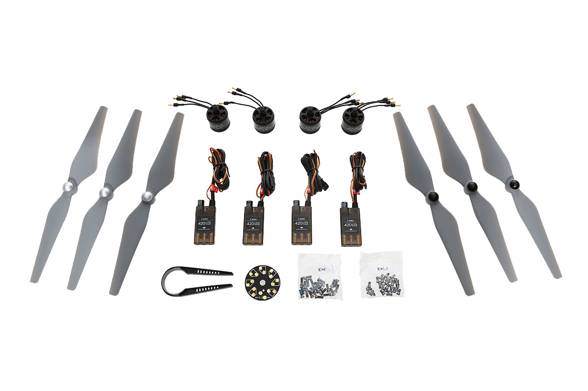
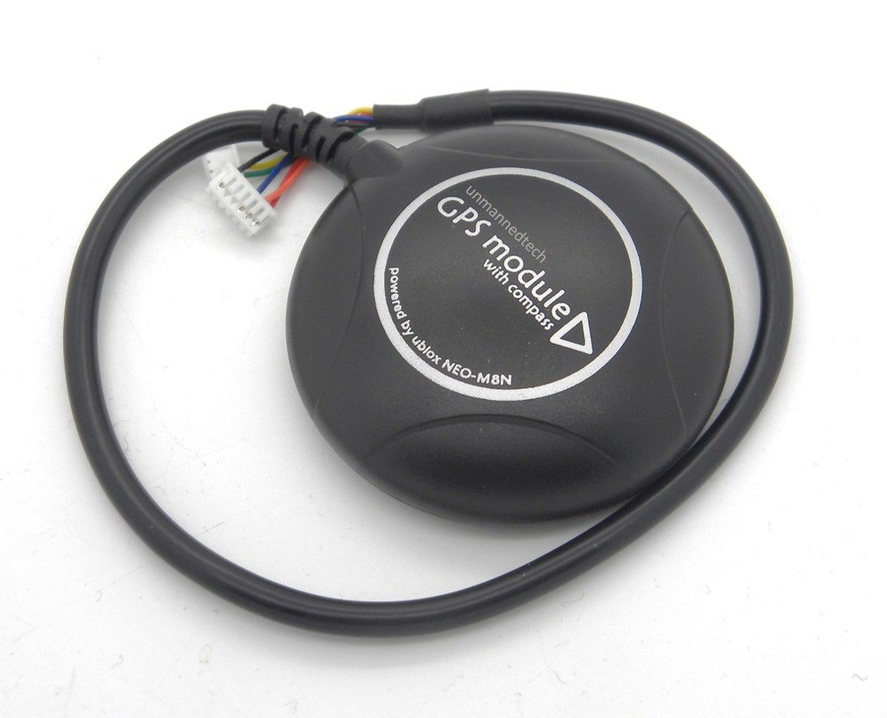
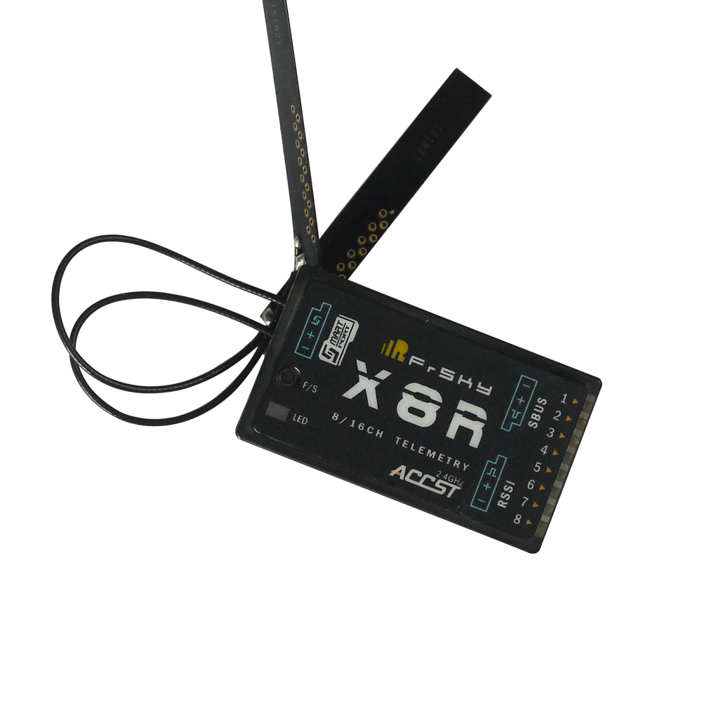
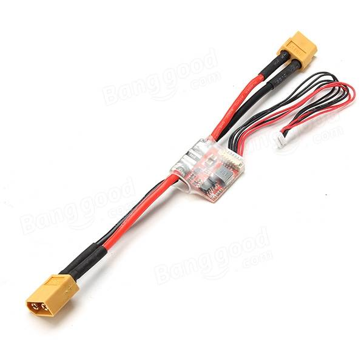
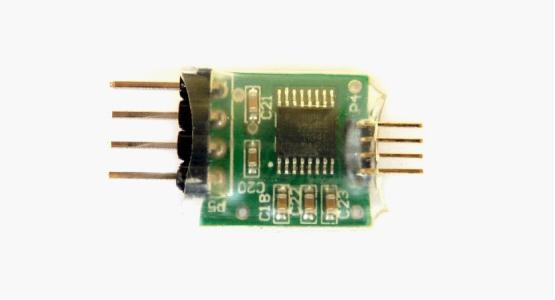
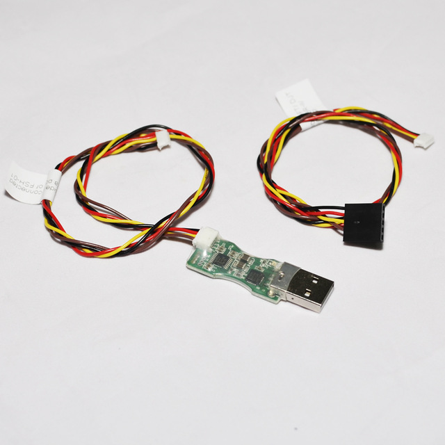
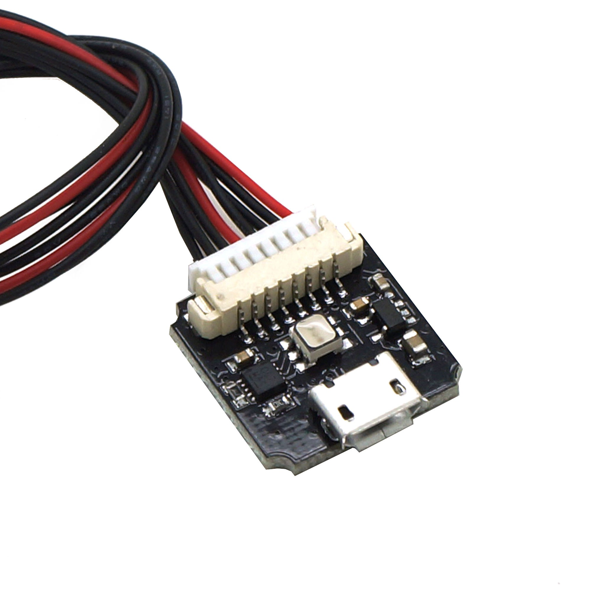
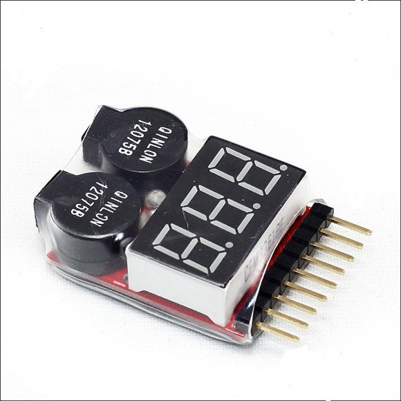
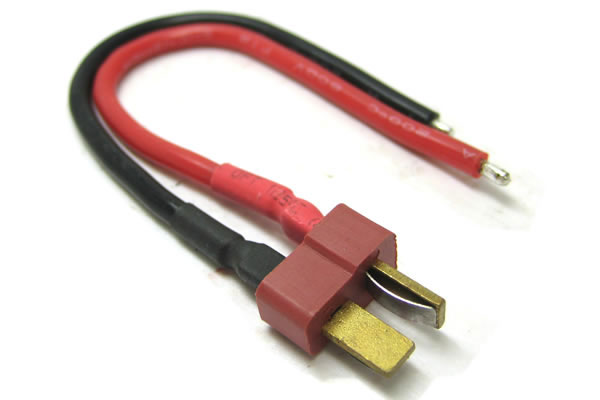
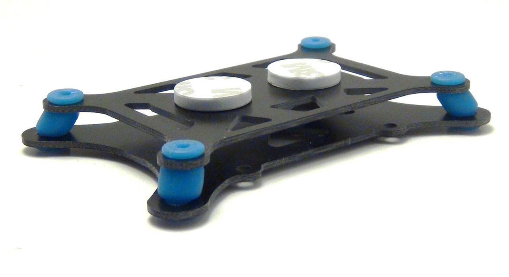

First time quadcopter build
===========================

Goal: I wanted to go from knowing nothing about remote control vehicles to building a quadcopter that could complete a route autononmously, i.e. without human control from the ground. I wanted as few black box elements as possible in the system and so used open source software and hardware wherever reasonably possible.

TODO: include photo of final build here.

Having some experience with hobbyist electronics projects I initially thought I'd really be able to make a quadcopter from scratch, 3D printing elements of the frame, sourcing most of the components, like motors, as generic parts from a big distributor like Digi-Key, and only having to buy a few drone-specific components like propellars.

I was quite disappointed when I found various pages (such as [this one](http://ardupilot.org/copter/docs/build-your-own-multicopter.html) from ArduPilot) making clear that this wasn't an option to consider when making ones first drone.

Apparently I'd have to start with what's referred to as an ARF (almost ready to fly) kit, i.e. an unassembled frame and the parts for the propulsion system (propellars, motors etc.).

The ARF acronym makes it sound like almost all the interesting work has been taken care of and all that's left is to put things together lego style.

But it turns out, if starting from scratch with no prior experience of drones, that there's quite enough additional complexity without also having to worry about the frame and the propulsion system.

Important: this build requires a small amount of soldering and it's assumed you've already got a soldering iron, solder etc.

Parts
-----

So what other parts do you need besides a frame and a propulsion system? The list of parts below makes it clear there's a bit more to this whole thing.

An approximate price in Euros (though I bought most items in the UK or Switzerland) has been given for every item, as you can see the most expensive items are the propulsion system, flight controller and transmitter. The batteries (if you buy two to have one in reserve) also add a significant cost.

Various acronyms used in the parts list, like ESC and PDB, are explained later in this pages or on the [`NOTES`](NOTES.md) page. Many terms in this page are used before being fully explained but hopefully they're all explained at some point.

### Major components

| Price | Description |
|-------|-------------|
| &euro;24 |    F450 frame - the basic platform to which everything else is attached ([link 1](https://www.amainhobbies.com/dji-flame-wheel-f450-basic-quadcopter-drone-kit-dji-fw450bas/p235233), [link 2](http://www.builtdrones.com/dji-flamewheel-f450-basic-kit/)).
| &euro;150 |  E305 propulsion system - propellars, motors and ESCs ([link](http://store.dji.com/product/e305-4)).
| &euro;175 |    Pixhawk flight controller - the "brains" of the system ([link](https://pixhawk.org/modules/pixhawk)).
| &euro;41 |  u-blox NEO-M8 GPS (and compass) module ([link](https://www.unmannedtechshop.co.uk/ublox-neo-m8n-gps-with-compass/)).
| &euro;35 |  X8R receiver - the drone's wireless receiver ([link](https://www.unmannedtechshop.co.uk/frsky-x8r-8-16ch-s-bus-accst-receiver-with-smart-port/)).
| &euro;108 |  Taranis Q X7 transmitter ([link](https://www.unmannedtechshop.co.uk/frsky-taranis-q-x7-2-4ghz-transmitter/)).
| &euro;17.50 |  Power module - connects the battery to the flight controller and the PDB ([link](https://www.unmannedtechshop.co.uk/high-voltage-apm-power-module-with-3a-ubec/)).
| &euro;37 |  LiPo 3300mAh 4S1P 14.8V 25C battery ([link](https://www.unmannedtechshop.co.uk/gens-ace-3300mah-14-8v-25c-4s1p-lipo-battery-pack/)). |

### Support components

| Price | Description |
|-------|-------------|
| &euro;5 |  GPS mast - separates the GPS unit from interference from the rest of the system ([link](https://www.unmannedtechshop.co.uk/foldable-gps-mast-mount/)).
| &euro;4 |  FUL-1 TTL to RS232 converter - connects the telemetry port of the flight controller to the receiver ([link](https://www.unmannedtechshop.co.uk/frsky-transmitter-receiver-upgrade-adapter-ful-1/)).
| &euro;9 |  FUC-3 upgrade cable ([link](https://www.unmannedtechshop.co.uk/frusb-3-frsky-upgrade-cable-fuc-3/)).
| &euro;2.50 |  SPC (smart port converter) ([link](https://www.unmannedtechshop.co.uk/frsky-smart-port-converter-spc/)).
| &euro;8 |  External LED and USB connector ([link](https://www.unmannedtechshop.co.uk/all-in-one-led-and-usb-module-for-pixhawk/)).
| &euro;2.50 |  I2C splitter - share the Pixhawk I2C connector between the GPS module's compass connector and the external LED and USB connector ([link](https://www.unmannedtechshop.co.uk/i2c-board/)).
| &euro;7.50 |  Spare propellars ([link](https://store.dji.com/product/9450-self-tightening-rotor-white-silver-stripes)).
| &euro;5 |  F450/F550 landing gear ([link](http://www.helipal.com/dji-landing-gear-for-f450-f550.html)).
| &euro;4.50 |  Battery monitor alarm ([link](https://www.unmannedtechshop.co.uk/battery-monitor-alarm-1-8s/)).
| &euro;21 |  E430 LiPo charger ([link](https://www.unmannedtechshop.co.uk/skyrc-e430-lipo-life-2-4s-balance-charger/)).

### Additional physical components

| Price | Description |
|-------|-------------|
| &euro;2 |  T-plug male power connector - connects the PDB to the power module ([link](https://www.unmannedtechshop.co.uk/male-deans-t-plug-wire-10cm/)).
| &euro;3 |  Vibration damping mounting set - isolates the flight controller from the vibration of the frame ([link](https://www.unmannedtechshop.co.uk/vibration-damping-mounting-set/)).
| &euro;3 |  Hook and loop velcro straps - attach battery to frame ([link](https://www.unmannedtechshop.co.uk/hook-loop-battery-strap-pack-of-5/)).
| &euro;2 |  Mounting foam - attach ESCs and other components to the frame ([link](https://www.unmannedtechshop.co.uk/3m-double-sided-mounting-foam/)).
| &euro;5 |  LiPo safety bag - keep LiPos safely contained when charging or not in use ([link](https://www.unmannedtechshop.co.uk/lipo-safety-bag/)).

As already noted some minor soldering is required - it's assumed you already have a soldering iron and solder and know how to use them.

The [F450 user manual](http://dl.djicdn.com/downloads/flamewheel/en/F450_User_Manual_v2.2_en.pdf) additionally notes that you'll need threadlocker, a 2mm hex key, [nylon cable ties](https://www.amazon.co.uk/Green-Cable-100Mm-2-5Mm-All/dp/B00904S2DE), scissors and [flush cutters](https://www.sparkfun.com/products/11952).

The 2mm hex key and the threadlocker (which is something I'd never heard of before) are covered in the [miscellaneous parts](NOTES.md#miscellaneous-parts) note.

Websites
--------

When putting together this page the most useful sites I found were:

* ArduPilot - in particular its [assembly](http://ardupilot.org/copter/docs/common-pixhawk-wiring-and-quick-start.html) and related sections.
* [Pixhawk.org](https://pixhawk.org/)
* RCGroups - in particualr the [multicopter drone forums](https://www.rcgroups.com/aircraft-electric-multirotor-drones-790/).

The [ArduPilot forums](http://discuss.ardupilot.org/) and [PX4 forums](http://discuss.px4.io/) were also useful.

Note: the terms Pixhawk and PX4 are often used interchangeably - though Pixhawk more often refers to the flight controller hardware while PX4 more often refers to the flight controller software stack.

---

The following sections cover the major components of the quadcopter. In writing this page I started including so many side notes that they started clogging up the whole things that I've moved these notes out into [`NOTES`](NOTES.md). They're worth scanning over quickly and cover:

* [Brief notes](NOTES.md#brief-notes) on clockwise and two counterclockwise motors, the external LED and USB connector.
* The [F450 ARF kit](NOTES.md#f450-arf-kit) and why I choose to buy the F450 frame and propulsion system as separate components rather than bundled as an ARF kit.
* The [E300 vs E305 vs E310](NOTES.md#e300-vs-e305-vs-e310) propulsion systems.
* The LiPo [batteries](NOTES.md#batteries), the T-plug battery connector, the battery alarm and the battery safety bag.
* [Vibration](NOTES.md#vibration) and why a vibration damping kit might improve the performance of the sensors in the flight controller.
* Predefined [waypoints](NOTES.md#waypoints) and in-flight drone-to-computer communication (as opposed to using the hand-held transmitter).
* The [Pixhawk 2.1](NOTES.md#pixhawk-21) and some background leading to my choice of the classic Pixhawk flight controller.
* [Pixhawk.org vs the ArduPilot site](NOTES.md#pixhawkorg-vs-ardupilotorg).
* [Bags and cases](NOTES.md#bag--case) and why the size of the F450 makes it hard to find a good bag for it.
* [Chinese copies](NOTES.md#chinese-copies) and how buying drone parts is a case of caveat emptor.

TODO: fill out [`stores.md`](stores.md) and [`assembly.md`](assembly.md) files further.

Now that's out of the way let's get onto the sections covering the major components...

Frame
-----

Explain choice of F450 - that it's mentioned in <http://ardupilot.org/copter/docs/build-your-own-multicopter.html> and there are lots of first time build instructions (see open tabs).

Say it has been around for a long time, while other components change it remains constant, seems practically the de-facto standard (at least in the non-race quadcopter space).

TODO: mention PDB (power distribution board) that comes with the E305 propulsion system but is unneeded as the bottom plate of the F450 is a PDB.

ESC (electronic speed control)
------------------------------

[ESCs](https://en.wikipedia.org/wiki/Electronic_speed_control) are responsible for spinning the motors at the speed requested by the flight controller.

The ESCs are the most expensive element in the E305 propulsion system (one ESC being just a little more expensive than its corresponding motor).

An ESC contains its own microcontroller (generally an Atmel Atmega or a Silabs 8051).

There are open source hardware implementations and many commercial ESCs are flashable with open source firmware (the main open source firmwares being [BLHeli](https://github.com/bitdump/BLHeli) and [SimonK](https://github.com/sim-/tgy)). However there seem to be no really popular open source hardware implementations and configuring the open source firmwares for your particular ESCs (whether commercial or open source) is non-trivial.

So for this piece of hardware it seems easiest to stick with the commercial ones and consider them non-upgradable black boxes.

Flight controller
-----------------

TODO: explain the parts, in addition to propulsion system and frame, i.e. flight controller etc. and why you chose the F450 and the Pixhawk (rather than a cheaper controller like the OpenPilot [CC3D Revolution](https://www.unmannedtechshop.co.uk/openpilot-cc3d-revolution-flight-controller/), the Revolution is a product of [LibrePilot](https://www.librepilot.org/), a successor to the now defunct OpenPilot).

Reorder Pixhawk and Pixhawk 2 and other sections below so things come in more sensible order.

Pixhawk autopilot
-----------------

The [Pixhawk](https://pixhawk.org/modules/pixhawk) is an [open source hardware](http://freedomdefined.org/OSHW) flight controller that originated at [ETH Zurich](https://en.wikipedia.org/wiki/ETH_Zurich) and is the de-facto standard high end open source hardware flight controller.

The software for the Pixhawk is the [PX4 autopilot](http://px4.io/docs/px4-basic-concepts/) that covers both basic direct remote control and fully autonomous autopilot operation.

While the Pixhawk is open source hardware most discussions recommend the [3DR](https://3dr.com/) produced Pixhawk and warn against cheap chinese produced versions.

However 3DR no longer produce the Pixhawk version you see covered by the [pixhawk.org](https://pixhawk.org/) and [px4.io](http://px4.io/) but have now gone off and produced their own version called the [Pixhawk Mini](https://store.3dr.com/products/3dr-pixhawk).

I specifically wanted an open source hardware controller - after a bit of searching I came across versions produced by:

* Unmanned Tech - <https://www.unmannedtechshop.co.uk/unmanned-pixhawk-autopilot-kit/>
* 3DXR - <https://www.3dxr.co.uk/product/pixhawk-1-v2-4-8-m8n-gps-power-brick/>
* HolyBro - <https://synosystems.de/de/kategorien/315-pix32-px4-246-pixhawk-flight-controller.html>
* RadioLink - <http://www.robotshop.com/eu/en/radiolink-pixhawk-advanced-autopilot-se100-gps.html>
* Salange - <https://www.mhm-modellbau.de/part-FLC-HM07.php>

I went with the Pixhawk version from Unmanned Tech as it's there product that they supply directly, they seem more engaged in the whole scene than many other suppliers, they are linked to as a supplier on the pixhawk.org site and are mentioned favorably on many other sites.

I bought it bundled with a [Ublox Neo-M8N GPS module](https://www.unmannedtechshop.co.uk/ublox-neo-m8n-gps-with-compass/) and an [APM power module](https://www.unmannedtechshop.co.uk/high-voltage-apm-power-module-with-3a-ubec/).

Orientation note: the white arrow seen near the bottom of the front panel of the Pixhawk case isn't a pointless graphic - when installing the unit this arrow should be pointing towards the front of the quadcopter (see the [standard orientation](http://ardupilot.org/copter/docs/common-mounting-the-flight-controller.html#standard-orientation) section of the ArduPilot setup guide).

Flight stack
------------

The Pixhawk supports two flight stacks - PX4 and ArduPilot. The pixhawk.org used to feature a page covering the choice between the two, but for whatever reason this is now gone, but you can still find [it on the Wayback Machine](https://web.archive.org/web/20150915080740/http://www.pixhawk.com/choice).

Note: the ArduPilot stack, often abbreviated as APM (for ArduPilotMega), is rather misleadingly named. It comes from its early days when it originally ran on the [Arduino Mega](https://www.arduino.cc/en/Main/arduinoBoardMega) - but those days are long gone. It now runs on ARM processors, like the one found in the Pixhawk, and various other platforms. This [code overview](http://ardupilot.org/dev/docs/apmcopter-code-overview.html) shows it can run on Linux and that when it runs on the Pixhawk it actually sits on top of the PX4 firmware.

When it comes to comparing the PX4 and ArduPilot flight stacks there's lots of confusing and often contradictory information out there. For some information see [this thread](http://discuss.ardupilot.org/t/apm-stack-question-apm-vs-px4/11497) and [this thread](http://discuss.ardupilot.org/t/new-guy-here-trying-to-make-sense-of-it-all/9255) on the ArduPilot forums and [this thread](http://discuss.px4.io/t/px4-vs-ardupilot-when-to-choose-what/2214) and [this thread](http://discuss.px4.io/t/px4-vs-ardupilot-arduplane-for-mapping-photogrammetry-using-fixed-wing/1766) on the the PX4 forums.

The [ArduPilot stack](https://github.com/ArduPilot/ardupilot) and the [PX4 one](https://github.com/PX4/Firmware/) can both be found on Github and both are clearly under active development.

PX4 appears to more a product of the academic community while ArduPilot appears to a product of the hobbyist community with some resulting differences in focus, e.g. PX4 seem to focus more on autonomous flight while ArduPilot perhaps more on direct control.

Both though work with ground control software for autonomous operation, e.g. Mission Planner (for ArduPilot) and QGroundControl (originally developed to work with PX4 but now also compatible with ArduPilot). See the [ground station](http://ardupilot.org/copter/docs/common-choosing-a-ground-station.html) section of the ArduPilot site for some comparison of ground control applications.

**Important:** the pixhawk.org and ardupilot.org sites cover much more than just flight stacks, most of the content on both is useful irrespective of which flight stack one uses.

Transmitter
-----------

The Taranis X9D+ is a mid-spec transmitter that's a very popular choice for setups like the one here. However I'm not really interested in direct remote control of the drone, but just want it as an option, hence the choice of the Q X7 which is a cut down cheaper version of the X9D+ but is very similar in many respects and runs the same [OpenTX](http://www.open-tx.org/downloads) firmware (note the warning for Taranis users on the download page, it's probably better to get firmware updates via FrSKY).

See the Dronetrest blog for a [comparison of the two transmitters](http://blog.dronetrest.com/taranis-x9d-or-taranis-q-x7-which-is-better-to-buy/).

XXX Pixhawk.org clearly lists the D4R-II receiver as their recommended FrSKY receiver (see [here](https://pixhawk.org/peripherals/radio-control/frsky)), while ardupilot.org lists the D4R-II as deprecated and recommend far newer FrSKY receivers (see [here](http://ardupilot.org/copter/docs/common-frsky-telemetry.html)).

XXX The FrSKY D4R-II is the recommended receiver on the pixhawk.org [FrSKY page](https://pixhawk.org/peripherals/radio-control/frsky) and as outlined on their [FrSKY telemetry page](https://pixhawk.org/peripherals/telemetry/frsky) you can use an [FrSKY FUL-1 converter](https://www.unmannedtechshop.co.uk/frsky-transmitter-receiver-upgrade-adapter-ful-1/) to connect the Pixhawk to the receiver so it can send telemetry data to the transmitter.

XXX However the ArduPilot [FrSKY telemetry page](http://ardupilot.org/copter/docs/common-frsky-telemetry.html) describes the D4R-II as deprecated and recommends the [FrSKY X8R](https://www.unmannedtechshop.co.uk/frsky-x8r-8-16ch-s-bus-accst-receiver-with-smart-port/) again with the FUL-1 but with an additional [smart port converter](https://www.unmannedtechshop.co.uk/frsky-smart-port-converter-spc/) (the same converter as bundled with the FrSKY USB upgrade cable above).

Note: when using the D4R II receiver the SPC is needed to connect the telemetry upgrade cable to the older style connector of the D4R II, when using the X8R receiver the SPC is needed for a completely different situation - adapting the FUL-1 to connect the receiver to the flight controller.

See upgrade warning regarding receiver [here](https://pixhawk.org/peripherals/radio-control/frsky#receivers) hence the FrSKY USB upgrade cable (this cable has a 4 pin connector while the FrSKY D4R-II has a 3 pin connector hence the SBC).

TODO: explain that the transmitter is the hand held remote control and the receiver is the corresponding component in the drone but that the names are historical and that both now transmit and receive.
