Finished result
===============

This page shows the laser cut parts that I received from Sculpteo and their assembly with the receiver.

The laser cutting process results in some scorching. At first I thought it might just be soot but it couldn't be cleaned off with soapy water or isopropyl alcohol.

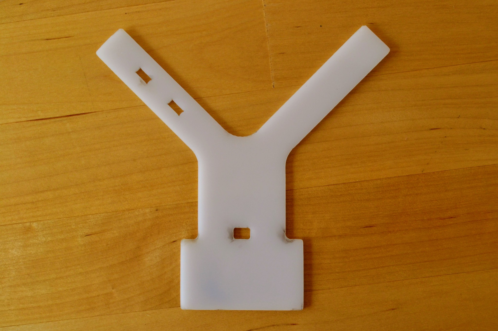

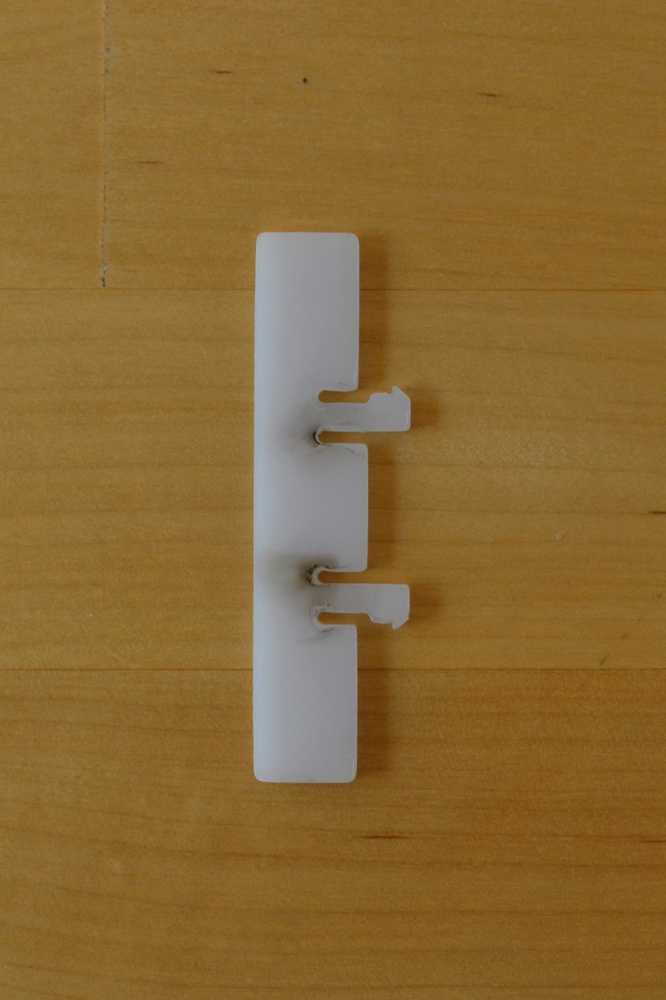

The scorching is a little odd - particular above you can see that it's at it's darkest about 0.5mm back from the actual edge of the cut.

On the underside there's no scorching - though the material is translucent enough that you can notice the dark areas from the other side.

Both Sculpteo and Ponoko warn that POM, unlike e.g. acrylic, does not come with a protective plastic film and so is generally noticeably scratched. This is indeed the case - if you look closely at the photos you'll see quite clear scratches. Apparently the scratches are less noticeable on white POM than on black POM - and this is the reason I chose white (however presumably the scorching is less obvious on black POM). While noticeable close up the scratches are not obvious from a distance.

Note: Ponoko refer to POM as Delrin - the DuPont trade name for POM.

The laser didn't completely cut through at all points and a little force was required to break the parts away from the surrounding material - this caused a little anxiety particular when breaking out the "heads" on the small attachment.

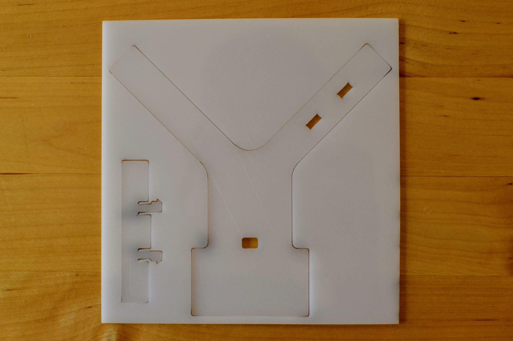

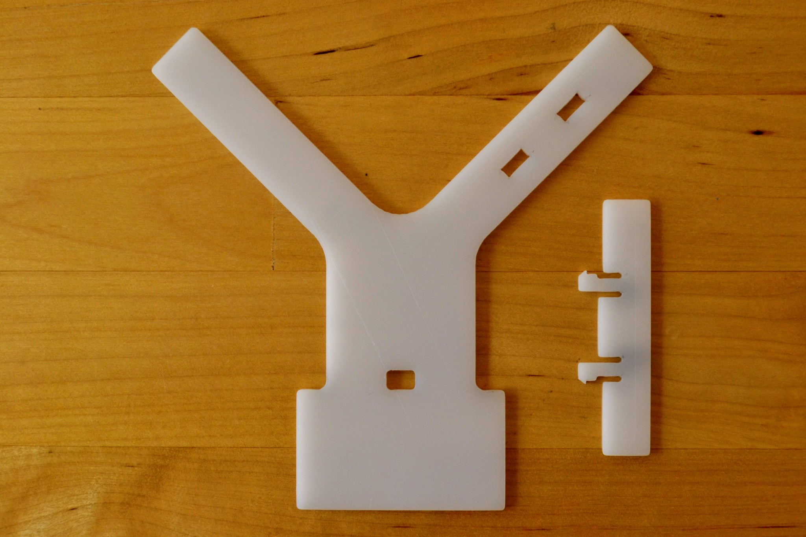

First I taped one PCB antenna onto the attachment - with a little extra tape around the point where the transmission line joins the PCB.

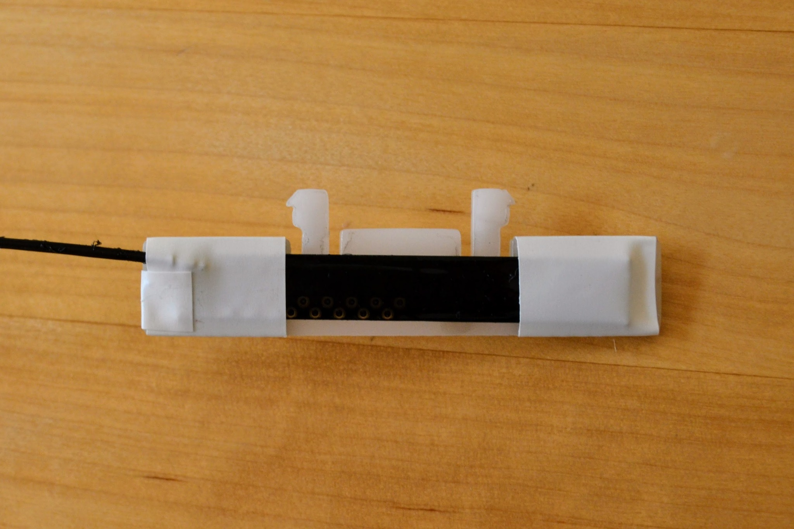

Then I used a cable-tie to attach the receiver to the main part of the mount.

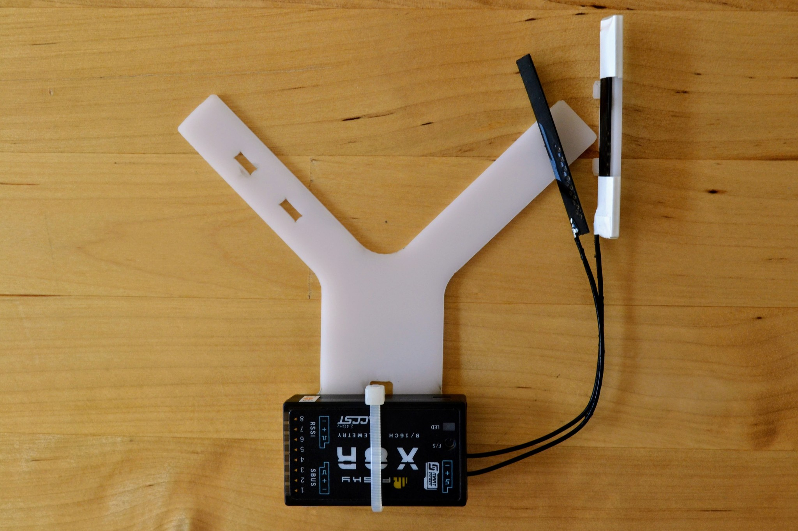

I locked the smaller attachment into place on the arm with the slots and taped down the other antenna on the other arm.

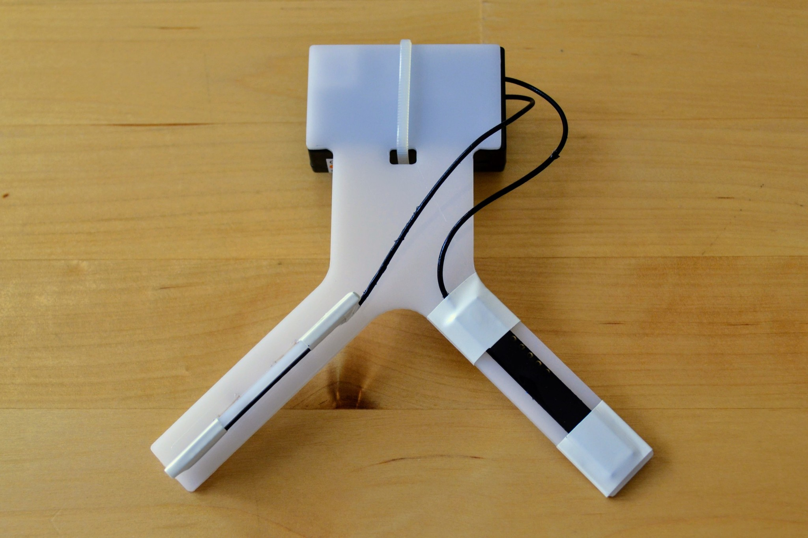

The result looks quite neat I think.

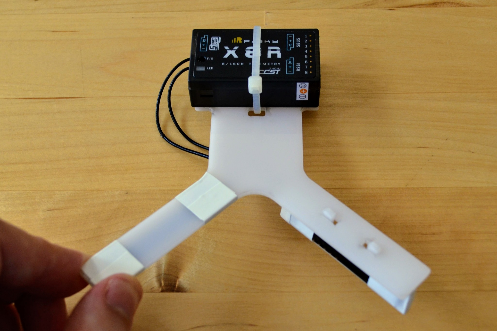

I think the biggest weakness of the design is in how the cable-tie doesn't sit flat against the underside. It almost acts like a semi-eliptical [leaf spring](https://en.wikipedia.org/wiki/Leaf_spring) and means that the adhesive mounting pads used to attach it to the frame of the vehicle will need to be quite thick if they're not to be affected by the spring like nature of the cable-tie.

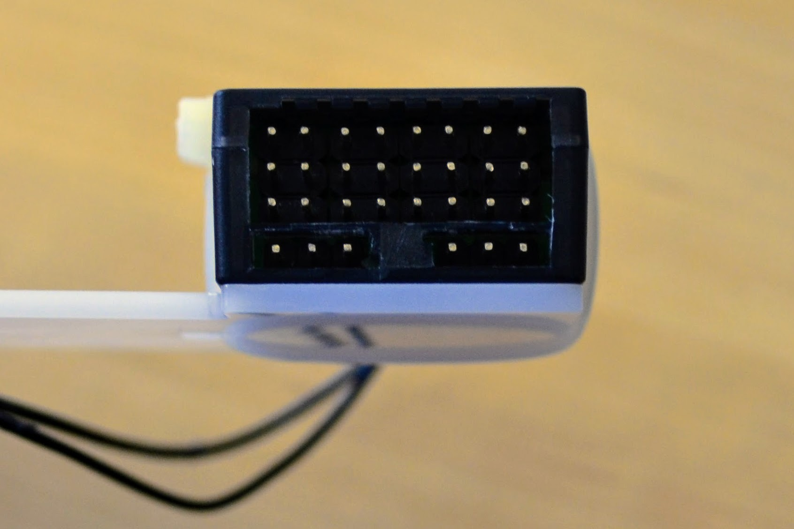

The notches fitted perfectly length-wise and locked into place properly, however the slots for the notches were noticeably wider than necessary. This meant the pressure from the transmission line could force the attachment well away from the desired 90&deg; to the main arm.

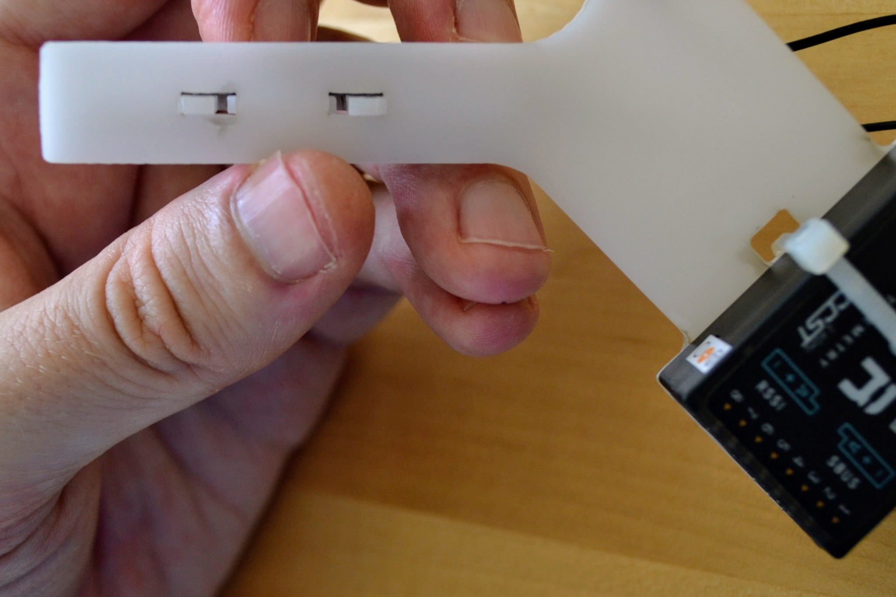

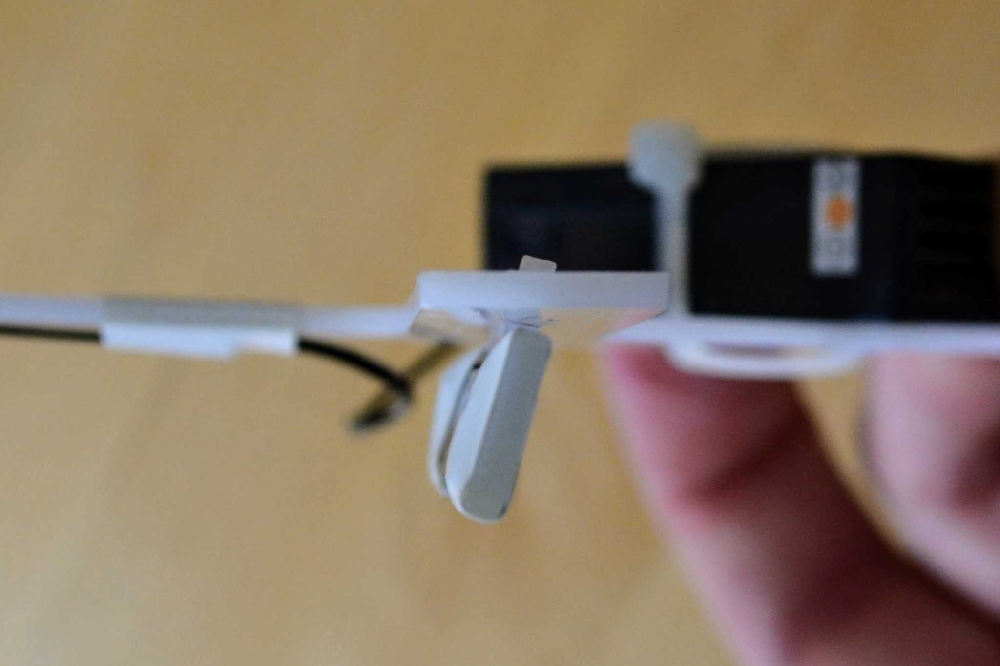

I could fix this with a rubber band but perhaps a cleverer design could fix this. I'm not sure what to do about this - 2mm POM can vary in width between 2.26mm and 1.74mm so the slot has to be wide enough to accommodate the 2.26mm thickness but the actual part that's inserted may be just 1.74mm thick.

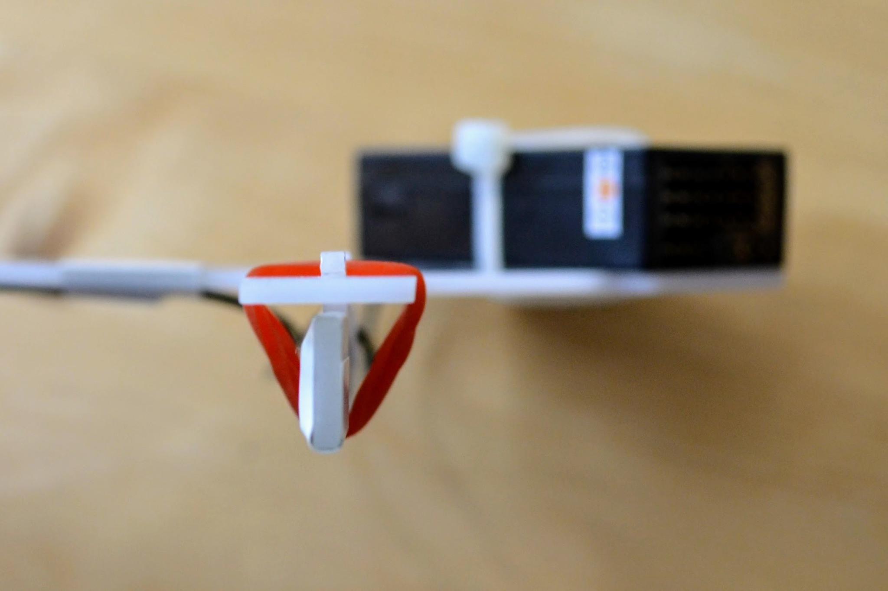

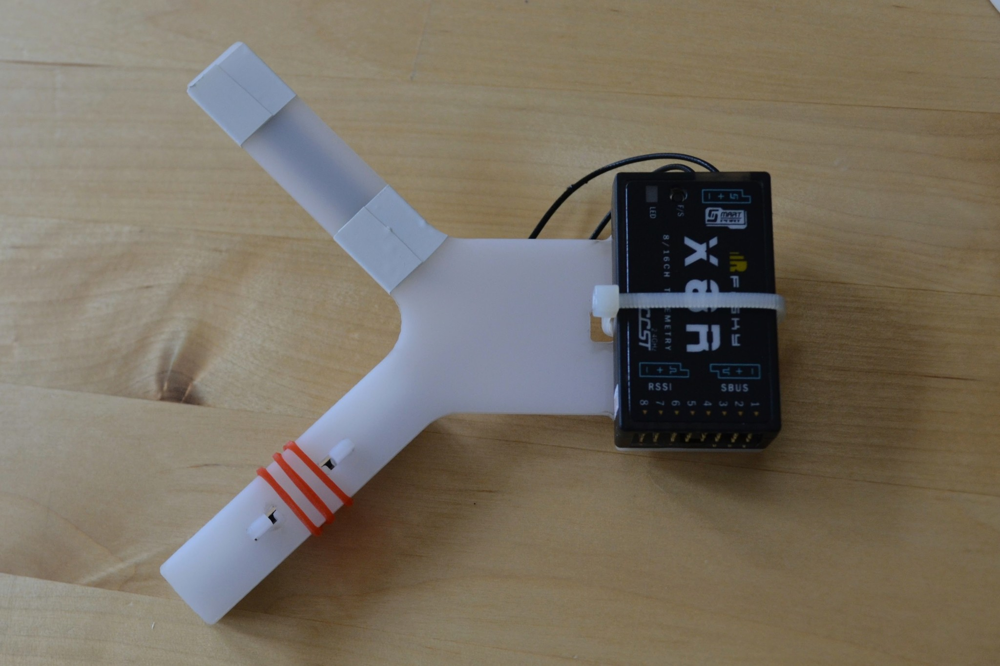

Version 2
---------

If I was ordering a second version I would probably make both the attachment and the arms a little longer so that the standard 15mm wide insulation tape that I used can be wrapped round while still leaving a millimeter or two clear from the ends and so that the tape at the base of the non-attachment arm doesn't overlap with the curve that joins the arm to the main body.

I'd consider what change, if any, I could make to deal with the width of the slots and the resulting problem of the attachment not being at 90&deg; to the arm it's attached to.

And I'd consider if the cable-tie arrangement could be improved so that it sits flatter against the underside of the mount - or if the cable-tie was simply a bad idea and that the receiver should just be affixed to the mount with e.g. double-sided adhesive tape.
