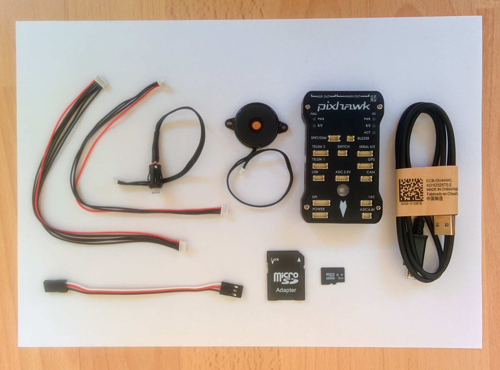
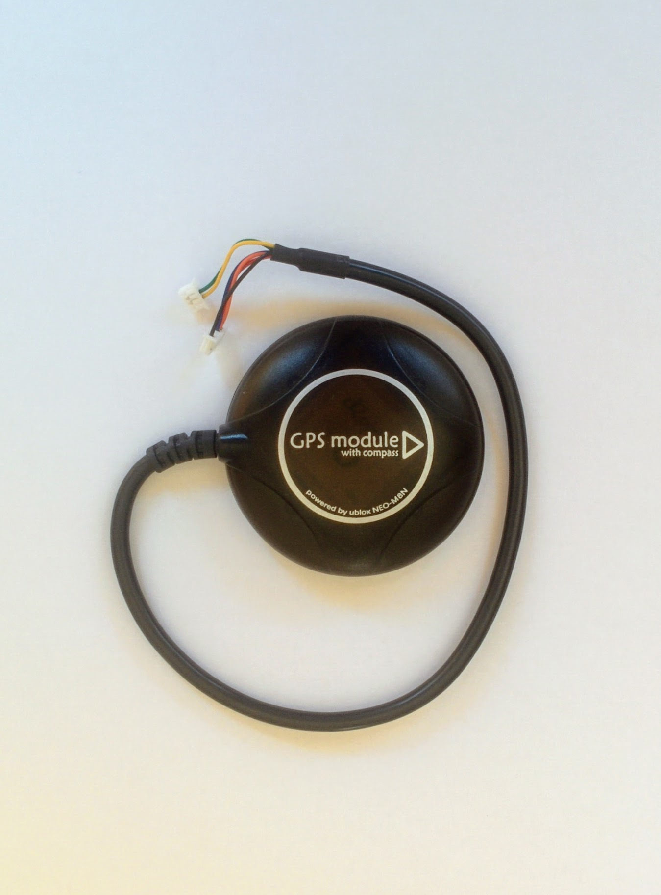
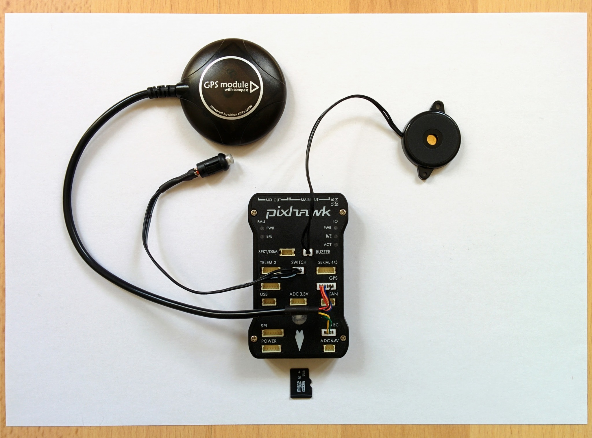
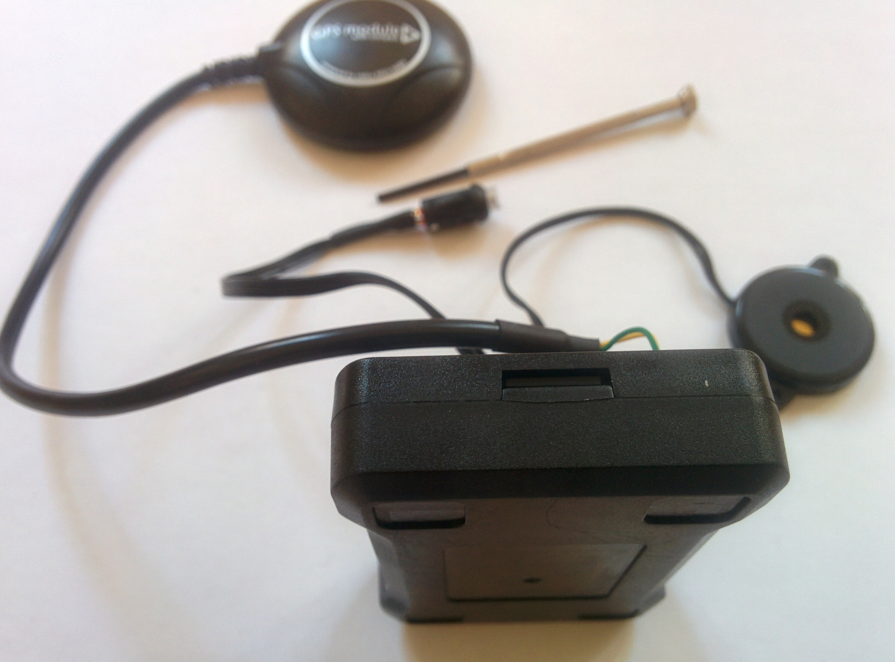
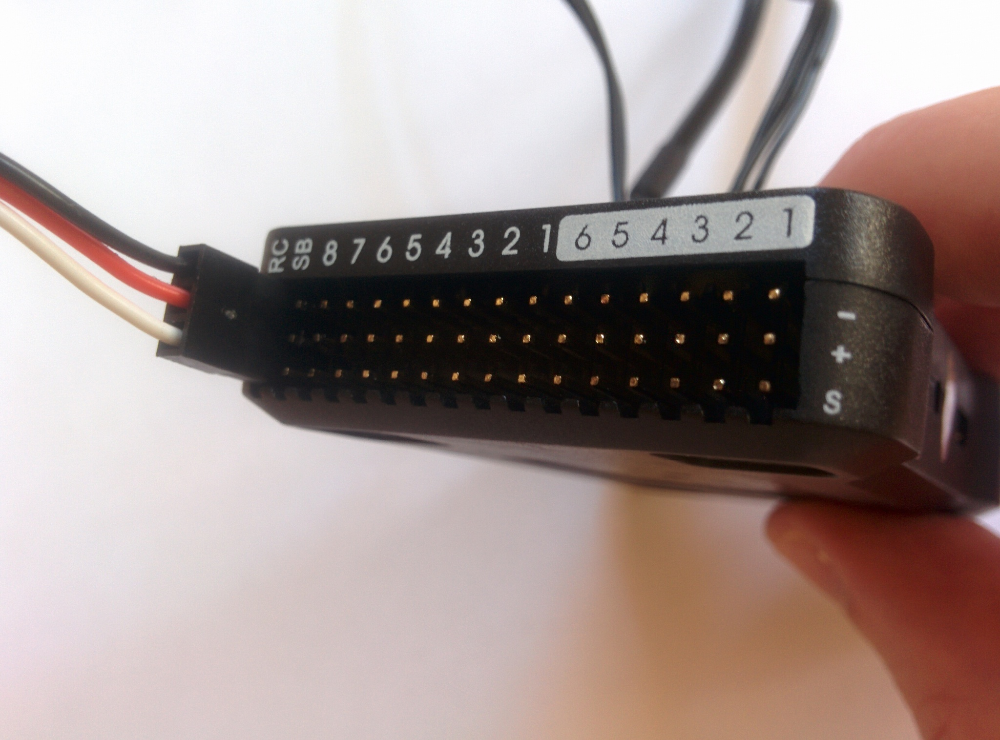
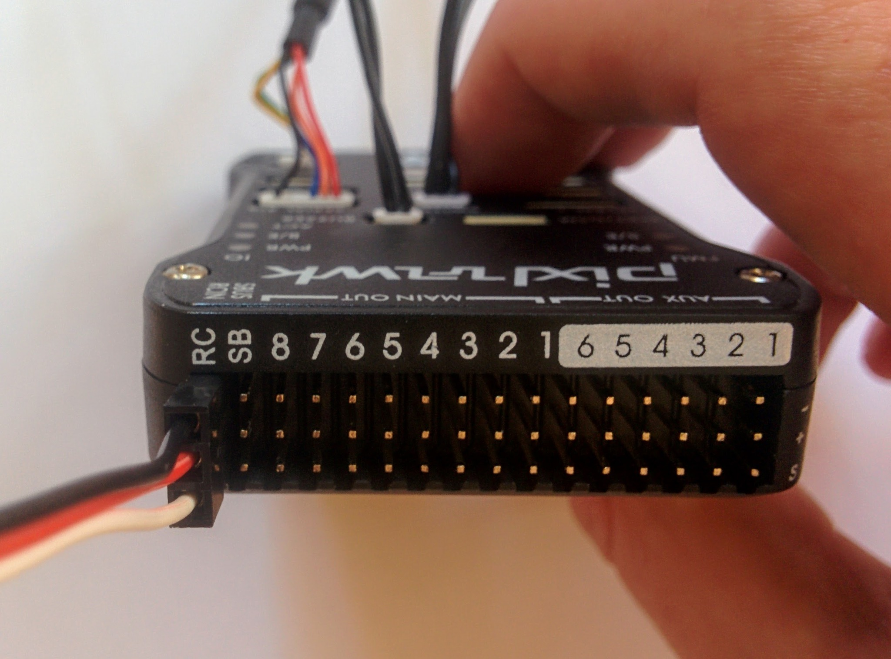
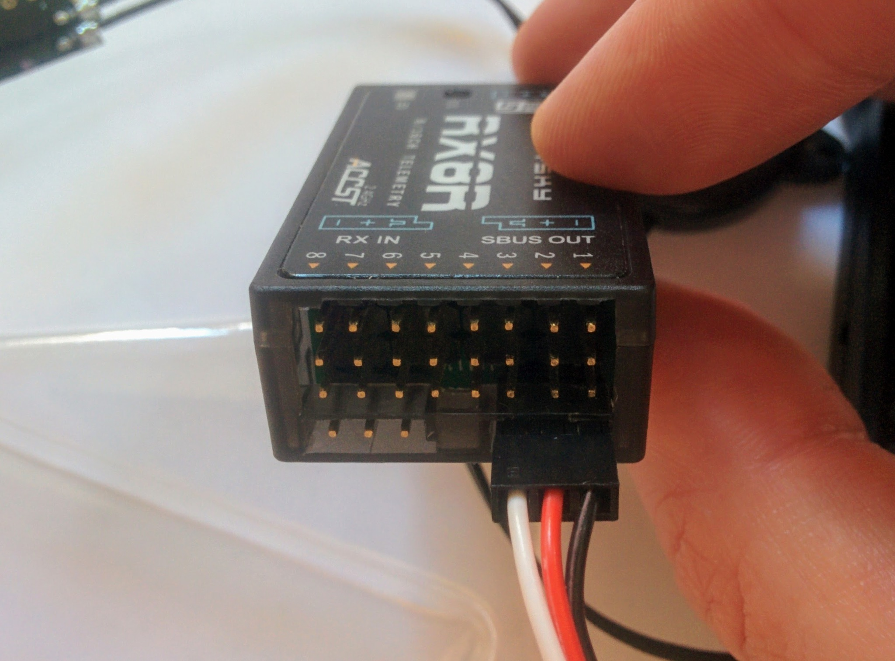
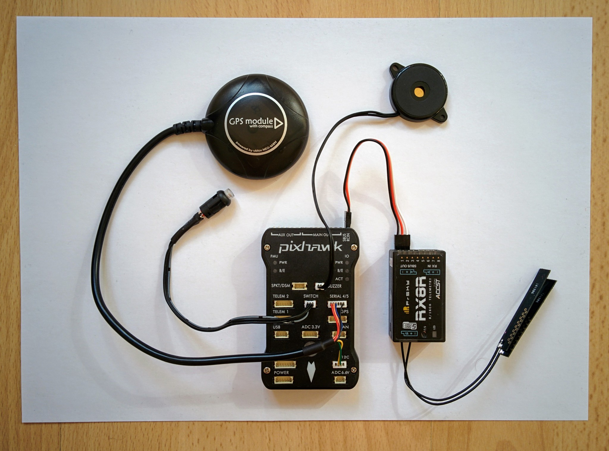

Electronics
===========

Now that we've upgraded the receiver we can connect up all the electronics (except the battery, ESCs and motors) and then connect everything to a laptop or PC via USB and set things up and experiment a bit without having to put together the full drone.

The Pixhawk comes with a number of parts (shown below) - these include a buzzer, an arming button, a cable for connecting the receiver (bottom left), a micro SD card and a USB cable. There's also an SD card adapter and two other cables that aren't of immediate use.

Initially we'll just wire up the Pixhawk, arming button, buzzer and the GPS (and compass) module.

_Pixhawk and accompanying parts._  

_GPS (and compass) module._  

The style of connectors used by the Pixhawk and the components that connect to it (with the exception of the receiver) are horrible. I've come across them before in electronics projects - they're designed for production setups where it's not envisaged that a given connection will ever be unplugged again once connected, i.e. they're not very hobbyist friendly. It's no wonder that in the video [introducing the Pixracer](https://www.youtube.com/watch?v=mpb6Cq023N8&feature=youtu.be&t=62) that they say the best thing about it is that they've switched to a nicer style of connector (as has the Pixhawk 2.1). The downside of changing the connector type of course is that one then has to change the awful-but-standard connectors on all components one wants to connect.

_Pixhawk wired up (without receiver)._  

When initially attempting to plug in the buzzer etc. I found the connectors so unwilling to go in that I wondered if I was really supposed to apply near board breaking pressure to just force them in. The answer is no - instead for each connector I repeatedly waggled it in and out until everything engaged nicely enough that it was then possible to force the connector in fully. This required a reasonable amount of force, with my thumbnails to the edges of the connector, but not too much.

Once this is done inserting the SD card is altogether more pleasant. There is enough open space beyond the slot in the case that it's possible to push the SD card in without pushing it into the actual SD card holder. The SD card holder is spring loaded so it's fairly obvious once you feel the resistance of the springs. The SD card has to be pushed so far in that I couldn't do it with just my finger nails, I needed to use a small screw driver to press it in the final millimeter or two (if you look closely at the next photo you'll see the SD card is quite far in).

_Pixhawk with microSD card inserted._  

Note: the SD card comes competely blank and is just used for storage (logs, waypoint data etc.), it does not contain the Pixhawk flight controller software - this is flashed to 2MB of non-removable internal RAM.

The receiver
------------

The final step (at this point) is to connect the receiver to the Pixhawk.  I was surprised how hard it was to find clear instructions on connecting the X8R receiver to the Pixhawk - it's trivial once you know how but still I didn't find anything that just plainly told you which set of three pins at the end of the Pixhawk to use and which port on the receiver to use.

The best I found was this [video starting at the 21 second mark](https://www.youtube.com/watch?v=uCcVCM7ajNA&feature=youtu.be&t=21). **Important:** when he plugs the connector into the X8R he plugs in the cable such that the white wire (signal) is on the left and black (ground) is on the right, which is correct, but he clearly says "the signal is on the right side" which is incorrect. In the video he just comments that we use the column of pins on the Pixhawk labelled RC and not the one labelled SB (for S.BUS) but doesn't explain why. The SB labelled pins are meant for S.BUS output, not for taking receiver input (whether in S.BUS format or not).

In the end it's all very simple and shown clearly in the following pictures.

_Receiver cable plugged into Pixhawk._  
 

_Receiver cable plugged into receiver._  

You can confirm you've got the wiring right from the little graphics on both the X8R and the Pixhawk. On the top of X8R you see two little graphics representing the two S.BUS ports, one labelled RX IN and the other SBUS OUT. The cable is plugged into the SBUS OUT port - the little graphic, shaped like the port, contains a minus, a plus and a little square wave symbol, for ground, power and signal respectively, showing you which pin is which. On the Pixhawk right at the end of the three rows of pins similarly you see the labels minus, plus and S.

So for the Pixhawk you plug this cable into the very first column of pins (labelled RC) with the black wire at the top, red in the middle and white at the bottom. Black is ground, red is power and white is signal. For the receiver you plug the cable into the lower right S.BUS port with white (signal) to the left.

Pixhawk fully wired up
----------------------

Now the Pixhawk is wired up and ready to be connected to a computer.

_Pixhawk wired up (with receiver)._  

