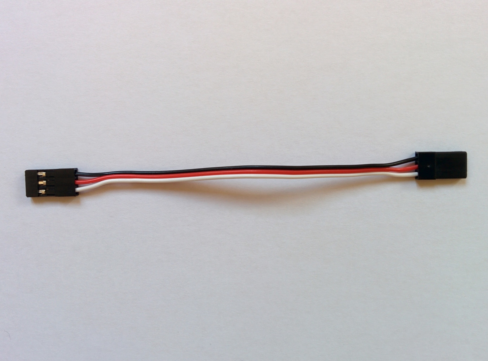
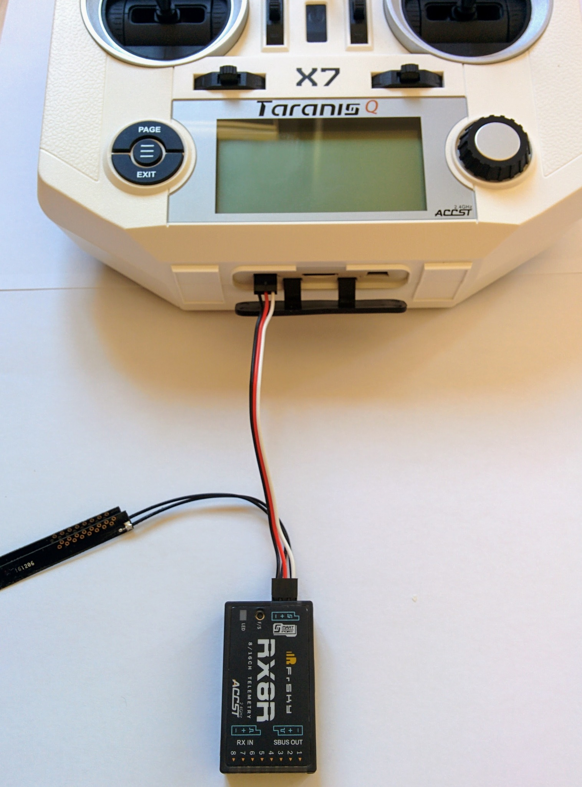
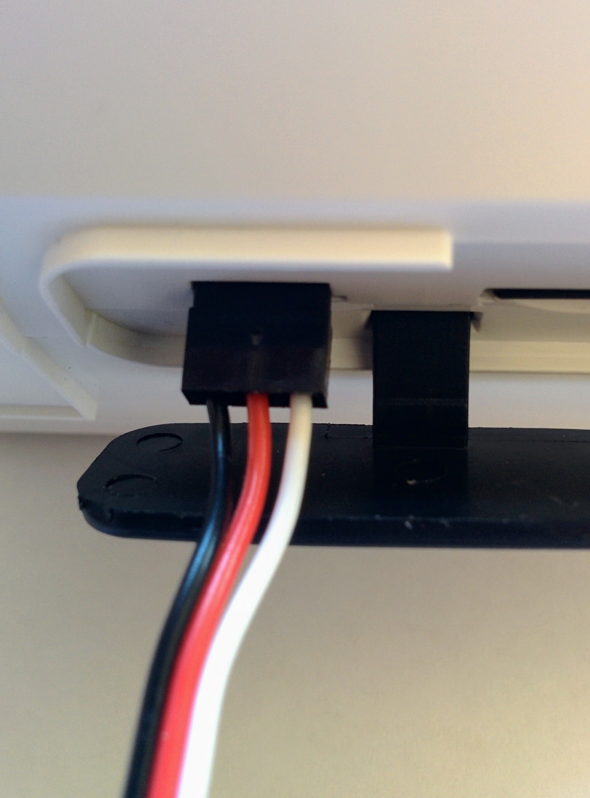
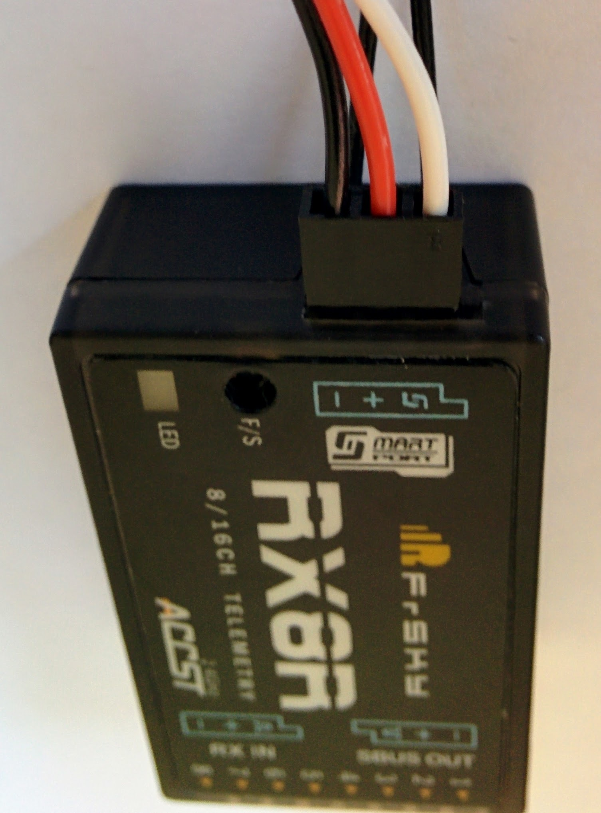

Receiver
========

I took a definite decision on all the components that make up this build. The receiver is the only exception - FrSKY produce a number of receivers that are equally suitable for this setup, the the X6R, X8R and RX8R. The X8R is definitely the most popular option, but in all the pictures here you'll see the RX8R. For all intents and purposes the RX8R is identical to the slightly cheaper X8R (only by pairing two RX8R do you get any additional functionality). The X8R and RX8R are physically identical, the X6R looks a bit different (in particular its S.BUS port isn't separated off from the servo outputs, see this [diagram](http://www.frsky-rc.com/product/images/pic/1470986872.png)) but it's just as suitable.

I bought the RX8R only because the X8R was out of stock at the online store I used. In the text here I always refer to the X8R (as that's what I recommend to buy) but when downloading firmware etc. make sure to get the firmware appropriate for your receiver, be it an X6R, X8R or RX8R.

Upgrading the receiver
----------------------

With other receivers such as the D4R-II there are [warnings](https://pixhawk.org/peripherals/radio-control/frsky#parts_list) that the receiver must be upgraded before use with the Pixhawk. I've found no such warning for receivers like the X8R but it makes sense to make sure your receiver is using the latest firmware.

You can upgrade the receiver via the transmitter - this is much simpler than upgrading it via a computer (and requires no special cables) and is much simpler with the Taranis Q X7 than with the older X9D+. Unlike the older X9D+ the Q X7 comes with a smart port, so it can be connected directly to the receiver with a standard cable.

Note: I documented upgrading the receiver via a computer [here](receiver-windows-upgrade.md) but I think using the transmitter, as outlined here, is the simpler approach.

Your Pixhawk should have come with various cables - one of which is a standard servo cable that should look like this:

_Standard servo cable._  

Later we'll use this to connect the receiver to the Pixhawk but here we'll use it to connect the receiver to the Q X7.

The process of upgrading the receiver is almost identical to upgrading the internal XJT module on the transmitter - the main difference just being that we have to connect the receiver to the transmitter first.

So as before go to [_Download_](http://www.frsky-rc.com/download/) on the FrSKY site, select _Firmware_, then select _Receivers_ (from the dropdown) and then select the X8R.

Important: the latest RX8R firmware zip file includes both EU and US `.frk` files, while for the X8R the latest zip file just contains `LBT`, i.e. EU, firmware - you have to look down the version history for the last firmware relevant to the US.

So click on _Download_ (or select the last firmware suitable for your jurisdication) and extract the resulting zip file, if it contains two `.frk` files then just choose the one suitable for you (the one with `LBT` in the name is for the EU and the other is for the US).

Now start you're transmitter in bootloader mode, connect it to the computer - the transmitter's SD card should appear as a USB drive, copy the appropriate `.frk` file to the `FIRMWARE` directory there.

Eject the transmitter's drives on your computer and disconnect and turn off the transmitter. Now we're going to connect up the transmitter to the receiver as shown here using the servo cable. The servo cable won't prevent you plugging things in incorrectly - if you connect ground on one side to signal on the other you will probably fry your receiver. So double check the connections on both receiver and transmitter, the black wire (ground) should always be furthest away from that little extra notch you see on one side of any S.BUS socket.

_Q X7 connected to receiver_  

_Q X7 connection closeup_  

_Receiver connection closeup_  

Now that the receiver is connected, turn it on in normal mode, navigate to the `FIRMWARE` directory. Select the right firmware (don't mix it up with the XJT module firmware that you might also have there), it should be called something like `X8R_LBT_build151118.frk`, select ENTER and this time select _Flash ext. device_.

You'll see a progress bar indicating that it's being written, once successfully completed it'll just return to the SD card screen. Turn off the transmitter and disconnect the now upgraded receiver.
