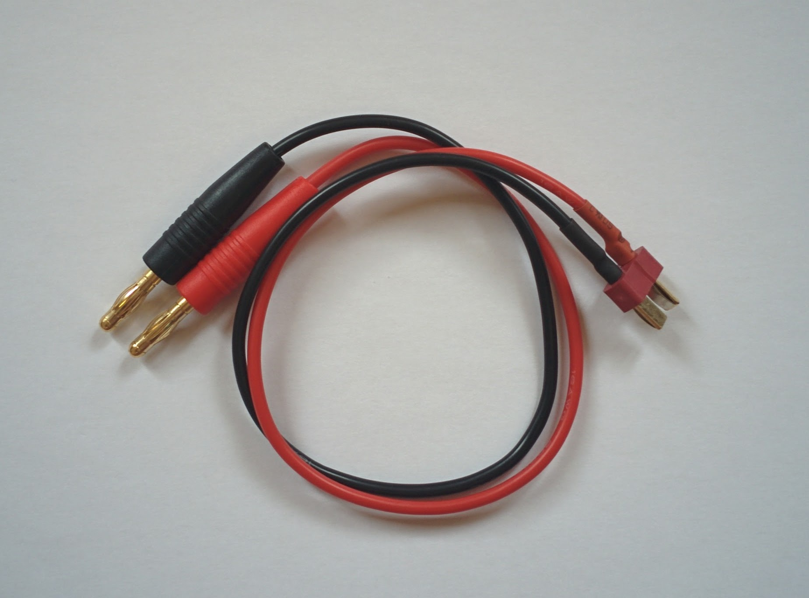

Batteries
=========

Charging LiPo batteries is slightly more involved than you might imagine. The battery needs to be connected to the charger via two leads, one is the same heavy duty lead that's used to connect the battery to your drone and the other is a balance lead. The charger charges the battery via the main heavy duty lead and monitors the state of the individual cells via the balance lead. Not all the cells become fully charged at the same time so once some of the cells reach full charge an odd thing happens (or so it seems initially), the charger continues charging the whole battery so that the remaining cells also become fully charged but at the same time it has to start ever so slightly discharging the cells that have aleady reached full charge so that they don't become overcharged as the battery continues to be charged. This discharging happens via the balance lead, so it serves both to monitor and discharge cells. Bruce Simpson has a very good video that goes into the details, from [6:08](https://www.youtube.com/watch?v=wIbHLacozFo&feature=youtu.be&t=368) to 11:30 explains the whole thing on a whiteboard (after the 11:30 point he starts explaining his clever trick for quickly charging specific cells in a battery that have somehow become very out of balance with the others - this is fairly specialist stuff and not immediately relevant to our situation).

| Parts |
|-------|
|  S60 charger. |
|  Replacement T-plug terminated charging cable. |
|  Batteries |
|  LiPo safety bag. |
|  Battery alarm. |

Charging setup:

The battery should be connected via **both** its connectors to the charger as shown.

Battery charging
----------------

Download the S60 manual as a PDF (it's in color and easier to read than the small black and white version that comes with the charger).

It's an intimidating complex manual but if you just want to charge a LiPo battery properly it's very simple - the device by default starts straight into this mode.

Just jump straight to the "Getting started" section of the manual. The following covers much the same details.

Connect the charger lead (with the banana plugs) to the charger before connecting it to the battery (to avoid the risk of shorting the battery by accidentally touching the banana plugs together).

When I power on my charger it starts straight into "LiPo balance" mode and shows 2.0A and 14.8V(4S).

My battery is 4S so that's already perfect but it's a 3300mAh battery so I need to increase the amps to 3.3A (see later for more on this).

To change this I just need to press ENTER, press INC until 3.3A is shown and then press ENTER twice (so no value is blinking any longer).

Press the ENTER button for 3 seconds, the charger will check the battery - it shows an R and an S value you should confirm these are the same and match your battery (4S in my case) - if all is correct press ENTER again.

The charger then starts making a noticeable noise as the fan starts up and gets gradually louder. The fan noise is fairly irritating as all advise is to never leave batteries charging unattended (so you probably shouldn't abandon the process to complete in another room).

You can use the INC button during charging to cycle through information about the ongoing process - I just leave it on the screen that shows the fuel percentage increasing.

The charger beeps when finished - just press the STOP button to turn off the flashing end of charging message and unplug the battery.

### Notes

The charger has a timeout (that defaults to 2 hours) - any operation that needs longer than this amount of time will be stopped when the timeout expires. This just forces you to be present - the charger can't accidentally be left running indefinitely. When this happens you can simply continue the operation by starting it again (hold ENTER for 3 seconds as above).

Ideally you should charge your battery on a fire resistent surface like concrete. Many people recommend charging the battery in a LiPo safety bag (as well as simply storing them in such a bag) or in something even more robust (like a well vented ammo box). I've shown the LiPo sitting on top of the safety bag above just so you can see everything.

If you've set things up as described it should take an hour or so to charge the battery from 20% to full. Why 20%? A LiPo battery should never be discharged beyond 80% of its capacity (search for the "80% rule" [here](http://www.rchelicopterfun.com/rc-lipo-batteries.html)).

Taking the milliamp/hours, 3300mAh in my case, and translating that value directly to the Amp setting for the charger, as done above, is the simplest thing to do - but the reason for doing this takes a bit of explanation and involves the batteries charge rate. If you're interested see [this page](http://www.dronetrest.com/t/everything-you-need-to-know-about-lipo-battery-chargers/1326) and it's battery charging rules (that include the injunction "always charge your battery at 1C or less") and its charging current section that explains combining the charging rate and the battery's milliamp/hours value, for even more details see the page mentioned above that covers the 80% rule.

TODO: the battery alarm doesn't just serve as an alarm - it's a nice quick way to see the current voltage of the battery - just check it at the end of a flight to see what state the battery is in.

TODO: does the flight controller output voltage as part of the telemetry information shown on the transmitter or in the ground control software?

Battery storage
---------------

If you're not going to use a battery in the next few days then it should be brought to its storage voltage first.

The main reason that I bought the S60 charger rather than a cheaper and simpler model is that doing this is one of its stardard programs.

The whole process is nearly identical to charging. The only difference is that right at the start when the "LiPo balance" mode is showing you just need to press INC until "LiPo storage" mode is shown instead. Then just go through the same process as before. If the battery is currently below its storage voltage the charger will charge it, and if it's above the charger will discharge it, until the storage voltage is reached.

Once the battery is at storage voltage the battery should be stored in a LiPo safety bag.

It took my charger 170 minutes to bring to take a battery, of the type I'm using, down from full charge to storage voltage.

TODO: if it took this long to discharge then is the 1 hour charge time from 20% (which I calculated using an online calculator rather than from experience) really accurate?

Note: there's a lot of dispute on the web as to whether storage voltage is crucial or not important at all - battery manufacturers though consistently recommend it.
