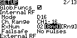

Binding
=======

Binding the receiver to the transmitter is very simple.

Now that we've got the receiver connected to the Pixhawk you can provide it with power simply by connecting the Pixhawk to a USB port on your computer (or to a USB mains power adapter).

There's a green and a red LED behind the little window labelled LED on the receiver, if you provide provide power now the red one will flash on and off (and green one will remain off). This indicates that the receiver is either unbound or that the transmitter that its bound to is not on.

So before we start make sure the receiver is turned off and then locate the little recessed button on it that's labelled F/S.

Now turn on the transmitter and go to the _Model selection_ screen and press PAGE to get to _Setup_, turn the dial until you reach the _Internal RF_ section. The default _Mode_ value is _D16_ and the the default _Ch. Range_ value is _CH1 - 16_ and these are the values we want.

You just have to go to _[Bnd]_ and press ENTER - the transmitter will start emitting a chirping sound.

_Selecting bind._  

Now press the F/S button on the receiver and keep it held down until we're finished. Provide power to the receiver.

The LEDs should initally be solid light green (almost yellow) and solid red but quickly switch to solid green and flashing red to indicate that the receiver is now bound to the transmitter.

Once this is done release the F/S button and then remove power from the receiver. That's it binding is completed.

Press EXIT on the transmitter to stop it chirping and press EXIT until you return to the main screen.

Now reconnect the the receiver to power - the red LED should be off and the green LED should be solid. This indicate that everything is fine and that it can see the transmitter that it's bound to.

This whole process is covered well in [this video from Blue Falcon](https://www.youtube.com/watch?v=RH_RuVbF2YU).

The main screen of the transmitter shows no visual indication of whether it can see the receiver or not. However if you've got the SD card setup then it will announce that telemetry has been lost if you remove power from the receiver (and announce that telemetry has been recovered if you reconnect power).

When all set up the green LED on my receiver flickers very slightly whereas in the Blue Falcon video it seems a more solid green. I don't know if this means anything (it doesn't seem to be a power issue as I measured this and it was fine).

Note: the F/S button also serves other purposes - in addition to being used during binding, as here, it can also be used to set the failsafe behavior and to enter range-check mode. However both these things can also be done via the transmitter - and that's how we'll do things.

TODO: the two page manual that comes with the receiver is largely useless - the table of modes, telemetry etc. is mildly helpful in that it assures you that the above process is correct and that you don't need to use any of the jumpers provided with the receiver. The range check information is important but as noted we'll do that via the transmitter.
