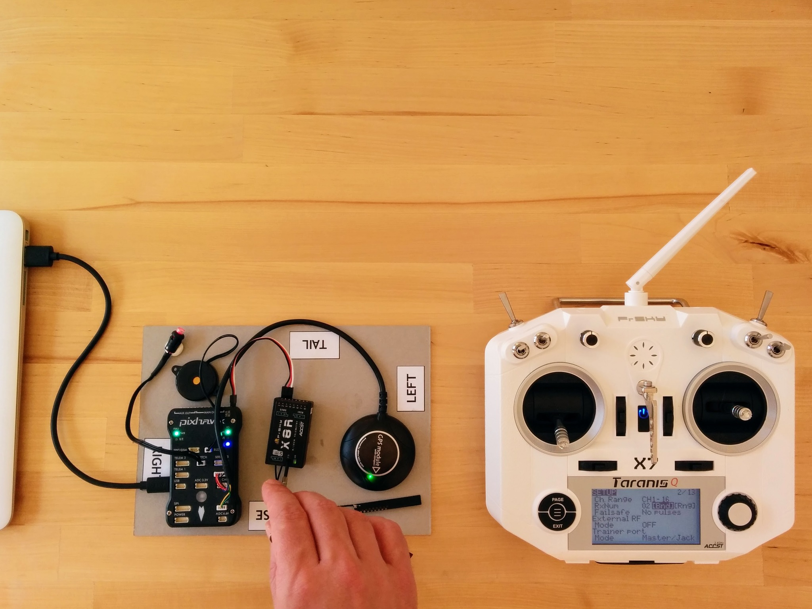

Binding
=======

We've already got all our electronics wired up and can power the Pixhawk via USB and the Pixhawk in turn can power the receiver. And we've created a model on our transmitter - so now we can bind our receiver to out transmitter.

Each RC craft has a receiver - to control a craft the transmitter has to be bound to that craft's receiver. Binding is like pairing a new bluetooth device, such as a speaker, with your smartphone. A single transmitter can be bound to many receivers, each model you create on your transmitter should have an associated bound receiver, a receiver however can only be bound to one transmitter at any given time.

Now that we've got the receiver connected to the Pixhawk you can provide it with power simply by connecting the Pixhawk to a USB port on your computer. After flashing its LEDs wildly, the Pixhawk will chirp loudly every time you connect it up via USB - but don't worry about that for the moment - you can safely plug it in and out without issue. When I say turn on or off the receiver below I just mean connect or disconnect the Pixhawk, that's powering it, from USB.

Note: if you're using Mac or Linux there are no additional drivers that need to be installed for the Pixhawk. However if you're using Windows then I suggest at this point powering the Pixhawk from your computer while it's in sleep mode so that it won't go off trying to find drivers for it. If that isn't an option for some reason then flip forward to [`pixhawk-setup.md`](pixhawk-setup.md) and follow the instructions there for installing Mission Planner as this will also install the necessary Windows drivers.

_Binding the receiver to the transmitter._  

The receiver has a little window labelled LED - there are actually two LEDs behind it, a green and a red one. If you turn on the receiver now the red one will flash on and off (and green one will remain off). This indicates that the receiver is either unbound or that the transmitter that its bound to is not on.

So before we start make sure the receiver is turned off and locate the little recessed button on labelled F/S. Now turn on the transmitter and go to the _Model selection_ screen and press PAGE to get to _Setup_, turn the dial until you reach the _Internal RF_ section (the default values here are already set to what we want, i.e. _Mode_ is _D16_ and _Ch. Range_ is _CH1 - 16_).

You just have to go to _[Bnd]_ and press _ENTER_ - the transmitter will start emitting a chirping sound.

Now press the F/S button on the receiver, keeping it held down until we're finished, and turn on the receiver. Both the red and the green LED should be solid initially and then change to solid green and flashing red to indicate that the receiver has successfully bound with the transmitter (this should happen almost instantly - so it may well look as if red just starts flashing straight away).

Once this is done release the F/S button turn off the receiver. That's it binding is completed - simple!

Press _EXIT_ on the transmitter to stop it chirping and then press _EXIT_ again until you return to the main screen.

Now turn on the receiver again - the red LED should be off and the green LED should be solid. This indicate that everything is good and that the receiver is receiving signal from the transmitter. The green LED flickers very slightly - I haven't found any reference as to why but this seems to be normal.

This whole process is covered well in this [video](https://www.youtube.com/watch?v=RH_RuVbF2YU) from Blue Falcon.

Notes
-----

The main screen of the transmitter shows no visual indication of whether it can see the receiver or not. However if you've got voice alerts (i.e. sounds on the SD card) then it will announce that telemetry has been lost if you turn off the receiver (and announce that telemetry has been recovered if you turn it on again). And once we set up the display of telemetry data later on the transmitter you'll see it flash _NO DATA_ on the telemetry screen if the receiver is not on.

The F/S button also serves other purposes - in addition to being used during binding, as here, it can also be used to set the failsafe behavior and to enter range-check mode. However both these things can also be done via the transmitter - and that's how we'll do things.

The FrSKY [X8R manual](https://www.frsky-rc.com/wp-content/uploads/2017/07/Manual/X8R.pdf) is largely useless for beginners, only once you've made sense of everything elsewhere does it serve as a somewhat helpful summary. The table showing the LED meanings is useful and the table of modes, telemetry etc. reassures one that the process described above is correct (and that you don't need to use any of the jumpers provided with the receiver). The range check and failsafe information is important but as noted we'll handle that via the transmitter.
