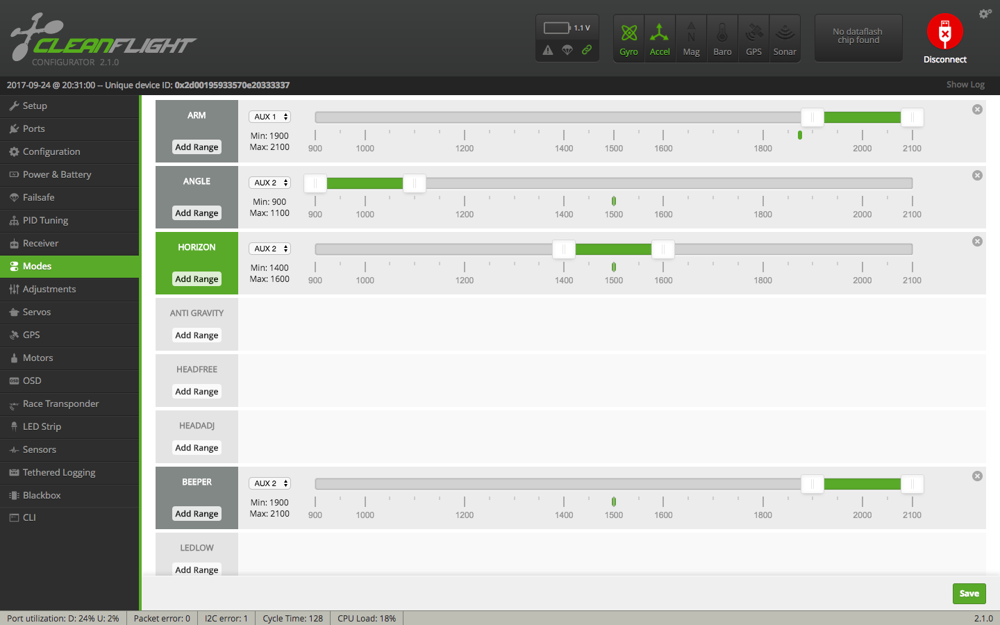

The QX95 came with Cleanflight 1.13.0 and as this is too old a version for the modern configurator it dumped me straight into CLI mode on connecting.

Cleanflight 1.13.0 doesn't support the `diff` command so I created a diff manually like so:

* Dumped all the parameter values  that the QX95 shipped with using `dump`.
* Reset all parameters to their 1.13.0 defaults using `defaults`
* Did another dump and diffed it and the initial one outside Cleanflight.

The result can be found in [`1.13.0-diff.txt`](1.13.0-diff.txt).

I then upgraded the firmware to 2.1.0 (the latest version available at the time of writing), then after connecting I applied the diff I'd created from 1.13.0. I didn't go through any of the parameters to work out what they did, to see if any of the default 2.1.0 values were perhaps more appropriate, I just applied the diff blindly by pasting it in on the CLI tab, followed by `save`.

The LED setup that comes with the QX95 isn't particularly fancy but I stuck with it. However when I switched to the [Matek LED strip](https://www.banggood.com/Matek-WS2812B-LED-Board-With-5V-Buzzer-For-Naze-32-Skyline-32-Flight-Controller-p-991715.html) that has six, rather than four, LEDs I adjusted the setup slightly as otherwise the leftmost four LEDs continued to behave like the original four LED strip while the rightmost two just stayed permanently white. I just swapped the setup of the 3rd LED with the 5th and the 4th with the 6th so that the two permanently white LEDs became the middle two and things balanced out again left and right of the center.

To apply this change just paste in the contents of [`leds-6.txt`](leds-6.txt).

When configuring my model on my transmitter I setup the value for switch _SF_ to be sent as channel 5 and that for switch _SA_ to be sent as channel 6.

Channel 5 and 6 are already mapped to _AUX1_ and _AUX2_ in Cleanflight and on the _Modes_ tab in Cleanflight I setup _AUX1_ just for _ARM_ and _AUX2_ to switch between _ANGLE_, _HORIZON_ and _BEEPER_.

The only other thing I did was do _Calibrate Accelerometer_ on the main _Setup_ tab and on the _PID Tuning_ tab I set the joint roll and pitch RC expo to 0.55 and the one for yaw to 0.35.

The final configuration can be found in [`parameters.txt`](parameters.txt) (produced by `diff`).

Note: upgrading from 1.13.0 to a later version is probably best done before you add a beeper as, for whatever reason, the beeper beeps incessantly while connected to the computer until this is completed.
