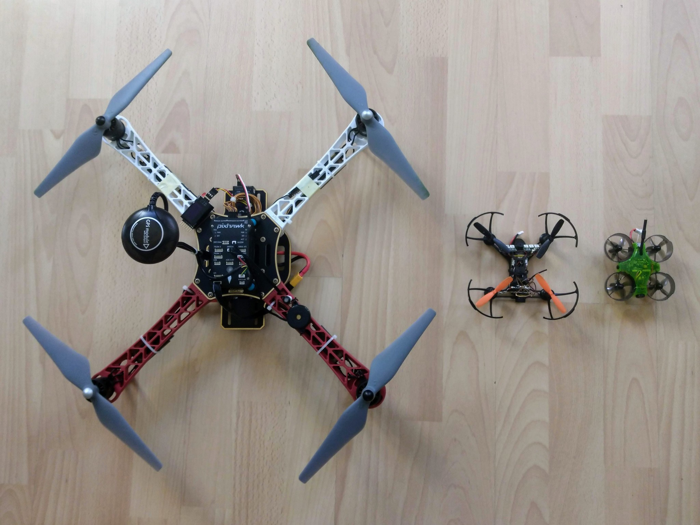

This project documents building a large quadcopter from scratch - going from knowing nothing about remote control vehicles to a completed quadcopter that can complete a route autononmously, i.e. without human control from the ground. For this project I wanted as few black box elements as possible and so used open source software and hardware wherever reasonably possible.

<!-- Add &autoplay=1 to autoplay. -->
<iframe
    width="892" height="502"
    src="https://www.youtube.com/embed/zLzhGyQgPUc?version=3&loop=1&playlist=zLzhGyQgPUc"
    frameborder="0"
    allow="accelerometer; autoplay; encrypted-media; gyroscope; picture-in-picture"
    allowfullscreen>
</iframe>

There's way too much information here to consume in one go - I suggest you first quickly scan through the main build pages to get an overview of what's here and hopefully get some kind of clearer idea of what's involved. Then work your way through the pages in a more systematic manner, starting with the purchase of the necessary parts and working your way through all the necessary setup until you finally have a quadcopter that's ready to fly.

This picture shows, from left-to-right, the large quadcopter covered by this project, a small racing quad and a small but capable indoor one.

When building your own drone (as opposed to buying a consumer drone like the [DJI Mavik](https://www.dji.com/ch/mavic-2)) the current focus of most websites is on racing quads. Unlike the large quad covered in this project, racing quads rarely have GPS and are rarely capable of autonomous flight. Like racecars they try to minimize on weight and do without every feature not necessary for racing - and their flight controllers tend to minimize on the amount of hand holding that they do, much more effort is required to learn how to fly these vehicles.

Note: quad technology has become so cheap that indoor drones are now sold as small novelty presents, that are generally intended to be flown a few times for mild entertainment. However there is a whole class of much more capable indoor quads (like the one shown above) and you can find no end of YouTube videos of people performing amazing runs through indoor environments.

---

Having some experience with hobbyist electronics projects I initially thought that I'd be able to make a quadcopter from scratch, 3D printing elements of the frame, sourcing most of the components, like motors, as generic parts from a big distributor like Digi-Key, and only having to buy a few drone-specific components like propellers. Looking back I see that was extremely naive, but at the time I was quite disappointed when I found various pages (such as [this one](http://ardupilot.org/copter/docs/build-your-own-multicopter.html) from ArduPilot) making clear that this isn't really an option to consider when making one's first quadcopter.

The [parts](parts.md) page makes clear how many different components are required to get a quadcopter off the ground - everything from the frame and flight controller to to velcro straps and a LiPo safety bag. It's important to realize that the physical assembly is only part of the job - some of these parts, such as the transmitter and flight controller, require a serious amount of configuration when doing everything for the first time.

Many manufacturers sell what are referred to as ARF kits. ARF stands for _Almost Ready to Fly_, and such kits consist of an unassembled frame and the parts for the propulsion system (propellers, motors etc.). The ARF acronym makes it sound as if all the interesting work has been taken care of and all that's left is to put things together lego style. But it turns out there's quite enough additional complexity without also having to worry about the frame and the propulsion system.

Important: this build requires a small amount of soldering and it's assumed you've already got a soldering iron, solder etc. If you've never tried soldering before it's easier than you may think - see [soldering](soldering.md) for details.
