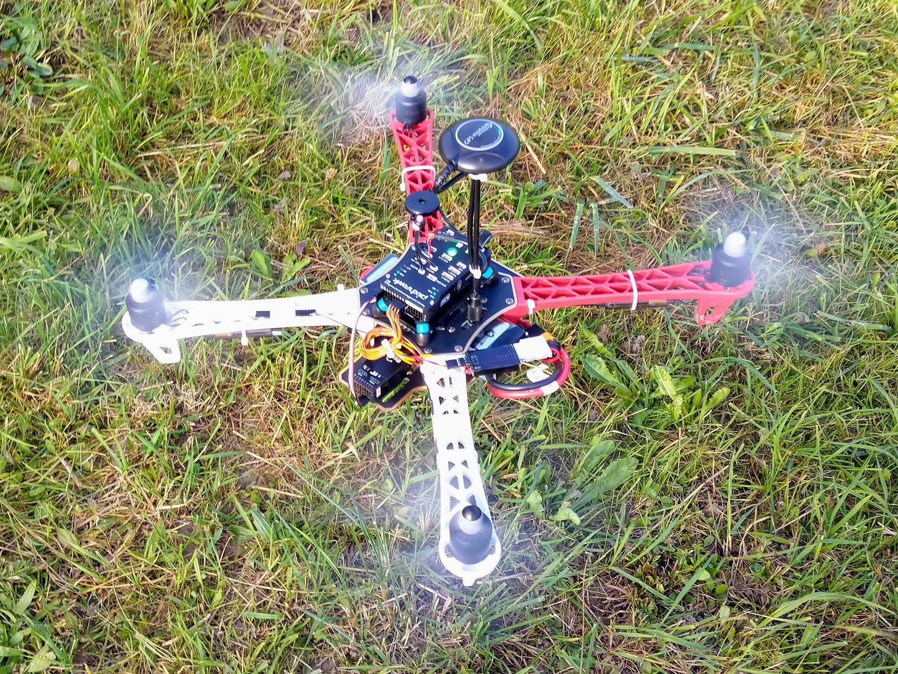

This project documents building a large quadcopter from scratch - going from knowing nothing about remote control vehicles to a completed quadcopter that can complete a route autononmously, i.e. without human control from the ground. For this project I wanted as few black box elements as possible and so used open source software and hardware wherever reasonably possible.

There's way too much information here to consume in one go - I suggest you first quickly scan through the main build pages to get an overview of what's here and hopefully get some kind of clearer idea of what's involved. Then work your way through the pages in a more systematic manner, starting with the purchase of the necessary parts and working your way through all the necessary setup until you finally have a quadcopter that's ready to fly.

TODO: include a photo showing the F450 beside a small race drone, i.e. the QX95, and make some notes on the differences.

---

Having some experience with hobbyist electronics projects I initially thought that I'd be able to make a quadcopter from scratch, 3D printing elements of the frame, sourcing most of the components, like motors, as generic parts from a big distributor like Digi-Key, and only having to buy a few drone-specific components like propellers. Looking back I see that was extremely naive, but at the time I was quite disappointed when I found various pages (such as [this one](http://ardupilot.org/copter/docs/build-your-own-multicopter.html) from ArduPilot) making clear that this isn't really an option to consider when making one's first quadcopter.

The [`parts.md`](parts.md) page makes clear how many different components are required to get a quadcopter off the ground - everything from the frame and flight controller to to velcro straps and a LiPo safety bag. It's important to realize that the physical assembly is only part of the job - some of these parts, such as the transmitter and flight controller, require a serious amount of configuration when doing everything for the first time.

Many manufacturers sell what are referred to as ARF kits. ARF stands for _Almost Ready to Fly_, and such kits consist of an unassembled frame and the parts for the propulsion system (propellers, motors etc.). The ARF acronym makes it sound as if all the interesting work has been taken care of and all that's left is to put things together lego style. But it turns out there's quite enough additional complexity without also having to worry about the frame and the propulsion system.

Important: this build requires a small amount of soldering and it's assumed you've already got a soldering iron, solder etc. If you've never tried soldering before it's easier than you may think - see [`soldering.md`](soldering.md) for details.

---

Build

* [`parts.md`](parts.md) - all parts required for this build with explanations of the major parts.
* [`transmitter-getting-started.md`](transmitter-getting-started.md) - introduction to the transmitter along with basic setup.
* [`receiver.md`](receiver.md) - introduction to the receiver and how to upgrade it via the transmitter.
* [`electronics-assembly.md`](electronics-assembly.md) - wiring up the core electronics, i.e. the Pixhawk, GPS etc.
* [`stick-setup.md`](stick-setup.md) - disabling self centering for the transmitter throttle.
* [`transmitter-model-setup.md`](transmitter-model-setup.md) - configuring a model in the transmitter.
* [`binding.md`](binding.md) - binding the receiver to the transmitter.
* [`transmitter-flight-modes.md`](transmitter-flight-modes.md) - setting up flight modes for a model. TODO: move out unrelated sections.
* [`frame-parts.md`](frame-parts.md) - details of the parts that come with the frame kit and propulsion system.
* [`pdb-soldering.md`](pdb-soldering.md) - soldering up the PDB.
* [`frame-assembly.md`](frame-assembly.md) - assembling the frame.
* [`pixhawk-setup.md`](pixhawk-setup.md) - configuring the Pixhawk.
* [`final-assembly.md`](final-assembly.md) - assembling the frame and electronics for the first flight.
* [`final-setup.md`](final-setup.md) - configuring the display of RSSI and battery voltage (with alarms).
* [`battery-charging.md`](battery-charging.md) - charging and storing the batteries.

---

TODO: move following sections elsewhere, they no longer belong here.

Websites
--------

When putting together this page the most useful sites I found were:

* ArduPilot - in particular its [assembly](http://ardupilot.org/copter/docs/common-pixhawk-wiring-and-quick-start.html) and related sections.
* [Pixhawk.org](https://pixhawk.org/)
* RCGroups - in particualr the [multicopter drone forums](https://www.rcgroups.com/aircraft-electric-multirotor-drones-790/).

The [ArduPilot forums](http://discuss.ardupilot.org/) and [PX4 forums](http://discuss.px4.io/) were also useful.

Note: the terms Pixhawk and PX4 are often used interchangeably - though Pixhawk generally refers to the flight controller hardware while PX4 generally refers to the flight controller software stack.

---

In writing the [`parts.md`](parts.md) page I started including so many side notes that they started clogging up the whole thing, so I've moved these notes out into [`notes.md`](notes.md). They're worth scanning over quickly. They cover:

* Brief notes on [clockwise and counterclockwise motors](notes.md#motor-direction) and the [external LED and USB connector](notes.md#external-led-and-usb-port).
* The [F450 ARF kit](notes.md#f450-arf-kit) and why I choose to buy the F450 frame and propulsion system as separate components rather than bundled as an ARF kit.
* The [E300 vs E305 vs E310](notes.md#e300-vs-e305-vs-e310) propulsion systems and the [E305 motor variants](notes.md#e305-motor-variants).
* The [power connectors](notes.md#power-connectors) of the power module and the charger.
* The [LiPo batteries](notes.md#batteries), the [charger](notes.md#charger), the battery alarm and the battery safety bag.
* The [IMU and MCU](notes.md#imu-and-mcu) - the core parts of the flight controller and how you can experiment with them.
* [Vibration](notes.md#vibration) and why a vibration damping kit might improve the performance of the sensors in the flight controller.
* Predefined [waypoints](notes.md#waypoints) and in-flight drone-to-computer communication (as opposed to using the hand-held transmitter).
* The [Pixhawk 2.1](notes.md#pixhawk-21) and some background leading to my choice of the classic Pixhawk flight controller.
* [Pixhawk.org vs the ArduPilot site](notes.md#pixhawkorg-vs-ardupilotorg).
* [Bags and cases](notes.md#bag--case) and why the size of the F450 makes it hard to find a good bag for it.
* [Chinese copies](notes.md#chinese-copies) and how buying drone parts is a case of caveat emptor.
