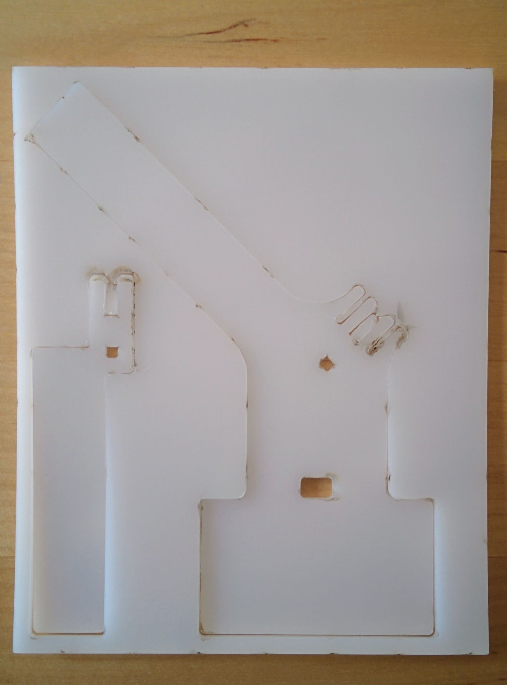
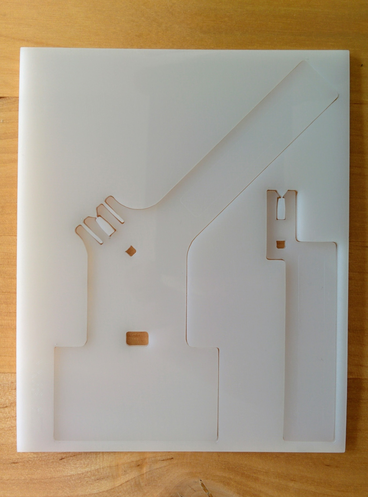
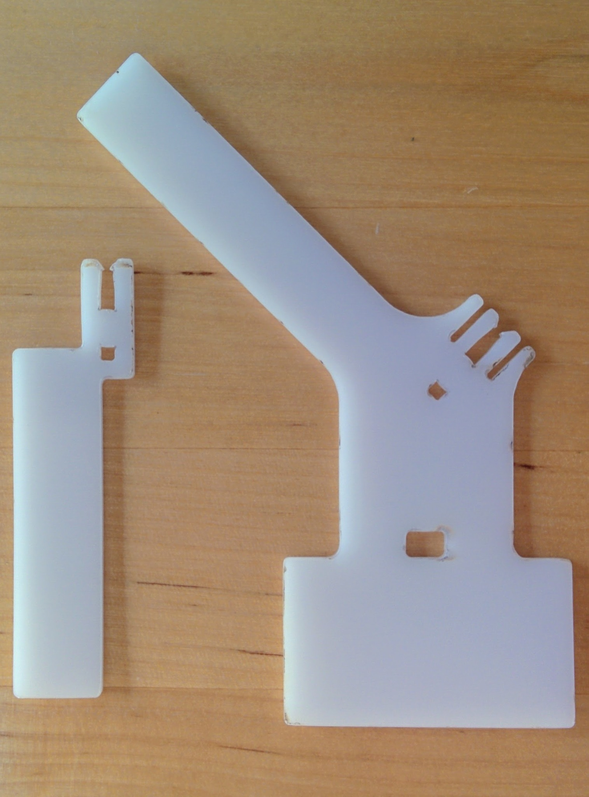
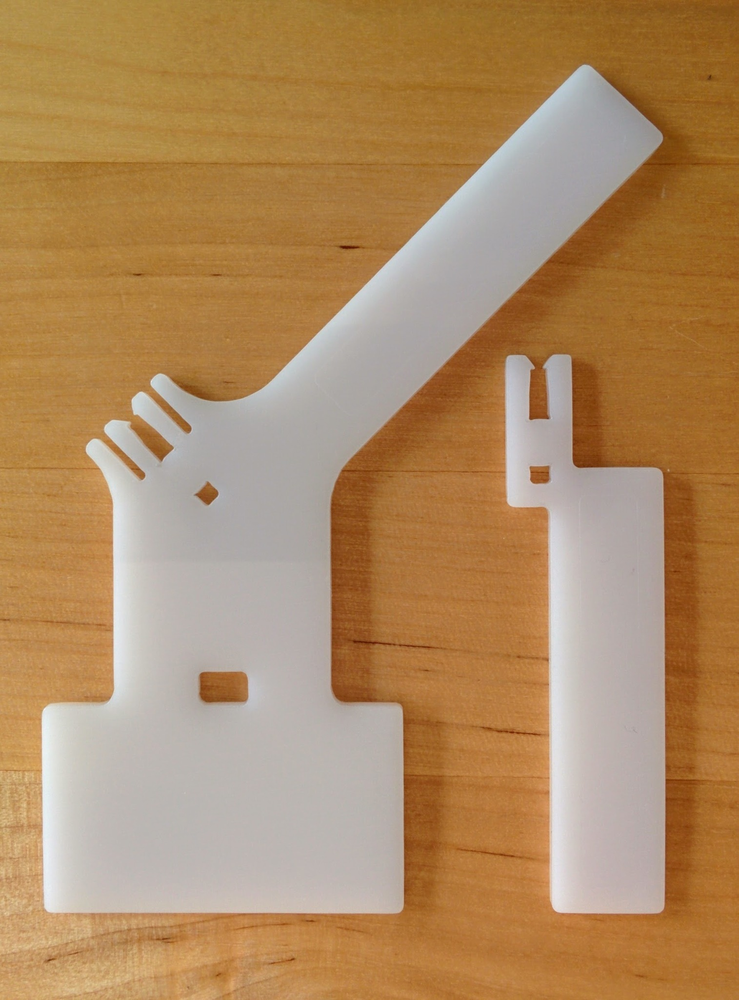
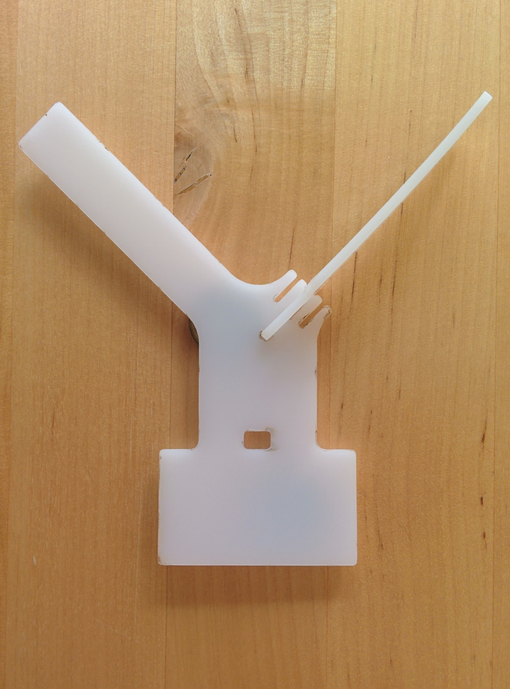
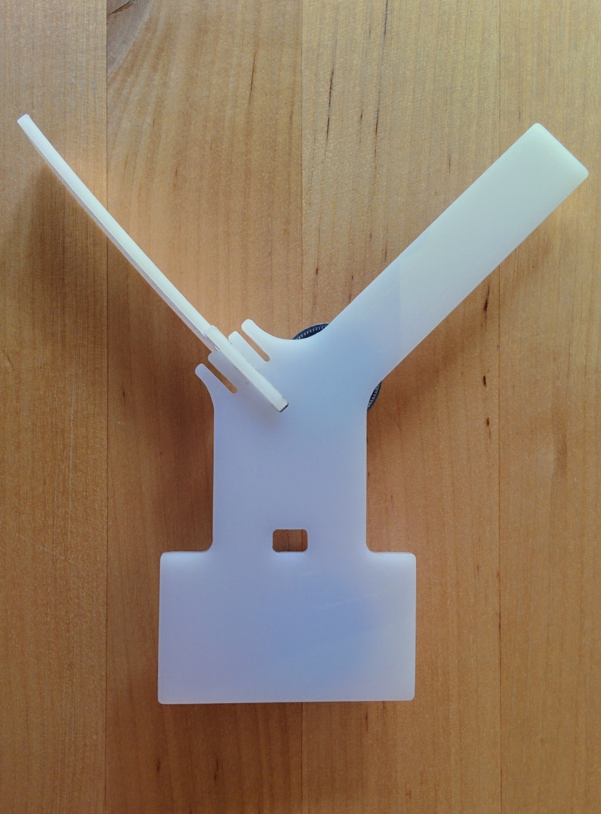

Version 2
=========

This directory contains my second antenna mount design, incorporating the lessons learned from the first design. It retains the cable-tie hole though really I think it probably makes more sense to attach the receiver to the mount using tape.

Finished result
---------------

Laser cut POM sheet as received from Sculpteo - note the scorching (as with version 1) on the top side.

 

Parts popped out of sheet.

 

Parts assembled into mount. Notice the warping in the attached arm - it's slightly curved. This wasn't so apparent in the parts for version 1 of the mount but is apparently a common issue with POM and something to do with residual stress in the material that causes it to warp after manufacture.

 

Note: the scratching, that both Sculpteo and Ponoko warn of and which was very apparent on version 1, was far less apparent with this piece - though on the whole, if given a choice, I'd take minor scratches over warping.
