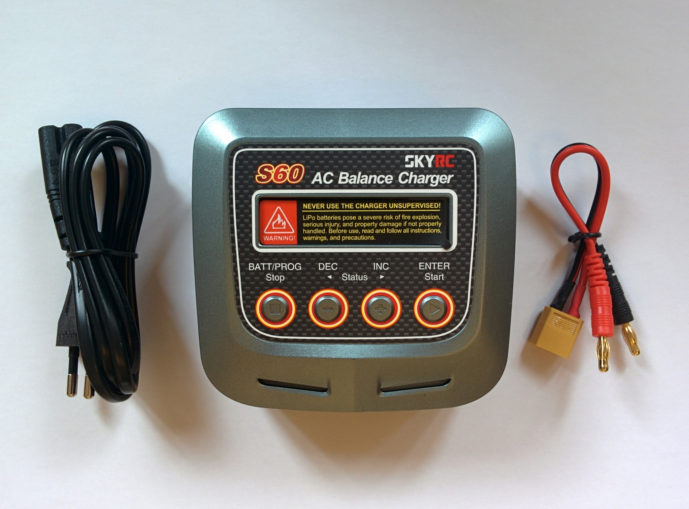
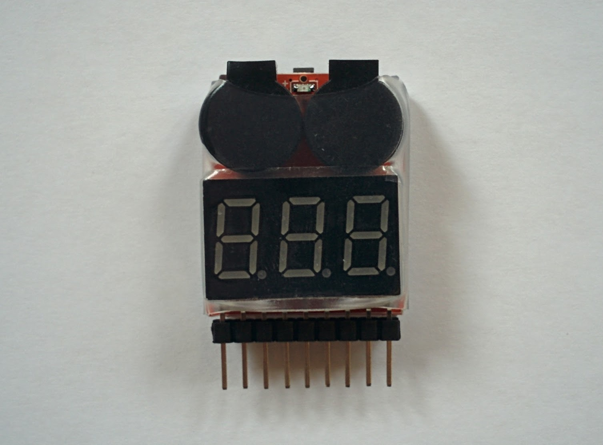

Batteries
=========

Charging LiPo batteries is somewhat more involved than you might imagine. The battery needs to be connected to the charger via two leads, one is the same heavy duty lead that's used to connect the battery to your drone and the other is a balance lead. The charger charges the battery via the main heavy duty lead and monitors the state of the individual cells via the balance lead. Not all the cells become fully charged at the same time so once some of the cells reach full charge an odd thing happens (or so it seems initially), the charger continues charging the whole battery so that the remaining cells also become fully charged but at the same time it has to start ever so slightly discharging the cells that have aleady reached full charge so that they don't become overcharged as the battery continues to be charged. This discharging happens via the balance lead, so it serves both to monitor and discharge cells. Bruce Simpson has a very good video that goes into the details, from [6:08](https://www.youtube.com/watch?v=wIbHLacozFo&feature=youtu.be&t=368) to 11:30 he explains the whole thing on a whiteboard (after the 11:30 point he starts explaining his clever trick for quickly charging specific cells in a battery that have somehow become very out of balance with the others - this is fairly specialist stuff and not immediately relevant).

| Parts |
|-------|
| _S60 charger._  |
| _Battery._  |
| _Voltage sensor._  |
| _LiPo safety bag._  |

Voltage sensor
--------------

LiPo batteries should never be fully discharged, most LiPo chargers will refuse to recharge cells that have been discharged below 3V and discharging it below 2.5V will apparently result in "permanent and irreversible chemical damage."

So new LiPo batteries will come delivered at what's called their storage voltage. You can check the voltage with the voltage sensor as shown.

_Sensor displaying cell voltages._  

The balance connector for a 4 cell battery has 5 wires, i.e. one wire for each of the cells plus an additional wire. At one end of the connector there should be a black ground wire and at the other end a red power wire. The colors of the in-between wires vary randonly by manufacturer - in this case they're black. Look for the pin labelled _GND_ on the sensor and plug in the balance connector such that the _GND_ pin and the next four pins of the sensor are connected, making sure that it's a black wire (and not a red wire) from your battery that's connected to the _GND_ pin.

The sensor displays the voltage of all the cells in the battery, this is important as it's not the overall voltage of the battery that you should monitor but that of the cell with the lowest voltage (under normal circumstances all cells should discharge at much the same rate). My batteries came delivered with a voltage of 15.4V.

This sensor is a high-tech version of the classic battery alarm. Both this sensor and a battery alarm are convenient for checking the voltage of your battery on the ground but their real purpose is for warning you in-flight if the battery voltage is getting too low.

_Battery alarm._  

The classic battery alarm makes a very loud noise as its warning signal whereas this sensor is plugged into the battery (just as shown above) and also connected via another lead to your craft's receiver and sends voltage data via the receiver to the transmitter. The transmitter can be configured to display this data on its telemetry data screens and to raise an alarm if the values drop below defined levels. This is an example of where the historical terms receiver and transmitter aren't entirely appropriate anymore as it's the receiver that's transmitting telemetry data to the transmitter.

Connecting charger and battery
------------------------------

*Warning:* Always connect the charger lead (with the banana plugs) to the charger before connecting it to the battery.

_Charger and charger lead._  

Doing things in his order is more important than it seems - the easiest way to permanently damage your battery (and potentially cause an explosion and fire) is to short it - and probably the easiest way to short it is to first connect the charger lead to the battery, rather than the charger, and then accidentally knock together the banana plugs of the charger lead.

Despite reading dire warnings about this (and having written this section) I've still thoughtlessly disconnected the charger lead from the charger before unplugging the battery from the lead - when you do this it becomes frighteningly obvious how easy it is to touch the banana connectors together. I actually attached a little label, with "THINK!" in red, to the banana plug end of my charger lead after doing this (whether that works is another matter). Why charger manufacturers standardized on male banana plugs for charger leads, making this kind of accident very easy, is a mystery.

Once the charger lead is plugged in connect the battery to the charger - the battery must be connected via both leads to the charger as shown.

_Charger connected to battery._  

Ideally you should do your charging on a concrete or stone floor (as shown below), i.e. avoid more flammable surfaces like wood or carpet. I do my charging on a metal baking tray near a window so I can throw it outside if any problems occur.

**Update:** I stopped using a metal tray after I did exactly what I warn about above - I unplugged the banana connectors from the charger before disconnecting the battery from the charger lead. Having a large metal surface around when you make this kind of mistake is only likely to make the shorting risk even worse.

Battery charging
----------------

Download the [S60 user manual PDF](http://www.skyrc.com/index.php?route=product/product/download&download_id=145) (it's in color and easier to read than the small black and white version that comes with the charger). It's an intimidating complex manual but if you just want to charge a LiPo battery properly it's very simple - the device by default starts straight into this mode. The following covers much the same details as the "Getting started" section of the manual.

When you power on the charger it starts back into the last mode that you used - when mine arrived new it started into "LiPo balance" mode and showed 2.0A and 14.8V(4S), i.e. it was already the right mode for what I wanted to do with almost the right settings already.

Assuming the charger is in "LiPo balance" mode then all that needs to be done is to adjust the amps and cell count to match the battery. To do this just press ENTER, first the amps values will flash - if your battery is e.g. 3700mAh then use INC and/or DEC to adjust the amps value to 3.7A - then press ENTER again and the cells value will flash, adjust this if necessary or if it already shows the correct value - e.g. 4S for a 4 cell battery - then just press ENTER again to complete this step.

Important: you must adjust the amps to match your battery, my battery is a 3700mAh one so I used an amps value of 3.7A, if your's is e.g. 3300mAh then you should use 3.3A - i.e. it's a simple relationship between the mAh value of your battery and the amps value on the charger (see later for more on this).

Now you're ready to start charging - you should keep the battery in a LiPo safety bag for the duration of the charging.

_Ready to start charging._  

Press and hold the ENTER button for 3 seconds, the charger will check the battery - it shows an R and an S value, the S value is the number of cells you set and the R value is the number of cells the charger detected. You should confirm these are both the same value and match your battery (actually if they're not the same value the charger will complain and you can't proceed). If all is correct press ENTER again.

Aside: if anyone can tell me why it says 4SER rather than just 4S then please tell me.

The charger then starts making a noticeable noise as the fan starts up and gets gradually louder. The fan noise is fairly irritating as all advise is to never leave batteries charging unattended (so you probably shouldn't abandon the process to complete in another room).

You can use the INC button during charging to cycle through information about the ongoing process - I just leave it on the screen that shows the fuel percentage increasing.

The charger beeps when finished - just press the STOP button to turn off the flashing end of charging message and unplug the battery.

### Notes

The charger has a timeout (that defaults to 2 hours) - any operation that needs longer than this amount of time will be stopped when the timeout expires. This just forces you to be present - the charger can't accidentally be left running indefinitely. When this happens you can simply continue the operation by starting it again (hold ENTER for 3 seconds as above).

Ideally you should charge your battery on a fire resistent surface like concrete. Many people recommend charging the battery in a LiPo safety bag (as well as simply storing them in such a bag) or in something even more robust (like a well vented ammo box).

If you've set things up as described it should take an hour or so to charge the battery from 20% to full. Why 20%? As noted up above a LiPo battery should never be discharged beyond a certain point, this point corresponds to having discharged about 80% of its capacity (search for the "80% rule" [here](http://www.rchelicopterfun.com/rc-lipo-batteries.html)).

TODO: time how long it takes to really fully charge the battery from 20% - I calculated the hour value quoted here using an online calculator rather than from experience.

Taking the milliamp/hours, 3700mAh in my case, and translating that value directly to the Amp setting for the charger, as done above, is the simplest thing to do - but the reason for doing this takes a bit of explanation and involves the battery's charge rate. If you're interested see [this page](http://www.dronetrest.com/t/everything-you-need-to-know-about-lipo-battery-chargers/1326) and its battery charging rules (that include the injunction "always charge your battery at 1C or less") and its charging current section that explains combining the charging rate and the battery's milliamp/hours value, for even more details see the page mentioned above that covers the 80% rule.

The C value shown on a battery (45C in my case) is its maximum discharge rate and does not imply a similar charge rate, i.e. the 1C rule still holds for batteries with high C values.

TODO: does the flight controller output voltage as part of the telemetry information shown on the transmitter or in the ground control software?

Battery storage
---------------

If you're not going to use a battery in the next few days then it should be brought to its storage voltage first.

The main reason that I bought the S60 charger rather than a cheaper and simpler model is that doing this is one of its stardard programs.

The whole process is nearly identical to charging. The only difference is that right at the start when the "LiPo balance" mode is showing you just need to press INC until "LiPo storage" mode is shown instead. Then just go through the same process as before. If the battery is currently below its storage voltage the charger will charge it, and if it's above the charger will discharge it, until the storage voltage is reached.

Discharging the battery takes far longer than charging it as discharging is done via the balance connector which functions far slower than the main charging lead. When the battery is almost fully charged, discharging the already full cells to ensure they don't become overcharged actually involves temporarily disabling the charging of the other cells. Generally this balancing phase is short compared to the total charging time so you don't notice the slowness. However if you discharge a fully charged battery down to its storage voltage then this whole process happens via the balance connector and you really will notice how slow it is - I tested this and it took the charger 170 minutes with my battery, i.e. far longer than the typical time to fully charge the battery.

Once the battery is at storage voltage the battery should be stored in a LiPo safety bag.

Note: there's a lot of dispute on the web as to whether storage voltage is not important at all or crucial (as opposed to storing batteries fully charged or discharged to 3V) - battery manufacturers though consistently recommend it.
