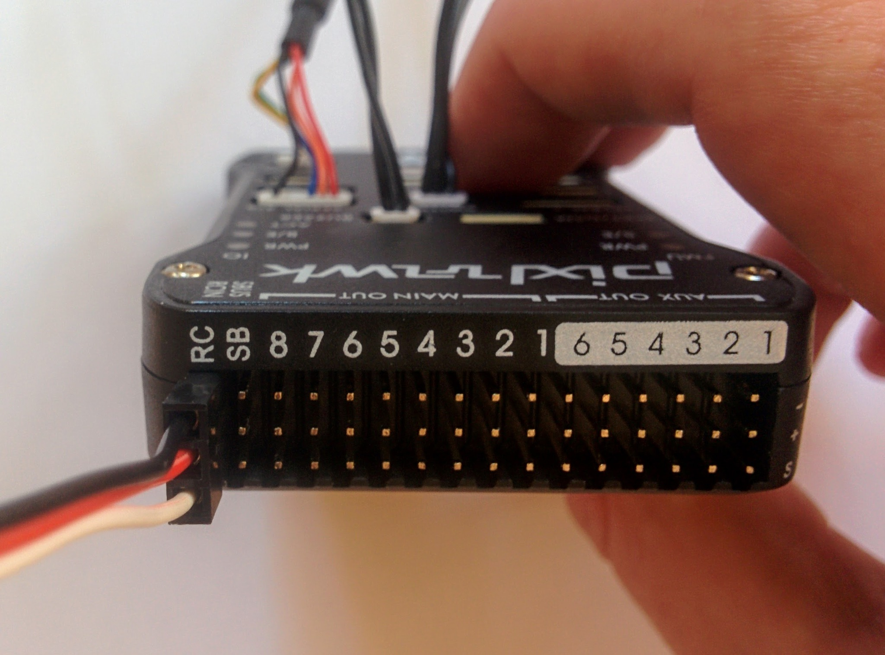

Now that we've done the initial set up for the transmitter and receiver, we can connect up all the electronics (except the battery, ESCs and motors) and then connect everything to a computer via USB to configure the flight controller (and experiment a bit) before putting together the full drone.

The Pixhawk comes with a number of parts (shown below) - these include a buzzer, a safety switch, a servo cable for connecting the receiver, a micro SD card and a USB cable. There's also an SD card adapter and two other cables that aren't of immediate use.

_Pixhawk and accompanying parts._  

As well as the Pixhawk and the parts above we also have a GPS module (that also includes a compass).

_GPS (and compass) module._  

The style of connectors used by the Pixhawk and the components that connect to it (with the exception of the receiver) are horrible. I've come across them before - they're designed for production setups where it's not envisaged that a given connection will ever be unplugged again once connected, i.e. they're not very hobbyist friendly. It's no wonder that in the video [introducing the Pixracer](https://www.youtube.com/watch?v=mpb6Cq023N8&feature=youtu.be&t=62) that they say the best thing about it is that they've switched to a nicer style of connector (as have other later Pixhawk variants). The downside of changing the connector type is that one then has to change the awful-but-standard connectors on all components one wants to connect.

Note: in [this video](https://www.youtube.com/watch?v=Kfu8M8t2fWY) from the ETH Pixhawk group it all looks so easy - things just plug in and out without problem.

_Pixhawk wired up (without receiver)._  

Note: initially I mistook the _GPS_ label as labelling the socket above it and accidentally plugged the GPS into the _SERIAL 4/5_ socket.

When initially attempting to plug in the buzzer etc. I found the connectors so unwilling to go in that I wondered if I was really supposed to apply near board breaking pressure to just force them in. The answer is no - instead for each connector I repeatedly waggled it in and out gently until I could feel everything engage nicely enough that it was then possible to force the connector in fully. This required a reasonable amount of force, with my thumbnails to the edges of the connector, but not too much.

Once this is done inserting the SD card is altogether more pleasant. There is enough open space beyond the slot in the case that it's possible to push the SD card in without pushing it into the actual SD card holder. The SD card holder is spring loaded so it's fairly obvious once you feel the resistance of the springs. The SD card has to be pushed so far in that I couldn't do it with just my finger nails, I used a small screw driver to press it in the final millimeter or two (if you look closely at the next photo you'll see the SD card is quite far in).

_Pixhawk with microSD card inserted._  

Note: the SD card comes competely blank and is just used for storage (logs, waypoint data etc.), it does not contain the Pixhawk flight controller software - this is flashed to 2MB of non-removable internal RAM via the Pixhawk's USB connection (we'll be coming to that in a later section).

The receiver
------------

The final step here is to connect the receiver to the Pixhawk.  It was surprisingly hard to find clear instructions on connecting the X8R receiver to the Pixhawk - it's trivial though once you know what ports are involved and is shown clearly in the pictures below. You just have to connect the S.BUS port on the receiver to the column of pins labelled RC on the top of the Pixhawk.

| | | |
|-|-|-|
| _Cable plugged into Pixhawk._  | &nbsp;  | _Cable plugged into receiver._  |

You can confirm you've got the wiring right from the little graphics on both the X8R and the Pixhawk. On the top of X8R you see a little graphic, labelled SBUS, that's shaped like the port and contains a minus, a plus and a little square wave symbol, for ground, power and signal respectively, i.e. showing you which pin is which. On the Pixhawk right at the end of the three rows of pins you see similarly the labels minus, plus and S. So just make sure the black wire on your servo cable is connected to the pin labelled minus (ground) on both the Pixhawk and receiver ends and you can't go wrong.

Note: servo cables aren't always black, red and white. Power is always red but ground may be brown instead of black and the signal wire can be basically any color (see this [page](http://www.robotplatform.com/knowledge/servo/servo_manufacturers.html) for more details).

On the Pixhawk the first column of pins is labelled RC and the second is labelled SB for S.BUS - but don't be confused this is for S.BUS output from the Pixhawk and is not used in this build, it is not intended for input from the receiver.

Pixhawk fully wired up
----------------------

Now the Pixhawk is wired up and ready to be connected to a computer.

_Pixhawk wired up (with receiver)._  

Initially I was worriend that the whole setup would need more power than a laptop USB port could easily provide so I connected the Pixhawk to one of the higher ampage capable ports on a powered USB hub but, for whatever reason, this didn't work (the Pixhawk made an unhappy squawking sound). As it turns out the whole system runs fine off my laptop USB port. I used a USB power meter to measure how many amps the whole setup draws - it's never more than 300mA so well wihtin the 500mA minimum that all USB ports should support.

The Pixhawk seems quite choosy about the type of USB port it's plugged into - as well as complaining when plugged into a higher ampage charging port, as just described, it also complained if I tried to power it off a USB charger (the kind of thing you'd use with your phone). So it seems best to just use it with the standard USB ports one finds on a computer.

Cardboard layout
----------------

We're almost ready to connect the Pixhawk via USB to a computer and configure it for the first time. This configuration will involve all the parts, i.e. Pixhawk, GPS, receiver etc., and will involve some calibration steps, that require rotating the Pixhawk about its axes, so it's best to mount everything on a piece of cardboard first using [Blu Tack](https://en.wikipedia.org/wiki/Blu_Tack) to make these steps easier.

_White tack on back of Pixhawk and other parts._  

_Pixhawk and other parts mounted on cardboard._  

Actually as you can see I used a white alternative to Blu Tack - it comes from UHU, has the original name [White Tack](https://www.amazon.co.uk/UHU-White-Tack-Twin-Pack/dp/B00A1KV52Q/) (in German it's called patafix) and is less oily than Blu Tack.

Make sure to get the orientation correct, you'll need to know which side corresponds to nose, tail, left and right.

Notice the triangle like arrow on the GPS module and the white arrow head like graphic on the Pixhawk? These are important - the arrows on the Pixhawk and the GPS module must both be pointing forward, i.e. in the nose direction. In the photo you can see GPS module is pointing slightly to the right, this isn't too critical at this stage but when it comes to mounting the components on the actual frame it's important to get this as dead on as you can so the Pixhawk and the GPS both agree exactly on what direction is forward.

Note: the arrow on this GPS module points in one direction and its cable comes out the other side like a tail, this seems an intuitive arrangement but isn't universal - some GPS modules have the cable coming out the same side that the arrow is pointing.

As mentioned the initial setup will involve some calibration steps, these steps will need to be repeated once the parts are mounted in their final position on the frame as proper calibration depends on the current layout of the components involved.
