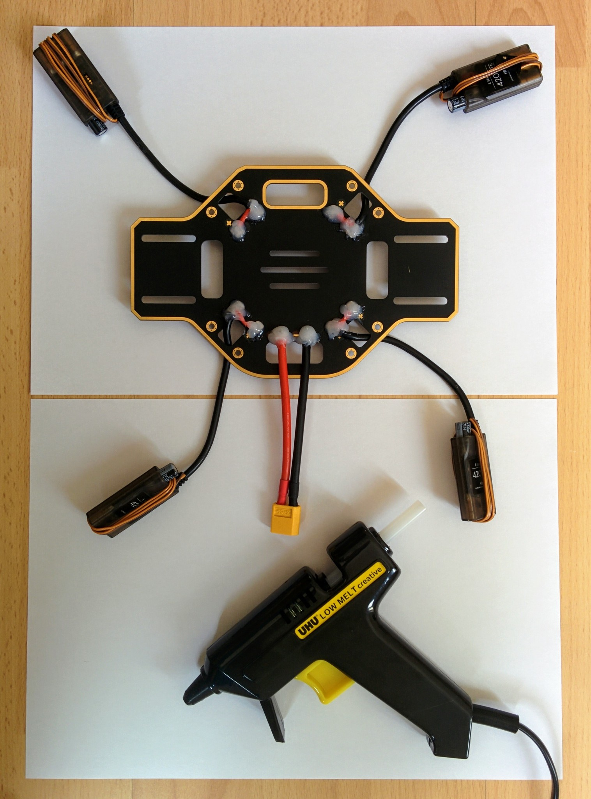
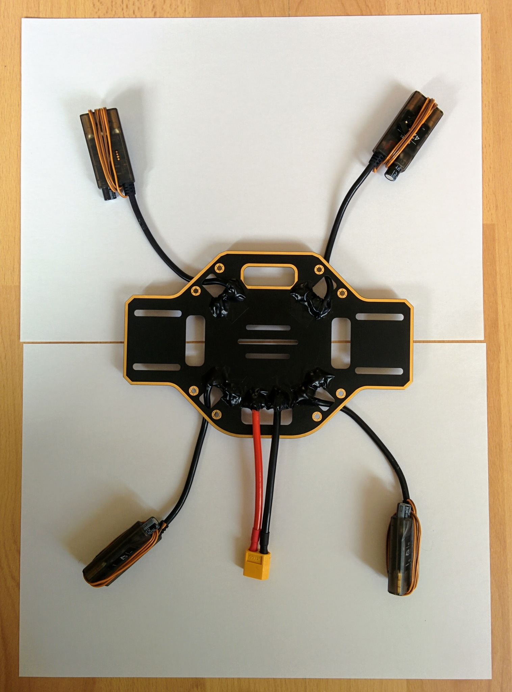
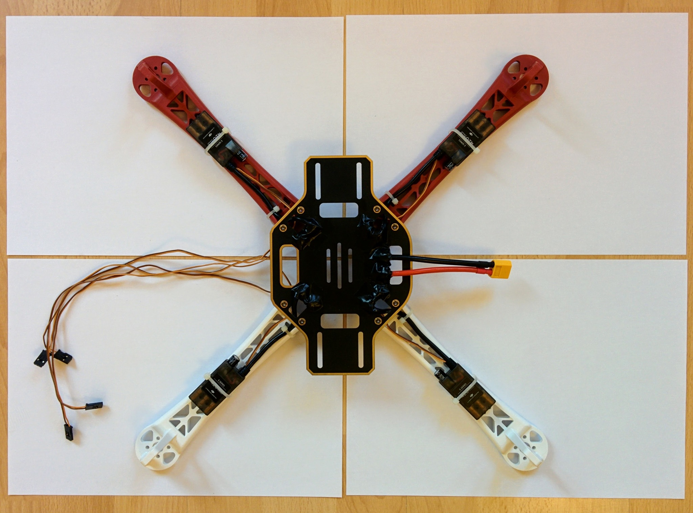
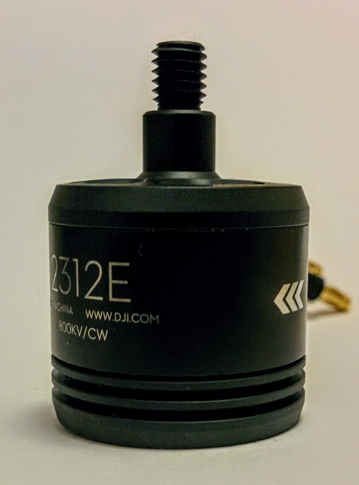
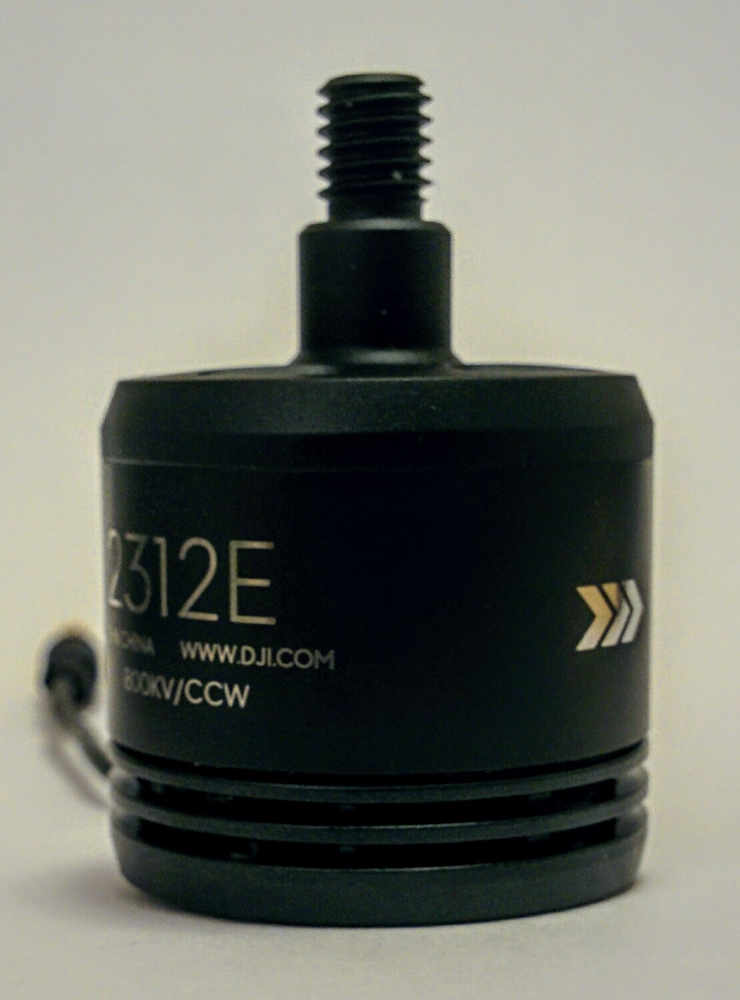

TODO: see also [`frame-parts.md`](frame-parts.md).

Now that we've soldered up the PDB and done the continuity testing we can do a quick check with the battery before assembling the frame.

If you've done the continuity testing properly you should be pretty confident there are no shorts, however connecting the battery for the first time is the point at which you'll know for sure. As such you should do this test outside on concrete as it there is a short the battery will puff up and possibly explode and catch fire.

The ESCs will beep to indicate their state if everything is OK and they are getting power (you can see a description of the sounds they make in the [E305 user manual](http://dl.djicdn.com/downloads/e305/en/E305_User_Manual_v1.00_en.pdf)). They'll only make a sound if the motors are connected so connect a motor to each ESC. At this point the order of the connectors is unimportant, for each motor just plug its three connectors any-which-way into an ESC. The bullet connectors are quite hard to remove once fully inserted so push them in most but not all of the way for this test. Once all the motors are connected, connect the battery - for safety reasons don't lean over the battery while doing this.

Update: The ESCs produce a high pitched beep that's very hard to localize, i.e. if three of the ESCs were beeping and one wasn't I'd find it very hard to tell which of the four was the non-beeping one. So instead of connecting all four motors at once I connected them one at a time. So making sure the battery was unplugged I plugged a motor into one of the ESCs, then plugged in the battery and then unplugged it again once I'd heard the expected beeping sound. This is primarily a test of the wiring and the ESCs and one could just swap the one motor from one ESC to the next but using a different motor to test each ESC also provides a basic check of the motors as well.

TODO: it sounds like the motors are making a sound as well, can this be? They definitely throb gently - is the a motor sound or the throbbing covered anywhere?

The bullet plugs can be quite to disconnect from the ESC so for this test it's fine not to push them in fully.

I would not recommed plugging in and out motors, or leaving motors partially plugged in, while the battery is connected - you want to avoid any possibility that the bullet connectors touch anything that's conducting power and causes a short.

_Outdoor battery test._  

If all goes well you'll hear a continuous tone from all the ESCs. This is actually the ESC error tone - indicating that they're receiving no control signal - which isn't surprising as they're not connected yet to the flight controller. But it does indicate that the PDB is wired up correctly and delivering power to each ESC.

The tone is one of those sounds where it's hard to determine the source, I had to hold my ear right up to each ESC in turn to check that a sound was coming from each. The motors also seem to be making a sound, if you hold each one you can feel a little pulsing motion in each motor.

The solder joints are large and exposed and could easily accidentally short against something, the [F450 user manual](http://dl.djicdn.com/downloads/flamewheel/en/F450_User_Manual_v2.2_en.pdf) very briefly mentions that you should insulate these points but doesn't suggest how. At [3:31](https://youtu.be/pUTHIL_Xfcc?t=211) in their assembly video they use hot glue. At [28:41](https://youtu.be/ER2GxMo0X3E?t=1721) in the Marionville Models video he just uses insulation tape.

I bought a cheap arts and crafts hot glue gun (the Uhu [Creative XL](http://www.uhu.com/en/products/glue-guns-hot-melt-adhesives/detail/uhu-creative-xl-low-melt-110c-glue-gun.html?cHash=62ef031c5d16bc8a8cefa468999b7dd9)) and you can see the results here.

_Solder joints covered in hot glue._  

If you've ever opened up any consumer electronics item you'll often find clear rubbery hot glue has been used at various point, generally as a form of strain relief for cables that may occassionaly be pulled rather than as a form of insulation. The glue from my glue gun was quite different to this, it's not transparent and it went hard rather than rubbery and once hard it was quite easy to prise off (even after leaving it for its 2 hours maximum bonding time) which obviously isn't ideal. After a little searching it seems I should have been looking for "high viscosity", i.e. more rubbery, glue but I can't recommend a particular product.

It's probably good enough to just cover everything up with insulating tape without using hot glue - though watch out, if there are any little spurs or sharp points at the solder joints they may pierce the tape. I finished up covering everything in tape anyway (using completely normal insulating tape - this [one](https://www.amazon.co.uk/d/Tape/Tesa-56192-00010-02-Insulation-Tape-15-mm-Black/B004SQLWH2/) from Tesa), this makes things look much tidier.

_Glue and wires covered by insulation tape._  

What goes where
---------------

You have a lot of flexibility in how you put the quadcopter together. The classic configuration has the PDB with its solder pads facing upwards and all wires simply soldered onto this upper face (without any threading of cables through holes in the PDB as I've done), then the Pixhawk is affixed to the PDB with adhesive foam pads (which provide some vibration damping) and then the adhesive velcro strip is attached left to right on top of the upper plate and the battery is installed here, held in place by the velcro and the battery strap.

Rather than this classic configuration I'm going with a setup that has become quite common with setups involving a vibration damping platform. The footprint of most vibration damping platforms means they simply won't fit between the arms on the bottom plate (and even if they did the vertical height of a platform plus Pixhawk plus plugged in cables would probably be more than could be squashed between the top and bottom plates). So in this setup the vibration damping platform and Pixhawk go on the top plate and the battery goes between the top and bottom plate.  In this configuration the pads of the PDB face downwards, this means all the solder joints are more exposed (being on the underside of the craft) - but it has the advantage that the area between the bottom and top plate is free of obstacles like wires and solder joints.

It's not only space issues that make it seem preferable to mount the Pixhawk on top, having it there also makes it easier to get at. Before I made the decision to mount the Pixhawk on top I actually bought a [LED and USB module](https://www.unmannedtechshop.co.uk/all-in-one-led-and-usb-module-for-pixhawk/) (along with an [I2C board](https://www.unmannedtechshop.co.uk/i2c-board/) that needs to used with it) - if the Pixhawk is installed in the middle space then its USB port is hard to get at and its status LED hard to see, so this little module duplicates the USB port and LED in a little unit that can be attached to one of the quadcopter arms where it's easy to get at and a cable run back from it to the hidden away Pixhawk.

However I decided I wanted to be able to easily get at the ports of the Pixhawk so mounting it on the top plate made more sense. This has another upside in that it moves the Pixhawk further away from the electrical noise of the PDB but has the downside of making the GPS mast harder to place (the upper plate is relatively small and the the vibration damping platform ends up covering a lot of it).

I'm keeping with the convention of using the two red arms for the front arms and the white ones for the back arms (even though this seems back to front to me e.g. relative to a car with its white lights at the front and red ones at the back). Similarly I'm going to stick with having the PDB oriented so that the power connector points off to the left (as [here](https://youtu.be/ER2GxMo0X3E?t=1835) in the Marionville Models video and [here](https://youtu.be/H_Rvi7xQLdw?t=118) in one of the DJI videos). In some DJI video they have the wider axis of the PDB going left-right but having it going front-back seems to make allowing you e.g. to mount a camera on the underside of the front facing extenstion.

Rather than keep the battery in place with velcro, as it's hard to pull upwards when the battery is mounted in the middle space, I'm going to use a non-slip silicone mat (like this [one](https://hobbyking.com/en_us/battery-silicon-anti-slip-mat-126x40x1-5mm-black.html)) instead. And rather than mount it left to right I'm going to mount it front to rear as this makes it possible to moving it forward or back to compensate for e.g. the weight of a nose mounted camera.

TODO: does this actually work out? If I mount the receiver at the rear of the bottom plate will it and the battery get in each others way?

Assembly
--------

The F450 kit came with two small packets of screws, longer 8mm M3 screws for the motors and shorter 6mm M2.5 screws for the arms. The E305 system also came with some packets of screws - we will not need any of those.

So open up the packet of shorter screws. You'll notice that each screw has a small blue patch on it - this is thread locker, a glue that stops the screws working loose due to vibration. The blue thread locker is weak enough that it won't prevent you unscrewing the screws later (there are stronger forms of thread locker intended for binding screws in place permanently). If you do ever remove the screws remember that you'll need to reapply fresh thread locker before screwing them back in.

TODO: confirm that thread locker really doesn't survive unscrew/rescrew operations.

Now screw on the legs making sure that the power connector for each ESC runs between the arch formed by the points of the leg that are screwed down to the PDB. I made sure not to overtighten the screws, I applied enough force that I could screw them all the way in but I didn't put any real extra force at the end to try and turn them that little bit more. In many videos I've seen the arms still flop around a bit (at least up and down, if not side to side) when the bottom plate is turned over after screwing in the arms - in my case I found there was little or no such motion and the arms were firmly in place once they'd been screwed down.

_PDB with arms screwed on._  

As shown in the photo I've used a 2mm hex screw driver for this - using a proper screw driver is far more convenient than using a small Allen key.

Now tie the ESCs to the undersides of the arms with cable ties - I used ties like these [natural / white 160mm x 2.5mm ties](https://hobbyking.com/en_us/cable-ties-160mm-x-2-5mm-white-100pcs.html) from HobbyKing - 100mm ties are too short. Some people like to match the color of the cable ties to the color of the arms but I didn't find the natural semi-transparent color of standard nylon cable ties too intrusive even on the red arms. 2.5mm is quite thin - wider ones might prevent the ESCs rotating against the arm more, but this isn't really an issue. Be careful not to overtighten the cable ties - you don't want them to tight that they cause the ESC cases to distort. I've used two ties on each arm - one holding down the ESC and another holding the ESC power cable in place at the point where the arm joins the cental body.

_Cable ties holding ESCs and their power cables in place._  

Update: for whatever reason I only cable-tied the power cables of the ESCs to the the frame - I should have also tied down the thinner control wires at the same time. See [`final-assembly.md`](final-assembly.md) for more on how these wires ultimately ended up being routed etc.

Update 2: in the new photos I did tie down the control wires as well.

The thinner wires coming out of each ESC are used to control them and will eventually be plugged into the flight controller. It's important to be able to distinguish which connector belongs to which ESC so before adding on the top plate number the connectors at the end of ESC control cables according to the following scheme:

| No. | Arm         | Motor type |
|:---:|-------------|------------|
| 1   | Front right | CCW        |
| 2   | Back left   | CCW        |
| 3   | Front left  | CW         |
| 4   | Back left   | CW         |

The arms are numbered 1 to 4 so number the connector of each arm's ESC accordingly. The ordering may seem odd (being neither a CW or CCW numbering order) but you can confirm it in the relevant [ArduCopter documentation](http://ardupilot.org/copter/docs/connect-escs-and-motors.html#motor-order-diagrams) and the corresponding [PX4 documentation](https://dev.px4.io/en/airframes/airframe_reference.html#quadrotor-x).

I used a white [edding 780](http://www.edding.com/creating-and-decorating/products/gloss-paint-marker/edding-780-gloss-paint-marker/) pen that's designed for writing on glass, metal and plastic - the ink is still easy to scratch off afterwards so it's not perfect (especially given that this pen is fairly expensive).

<!-- Github can't handle relative SVGs - see https://github.com/github/markup/issues/556 and https://github.com/isaacs/github/issues/316 -->

The diagram above shows arm numbering and CW and CCW motor placement. The A, B, C, D values (that don't even follow the same ordering as the 1, 2, 3, 4 values) are used later when it comes to motor testing.

When adding the motors later it's important to use the appropriate motor type (CCW or CW) for each arm, so the above table and diagram include this information.

_ESC connectors numbered 1 to 4._  

Now that's done scew down the top plate and that's the assembly of the main frame body done - the rest is adding the electronics. Unlike IKEA they've been fairly generous with the screws so there are a few left over spare.

Update: here, once numbered, I fed the front wires thru to the back and taped them down - see the newer photos.

_Frame with top plate attached._  

Mounting the motors
-------------------

Each motor is designed to turn in one particular direction, i.e. clockwise (CW) or counterclockwise (CCW). This doesn't mean that a CW motor can't turn CCW and vice-versa (as we'll see later when connecting the motors to the ESCs) but running them counter to their intended direction isn't good for them.

TODO: provide reference for the assertion that running them "backwards" is bad for them.

The E305 propulsion system comes with two CW and two CCW motors and it's important to mount them on the arms according to the table and diagram introduced above when discussing arm numbering.

Each motor is clearly labelled with the text CW or CCW along with an arrow showing its intended direction of rotation. You can see the arrow and the text CW or CCW in these images.

| CW motor | CCW motor |
|----------|-----------|
|  |  |

So open up the second packet of screws that came with the F450 frame kit - these are the longer 8mm M3 screws - and pair each arm with a motor with the appropriate rotation for that arm. As before the screws have pre-applied thread locker.

_Arms paired with appropriate motors._  

Check the wires coming out of each motor and flatten them down a little, making sure no wire will squash down on another when the motor is screwed into place. After pushing each screw through a hole in the frame it's a little fiddly to line it up with the appropriate threaded hole in the motor but not too troublesome. Again the screws should be screwed in tight but don't force them at the end - you don't want to overtighten them.

_Arms with motors attached._  

After attaching the motors double check that each arm has the appropriate motor - for each motor the diagonally opposite one should be of the same type. Don't plug the connectors from the motors into the ESCs at this point - we'll do that later.
