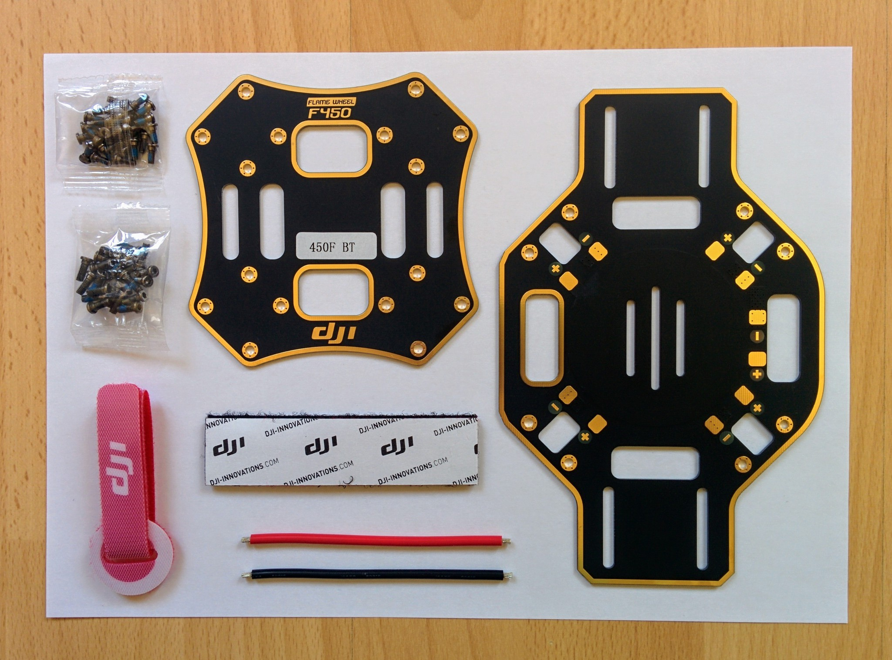

F450 frame kit
--------------

Online stores seem to be particularly vague about what exactly comes in the F450 frame kit. The kit I received consisted of:

* Top and bottom central plates.
* Two red legs and two white legs.
* Two small packets of screws.
* A battery strap.
* An adhesive backed velcro strip.
* A red and a black piece of 14AWG wire.

The parts section of the [F450 user manual](http://dl.djicdn.com/downloads/flamewheel/en/F450_User_Manual_v2.2_en.pdf) mentions, but does not picture, a mysterious "magic strap", labelled 450MSX, that is never referred to again in the manual. The actual part that comes labelled 450MSX turns out to be the velcro strip and, while not covered in the manual, can be seen in DJI videos with one side attached to the top plate and the other side (or a small piece of it) attached to the battery to prevent it sliding around under the battery strap.

The packets of screws are unlabelled but the packet of shorter screws are the 24 M2.5 6mm screws needed to secure the central plates to the legs and the packet of longer screws are the the 16 M3 8mm screws needed to secure motors to the legs. Both packets contain several spare screws.

The red and black wires are for connecting the lower plate (that also serves as a PDB) to power. However rather than solder an XT60 connector onto these I just bought an XT60 connectors that was already soldered onto a pair of wires.

_Central plates, velcro strip, battery strap, wires and screws._  

_F450 legs._  

E305 tuned propulsion system
----------------------------

The E305 tuned propulsion system consists of:

* Two clockwise (CW) and two counterclockwise (CCW) 2312E 800KV motors.
* Two 420 Lite ESCs.
* A PDB.
* A propeller removal clamp.
* A packet of M3 4.5mm screws and a packet of M3 8mm screws.
* Three packets of propellers, each containing a CW and CCW propeller.

The PDB isn't needed as the bottom plate of the F450 is also a PDB. Similarly two different lengths of screws are provided so you can match them to the depth of the assembly holes on your frame but neither is needed as the F450 frame already came with suitable screws (M3 8mm screws).

If you look at the picture below you can clearly tell the CW and CCW motors apart by the arrows on the sides of the motor housings. If you look at the other side of the motors you'll also see "CW" or "CCW" as part of the labelling.

The housing of the motors is aluminium and apparently buckles easily under pressure so you should always use the propeller removal clamp if you need to grip them tightly.

Each pack of propellers contains one CW propeller (with a black colored central nut) and one CCW propeller (with a silver colored central nut).

_Motors, ESCs, clamp, PDB and screws._  

_Propellers._  

