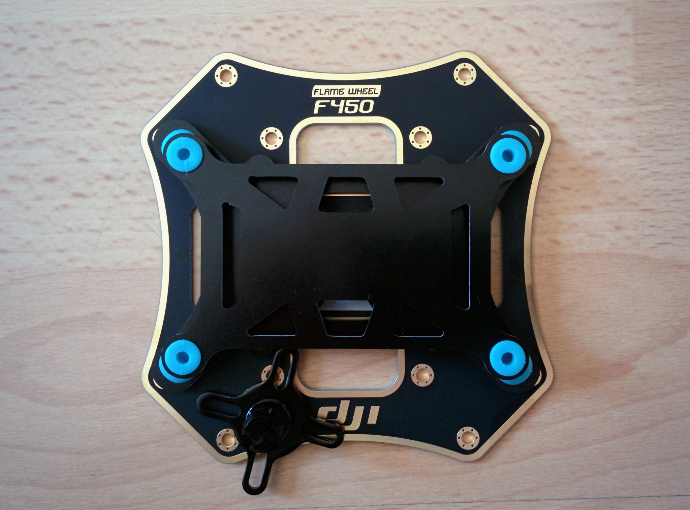

If you install the vibration damping board on the top plate then you're fairly limited in where you can place the base of the GPS mast. If you're going to stick it down then the following picture shows the best you seem to be able to do with the kind of base and board that I have. One leg is attached to nothing (and should probably be cut off) but the rest of the base rests solidly on the top plate.

An alternative would be to use longer assembly screws and screw the base down with the same screws used to attach one of the F450 legs. Or one could perhaps attach the base to one of the jutting out panels of the bottom plate - this would have the advantage of letting you center the mast better relative to the nose/tail axis of the drone but at the cost of bringing the GPS unit about 37mm closer to the battery and the PDB (the total mast length is about 140mm).

_Placement of the base of the GPS mast._  

**Update:** such a placement doesn't work as it doesn't take into account the screw heads. Also note that the protuberence on the mast base cannot fit under the vibration damping board if you stick the base down with something like VHB tape (as tape and base together are too thick to fit under) but if you screwed it down they could - but either way you're probably better off clipping off unused protuberences.
