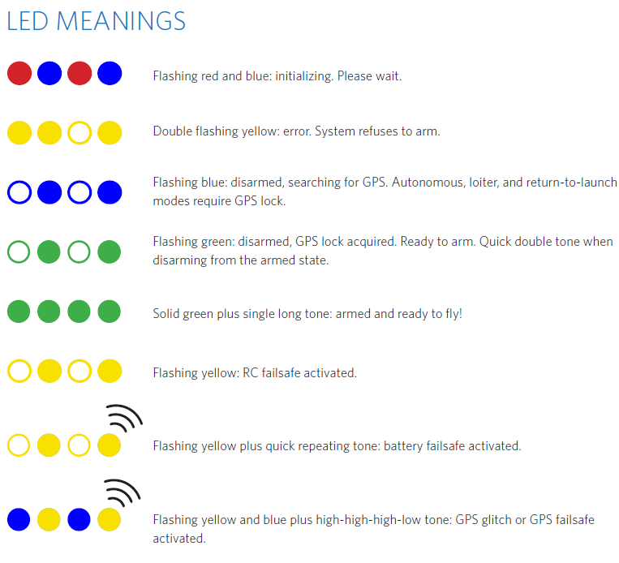
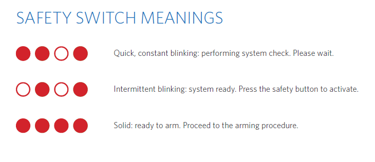

The 3DR site used to maintain information on the LEDs on the Pixhawk - however gradually all their Pixhawk information is disappearing and the images included below are no longer available from there.

These versions of the pictures were downloaded from [Kopterforum.at](http://kopterforum.at/) (which requires registration before you can see images posted to its forums).

The images here cover:

* The main LED seen at the center of the Pixhawk itself.
* The red LED in the safety switch.

For more details on the various other LEDs see the [status LEDs page](https://pixhawk.org/users/status_leds) on pixhawk.org.

_The main Pixhawk LED._  

_The safety switch LED._  

TODO: see also <https://docs.px4.io/en/flying/led_meanings.html>
