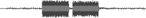
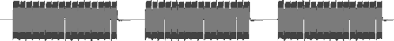
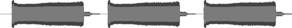
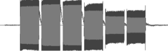
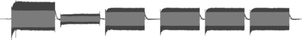

Here you can listen to the various sounds the Pixhawk makes to report its state.

| Meaning | Audio | Sound wave |
|---------|-------|------------|
| Start up OK. | <audio controls><source src="assets/tones/start-up-OK.mp3" type="audio/mp3"></audio> |  |
| Startup failed. | <audio controls><source src="assets/tones/startup-failed.mp3" type="audio/mp3"></audio> |  |
| Armed. | <audio controls><source src="assets/tones/armed.mp3" type="audio/mp3"></audio> |  |
| Failed to arm. | <audio controls><source src="assets/tones/failed-to-arm.mp3" type="audio/mp3"></audio> |  |
| Disarmed. | <audio controls><source src="assets/tones/disarmed.mp3" type="audio/mp3"></audio> |  |
| Low battery. | <audio controls><source src="assets/tones/low-battery.mp3" type="audio/mp3"></audio> |  |
| No SD card. | <audio controls><source src="assets/tones/no-SD-card.mp3" type="audio/mp3"></audio> |  |
| Lost copter alarm. | <audio controls><source src="assets/tones/lost-copter-alarm.mp3" type="audio/mp3"></audio> |  |
| GPS glitch. | <audio controls><source src="assets/tones/GPS-glitch.mp3" type="audio/mp3"></audio> |  |
| Barometer glitch. | <audio controls><source src="assets/tones/barometer-glitch.mp3" type="audio/mp3"></audio> |  |
| EKF or inertial nav failure. | <audio controls><source src="assets/tones/EKF-or-inertial-nav-failure.mp3" type="audio/mp3"></audio> |  |
| Parachute release. | <audio controls><source src="assets/tones/parachute-release.mp3" type="audio/mp3"></audio> |  |
| New IO board firmware found. | <audio controls><source src="assets/tones/new-IO-board-firmware-found.mp3" type="audio/mp3"></audio> |  |
| New IO board firmware loaded successfully. | <audio controls><source src="assets/tones/new-IO-board-firmware-loaded.mp3" type="audio/mp3"></audio> |  |

Notes
-----

The sounds for "low battery", "no SD card" and "new IO board firmware loaded successfully" are much longer than the other sounds so their soundwave images have been squashed to a maximum length of 500 pixels, so they're not to scale relative to all the other images.

The original sound files came from <https://3dr.com/support/articles/listen_to_notification_tones/> and have been converted to small MP3s that can be played directly on this page.

The originals were oddly large stereo recordings of mono sounds, e.g. the "loaded successfully" sound was a 2.1MB WAV file and has been converted to a 95KB MP3 file here. Really you should be able to get them down to a few bytes, e.g. as MIDI files played back through [Web Audio](https://developer.mozilla.org/en-US/docs/Web/API/Web_Audio_API) but these MP3 files were the smallest things I could produce that could easily be played on all platforms. The corresponding [ogg](https://en.wikipedia.org/wiki/Ogg) files are smaller but did not work with MS Edge.

The audio playback on this page has been tested on the latest versions of Chrome, Safari, Firefox and MS Edge.

I use Windows running on a VirtualBox VM. In order to get sound working for Windows I had to change the VM's audio controller setting from "ICH AC97" to "Intel HD Audio".
