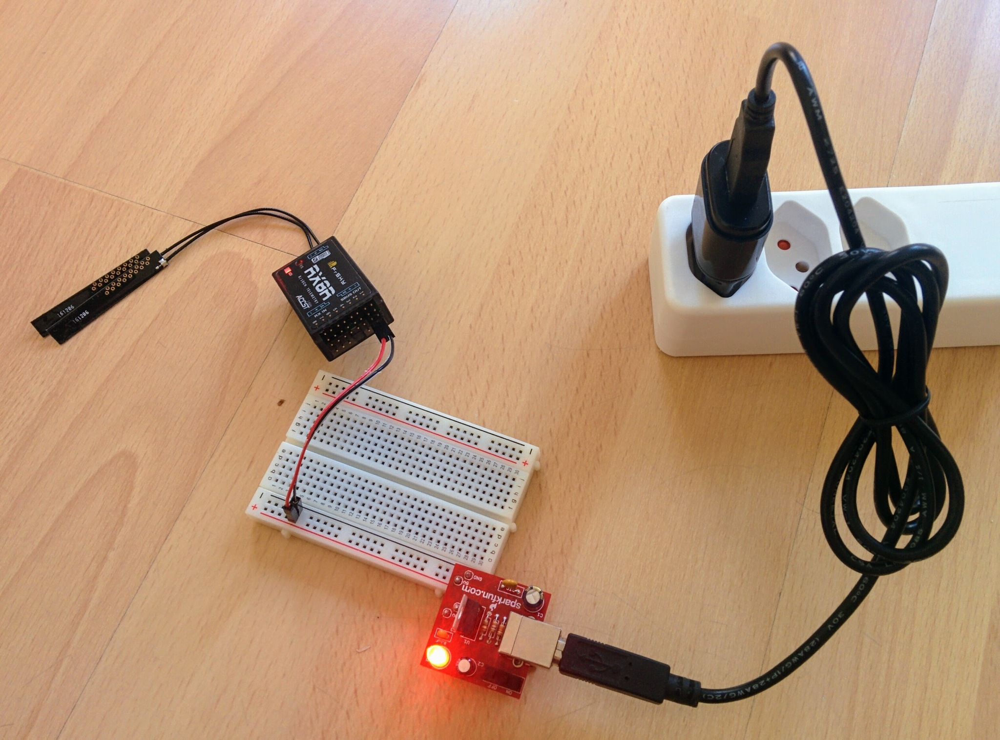
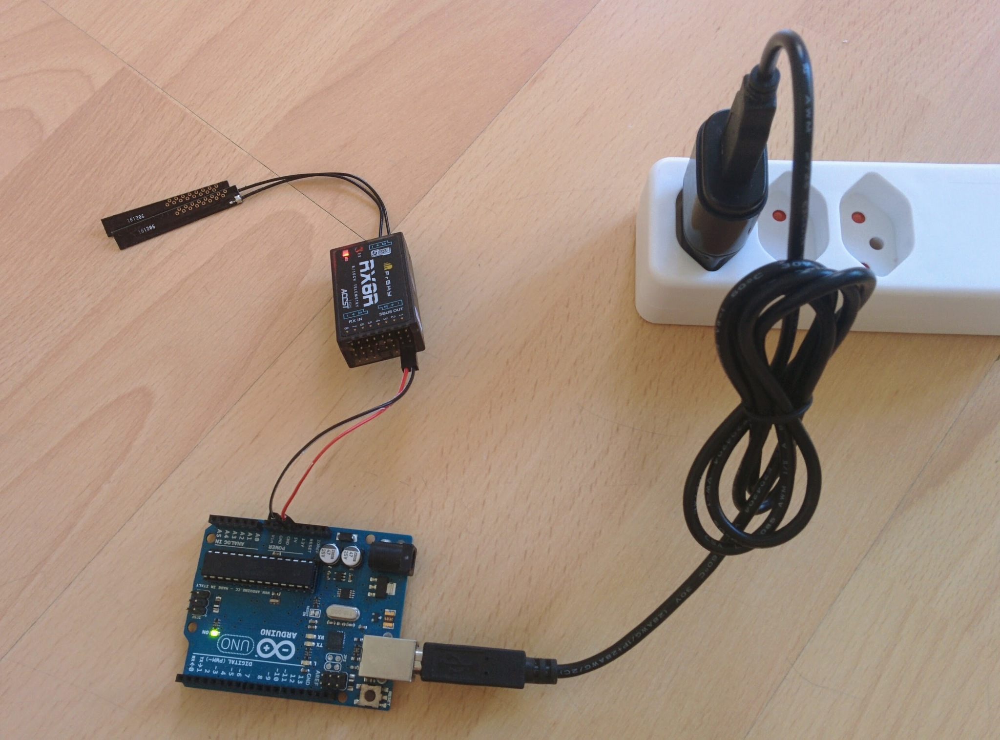
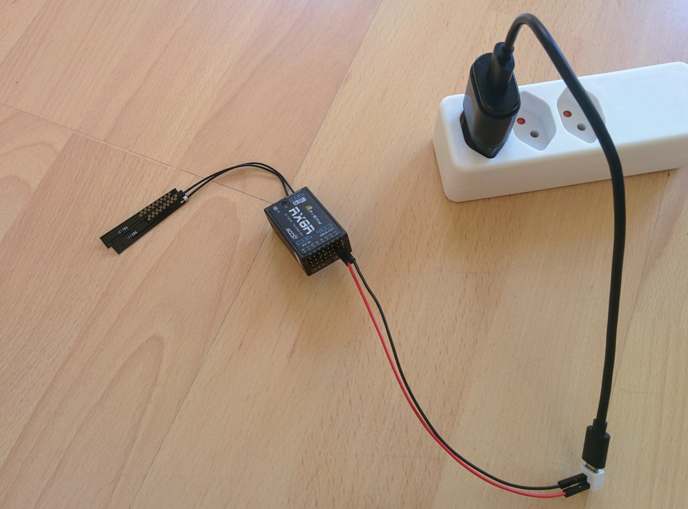

Receiver power
==============

Normally the flight controller provides power to the receiver. But if you want to experiment with it on its own then it's easy to power it directly.

The following images show it powered via a breadboard power supply, an Arduino and directly off USB.

_Breadboard power supply_  

_Arduino_  

_USB_  

The breadboard power supply above is a [PRT-08376](https://www.sparkfun.com/products/8376) from Sparkfun. For direct USB power setup the little adapter that breaks out the USB power pins came from this [Kickstarter project](https://www.kickstarter.com/projects/252587878/the-worlds-smallest-tiny-breadboard-power-supply-u) but you could use any basic USB breakout like [this one](https://www.adafruit.com/product/1833) (as the receiver doesn't need any more than the 100mA that USB will provide without any extra negotiation). The Arduino shown is the classic [UNO](https://www.arduino.cc/en/Main/ArduinoBoardUno) but obviously any hobbyist board, with a 5V out, will do as long as it can deliver at least 100mA (the UNO can provide up to 200mA).

Here I've used a standard USB mains charger in all situations, obviously you could just as well use one of your computer's USB ports instead.
