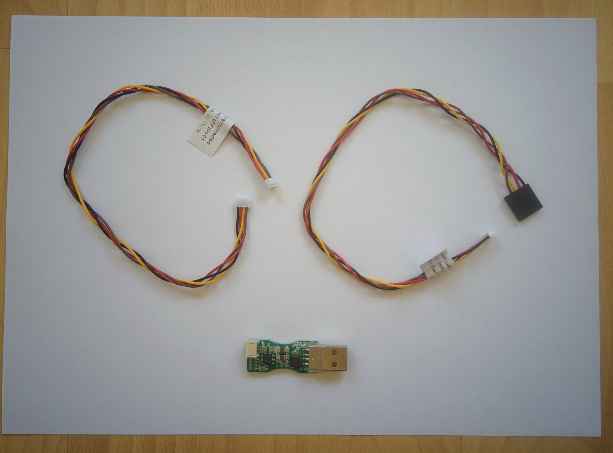

Upgrading the receiver via Windows
==================================

It is much easier to upgrade the receiver via the transmitter but for reference this page documents the process of upgrading the receiver via Windows - this requires two additional components, an [FrUSB-3 (FUC-3)](http://www.frsky-rc.com/product/pro.php?pro_id=37) upgrade cable and the [Smart Port Converter (SPC)](http://www.frsky-rc.com/product/pro.php?pro_id=132).

The FrSKY update application only runs on Windows. I only have Mac and Linux machines so I used a VM running Windows to do this, for details of this setup see [`windows-vm.md`](windows-vm.md).

Whether using a real Window machine or a VM the upgrade process is fairly simple. The following photos show the parts you need.

_FrUSB-3 (FUC-3)._  

_FUC-3 with original cable unplugged._  

_Smart port converter (SPC)._  

_RX8R receiver._  

The FUC-3 comes with a small [PCB](https://en.wikipedia.org/wiki/Printed_circuit_board) with a USB connector and two cables - one with small white connectors at both ends and one with a larger black connector at one end. My FUC-3 came with the cable with the two small connectors already plugged into the PCB. However we don't need this cable, unplug it and replace it with the cable with the larger connector at one end.

This larger connector then needs to be connected to the pins on the SPC PCB. Look closely at the SPC PCB, you'll see the pins are labelled GND, +5V, RXD and TXD, make sure when connecting the connector that the connector's black wire lines up with GND. I.e. black connects to GND, red to +5V and so on as shown in the picture below.

**Warning:** if you're just used to consumer electronics products where it's generally impossible to plug things in in a way that results in damage to the device it may come as a surprise that this is all two easy in the realm of hobbyist electronics, mixing up your wires will often result in irreparable damange.

_FUC-3 with other cable plugged in and connected to the SPC_.  

_Closeup of cable from FUC-3 connected to SPC_.  

Now you have a joined up cable with a USB connector at one end, the SPC in the middle and a Smart Port connector at the other end. The smart point connector plugs into the left hand side of the X8R receiver (the side that has just a single port), but **don't** do that yet.

Aside: don't get Smart Port connectors and S.BUS connectors mixed up - the receiver has both and they look identical but they're different things.

Now plug the FUC-3 USB connector into your computer, a red power LED on the FUC-3 PCB will light up and Windows will automatically detect the device and install the necessary drivers (assuming you're running Windows 8 or 10). Remember that if you're on Mac or Linux and using a VM you'll need to tell VirtualBox to pass the device through to the VM.

Now go to FrSKY [downloads](http://www.frsky-rc.com/download/), go to the Tool section and download and extract the "Tool-FrSky update sport". Then switch from Tool to Firmware, select Receivers (from the dropdown) and then select X8R (at the time I did this there was a beta firmware available, I ignored this and just downloaded the normal one).

Important: see the section in the instruction for installing the receiver firmware via the transmitter for instructions on selecting the right firmware (in particular for the US, where the latest firmware may not be appropriate) and for choosing between `.frk` files if the downloaded zip file contains two.

Now go to the extracted upgrade application and start it - it has a super simple user interface interface. The dropdown should show something like COM3, indicating that it's found the FUC-3, now select the File button and find the appropriate `.frk` firmware file. One of the red squares should start flashing red and green (indicating its now expecting a device to be connected).

Only now should you plug in the receiver, the LED on the receiver should light up and go green and the application should detect the receiver and you can now press the Download button. The download takes several minutes - once done just unplug the receiver. I've seen reports that the receiver can become [bricked](https://en.wikipedia.org/wiki/Brick_(electronics)) if the download is interrupted so always let the process complete.

_Receiver connected to computer via FUC-3 and SPC_.  

Important: the upgrade software seems to be completely inflexible as to the order things need to be plugged in. The FUC-3 must be plugged into the computer before the upgrade software is started, then the `.frk` file should be selected and only then should the receiver be connected (to the Smart Port terminated connector coming out of the SPC). Things did not work for me if I plugged in the USB connector after starting the upgrade software or connected the receiver before the firmware file had been chosen (the LED on the receiver would light up red and stay red unless the upgrade software was already ready to update it).

Note: DJ WoodZ has a [page](http://djwoodz.com/2016/04/11/How-To-Update-FrSky-X4R-SB-Firmware-via-USB/) that covers similar instructions for the X4R and has nice clear photos and screenshots that provide some more step-by-step details than here (that are relevant for both the X4R and X8R).
