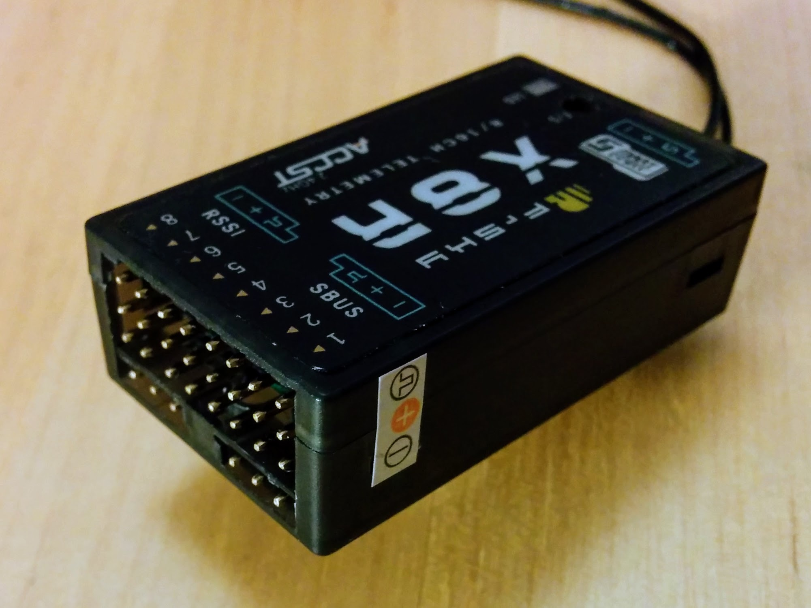
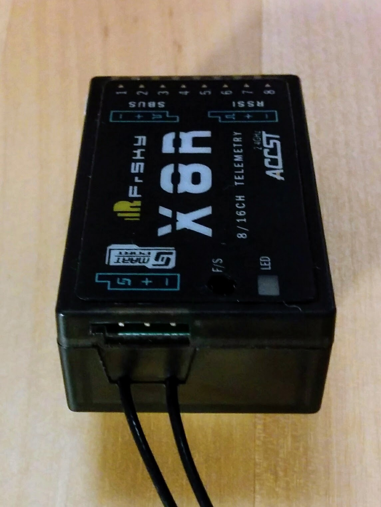
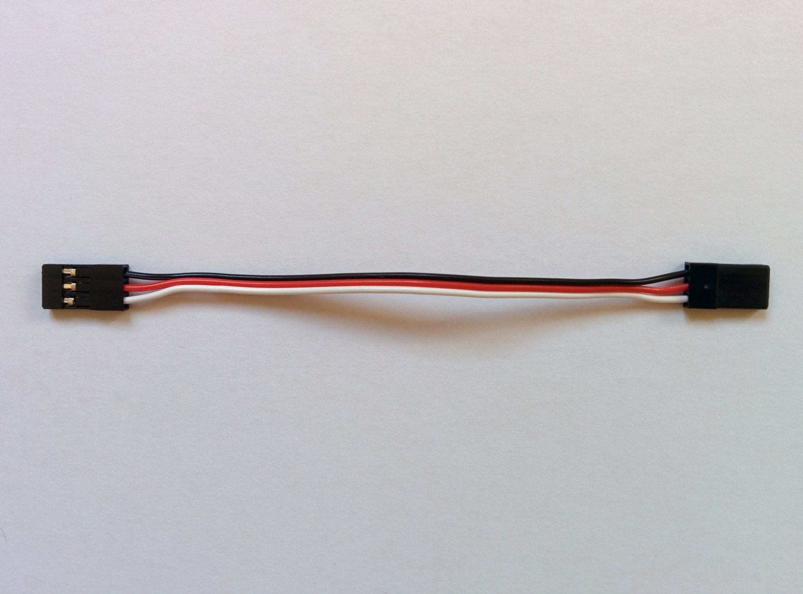
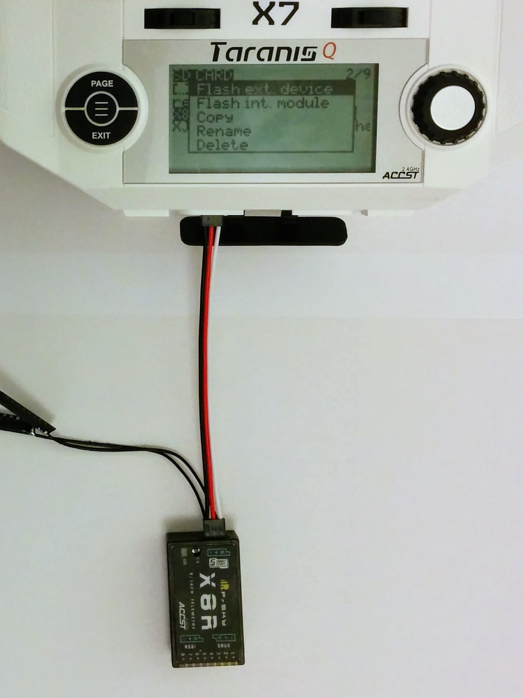
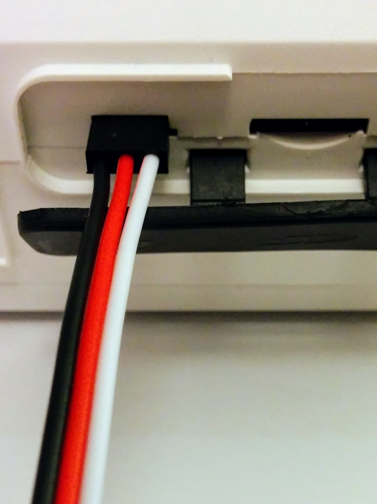
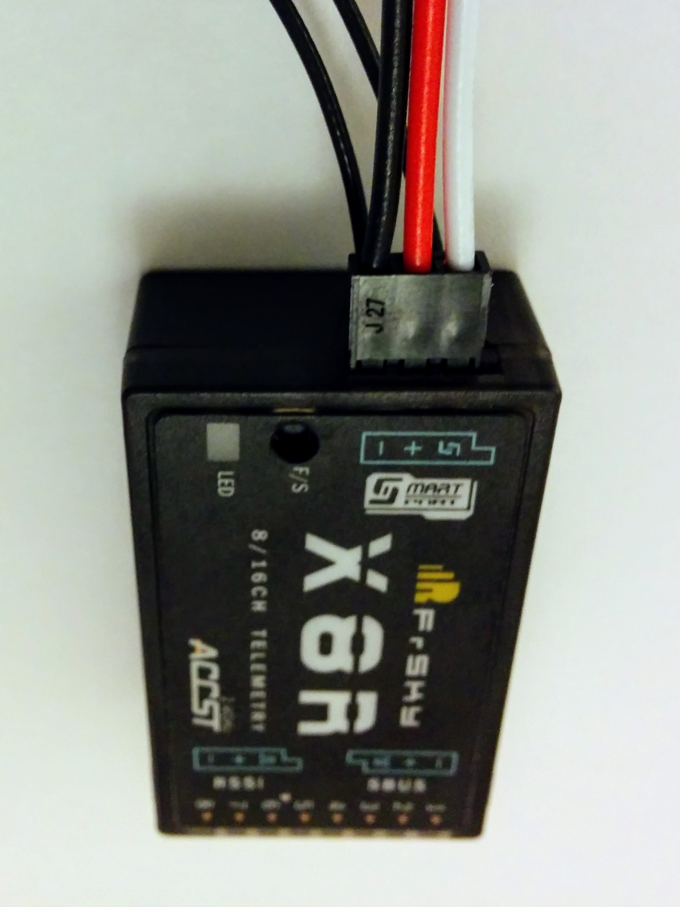
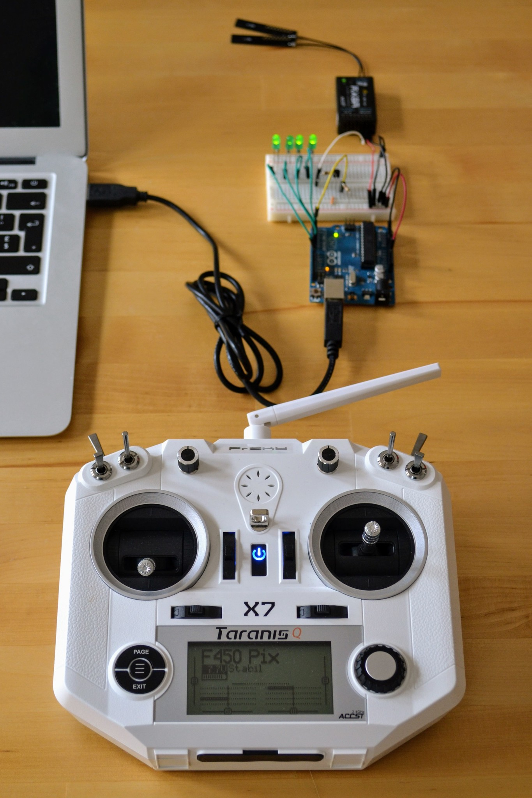

The FrSKY X8R receiver is probably the most popular receiver for this kind of build. It features two PCB antennas - a PCB antenna provides much the same performance as a classic whisker style antenna in a smaller package (but at increased cost). The two antenna provide [antenna diversity](https://en.wikipedia.org/wiki/Antenna_diversity) which allows for a more reliable wireless link.

Note: it's sometimes erroneously claimed that one of the two antennas is for reception and the other for transmission - this is not the case.

At one end of the receiver is a block of 8 by 3 pins - if you look at the side of the receiver you'll see a little sticker that indicates that the top row of pins provide signal, the middle row power and the bottom row ground. So you have 8 columns of 3 pins and each column can control a separate motor (providing it with signal, ground and power). The receiver can receive 8 channels from the transmitter and output the values received on these channels on the 8 signal pins so allowing the independent control of up to 8 motors.

_The main block of pins and the S.BUS and RSSI ports._  

These pins would be used in the setup for a classic model airplane where the motors, e.g one for the rudder, one for the left aileron and so on, are controlled directly by the receiver. However in a quadcopter the motors and everything else are controlled by the flight controller so the receiver just pipes its data into it rather than controlling anything directly. On older receivers this would have involved connecting the 8 columns of pins to the flight controller with 8 seperate servo cables. However the X series receivers from FrSKY feature a technology called [S.BUS](http://www.futabarc.com/sbus/) (developed by a Japanese company called Futaba) that allows all the channel information to be communicated over a single connection. If you look at the top of the receiver you'll see two little graphics, one labelled RSSI and the other labelled SBUS. These correspond to the two ports (each with 3 pins) found below the main block of pins. The little graphics make clear the ground, power and signal pins of each connector. So just the the S.BUS port needs to be connected to the flight controller. And as this port is unconstrained by the need for columns of physical pins it actually carries data for 16 channels rather than just 8.

Hence the 8/16CH seen on the front of the transmitter - if you're using the receiver without a flight controller then it can just output data for 8 channels on its 8 columns of pins but if you're using it with a flight controller it can communicate 16 channels of data to it. So while the X4R, X6R and X8R receivers feature different numbers of 3 pin columns (unsurprisingly 4, 6 and 8 respectively) they can all communicate 16 channels via S.BUS.

Note: even in a classic model airplane setup it's not just motors that can be controlled, channels can be used to e.g. turn on and off a beeper, control lighting and such like.

At the opposite end of the receiver to the main block of pins is another 3 pin port - if you look at the top of the receiver you'll see it marked in the same fashion as the other ports and labelled with the Smart Port logo. Smart Port (sometimes abbreviated S.PORT making it easy to mix up with S.BUS) is a technology developed by FrSKY themselves and allows a large array of sensors to be connected directly to the receiver, which can then transmit the sensor data back to the transmitter. We'll be using it later with a sensor that monitors the voltage of the individual cells in our battery.

_The Smart Port._  

The data the receiver sends back to the transmitter is referred to as telemetry data. Even without any sensors plugged into it the receiver stills sends some data back to the transmitter. It sends a value called RxBT which is the voltage seen by the receiver, in a simpler setup where the receiver (Rx) is being powered by a battery (BT) this might be more interesting but in our setup it's powered by the flight controller (via the S.BUS port). We'll instead get data directly from the battery via a separate voltage sensor.

Note: the flight controller itself independently monitors both the voltage and the current of the battery via its power module.

The other value sent by the receiver is called [RSSI](https://en.wikipedia.org/wiki/Received_signal_strength_indication) (received signal strength indication) and it's more interesting - it allows you to monitor the strength of the signal seen by the receiver. This means you can configure an alarm on the transmitter to warn you if the signal strength drops to low, indicating that your craft is getting out of range.

As you might have noticed one of the ports mentioned earlier was also labelled RSSI. We won't be connecting up this port for the initial build but will come back to it later when looking deeper into telemetry data. The RSSI port can be connected to the flight controller so that it can monitor the current RSSI value directly.

Upgrading the receiver
----------------------

With other receivers such as the D4R-II there are [warnings](https://pixhawk.org/peripherals/radio-control/frsky#parts_list) that the receiver must be upgraded before use with the Pixhawk. There are no such warning for receivers like the X8R but it makes sense to make sure your receiver is using the latest firmware.

You can upgrade the receiver via the transmitter - this is much simpler than upgrading it via a computer (and requires no special cables) and is much simpler with the Taranis Q X7 than with the older X9D+. Unlike the older X9D+ the Q X7 comes with a Smart Port, so it can be connected directly to the receiver with a standard cable.

Note: I documented upgrading the receiver using a computer [here](receiver-windows-upgrade.md) but I think using the transmitter, as outlined here, is the substantially simpler approach.

Your Pixhawk should have come with various cables - one of which is a standard servo cable that should look like this:

_Standard servo cable._  

Later we'll use this to connect the receiver to the Pixhawk but here we'll use it to connect the receiver to the Q X7.

The process of upgrading the receiver is almost identical to upgrading the internal XJT module on the transmitter - the main difference just being that we have to connect the receiver to the transmitter first.

So as before go to [_Download_](http://www.frsky-rc.com/download/) on the FrSKY site, this time scroll down to receivers and (after clicking _Load more_) select the X8R. On the X8R page expand the _Firmware_ section and download the latest firmware. At the time of writing the latest firmware for the X8R was released in 2015 so unless your X8R has been sitting on a shelf for a long time it probably came with this firmware.

**Important:** as noted when upgrading the receiver the EU requires a technology called LBT and all the three latest firmware releases (at the time of writing) for the X8R are LBT specific, so if you're in a country that is not subject to EU wireless regulations then you need to look down the list for the last non-EU firmware. Both the transmitter and the receiver must be running the same kind of firmware, i.e. EU or non-EU.

Once you've downloaded and extracted the firmware zip file you should have a single `.frk` firmware file. Now turn on you're transmitter, connect it to your computer via USB and the transmitter's SD card should appear as a USB drive. Copy the `.frk` file to the `FIRMWARE` directory there. Eject the transmitter's drives on your computer and disconnect it.

Note: FrSKY seem to randomly switch between [zip](https://en.wikipedia.org/wiki/Zip_(file_format)) and [rar](https://en.wikipedia.org/wiki/RAR_(file_format)) for compressing their firmware files etc.

Now we're going to connect up the transmitter to the receiver as shown here using the servo cable. The servo cable won't prevent you plugging things in incorrectly - you can connect ground on one side to signal on the other so double check the connections on both receiver and transmitter (see the pictures below). The black wire (ground) should always be furthest away from that little extra notch you see on one side of any S.BUS socket.

| | | |
|-|-|-|
| _Q X7 connected to receiver._  | _Q X7 connection closeup._  | _Receiver connection closeup._  |
<!-- The ratios are correct on these photos so why aren't the cells equal widths? -->

Now that the receiver is connected, turn it on, navigate to the `FIRMWARE` directory. Select the right firmware file (don't mix it up with the XJT module firmware that you might also have there), it should be called something like `X8R_LBT_build151118.frk`, select _ENTER_ and this time select _Flash ext. device_ (rather than _int. device_).

The receiver's green LED will turn on and its red LED will flash during the process. On the transmitter you'll see a progress bar, indicating that the new firmware is being written, and once successfully completed it'll just return to the SD card screen. Turn off the transmitter and disconnect the now upgraded receiver.

Note: servo cables always have power as the middle wire - this prevents a more serious issue than getting ground and signal mixed up (which won't work but is probably safe). If ground and power were the two outer pins (with signal in the middle) then it would be possible to get power and ground mixed up which would almost certainly fry the device. It's always important to check power and ground wires - in hobbyist setups, unlike consumer electronics, there may be nothing preventing you wiring things up incorrectly and the result will often be fatal for the devices involved.

X8R alternatives
----------------

As noted above the X8R is by far the most popular receiver for this kind of build. But you will also see other receivers being used and depending on your preferences you might like to use one of them instead.

If you look closely elsewhere in this guide you may notice that the receiver in some of the photos is an RX8R rather than an X8R. This is just because the X8R was out of stock at the particular retailer I was using. The RX8R is physically identical to the X8R except that instead of an RSSI port it has an RX IN port - this allows for redundancy (hence the R at the start of the name) and let's you connect up a second receiver - if the primary one fails for some reason the secondary one takes over. The RX8R is slightly more expensive than the X8R, has absolutely no advantages over the X8R for our setup and has the downside that RSSI isn't easily available as a port for connection to the flight controller. You can though open up the RX8R and run out a wire from a solder pad there that provides RSSI (for shots of the inside of the RX8R see [`rx8r.md`](rx8r.md)).

Note: unlike the X8R the firmware for the RX8R seems to always ship with two firmware files, the EU and non-EU versions, bundled together in one zip file so, unlike the X8R, you don't have to hunt through the version history information for the latest version appropriate for your jurisdiction.

So while the RX8R isn't that interesting as an alternative to the X8R there are a couple of receivers that are. A big part of the X8R is taken up with the block of 8 by 3 pins that are never used. So the obvious question is can't you just get a receiver without these pins? You can. As noted already there are receivers with fewer columns of pins, including the X4R. Normally the X4R has four columns of pins but it is also sold in what's called the "naked" variant that comes without any casing and without these pins soldered on, resulting in a much smaller package (as you can see [here](https://www.unmannedtechshop.co.uk/frsky-x4r-sb-eu-naked-receiver-without-case/)).

Note: the X4R was sold in a variant without S.BUS - and the X4R with S.BUS is properly called the X4R-SB but these days X4R invariably means the S.BUS variant.

The other interesting alternative is the R-XSR. At the time of writing the R-XSR is just out. Unlike the "naked" X4R, that simply doesn't have its block of pins soldered on, the R-XSR has no option for such pins and is a pure S.BUS receiver. The R-XSR, like the earlier XSR, comes with short whisker antenna suitable for use on very small vehicles where space is tight. However unlike the XSR, where the antenna are soldered on, you can easily pop of the antenna on the R-XSR and replace them with either the PCB style antenna of the X8R or the longer whisker style antenna of the X4R in order to provide better range.

The downside of the "naked" X4R and the R-XSR is that they don't come with separate ports for S.BUS and Smart Port that you can connect up with standard servo cables, instead they both cram everything into one small port that requires you to make up your own cables to connect to the Pixhawk and to the voltage sensor that are being used in this build. Similarly each of them only makes RSSI available via a tiny solder pad that you'd have to solder up yourself if you wanted to connect if to the flight controller.

However the tiny size of the R-XSR is very nice and if you replace the standard antennas with PCB antennas there seems to be nothing to distinguish it from the X8R for this kind of build other than the inconvenience of wiring it up. If I was going to try an alternative to the X8R here it would be the R-XSR.

Note: FrSKY produce a number of other small S.BUS receivers but these either don't support telemetry at all or don't support sharing it locally with the flight controller, i.e. they only make it available to the remote transmitter. And many of them have soldered on antenna so you have to live with the small shorter range antenna that they come with. The R-XSR however looks perfect as its antennas can be easily replaced and it supports sharing telemetry data both locally and remotely.

Experimenting with the receiver
-------------------------------

If you're interested in experimenting with the receiver then see the project and details I put together around an existing S.BUS library [here on Github](https://github.com/george-hawkins/arduino-sbus). Sending the current position of the sticks on your transmitter involves four channels (two for each stick, one for up/down and one for left/right). In this project I vary the intensity of four LEDs according to the value the receiver sees on these four channels as you move the sticks about.

_Transmitter, receiver and breadboard setup._  

If you look at the `SBUS::process()` method in the main [`SBUS.cpp`](https://github.com/george-hawkins/arduino-sbus/blob/master/SBUS.cpp) file in this project you'll see that it's actually very easy to decode the 25 bytes that make up an S.BUS frame.

Note: this project is about understanding S.BUS - there are lots of other projects out there that cover the simpler task of just reading PWM values directly from the signal pins (the top row of pins in the main block of pins on the X8R), e.g. see this [one](https://www.sparkfun.com/tutorials/348) from Sparkfun.

If you want to see alternative ways to power your receiver, while you experiment with it then see [`receiver-power.md`](receiver-power.md).

TODO: add in project on decoding Smart Port sensor data too - see <https://github.com/jcheger/arduino-frskysp>
