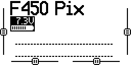

Main screen pages
-----------------

We've looked at screens that you can get to from the main screen by long and short holding the _MENU_ button and then using _PAGE_ from there. However there's more to the main screen itself and you can also page page to other screens from here without first using the _MENU_ button.

If you accidentally turn the dial while on the main screen you'll find it actually has a lower half consisting of two mysterious rows of dashes - to get out of here just dial back up. It turns out that these dashes correspond to the state of the transmitter's 64 logical switches - if you configure up logical switches for the flight modes (as we do later) then you'll see one of the first few dots here becoming highlighted as the corresponding logical switch is activated.

_Main screen - lower half._  

If you press PAGE you'll get to a screen that shows the transmitter's channels. These are essentially the set of values that the transmitter will send to the receiver. Initially just the sticks are bound to channels, i.e. only the stick states and nothing else will be sent. Move the sticks and see how the bars of this screen react.

_Main screen - page 2, showing channels 1 to 8._  

The transmitter supports up to 32 channels (16 using the standard internal RF module and 16 more if you add an additional external RF module). Initially bars for channels 1 to 8 are shown. Turn the dial and you'll see the topmost bar change to indicate that channels 9 to 16 are now showing, turn it further to see channels 17 to 24 and so on. As nothing is bound to these channels there's nothing really to see.

_Main screen - page 2, showing channels 9 to 16._  

If you press the PAGE button again you'll get to the same channel information but this time displayed as numbers rather than bars.

_Main screen - page 3._  

If you long press _PAGE_ at any stage, while moving through the pages of the main screen, you'll come to the telemetry screens but we'll set them up and discuss them at a later stage.

Loss of resolution
------------------

Painless360 says at [4:26](https://youtu.be/ajJ3rJ1HN5Q?t=266) in his video introducing the expo concept and at [7:57](https://youtu.be/NIR85KOqIAo?t=477) in his video on configuring the Q X7 that you should set expo on the flight controller rather than the transmitter, if you can, as this avoids a loss of resolution. As it turns out you can't do this with ArduCopter. But what does he mean by loss of resolution? It's not important for our situation but let's look at it briefly.

Let's just consider rudder. When the right stick is at its leftmost position it sends a PPM value of around 980 and when it's at its rightmost it sends a value of around 2000. So the range of rudder values runs from 980 to 2000.

| | |
|-|-|
| _Before applying expo._  | _After applying expo._  |

Above we see the graphs that we saw when setting expo on the transmitter. The x-axis is real stick movement and the y-axis is the PPM value sent by the transmitter - initially the relationship between the two is linear. However if I specify an expo of 25 then things change - the 50% of the stick movement range around the center, that used to correspond to 50% of the range of PPM values on the y-axis, now corresponds to just 40%.

If we move the pitch stick from its leftmost position to its rightmost this is a movement of about 50&deg;. So if we think about the middle 50% of the range of the x-axis shown above then moving from one end to the other corresponds to a movement of about 25&deg;

As already noted the range of PPM values sent by the transmitter runs from around 980 to 2000. After applying expo just 40% of the this range, i.e. 1286 to 1694, correspond to our 25&deg; of movement around the center point - whereas before expo, when things were still linear, this 40% of PPM values corresponded to 40% of total stick movement, ie. just 20&deg; of movement.

So before expo an increase in the PPM value of one described a stick movement of 20&deg; / (1694 - 1286), i.e. 0.049&deg;, whereas afterwards it describes a stick movement of about 25% / (1694 - 1286), i.e. 0.0612&deg; ("about" because things are no longer completely liner even in the middle range).

So this is the loss of resolution we're talking about. Note that there's a corresponding gain in resolution at the edges (where it's not particularly useful).

However few would complain that 0.0612&deg; wasn't still quite fine grained enough, i.e. 16 PPM values per degree of movement vs 20 before. Obviously if you use higher expo values the difference becomes greater.

One could avoid this loss of resolution by doing the adjustment in the flight controller software rather than on the transmitter - and flight stacks such as Cleanflight and Betaflight, that target racing drones, include this feature - but ArduCopter does not (I asked [a question](https://discuss.ardupilot.org/t/set-expo-for-roll-pitch-yaw-in-arducopter-rather-than-on-tx/20009) about this on the ArduCopter forum but didn't receive any replies).
