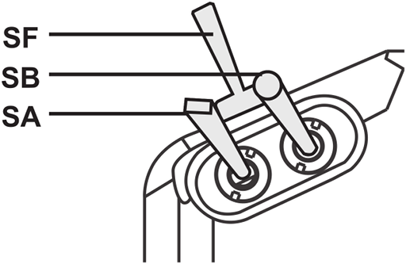

Flight modes
============

We've already done a lot with the transmitter. But now we've got to set up being able to switch between flight modes. Unlike a classic model airplane, a quadcopter has a flight controller that looks after many things for you and which can operate in various different modes. These modes are called flight modes and can cover a whole range of things from particular operations, e.g. taking care of landing itself or using GPS to return to its point of take off, or changing its flight behavior, normally the craft flies in mode called stabilize where it tries to take care of a lot of the difficulty of flying but you can switch it into modes like acro where flying is more difficult but you can engage in more aggressive flying (like sports mode on some cars).

You need to be able to switch between flight modes using your transmitter. The ArduCopter flight stack supports a large numbder of flight modes from which you have to choose six that you want to use. Ideally your transmitter would have a single switch with six corresponding positions - and some people do modify their transmitters to add a knob that can be clicked through six positions - but we'll live with the switches we have and use two switches together to achieve six different combinations.

At this point we won't actually associate meanings with positions, e.g. that position one means stabilize and so on. Instead we'll just set up the transmitter so that it can send six different values, depending on the current switch postiions, and we'll only associate them with actual flight modes later when we come to set up the flight controller.

Configuration
-------------

Now we're going to set things up on the transmitter. This can be done directly on the transmitter, via its LCD and the buttons either side, but as this process is rather involved it's far easier to do it on your computer using the application OpenTX Companion and then downloading the new setup to the transmitter. We already briefly introduced OpenTX Companion in [`transmitter-getting-started.md`](transmitter-getting-started.md).

Start OpenTX Companion on your computer and start your transmitter in bootloader mode as before (keep the two lower trim buttons pressed inwards when turning it on). Then connect the two via USB.

The first thing we want to do is upload all the work we've done already on the transmitter into OpenTX Companion. So to read the current model (or models) from the transmitter - go to the _Read/Write_ menu and select _Read Models and Settings From Radio_.

This page largely covers the process that Painless360 covers well in this [video](https://www.youtube.com/watch?v=agjHu-WhCJw) from 6:04 onwards. However he first shows how to set things up using a Taranis X9D+ that's been modified to add a six position switch, it's only around 10:00 that he discusses achieving things using two of the switches on an unmodified transmitter.

Note: if you watch this video from the start then ignore the part on pitch inversion - we handled this differently.

He uses the swtiches SF and SE on the Taranis X9D+. The Q X7 doesn't have an SE switch so instead we'll use the upper left pair of three-way switches called SA and SB.

_Upper left switches._  

So it's easy to see how we can flip SB through three positions, we'll set things up so that when SA is up we can use SB to flip through the first three flight modes, i.e. 1 to 3, and when SA is in its middle position we can use DB to flip through the remaining three flight modes, i.e. 4 to 6.

So flight mode 1 is selected when SA And SB are in their up position, flight mode 2 when SB is moved to its middle position and  flight mode 3 when SB is moved to its down position. Then when SA is moved to its middle position flight modes 4, 5 and 6 are selected when SB is in its up, middle and down positions respectively. We don't use the down position of SA for anything.

To do this we first have to create six logical switches. Under the _Logical Switches_ tab set the _Function_ for _L1_ to _L6_ to _AND_ and then for these six logical switches fill in the values for _V1_ and _V2_ with the six combinations of SA and SB outlined in the previous paragraph. SA and SB can be up (&uarr;), middle(-) or down (&darr;). So we end up with:

|    | Function | V1       | V2       |
|----|----------|----------|----------|
| L1 | AND      | SA&uarr; | SB&uarr; |
| L2 | AND      | SA&uarr; | SB-      |
| L3 | AND      | SA&uarr; | SB&darr; |
| L4 | AND      | SA-      | SB&uarr; |
| L5 | AND      | SA-      | SB-      |
| L6 | AND      | SA-      | SB&darr; |

Then we set up what each of these logical switch is going to do - they're going to output different values on channel 5 and the flight controller will interpret each of these values as meaning it should switch to a corresponding flight mode.

This is done by going to the _Special Functions_ tab and setting up six functions. Set _L1_ to _L6_ as the _Switch_ values for the first six rows, set the _Action_ for each switch to _Override CH05_ and set the parameter values as shown. For some reason special functions default to disabled so make sure to tick _Enable_ for each row or nothing here will have any affect.

| #   | Switch | Action        | Parameters | Enable   |
|-----|--------|---------------|------------|----------|
| SF1 | L1     | Override CH05 | -90        | &#x2713; |
| SF2 | L2     | Override CH05 | -40        | &#x2713; |
| SF3 | L3     | Override CH05 | -20        | &#x2713; |
| SF4 | L4     | Override CH05 |  10        | &#x2713; |
| SF5 | L5     | Override CH05 |  40        | &#x2713; |
| SF6 | L6     | Override CH05 |  80        | &#x2713; |

If you're interested in where the values -90 etc. come from then watch the Painless360 video mentioned above from [6:16](https://www.youtube.com/watch?v=agjHu-WhCJw&feature=youtu.be&t=376) onwards - he explains things in terms of a six position rotary switch but the same applies for our six logical switches.

---

TODO: I don't believe this section (setting up an input called _Mod_) is meaningful or needed for our setup involving logical switches. Unlike a physical 6 way switch there's no underlying input here - nothing is piped on through to a mix (it's all done using special functions instead). Watch the video again and cf with the physical 6 way switch approach - where if I remember right things do involve taking advantage of inputs and curves, unlike here. If that's the case remove this bit. Add in a link somewhere to <http://www.rc-soar.com/opentx/basics/index.htm> which nicely shows how real inputs get mapped to inputs, where expo etc. can be applied, and can then feed into mixes that output values on channels. If you remove this bit maybe point out that _if_ you had a six way switch you'd use an input and mix rather than special functions and point to the relevant bit of the video. And point to Banggood where you can get a six way switch - https://www.banggood.com/FrSky-Taranis-X9E-6-Position-Switch-Pot-Knob-p-1043146.html

Now go to the _Inputs_ tab, right click on _I05_, select _Edit_ and and enter:

* Input name: _Mod_
* Source: _SA_

I.e. _Mod_ for "mode" (the names can only be three characters long). The value for _Source_ isn't really important but you should tie it to one of the physical switches being used, i.e. _SA_ or _SB_, rather than tying up something that isn't involved.

---

Now try try everything out - press the _Simulate_ button at the bottom of the screen. The _Radio Simulator_ window will appear (its layout has changed since the Painless360 video), go to the _View_ menu, select _Radio Outputs_ and then dock the _Radio Outputs_ dialog to the main simulator window to make things easier to manage. The _Radio Outputs_ shows the logical switches and the channel outputs (along with global variables).

Note: docking the _Radio Outputs_ dialog involves double clicking its title bar on Windows and Mac but on Linux there's a more obvious docking icon beside the dialog's close button.

You can't interact with the logical switches directly, instead move the sliders for the real switchs _SA_ and _SB_ and you'll see the state of the logical switches and the output for _CH05_ changing in accordance with what we've just configured.

Above you can see that _SA_ and _SB_ (upper left) are both in their middle position so in the _Logic_ section (upper right) _05_ is selected and in the _Channels_ section (lower right) _CH05_ is at 40%.

So now we've got our six logical switches for the six flight modes that we'll set up later on the flight controller. Once you've chosen the flight modes and e.g. decided that logical switch 1 enables "Stabilize", 2 enables "Altitude Hold" and so on, you'll have to come back to OpenTX Companion and tell it the name of the flight mode you've associated with each logical switch. The transmitter can then helpfully display the name of the currently selected flight mode on its LCD.

To do this go to the _Flight Modes_ tab, you'll see a set of sub-tabs, the first of which is _Flight Mode 0_, you can ignore it as it just defines a set of default values that can be picked up by the following flight modes. Go through _Flight Mode 1_ to _6_ and set their _Switch_ values to _L1_ to _L6_ respectively and set their _Name_ values to flight mode you've decided on for each, e.g. _Stabilize_, _Alt. Hold_ etc.

If you then try out _Simulate_ again you'll see the names appear on the transmitter LCD as you flip _SA_ and _SB_.

Above you can see that _SA_ and _SB_ are still in their middle position so logical switch 5 is selected - I've bound this to flight mode 5 and given it the name "Auto" - so now "Auto" appears on the simulated LCD screen.

Note: I sometimes found that the simulator didn't pick up the latest changes I'd made on a particular tab - if I flipped to another tab, then flipped back and reopened the simulator window everything would then work as expected.

Assigning sounds
----------------

If you'd like the transmitter to announce the current mode as you flick the switches (which can be a helpful confirmation when you want to remain focused on your drone rather than the transmitter's LCD screen) you can also do this in _Special Functions_.

First though OpenTX Companion needs to know what sounds are available. The sounds are stored in the _SOUNDS_ directory on the transmitter's SD card and OpenTX Companion works off a synced copy of the SD card. Go to _Settings_ in OpenTX Companion and then go down to _SD Structure path_ and click its _Select Folder_ button. Create a new folder (called e.g. `opentx-sdcard`) and select it - this is where the synced copy of the transmitter's SD card will be stored. Then, assuming your transmitter is still connected in bootloader mode, go to the _File_ menu and select _Synchronize SD_.

Notes:

* If you're using the default SD card contents then about 99% of the used disk space is taken up with the sound files and these include sounds for German, Spanish, French and Italian, in addition to English, so 80% of the content is for other languages. You might want to delete all but your preferred language first before syncing as the syncing process is very slow.
* Windows may "helpfully" automatically add a directory called `System Volume Information` to your SD card that cannot be synced - you can ignore any errors related to this directory.

Once synched OpenTX Companion will know what sounds can be played so back to _Special Functions_ and this time assign _L1_ to _L6_ to _SF11_ to _SF16_ (the only reason for using these rather than _SF7_ onwards is so that the last digit matches nicely for each, i.e. _L1_ to _SF11_ and so on) and this time choose _Play Track_ at the action for each. Then for the _Parameters_ value for each you can choose a track.

Note: don't mix up _Play Track_ with the altogether more limited _Play Sound_ which just works against a limited set of predefined beeps and chirps. Oddly the actions aren't alphabetically sorted so you just have to search about.

The default set of sounds are more suitable for planes than quadcopters - there aren't tracks in the default sound pack for stabilize etc., you can just choose the generic flight mode tracks _fm-1_ to _fm-6_, that just announce "flight mode one" and so on. At the end of this page is a section on adding additional sounds that match the actual flight modes, e.g. "stabilize" etc., but I suggest you only do this once you've configured the flight modes you want later when we cover setting up the Pixhawk.

So now each logical button is associated with two special functions - one for changing the value transmitted on channel 5 and one for playing a sound.

Emergency switch
----------------

Painless360 feels it's a good idea to assign a single physical switch to switch into the flight mode that's most appropriate for emergency situations. This is typically the [return to launch](http://ardupilot.org/copter/docs/rtl-mode.html) (RTL) flight mode.

So let's turn SF into that emergency switch - it's the two-way switch on the transmitter's left shoulder. To do this just return to the _Special Functions_ tab and setup _SF7_ and _SF8_ like so:

| #   | Switch   | Action        | Parameters | Enable   |
|-----|----------|---------------|------------|----------|
| SF7 | SF&darr; | Override CH05 | 80         | &#x2713; |
| SF8 | SF&darr; | Play Track    | fm-6       | &nbsp;   |

Remember to click _Enable_ for _SF7_. Again we can only play a very generic sound.

Important: this assumes RTL mode is configured as the sixth flight mode, i.e. the one triggered by the 80 parameter value.

Note: this won't cause the flight mode shown on the LCD screen to update - as this is configured off the state of the logical switches.

Save changes
------------

Now that we're finished, close the _Editing model_ screen and go to the _Read/Write_ menu and select _Write Models and Settings To Radio_. Then eject the two USB drivers that correspond to the transmitter and its SD card and disconnect the transmitter.

Delay
-----

Try flipping through the flight modes on your transmitter. You may immediately notice something a little irritating. Try this to demonstrate - move _SA_ and _SB_ to their up position, i.e. flight mode 1, now try to quickly get to flight mode 6 by first moving _SA_ to it's middle position and then flipping _SB_ to its down position. No matter how quickly you flip through the intermediary switch positions the transmitter will still play the tracks associated with these positions, so even though you wanted to get to flight mode 6 you'll always hear it announce "flight mode 4" and "flight mode 5" before it gets to "flight mode 6".

You can fix this by introducing a delay for the logical switches. At the moment for example _L04_ is activated the instant two things become true, i.e. that _SA_ is in its middle position and _SB_ is in its up position, however we can introduce a delay such that _L04_ only becomes activated if those things stay true for a certain minimum amount of time. If the state of our switches changes quicker than our specified delay then we won't hear the unwanted announcements of "flight mode 4" etc. as the intermediate logical switches will never have had time to become activated.

If you don't want to reconnect to OpenTX Companion you can quickly add a delay to each logical button on the transmitter by going to the _Logical switches_ page and pressing _ENTER_ for each one to get to its edit page and then set the _Delay_ value to 0.4.

Or you can set up the delay in the same place you set up the logical switches originally.

Note: 0.4 is 0.4 seconds - initially I thought a value like 0.2 would be more than enough but it wasn't and I still ended up activating intermediate logical switches even when I flipped the switches quite quickly. Initially I was sure the timing logic in OpenTX must be off (as 0.4 seconds sounds too long to me) but if you bump the delay up to something more easily measurable like 5 seconds then you can time things and see that it really does take 5 seconds for a logical switch with this delay to become active. So OpenTX does seem to be measuring the passing of time correctly.

Choose your own setup
---------------------

The above setup tries to match the setup covered in the Painless360 video. But you should know enough now to be able to create whatever setup seems most logical to you. In the end I went for something different myself.

In my setup SA and SB are in the up position, as before, for flight mode 1, then I move SA to its middle position for flight mode 2 and to its down position for flight mode 3. Then (leaving SA in its down position) I move SB to its middle position for flight mode 4 and to its down position for flight mode 5. And then I have _SF_ set up as above in the emergency switch section, so I move it to its down position for flight mode 6. So unlike the Painless360 setup I don't have two ways to reach flight mode 6. And as flight mode 6 is activated by a single physical switch I don't need to create a logical switch for it.

Note: for this configuration I used a column in the _Logical Switches_ tab that we ignored previously - to the right of the _V1_ and _V2_ columns is an _AND Switch_ column. It may seem odd to have such a column when _AND_ can be selected in the _Function_ column, however it's independent of the _Function_, _V1_ and _V2_ columns and allows you to optionally specify a third switch that must also be in a given state for the specific logical switch to become active. So I specified SF&uarr; in this column for all my logical switches.

TODO: log to a bug - in the version I was using the simulator ignored the values of SA and SB unless I closed the simulator, changed focus to another application, then returned to OpenTX Companion and reopened the simulator, alternatively I could change one to the SF&uarr; values to !SF&darr; (which is logically the same thing for a two-way switch like SF) - though the issue returned each time I moved focus to another application and then returned to OpenTX Companion. Also see if it's Linux specific.

For more details on logical switches, including an explanation of the _AND switch_ column, see the [logical switches section](https://opentx.gitbooks.io/manual-for-opentx-2-2/content/logical_switches.html) of the OpenTX 2.2 manual.

Adding sounds
-------------

As noted before the standard SD card contents do not include sounds for the ArduCopter flight modes that we will be setting up later. This is simple to fix. I've put together the zip file [`opentx-extra-tracks.zip`](opentx-extra-tracks.zip) which contains the necessary sounds. The following table shows the flight mode names and the corresponding sound files (for some modes there wasn't a suitable file in the sound pack from which I took these files).

| Flight mode | Sound file |
|-------------|------------|
| Acro | `acromd.wav` |
| AltHold | `althld.wav` |
| Auto | `automd.wav` |
| AutoTune | `attnmd.wav` |
| Avoid_ADSB | |
| Brake | `brkmd.wav` |
| Circle | `crclmd.wav` |
| Drift | `drftmd.wav` |
| Flip | |
| Guided | `giddmd.wav` |
| Guided_NoGPS | |
| Land | `lndgmd.wav` |
| Loiter | `loitrmd.wav` |
| PosHold | `poshld.wav` |
| RTL | `rtl.wav` |
| Sport | `sprtmd.wav` |
| Stabilize | `stblzmd.wav` |
| Throw | &nbsp; |

Extract the zip file above into the `SOUNDS/en` folder on your transmitter's SD card and synchronize the contents of your SD card with the copy on your computer (as described previously). Once you've configred your set of flight modes on the flight controller (which we'll do later) you just have to update the _Name_ field for each flight mode to match, e.g. as below (see "Stabil" etc. in brackets on each flight mode tab).

Now on the special functions tab you can replace the uninformative sounds that we used before, like "flight mode one" etc., with sounds that correspond to the names you've just set up above.

Note: the sound files used here were taken from the Amber sound pack linked to on the [2.2 resources page](http://open-txu.org/v2-2-resources-2/) on OpenTX University. The files `loitmd.wav` and `stblmd.wav` were originally called `loitrmd.wav` and `stblzmd.wav` respectively, they were renamed as file names can only be a maximum of six letters now (excluding the suffix). As well as the flight modes the zip file also contains a WAV file for "battery critical" which we'll use later.

Notes
-----

As noted above this page is heavily based on this [video](https://www.youtube.com/watch?v=agjHu-WhCJw) from Painless360. This page has been updated for the Q X7 (the video features the X9D+) and the screenshots here are from a more recent version of OpenTX Companion.

The Painless360 video is accompanied by its own [page](http://open-txu.org/home/special-interests/multirotor/opentx-apm-px4-pixhawk/) on OpenTX University which you may find useful as a reference.
