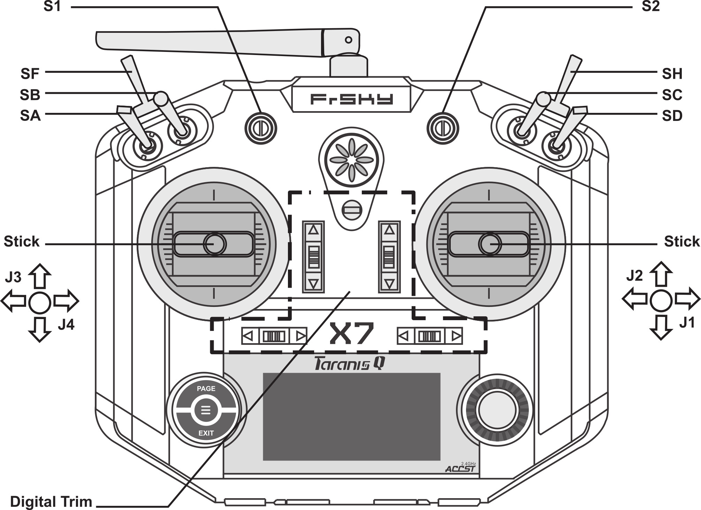
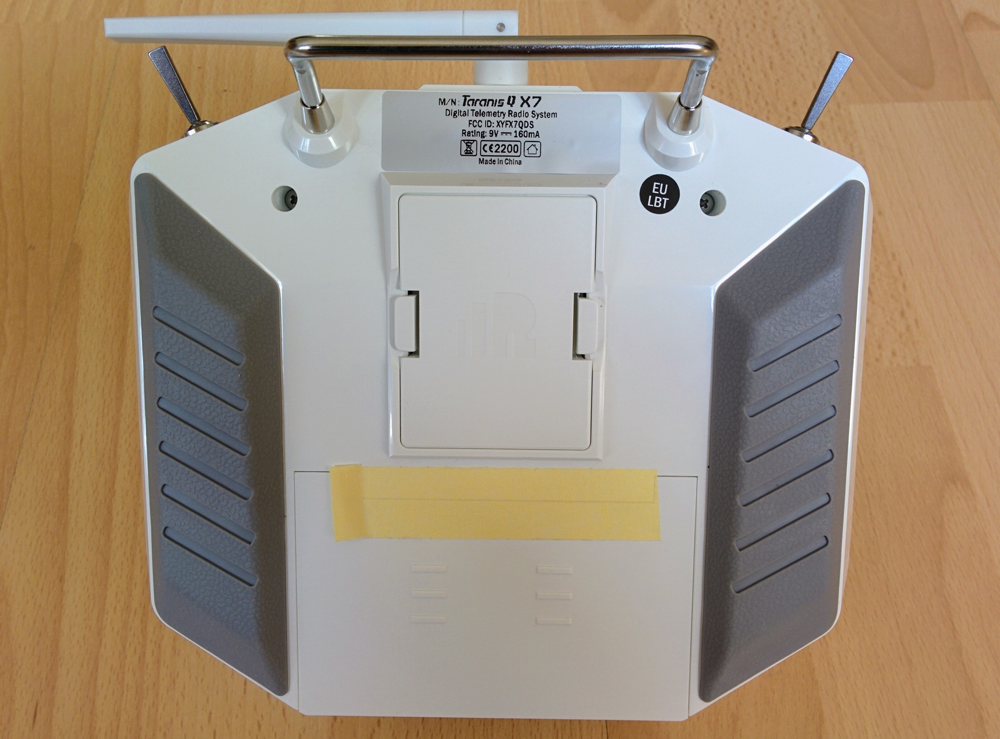

It came as a bit of a surprise to me, initially at any rate, that the transmitter involves at least as much configuration as the flight controller. I couldn't believe that it's really just a box of switches with a radio that you essentially have to program in order to use it for a specific purpose. This page is one of the longest build steps but don't let it intimidate you!

_FrSKY Taranis Q X7._  

If you're new to the whole field, as I am, then the small folded black and white manual that comes with the Taranis Q X7 is impressively unhelpful (and it's not one of those cases where the manufacturer makes the real manual available online). Actually the information about the antenna is useful (the side rather than the tip of the antenna should be pointing at the drone in flight), as is the model setup information (but only once you have enough background information to understand it).

The manual doesn't even tell you how to turn on the transmitter, the power button is actually missing completely from the incluced diagrams. I assumed it must be one of the many mechnical switches but it's actually the lower half of what I took to be just the power indicator in the very middle of the front panel.

So we've got the on/off button, the other immediately important things are either side of the LCD. To the left we've got _PAGE_ and _EXIT_ and the circular button between them is called _MENU_. And to the right we've got a dial - you can turn it but it's aso the _ENTER_ button if you press it.

_Q X7 LCD, buttons and dial._  

What about all the other switches etc? At each of the upper corners we've got a set of three switches, then between them we've got two knobs (called pots), then two joysticks (always just called sticks) and finally, above the LCD and between the sticks, a set of four 2-way momentary switches (that together are referred to as digital trim). What do these all do? The odd answer is that they don't have any inherent meaning - but we'll get to that soon.

The only important thing for the moment is that the switches have names (_SA_, _SB_, _SC_, _SD_, _SF_ and _SH_) as do the pots (_S1_ and _S2_) and that (initially at least) up/down on the left stick is the throttle (pull it all the way down and the throttle is at zero). The stick directions also have names - _J1_ to _J4_.

_Q X7 switches, pots and sticks._  

Notes:

* The upper left and right switches aren't quite identical - _SH_ is [momentary](https://learn.sparkfun.com/tutorials/switch-basics#momentary-switches) while _SF_ is not. Similarly the pots are slightly different - _S2_ has a noticeable click at its midpoint.
* Nearly all the switches etc. are on the front of the transmitter however _SF_ and _SH_ are on what people refer to as the left and right shoulders of the transmitter.

Batteries
---------

Before we use the transmitter we have to add batteries. Under the battery cover is a standard battery holder that takes 6 AA batteries. When my transmitter arrived the battery cover didn't close and it turned out the battery holder wasn't sitting quite right in the case. You can actually pull out the battery holder and instead of using AA batteries you can wire up something like a large LiPo. So just make sure the battery holder is sitting snugly in the case.

I used rechargeable NiMH batteries - I used this [Varta charger](https://www.amazon.co.uk/Varta-57677-PLUG-Charger-Battery/dp/B00HV5XOEG/ref=pd_sim_23_2), that includes four batteries, and two additional [packs of four batteries](https://www.amazon.co.uk/Varta-Rechargeable-Batteries-2100mAh-Ni-MH-x/dp/B000EGWOCM/) (this means I can have six batteries in the transmitter and a further six charged and ready to swap in if it runs out of power). The Varta charger has a Europlug - Amazon have an own branded [charger](https://www.amazon.co.uk/AmazonBasics-Ni-MH-Battery-Charger-Port/dp/B00TS18AEA/), that presumably comes with a plug to match the market it's sold in, along with their own brand [batteries](https://www.amazon.co.uk/AmazonBasics-Capacity-Pre-Charged-Rechargeable-Batteries/dp/B00HZV9WTM/). The transmitter batteries will last for many hours and, given that the LiPo on the drone will only last for about 20 minutes of flight time, this means a single set of batteries in the transmitter will last for many flights.

See Oscar Liang's in-depth [review of the Q X7](https://oscarliang.com/taranis-q-x7-tx/) that provides a nice walkthru of the transmitter and covers things like replacing the battery pack with a LiPo.

With time I grew to really like the Q X7 but the one terrible feature is the design of the battery compartment - I presume FrSKY with give it a makeover eventually.

The following is a simple tip but essential in my opinion. Inserting AA batteries into the battery holder is harder than it should be, getting them out is even worse. The first time I did this I slightly dented the casings of some of the batteries as I ended up levering them out with a wooden lollipop stick. So to make things much easier cut off a length of ribbon and run it below the batteries as you insert them - then use it to help pull out the batteries later when needed.

_Batteries with ribbon underneath._  

Several times I found the transmitter would not start up after replacing the batteries. There never seemed to be any issue with how the batteries were sitting in the battery compartment - still removing them all and reinsterting them always resolved the problem.

Finally the battery cover itself is very loose - eventually I ended up keeping it in place with masking tape.

_Battery cover taped in place._  

Balance bar
-----------

The transmitter comes with a mysterious little piece which turns out to be for attaching the neck strap. It's called a balance bar and needs to be screwed on, pointing downwards, with a 2.5mm hex wrench. The power button is still relatively easy to get at despite being covered by the balance bar once in place.

 

The balance bar has four holes, try suspending the transmitter from the neck strap using each of the different holes in turn - you'll see it affects the angle at which the transmitter hangs - choose whatever suits you best (I used the lowest hole).

Even without the neck strap I didn't find the transmitter getting too heavy during the relatively short sessions that even the large LiPo batteries allow for. The best reason for using the neck strap is not to relieve weight but to force you to be somewhat disciplined about how you hold the transmitter. Anyone who's played console games will be used to the tendency to twist the controller in the direction you want to travel, e.g. coming to a tight corner you wrench the controller about to make the turn even though this has no real affect on things. I found myself doing the same with the transmitter - and on a number of occassions lost radio contact when I wanted the craft to come down as subconsciously I'd ended up pointing the transmitter in the desired direction, i.e. at the ground, which unsurprisingly isn't the ideal direction for the transmitter antenna to be pointing.

**Update:** initially I used the transmitter without the neck strap but after using it for a while I wouldn't use it without it - as well as making you hold the transmitter correctly it also means you can let the transmitter dangle, freeing up your hands when you need.

Power on
--------

Before switching on the transmitter just play with the switches, pots and sticks. You'll find that some of the switches are 3-way and some 2-way. Each of the mechanical swiches has a neutral position, i.e. a position the Taranis considers safe, for the switches on the shoulders it's the rearmost position and for all other switches it's the upmost position. If a switch isn't in its neutral position before you turn on the transmitter then the transmitter will complain during startup.

I actually recommend that you flip some of the mechanical switches into different positions, some all the way back or up, some all the way forward or down, so that we see the transmitter warnings and how to resolve them. As the throttle (up/down on the left switch) self centers, i.e. springs to the mid position, it will always be in what the transmitter considers an unsafe position unless you actively push it down to its lowest position, i.e. zero throttle. We'll resolve this later.

OK - press the power button. The first thing you see is a throttle warning. Pull the throttle (left stick) all the way down and this warning will go away. Next, if you've flipped some of the switches out of their neutral position you'll see a switch warning - below the warning you'll see what switches its complaining about, e.g. _SB_ and _SC_. Look at the diagram up above and find the relevant switch and flip it all the way up (or back) so that the warning goes away for that button - once this is done for all problem switches the overall warning goes away. The next warning is that the failsafe hasn't been set - for the moment you'll have to ignore this by pressing e.g. _PAGE_.

You can ignore any warning by pressing a key like _PAGE_ but I suggest you get into the habit of always resolving the issue being complained about rather than ignoring it - when you're flying for real it's important to know that nothing is in an unexpected position before you take off.

_Main screen._  

Now you're at the main screen, move the sticks around, flick the switches (including the black plastic trim switches) and twist the pots and see how this is reflected on the LCD. As you can see the screen updates to reflect the current state of the switches etc., e.g. if you move the left stick around you'll see a corresponding little circle moving around in the left box or if you flip _SA_ (see the switch names up above) you'll see the little arrow beside _SA_ changing accordingly.

To turn off the transmitter just hold down the power button for a few seconds (if you don't keep holding until the transmitter is off you'll just return to whatever screen you were on).

Purpose
-------

So what do the switches etc. all do? Nothing actually - as stated at the start they have no inherent meaning.

It turns out the transmitter is actually a fairly general purpose computer. It has an operating system called [OpenTX](http://www.open-tx.org/) and you can interact with this OS via the LCD and the buttons either side of it. The basic job of OpenTX is simply to detect changes in the state of the sticks etc. and transmit these changes to a receiver connected to the drone.

So actually there are two distinct groups of controls - the controls either side of the LCD that are for the OS and then the sticks, mechanical switches etc. that can be programmed to do whatever you want.

The transmitter simply transmits the state of the sticks etc. to the drone. On a quadcopter the state of the sticks will be communicated to the flight controller and it will decide how to change the speed of the various motors to achieve the desired action, e.g. drift left. On a classic remote control plane there is no flight controller and the receiver directly drives various [servos](https://learn.sparkfun.com/tutorials/hobby-servo-tutorial), e.g. the position of one stick will control the position of the aileron and other the position of the rudder.

The important thing is that it's up to the drone to give meaning to the state of the sticks etc. The wiring of the receiver and servos or the configuration of the flight controller determines whether moving the left stick up and down controls the throttle or something else entirely.

There are some conventions, particularly as to what the sticks do, but that's all they are - conventions. And the conventions can differ by craft type and by country, e.g. mapping the throttle to up/down on the left stick is the norm in the US and much of the rest of the world but in some countries, e.g. Japan, it's often mapped to the right stick.

OpenTX
------

So the OS on the transmitter is OpenTX and you can interact with it via the LCD and the controls to its left and right. Power on your transmitter and let's try them out:

* _PAGE_ - you can use this to page through various screens, in the default mode (where the state of the sticks etc. are shown) this isn't too intereting but for the screens reached with _MENU_ there's more to see using _PAGE_. If you hold the _PAGE_ button a little longer you'll go back a screen rather than forward.
* _MENU_ - press and release quickly and you get to _Model selection_, press _EXIT_ to get back to the main screen, press and hold _MENU_ for a little longer and you get to _Radio setup_.
* _EXIT_ - gets you back to the main screen, it's also used in combination with the dial when changing the value of settings. Also - if you've scrolled far down a long screen, with the dial, pressing _EXIT_ quickly will return you to the top of the screen.

Go to _Radio setup_ and press the _PAGE_ button repeatedly to cycle through various screens (you can see the screen you're on, e.g. 3 of 9, in the upper right corner).

Note: confusingly in this context _radio_ just means the overall device, i.e. your Taranis Q X7, and doesn't mean the radio hardware that communicates with the receiver on the drone. Even more confusingly the radio hardware is sometimes referred to as the transmitter or TX module. I.e. depending on context transmitter and radio can refer to the whole device or just the component that handles the actual radio communication.

Let's try out something simple, safe and somewhat important - calibration. Go to _Radio setup_, press _PAGE_ until you reach the last screen - the _Calibration_ screen. Before you start (by pressing _ENTER_, i.e. the dial), turn the pots so that they're set at half way, i.e. make sure they're neither as far as they can go clockwise nor as far as they can go counterclockwise (if a pot is e.g. all the way clockwise before starting then calibration will only work out its lower limit but not its upper limit). Now press _ENTER_ and move the sticks, it'll ask you to set the sticks to their midpoint - as the sticks are self centering you don't have to do anything so just press _ENTER_ again. Now move the sticks so you touch every point of the outline of their corresponding boxes, this calibrates how far the sticks can travel in every direction. Finally turn both pots fully in both directions to similarly calibrate them and then press _ENTER_ - calibration is done.

Before we go on you may also want to note down the details of the current firmware version so you can compare them with the values you see after upgrading the transmitter as described below. Just go to _Radio setup_ as before and then page to the _Version_ screen, you should see something like:

* FW: opentx-x7
* VERS: 2.2.0 (0)
* DATE: 2017-02-16 17:22:25
* EEPR: 218

Note: we won't be changing the EEPROM value (this is to do with your own models and settings).

Transmitter software
--------------------

We're going to update everything on our transmitter. Confusing there are three different things that can be updated:

* OpenTX - this is the OS of the transmitter.
* The radio firmware - this is the low level firmware for the radio hardware.
* The bootloader.

If you're used to laptops and PCs then OpenTX is the OS and is not specific to your particular transmitter, it can run on a range of transmitters, not just the Q X7. The radio firmware is like a device driver and is specific to the particular radio hardware of a particular transmitter model. Last is the bootloader - if you've played around with something like an [Arduino](https://learn.sparkfun.com/tutorials/what-is-an-arduino) then you'll know what a bootloader is, otherwise just think of it as the BIOS - the very basic low level software activated on startup that boots the OS (among other things).

Aside: in a modern OpenTX setup there are actually two bootloaders - a super low level one called the STM32 bootloader, that you can always fall back to, and the OpenTX bootloader that provides more features (and allows you to do fancy things like update the firmware on other devices, like the receiver, without needing a laptop or PC).

When people use the term "firmware" you'll have to deduce from context whether they mean the OS, i.e. OpenTX, or the low level radio firmware as often it's not very clear.

OpenTX Companion
----------------

You can setup everything to with your transmitter via the transmitter itself, but this can be fairly fiddly using just the dial and the other buttons. One of the great features of OpenTX is that you can connect the transmitter to a computer via USB and do all the setup using an application called OpenTX Companion.

We'll use OpenTX Companion first to update the OpenTX version on the transmitter along with the bootloader.

OpenTX Companion can run on Mac, Linux and Windows. On Mac and Linux it doesn't need any extra driver but if you're using Windows you'll need to download [Zadig](http://zadig.akeo.ie/) and get it to install a USB driver for the STM32 bootloader. With a modern Windows setup and the current version of Zadig this is trivial but as with much OpenTX documentation they make it sound very complicated. So I suggest you just download Zadig, run it and then go to the OpenTX [Zadig documentation](http://open-txu.org/home/undergraduate-courses/fund-of-opentx/using-zadig/) and just jump straight down to the point where it says "The first screen you see will be the Zadig install window" and work through the three following simple steps.

To get OpenTX Companion go to [OpenTX.org](http://www.open-tx.org/) and then to the _News_ section, click on the link to the latest OpenTX 2.2.0 RC (RC18 at the time of writing). Go to the bottom of the resulting page and click on the link for the OpenTX Companion version for your system (Window, Mac or Linux).

Note: OpenTX Companion is installed like any other application on Windows or Mac - on Linux it's still easy but requires installing the releases PPA for OpenTX first - see [`opentx-companion-on-ubuntu.md`](opentx-companion-on-ubuntu.md) for more details.

TODO: normally I wouldn't recommend an RC release but it's actually a prerelease version of 2.2.0 that comes on the Q X7 and 2.2.X is the first version that comes with direct support for the Q X7. Once 2.2.0 stable is out update this section telling people to go to Downloads (where stable versions are) rather than to New and an RC release.

When you start OpenTX it'll complain that it's "Unable to check for updates" - this is a consequence of using an RC release and you can resolve it as described [here](https://github.com/opentx/opentx/issues/4012) (actually you need to tick both "Use OpenTX firmware nightly builds" and "Use Companion nightly builds").

TODO: remove link to above Github issue - and uncheck the options involved - once a stable release is available.

When you start OpenTX it'll check for the latest firmware and ask if you want to download it. Don't - you haven't configured your transmitter model yet and it defaults to downloading firmware for the Taranis X9D+.

TODO: the needs a rewrite for a non-prerelease version of OpenTX. The screenshot below is from installing Companion 2.2 on Windows. At the end of installation it opened and opened straight into settings so you have to establish your radio etc. immediately (which makes more sense than the previous behavior). So setup _Profile Name_, _Radio Type_ and _Build Options_ (_SD Structure path_ gets set in a later page/chapter). It did not bug me on _first_ starting to download the latest firmware - oddly it only this on restarting it, it would seem to make most sense to bug you immediately after forcing you to complete the settings.

In _Settings_ change the radio type to _FrSky Taranis X7_ and tick _lua_ and _massstorage_ as build options. Only the radio type is very important, the build options could probably all be safely left unchecked. The three options suggested in nearly all guides are:

* _lua_ - this enables [Lua](https://en.wikipedia.org/wiki/Lua_(programming_language)) scripting for the transmitter. While you may probably never use Lua scripting yourself it is used in some standard operations such as the new model setup wizard (that currently is only available if using the older X9D+), but it does not seem to be used in any really core functionality (see [my question](https://opentx.rocket.chat/channel/OpenTX_General?msg=z9X8qKSt2afERAy6y) on the OpenTX chat channel).
* _massstorage_ - this means that your Taranis looks like a USB drive when it's plugged into your computer via a USB cable. I find this very convenient and the only reason not to enable it is that you have to choose between this feature and being able to connect the transmitter up to simulator software running on your computer (see [here](https://oscarliang.com/free-quadcopter-simulator-drone-multirotor-trainer/) and [here](http://www.dronethusiast.com/drone-flight-simulator/) for more on simulators).
* _sqt5font_ - this is an alternative font, for use by the transmitter, that some people prefer. I tried the firmware with _sqt5font_ ticked and with it unticked and didn't see any difference so perhaps this setting is irrelevant for the Q X7 - as such I don't select it.

**Update:** it turns out that the SQT5 font was accidentally left out of 2.2.0 (see [#5142](https://github.com/opentx/opentx/issues/5142)) - hence the  lack of any difference if _sqt5font_ is ticked or not.

For a more detailed walkthru of these basic settings see Oscar Liang's [walkthru](https://oscarliang.com/flash-opentx-firmware-taranis/), just jump down to the "Firmware Download and Flashing" section. Note that he's setting things up for a Taranis X9D+ and that he turns off _massstorage_ (as he wants to be able to use the transmitter with simulators, something I haven't tried). Also Wayne Flower's [video from the 2:59 mark](https://www.youtube.com/watch?v=q1D-LEfDprk&feature=youtu.be&t=179) covers the same thing for the Q X7 (note he enables nightly builds as an option, but only because this video was made before a stable 2.2.X version came out).

Backup
------

Now we're ready to connect the transmitter to the computer. You'll need a USB cable with a mini-B connector (like [this one](https://www.amazon.co.uk/AmazonBasics-USB-2-0-Cable-Male/dp/B00NH11N5A)), i.e. the kind of cable usually used to connect to cameras.

First start the transmitter in bootloader mode - this involves pressing the two black trim swtiches above the LCD inwards while you press the power button. Again Oscar Liang has a nice picture in his [walkthru](https://oscarliang.com/flash-opentx-firmware-taranis/) , see the "Backup Current Configuration" section (however we're going to back things up in a different way to him).

Note: when starting the transmitter in bootloader mode I sometimes found it would crash in the same fashion as described [here](http://openrcforums.com/forum/viewtopic.php?t=8882). Whenever this happened I had to pull out a battery to turn it off. While annoying the transmitter did usually enter bootloader mode successfully on trying again.

**Update:** after a little more experimentation, it seems this bug is triggered by holding down the power button at startup rather than just quickly pressing and releasing it.

Once started in bootloader mode you'll see _Or plug in a USB cable_ at the bottom of the screen - so do that (the USB port is under the flap at the bottom of the transmitter) and connect it to your computer running OpenTX Companion.

_Connected via USB._  

First we're going to backup the current transmitter setup - in OpenTX Companion go to the _Read/Write_ menu and first select _Read Firware from Radio_ and save the result as e.g. `orig-firmware.bin`, then select _Backup Radio to File_ and save the result as e.g. `orig-eeprom.bin`.

If _massstorage_ is currently enabled for your Q X7 (which is the factory default) then you transmitter should appear on your computer as a USB drive called _Taranis_, if you open this drive you should find two files called `EEPROM.BIN` and `FIRMWARE.BIN` that contain exactly the same contents as the two files we just backed up. So if _massstorage_ is enabled an even easier way to backup your transmitter is to just copy these two files to your computer.

In all likelyhood you'll never need these backups.

Note: if you recorded your current OpenTX firmware version as described above then you may also want to record the bootloader version to see how it is affected by the upgrade process - just record the top title of the bootloader screen, it should be something like "X7 Bootloader 2.2.0".

While USB is connected it's not acutally possible to power off the transmitter, so eject the Taranis USB drive, disconnect the transmitter and then turn it off.

Upgrade
-------

For upgrading we're going to connect the transmitter to the computer again but this time without turning the transmitter on first. When you connected the transmitter you may here a little pop from its speaker but nothing else should happen.

Now, using OpenTX Companion, let's download the latest OpenTX firmware suitable for your transmitter (assuming you haven't already done so - OpenTX Companion nags you everytime you restart it to do so). Go to the _File_ menu and select _Download..._, then click _Check for updates_. It'll go off and find the latest firmware and prompt you to save it to your local drive - do so. Now we're ready to write the latest version of OpenTX to the transmitter - go to the _Read/Write_ menu and select _Write Firmware to Radio_. It will now pop up a dialog showing the details of the firmware version you just downloaded, just click the _Write to TX_ button. Now you'll see a progress bar, click _Show Details_ and you'll then see a more informative indication of progress.

Once that's finished it's all done, there are no further steps. Unplug the transmitter (as we never turned it on it was never mounted as a USB drive so we don't have to be careful about ejecting it first).

It you turn on the transmitter now and go to the _Version_ screen (as described above) you should see the new version details, similarly if you startup the transmitter in bootloader mode you should see that the bootloader version that's shown has changed as well.

TODO: include screenshot of 2.2.1 version screen once it's out.

**Important:** there are other ways, described elsewhere on the web, to upgrade the firmware - however these approaches are only able to update the OpenTX firmware, while this approach updates both the OpenTX firmware and the OpenTX bootloader. E.g. Oscar Liang, in his walkthru connects the transmitter in bootloader mode both for the backup (as above) and for the upgrade - but if you start in bootloader mode then the bootloader is active and it cannot be upgraded while active so only the OpenTX firmware is upgraded.

SD card
-------

The Q X7 doesn't come with an SD card but we're going to need one to upgrade the radio firmware next (when I say radio here I mean the Q X7's low level radio transmission hardware).

The SD card can store images and sound files that the OpenTX firmware can use and you can backup to the SD card and store firmware updates for the radio (and, as we'll see later, also for the receiver).

You don't need a very big one - the standard set of sound files etc. are only around 37MB and a complete backup takes less than 1MB so a 1GB card would be more than enough. However the smallest card you can buy these days seems to be about 8GB - something like this [Kingston 8GB microSD card](https://www.amazon.co.uk/Kingston-8GB-Micro-SD-HC/dp/B001CQT0X4/).

Go to the same place that you downloaded OpenTX Companion (see above) and just above the links to OpenTX Companion you should find a link to _SDCard content_. Click this and download the latest version shown for the Q X7 (`sdcard-taranis-x7-2.2V0009.zip` at the time of writing).

TODO: update once 2.2.0 stable comes out.

Format your SD card for FAT (rather than e.g. exFAT or NTFS), unzip the downloaded SD card contents and copy them to the card so that it ends up containing a set of top level directories with names like `EEPROM`, `FIRMWARE` etc.

Note: FAT means FAT32 these days - essentially nothing is using earlier FAT variants anymore.

If you're on a Mac you may end up with a whole load of [extended attribute](https://apple.stackexchange.com/q/14980) files and other Mac specific stuff. The transmitter ignores them but you may want to remove them while the SD card is still plugged into your Mac. Close any Finder windows showing any folders on the SD card, then in terminal find the appropriate volume under `/Volumes` (I called my SD card `OPENTX`) and do something like this:

    $ cd /Volumes/OPENTX
    $ rm -rf .Trashes ._.Trashes .Spotlight-V100 .fseventsd
    $ rm $(find . -name '._*')

As always be very careful what you're doing when using `rm` from the command line!

Once you're ready eject the card and put it into the transmitter (the SD card slot is beside the USB connector). The card goes in upside down, i.e. connector pins facing upward.

**Important:** the Q X7 manual warns that you should never insert or remove the SD card while the transmitter is on.

_Inserting SD card._  

Now turn on the transmitter - the first thing you'll notice is that the transmitter starts talking to you, you'll here it say "Welcome to OpenTX". This can be a little disconcerting but apparently the audio alerts are useful when you're flying and you want to stay looking at your drone rather than the LCD screen.

Now if you go to _radio setup_ (as described already above) and then press _PAGE_ to get to the _SD card_ screen you'll see the contents of the card. If you haven't already, try playing with the dial and pressing it to navigate around the contents of the card - it's fairly intuitive.

If you connect your transmitter (while turned on) via USB to your computer you'll now see two USB drives (assuming you enabled _massstorage_ as outlined up above). One is the _Taranis_ drive we saw before and the other is the SD card - it looks just as it did when directly connected to your computer.

Note: Here I setup the initial contents of the SD card on my computer before putting it into the transmitter - in [this video](https://www.youtube.com/watch?v=2wZM_dqvBJ4&feature=youtu.be&list=PLiYYhnH4BhI-ot9OQ9djvRaacFHboFqC2&t=170) the presenter inserts a blank SD card straight into the transmitter and then connects the transmitter to his computer and copies the extracted SD card contents over via USB. The end result is the same but don't try to interact with the SD card via the transmitter before this is done. I tried doing this - after inserting a blank SD card into the transmitter I put it into bootloader and tried to use the _Write Firmware_ option to backup the firmware to the card. However this just results in the somewhat cryptic error "No directory found" - OpenTX and its bootloader expect the directory structure seen above, i.e. `FIRMWARE` etc. to already be there.

XJT module upgrade
-------------

The internal XJT module is the hardware within the transmitter that communicates with the receiver on your drone, i.e. the XJT module is the core radio hardware.

Aside: I don't know what XJT stands for though I'd make a wild guess that the X indicates the FrSKY X series, the J is for [JR](http://www.jramericas.com/) and T is for telemetry - i.e. an XJT module is an FrSKY X series module, for use with JR type devices, that supports telemetry. The X series is FrSKY's S.BUS based range (the older D series, that includes models like the D4R-II, is PPM based). For a summary of receiver technologies (PWM, PPM etc.) see this [video](https://www.youtube.com/watch?v=GbUMC8h2uhU) from Painless360.
<!-- The web page for the XJT external module describes it as being "compatible with transmitters with external JR/Graupner type module slot." -->

Now that we've upgraded we've upgraded the OpenTX and its bootloader the last step is to upgrade the XJT module.

The Q X7 and other modern FrSKY transmitters come with an internal XJT module but FrSKY also sell an external XJT module. All these modules use the same firmware - on the old FrSKY site this used to be clear as the firmware download page included a list of compatible devices. This list seems to have been lost with the recent site redesign - so you just have to know that the firmware associated with the external XJT module is also the firmware for use with the internal module in your transmitter.

Go to [_Download_](http://www.frsky-rc.com/download/) on the FrSKY site, scroll down to _Modules_ and select _XJT_. On the _XJT_ page expand the _Firmware_ section and download the latest firmware file. The downloaded zip file will contain two `.frk` files, one for the EU (with `EU` or `LBT` in the middle of its name) and one for other jurisdictions. The EU has specific wireless regulations that require a technology called LBT. You should use only the `.frk` file appropriate for your jurisdiction.

Notes:

* LBT stands for Listen Before Talk and is the firmware type FrSKY is now using for the EU (see their [press release](https://www.frsky-rc.com/lbt-eu-firmware-official-release/)).
* Your transmitter needs to be compatible with the firmware used by the receiver - so when we come to setting up the receiver next we'll upgrade it too to ensure this is the case. Mixing EU firmware on the transmitter with non-EU firmware on the receiver, or vice-versa, won't work.

Copy the appropriate `.frk` file to the `FIRMWARE` directory on your transmitter's SD card (either connect your transmitter to your computer via USB, as described up above, so the SD card shows up that way or simply turn off the transmitter, pop out the card and copy the file on directly from your computer).

Once that's done, and you've disconnected USB (or reinsterted the SD card), restart the transmitter in normal mode and navigate to the contents of the SD card. Navigate into `FIRMWARE` and select the `.frk` file that you just copied on (it should have a name like `XJT_EU_V20_build170317.hex.frk` or the same with `NONEU` for the non-EU firmware). Now press and hold _ENTER_, i.e. press the dial, you should see a popup with various options - select _Flash int module_ and a progress bar will appear indicating that it's being written.

Oddly the process just finishes without any confirmation (if there had been a problem though it would have told you) and there appears to be no way to query the XJT firmware version via OpenTX - you just have to trust that it's been done (I've confirmed this on the [OpenTX chat channel](https://opentx.rocket.chat/channel/OpenTX_General?msg=mszoW8QwiAirmFfvy)).

Wrap up
-------

OK - that's it for the moment with the transmitter. Later on we'll use Open Companion again to configure some of the switches to select between various [flight modes](http://ardupilot.org/copter/docs/flight-modes.html) for the quadcopter. And we'll look at disabling self-centering for the throttle.

Notes
-----

If you're really interested the OpenTX project has a lot of documentation - however I'm not sure I'd recommend it, it can be rather overwhelming and some of it is more confusing than helpful. But for reference here's the material either directly produced by or recommended by the OpenTX project:

* [The OpenTX 2.2 manual](https://opentx.gitbooks.io/manual-for-opentx-2-2/content/) - this is probably the most digestable of the items here but it isn't terribly detailed. It is part of the [OpenTX Gitbook collection](https://www.gitbook.com/@opentx) that also includes some Lua related documentation and the OpenTX Taranis manual (which is nearly identical to the OpenTX 2.2 manual but covers a previous version).
* [The OpenTX 2.1 documentation](http://openrcforums.com/forum/viewtopic.php?f=45&t=8724) - despite the similar name this is a completely different set of documentation (in PDF format), it has far more detail but can be confusing at times.
* [OpenTX University](http://open-txu.org/home/undergraduate-courses/) - someone has put a lot of work into this but I found it so meandering as to be almost useless - but there is some good information burried in there.

For any given task it's often easier just to Google for information - you'll generally find someone else has writen something shorter and clearer on that particular thing.
