Previously we updated everything to do with the transmitter - in particular the transmitter OS called OpenTX. Then we disabled self-centering for the throttle. Now we'll finally go through the basic configuration for the transmitter. There are no end of transmitter settings you can adjust but we can ignore nearly all of them as they have sensible defaults or are irrelevant for our setup. We'll just set some basic things like time and date and create a model.

I'm not going to go into much detail about how to use the transmitter buttons like _PAGE_ etc. to navigate around and change settings. The buttons have been covered previously and if you need more help on getting started with them, and how to use them to change settings etc., there's a section down below that includes links to videos that cover all this that you might want to look at first.

On this page we're just going to:

* Set date and time for the transmitter.
* Set its county code.
* Set the receiver channel order.
* Calibrate the sticks and pots.
* Create a new model.
* Set the model name.
* Set the model's failsafe setting.
* Set expo for pitch, roll and yaw.
* Invert the pitch.

Basic onfiguration
------------------

To get started long press _MENU_ to get to the _Radio setup_ screen and set the current date and time.

_Set date and time._  
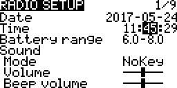

Then use the dial to navigate downwards and set the country code if necessary. It defaults to US, I set it to EU.

_Set country code._  
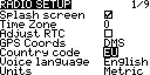

Aside: if you look through the OpenTX source code it seems that the only behavior that this country code value affects is binding for the XJT module used by all modern FrSKY transmitters (search for `countryCode` in [`pxx_arm.cpp`](https://github.com/opentx/opentx/blob/2.2/radio/src/pulses/pxx_arm.cpp) - PXX is the protocol used with these modules).

Now navigate down further to the bottom of the screen. The last two entries are _Rx channel ord_ and _Mode_. We already covered mode when setting up the sticks - we're using mode 2, which is the default so leave this as it is. However we do have to change _Rx channel ord_ to _AETR_ (by default it's set to _TAER_). Channel order is explained in more detail later on.

_Set RX channel order._  
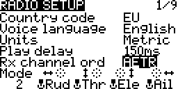

Then use _PAGE_ to get to the _Calibration_ screen and re-calibrate the sticks and pots (calibration was already been covered in more detail in the [OpenTX intro](transmitter-getting-started.md#opentx)). Remember to set the pots to their mid position before starting.

_Calibration._  

Models
------
A single transmitter can be used to control any number of remote controlled craft, e.g. you could have any number of quadcopters, along with some planes, cars and boats, and use the same transmitter to control whichever one of these you wanted to use at a particular time. On your transmitter you have to create models with each model corresponding to one of the RC craft you own.

Later we'll cover the binding process that ties a given model, that you've created, to the actual receiver on the corresponding craft.

The transmitter comes with one model, called MODEL01, already set up - when you turn on the transmitter you can see on the main screen that it's the currently selected model.

_Main screen before any setup._  

So let's create a new model corresponding to the Pixhawk based quadcopter that we're building. Make sure you're on the main screen (use _EXIT_ to get back there if you're not) and then short press _MENU_ to get to the _Model selection_ screen. You can either modify the existing MODEL01 or create a completely new model. To create a new model turn the dial to select an empty slot, e.g. 02, and press _ENTER_ and select _Create model_.

_Create a new model._  
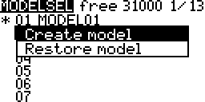

The new model is initially just called MODEL02, the asterisk beside it indicates that it's the currently selected model.

_New model with default name._  

Now press _PAGE_ and update the model name to something more informative, e.g. "F450 Pix". Long hold _ENTER_ to get a capital letter.

_Set model name._  

Use the dial to scroll through all the other options until you reach failsafe. Set it to _No pulses_, we'll come to what this means later.

_No pulses failsafe._  
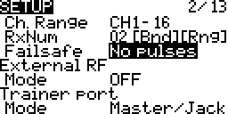

That's it - setup is done for the moment. If you return to the main screen you'll see that the name of the newly created (and currently selected) model is now shown.

_Main screen with new model selected._  
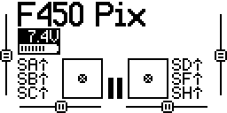

As you've already seen the main screen shows current switch states etc., if you're interested there's other data you can get to from the main screen - see [main screen pages](transmitter-extras.md#main-screen-pages).

Receiver channel order
----------------------

We looked at something called mode when we covered stick setup. The chosen mode affects which stick direction is considered to be throttle etc., e.g. up/down on the left stick is throttle in mode 2.

However there are two devices involved here - the transmitter and the receiver. The mode just affects the mapping between stick directions and names like _Ail_, _Ele_, _Thr_ and _Rud_ in the transmitter. So when you're in mode 2 and you move the left stick up and down this adjusts the value that the transmitter associates with throttle. The transmitter then has to transmit this value to the receiver.

As noted above the transmitter has 16 channels (using its internal RF module) on which it can output these values. Typically the stick values are transmitted on the first four channels, i.e. 1 to 4. But like mode it's just a convention how the receiver (and the related equipment - either a flight controller or directly connected servos) interprets the values it sees on these channels.

There are two main conventions for receivers. Many devices follow the convention established by the manufacturers Spektrum and JR where channel 1 is interpreted as the value for the throttle and so on like this:

| Channel # | Control  |
|-----------|----------|
| 1         | Throttle |
| 2         | Aileron  |
| 3         | Elevator |
| 4         | Rudder   |

The shorthand for this convention (for obvious reasons) is TAER.

Note: as discussed elsewhere the terms elevator, aileron and rudder tend to be popular among those piloting planes while the terms pitch, roll and yaw are more common among those piloting mutlicopters (and both groups use the term throttle). OpenTX always uses the plane naming convention in all its screens and menus.

As we saw above TAER is the default value for _Rx channel ord_. However many devices follow the Futaba and Hitec convention:

| Channel # | Control  |
|-----------|----------|
| 1         | Aileron  |
| 2         | Elevator |
| 3         | Throttle |
| 4         | Rudder   |

The shorthand for this convention is AETR. This is the convention that the setup we're building requires and so we changed the _Rx channel ord_.

When you create a new model the controls are initially mapped to channels according to the current value of _Rx channel ord_. If you go to the _Mixer_ screen for your model you can see the current mapping between channels and controls.

_Mixer screen._  

_RX channel ord_ is a global setting, however its current value is only used to determine the initial channel order when creating a new model. Changing _Rx channel ord_ won't affect any existing models. And you can modify the channel order of existing models independent of the current value of _Rx channel ord_ (just go to the _Mixer_ screen and rearrange the order there).

Note: there's an _Input_ screen that superficially looks quite similar to the _Mixer_ screen - however this screen is about adjusting the behavior of the various controls, e.g. adjusting expo (which we'll come to later) to make them less "twitchy". On this screen you can even adjust the real source for the values _Thr_ etc. on this particular model. By default the stick considered throttle according to your current mode setting is mapped to _Thr_ but you could e.g. map one of the pots to _Thr_ for this particular model if you wanted.

Failsafe
--------

Above we set failsafe to _no pulses_. Before we did this the transmitter would always warn that there was no failsafe set for the current model when the transmitter was turned on.

The failsafe setting determines what the receiver should do if it loses contact with the transmitter, e.g. if the drone flies too far away or the transmitter runs out of battery power. There are various options - including leaving the choice to the receiver (you then have to configure the actual failsafe behavior on the receiver). Other options include having the receiver continue to output the same values as when it lost contact (this presumably results in the situation getting worse in most circumstances, with the receiver telling the craft to maintain the course that caused it to fly out of range).

With a craft like ours the flight controller can respond intelligently to losing contact. So in this situation _no pulses_ is the preferred option (see [ArduPilot failsafe setup](http://ardupilot.org/copter/docs/radio-failsafe.html#receiver-and-flight-controller-set-up)), this leave it up to the flight controller to decide what to do. It can e.g. be configured to return to the launch point or, if it's following a preconfigured route, to simply complete the route. We'll look at testing that the failsafe really works as expected when we set up the flight controller.

Expo
----

When you use the sticks for pitch, roll and yaw you're generally not making extreme movements so the sticks stays near the center in any given direction and you rarely move any stick to its maximum or minimum position. You end up just moving the sticks within a small area around their center position. So it would be nice if we could adjust things to stretch out this small central area so that small movements around the center result in less dramatic movements for the vehicle, making it easier to control and making it less "twitchy" when responding to the small movements we're typically making.

This is what expo is about - adjusting the responsiveness around the center of the sticks. Generally expo is just applied to pitch, roll and yaw while the throttle is left as it is - so for the left stick we're just talking about adjusting things for left/right stick movement, i.e. yaw, while for the right stick we're talking about both left/right and up/down stick movement, i.e. roll and pitch.

Painless360 has a [nice video](https://www.youtube.com/watch?v=ajJ3rJ1HN5Q) that explains expo far better than I could. And then in a [separate video at 5:10](https://www.youtube.com/watch?v=NIR85KOqIAo&feature=youtu.be&t=310) he explains how to set expo on the Q X7. That video covers all the details clearly within a minute - so rather than duplicate that I'll just summarize briefly here.

|  |  |  |  |
|-|-|-|-|
| _Inputs before adjustments._ 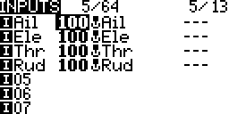 | _AIL before adjustments._ 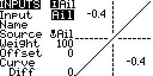 | _AIL with expo of 25._ 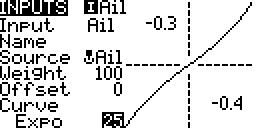 | _Inputs after adjustments._ 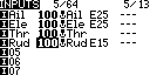 |

From the main screen short press the _MENU_ button to get to the _Model selection_ screen, then use the _PAGE_ button until you get to the _Inputs_ screen. Then in turn for _Ail_, _Ele_ and _Rud_ you press and hold _ENTER_ and select _Edit_ - on the edit screen for each you go down to _Curve_ and change the default values their (_Diff_ and 0) to _Expo_ and the desired expo value. Suggested values are as follows:

| Control | Value |
|---------|-------|
| Ail | 25 |
| Ele | 25 |
| Rud | 15 |

These are just values that Painless360 consistently suggests in various videos and not ones I've come to by experimentation. As noted above throttle is left unadjusted.

Note: despite the name the function behind expo in OpenTX is not an exponential fuction - if you're interested take a look at [`mixer.cpp`](https://github.com/opentx/opentx/blob/2.2/radio/src/mixer.cpp), there you'll find a large comment and the actual `expou` function that's used.

In both videos on setting expo Painless360 says that if you can you should set expo on the flight controller rather than the transmitter as this avoids a loss of resolution. This isn't too important and as it happens you can't do set expo like this with the flight controller software that we're using. However if you're interested by what he mean then see [loss of resolution](transmitter-extras.md#loss-of-resolution).

Inverting pitch
---------------

We'll be using the ArduCopter flight stack and one of its odd features is that you have to invert the pitch, i.e. the elevator in airplane-speak, otherwise the quadcopter will go forward when you pull the right stick back and go backward when you push it forward.

Go to the _Outputs_ screen for your model, go down to _CH2_ (which is elevator), press ENTER, select _Edit_, go down to _Direction_ and change the _---_ value shown to _INV_.

Afterwards you'll see on the _Outputs_ screen that the little arrow for _CH2_ is pointing the opposite direction to all the other ones.

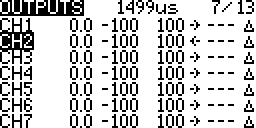

You can then see the affect of this by going to the main screen and then pressing _PAGE_. This brings you to the screen shown below - try moving the sticks about, up and down, left and right, and seeing how things react. Move the left stick, i.e. throttle, up and down and you'll see the value corresponding to channel 3 changing - as you'd expect its value is highest when you push it all the way up. Now move the right stick, i.e. pitch which we've just inverted, and you'll see how its value is instead at its lowest when it's pushed all the way up.

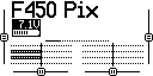

Notes:

* Having to invert the pitch is basically an ArduCopter bug though some people argue it's a matter of perception what's correct, see ArduPilot issue [#935](https://github.com/ArduPilot/ardupilot/issues/935) and this [DIY Drones thread](http://diydrones.com/forum/topics/pitch-is-reversed-where-should-i-fix-it).
* This is one of the few situations where Painless360 gets things wrong - in more than one of his videos he discusses inverting pitch via the _Inputs_ screen but this just inverts the stick and not the associated trim buttons.

TODO: verify the claim about trim - establish the craft at a stable fixed point and then use the roll trims to force the copter left and right, rather than using the roll stick, then try the same with the pitch trims and see that these trims affect going back and forward in the same way as the roll trims affect going left and right. Then unset _INV_ in _Outputs_ and instead set the _Weight_ for _Ele_ to -100 in _Inputs_ and see if things behave differently.

TODO: see if pitch inversion is also required when using the PX4 flight stack and see if QGroundControl has any special handling for it.

Videos and tutorials
--------------------

If you had any problem with the basic transmitter setup and model creation then this section contains some links to content that should make things clearer. While much of this content is not specific to our setup, e.g. covering planes rather than quadcopters, it's still helpful to see how to use OpenTX and interact with the transmitter.

Painless360 has two relevant videos:

* [Tips for setting up a new radio](https://www.youtube.com/watch?v=YD3ojhwVmrI) - at 10:37 he sets date and time and later at 11:39 he goes through calibration.
* [Creating basic model types](https://www.youtube.com/watch?v=NIR85KOqIAo) - at 2:50 he creates and names a new model. Then he sets up expo (as already linked to above). Then he briefly covers the mixer (note that the channel order shown is different to that used with the Pixhawk). From 6:44 he goes into quadcopter specific setup but by 10:50 the content relevant to this build is over. After this point he sets up an arming switch (which isn't relevant for the Pixhawk as it uses a physical safety switch combined with stick based arming) and then he sets up a flight mode switch (we'll handle flight modes later using a different Painless360 video for reference where he sets things up specifically for the Pixhawk using OpenTX Companion rather than the transmitter).

The Flite Test team cover model creation at 16:50 in their [Q X7 Setup and review](https://www.youtube.com/watch?v=7cExS1tTOJA) video. Later they bind it (which we'll come to later) to a D4R-II receiver. Most of what they cover is plane specific.

Blue Falcon covers failsafes in his [Q X7 - setting up failsafes](https://www.youtube.com/watch?v=LuJ_K0pOJkE&feature=youtu.be) video and at 5:28 he sets _no pulses_ as we do here. Blue Falcon in fact has a whole [playlist](https://www.youtube.com/playlist?list=PLiYYhnH4BhI-ot9OQ9djvRaacFHboFqC2) of videos covering the Q X7, that starts out with a [basic introduction](https://www.youtube.com/watch?v=W9zYI7KAtn8) and works through pretty much every aspect of the transmitter, both its hardware and its software. There are better approaches for some things he covers, e.g. gimbal adjustment, but overall it at least makes you aware of pretty much everything one can do with the transmitter.

RCdiy has a [detailed page](http://rcdiy.ca/taranis-q-x7-tutorial-first-flight-setup/#Using_OpenTX_The_Transmitter), that's accompanied by a video, that covers similar content. He covers setting the mode for the sticks (in our case the default is already what we want), binding and setting the failsafe (he delegates the choice of action to the receiver).

Hanger Fifty one explains in this [video](https://www.youtube.com/watch?v=oJXETHp2lsE) why trying to invert the pitch via the _Inputs_ screen is incorrect and he demonstrates setting it up, as we did above, via the _Outputs_ screen. And RCdiy discusses [changing control surface directions](http://rcdiy.ca/taranis-q-x7-tutorial-first-flight-setup/#ChangingControl_Surface_Directions) on one of his pages - this covers the same thing but he uses the term "inverting control surfaces" as he's talking about planes.
