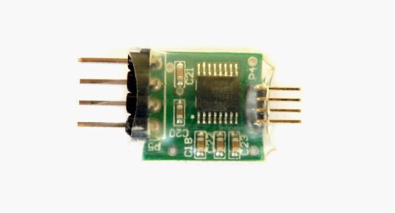
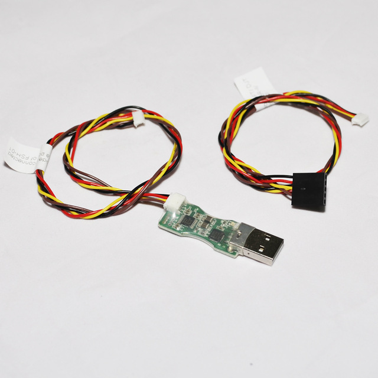
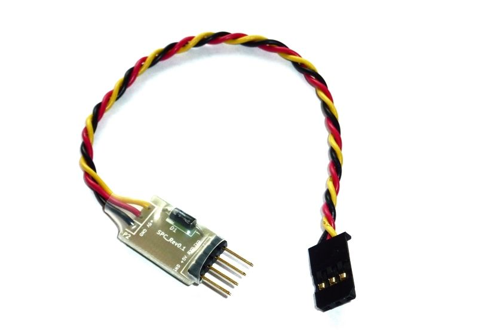
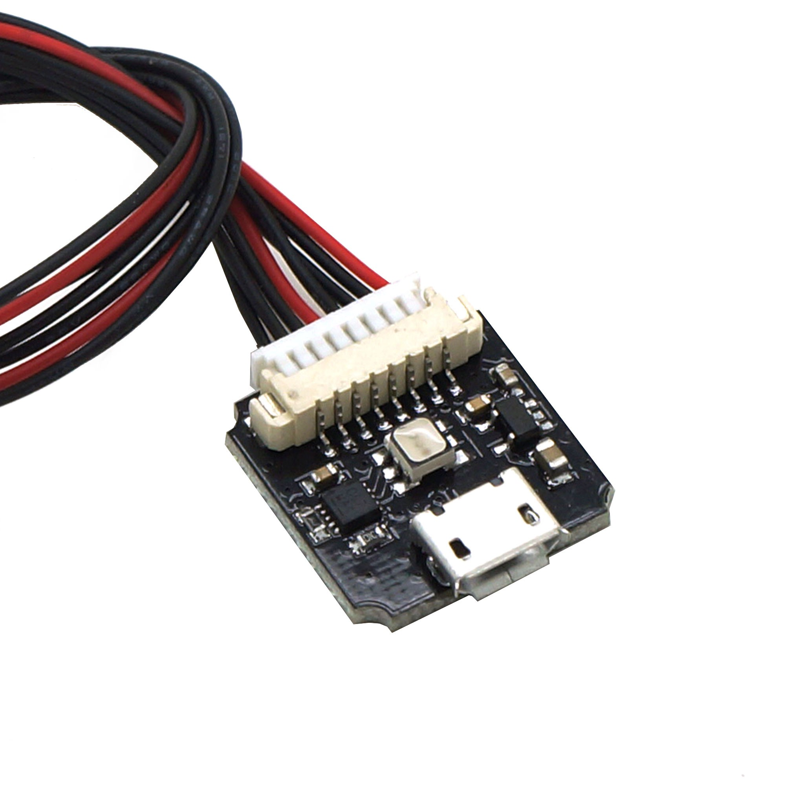
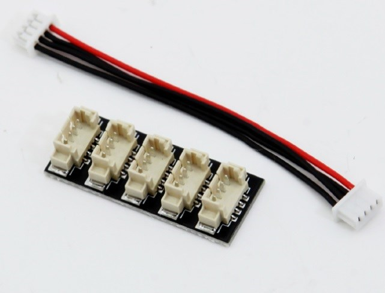
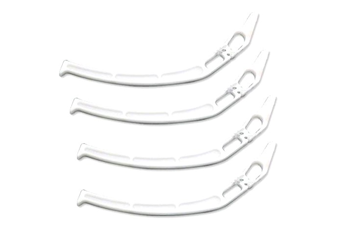
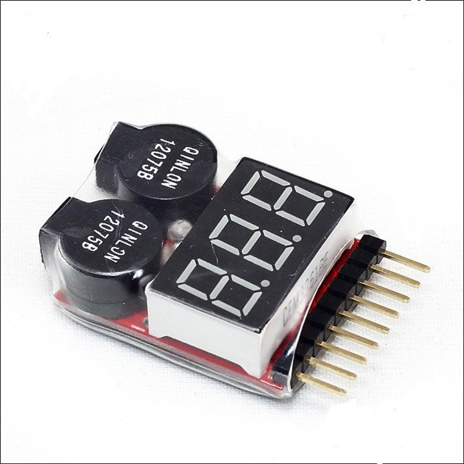
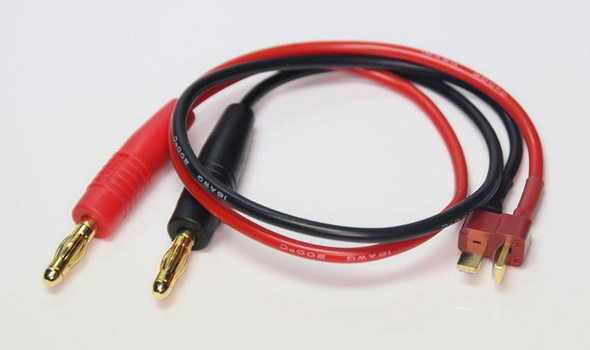
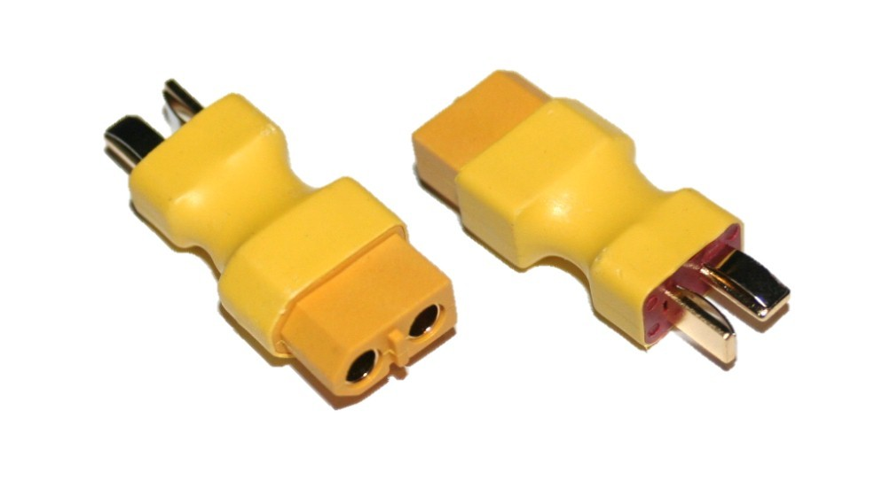

### Unused parts

The following are parts that were originally included in the [`parts.md`](parts.md) page but were ultimately never used.

| Price | Description |
|-------|-------------|
| &euro;4 |  FUL-1 TTL to RS232 converter - connects the telemetry port of the flight controller to the receiver ([link](https://www.unmannedtechshop.co.uk/frsky-transmitter-receiver-upgrade-adapter-ful-1/)).
| &euro;9 |  FUC-3 upgrade cable ([link](https://www.unmannedtechshop.co.uk/frusb-3-frsky-upgrade-cable-fuc-3/)).
| &euro;2.50 |  SPC (Smart Port converter) ([link](https://www.unmannedtechshop.co.uk/frsky-smart-port-converter-spc/)).
| &euro;8 |  External LED and USB connector ([link](https://www.unmannedtechshop.co.uk/all-in-one-led-and-usb-module-for-pixhawk/)).
| &euro;2.50 |  I2C splitter - share the Pixhawk I2C connector between the GPS module's compass connector and the external LED and USB connector ([link](https://www.unmannedtechshop.co.uk/i2c-board/)).
| &euro;5 |  F450/F550 landing gear ([link](http://www.helipal.com/dji-landing-gear-for-f450-f550.html)).
| &euro;4.50 |  Battery monitor alarm ([link](https://www.unmannedtechshop.co.uk/battery-monitor-alarm-1-8s/)).
| &euro;7.50 |  T-plug charger cable - connects battery to charger ([link](https://www.unmannedtechshop.co.uk/skyrc-s60-ac-balance-charger-discharger/)).
| &euro;3 |  Male T-plug to female XT60 adaptor - connects the battery to the power module ([link](https://www.unmannedtechshop.co.uk/male-t-plug-to-female-xt60-adaptor/)).

I was put off adding the landing gear by two things. The most important being the realization that it would make the craft much taller - without the landing gear legs you can transport the craft in a bag, with them you'd really need some kind of more substantial box-like case, making it harder to transport without a car. The second thing that put me off was this [blog post](http://diydrones.com/profiles/blogs/be-careful-with-the-new-dji-landing-gear) that showed that the legs could act like levers and increase the damage to the frame in the case of the crash. This became a real worry as crashing turned out to be a major part of getting used to the small practice drone that I bought before flying this build. However the general concensus seems to be that the legs more often help to absorb the shock of a crash with the situation reported in the blog being contrary to the norm.
