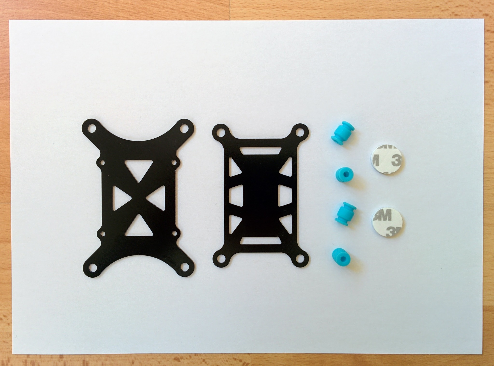
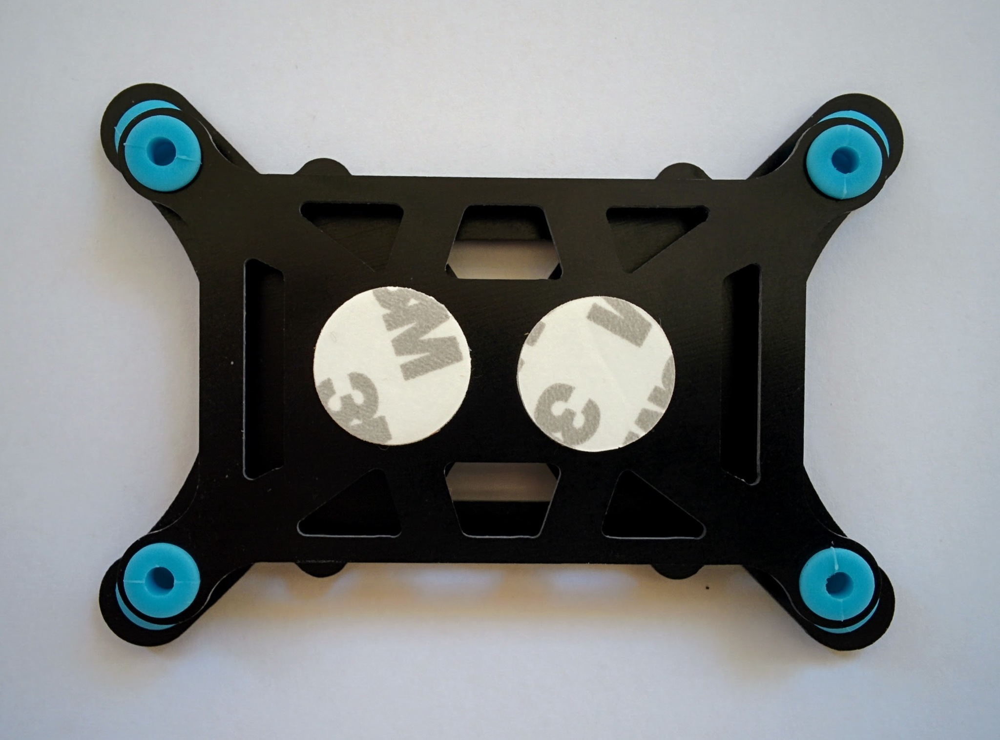

Vibration damping
=================

It's important to minimize the vibration to which the internal sensors in the flight controller are subjected. There are no end of suggested alternatives to attaching the flight controller directly to the frame. For some reducing vibration has become an obsession but it is possible to overstate the issue - 3DR, the original Pixhawk manufacturer, felt that just using adhesive foam to attach the controller to the frame was an adequate solution.

The most common step up from this is a vibration damping platform. Nearly every online store selling one has their own variation but the important thing seems to be that the upper platform be smaller than the lower one so forcing the rubber plugs, that provide the damping, inwards - this prevents too much lateral movement.

I bought [one from Unmanned Tech UK](https://www.unmannedtechshop.co.uk/vibration-damping-mounting-set/). In this set the plates seem to be cut from some strong plastic (rather than molded) and are significantly stronger than you'd achieve with a hobbyist 3D printer.

_Vibration damping platform unassembled_  

_Vibration damping platform assembled_  

Forcing the ends of the rubber plugs through the holes in the plates is somewhat challenging - for some hints see [these instructions](https://cdn.thingiverse.com/assets/e6/fe/0b/ee/57/Omnimac_Pixhawk_Mount_v1.1_Instructions.pdf).

Note that I haven't tested or confirmed the damping affect on the sensor readings from the flight controller.

For more on vibration damping see the ArduPilot [vibration damping page](http://ardupilot.org/copter/docs/common-vibration-damping.html). Among other things this covers the more substantial platform from Guy McCaldin that comes up over and over if you start looking into this area. It's taller (15mm) than the one I bought (11mm) which may be an issue if you're attempting to cram the flight controller between the upper and lower plates of a frame like the F450. You can find downloadable [plans](http://www.thingiverse.com/thing:163472) on Thingverse or order it (with a small markup) from the creator's [Shapeway page](https://www.shapeways.com/product/348KGX5PM/omnimac-pixhawk-mount-v1-1?optionId=42539551). In addition to the printed parts you'll also need rubber plugs - sources for which are linked to from the [instructions PDF](https://cdn.thingiverse.com/assets/e6/fe/0b/ee/57/Omnimac_Pixhawk_Mount_v1.1_Instructions.pdf).

Whenever you see analysis of vibration damping on hobbyist forums you often also see graphs and tables from the Hover Analysis Excel sheet created by the vibration obsessed Forrest Frantz. It's regularly updated - to find the latest version you have to wade through the comments on [this DIYDrones forum post](http://diydrones.com/forum/topics/vibration-isolation-and-dampening-of-apm-px4-for-version-2-9) on vibration damping (at the time of writing the latest version was on [page 57](http://diydrones.com/xn/detail/705844:Comment:2333750) of the comments).
