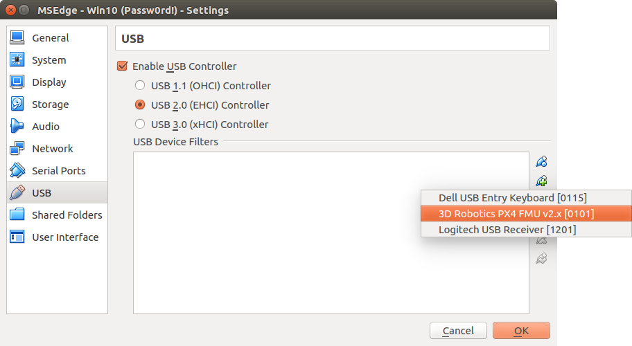

Some of applications used in this drone build only run on Windows. As I only use Linux and MacOS I had to run these in a VM.

This is very simple. I used [VirtualBox](https://www.virtualbox.org) and the very nicely preconfigured [Windows 10 (stable) VM](https://developer.microsoft.com/en-us/microsoft-edge/tools/vms/) that Microsoft makes available for browser testing.

Note: these VMs are not meant for general purpose long term use and are only valid for 90 days (which I don't find an issue).

Once you've installed VirtualBox you just need to unzip the Windows VM download, this produces an OVA file which you should double click - this will start VirtualBox and cause it to automatically install the new VM.

Note: the native MacOS `unzip` can't handle the zip format Microsoft is using for these VMs - you need to use `p7zip` (if you're using [Homebrew](https://brew.sh/) you just install it with `brew install p7zip`), see this [SO answer](https://superuser.com/a/626731/238591) for more details.

Once installed start the VM - when up and running for the first time just leave it alone for a few minutes and it will automatically activate itself (it also encouraged me to upgrade OneDrive - which I did, it did not then force me to log in to any related cloud service).

The VM is already setup with VirtualBox [guest additions](https://www.virtualbox.org/manual/ch04.html) so there's no need to install these.

TODO: this doesn't always seem to be the case - best to install version that matches your VirtualBox version (see below for Ubuntu instructions - process is the same for Mac). Just go to _Devices_ menus and select _Insert Guest Additions CD Image..._, then in Windows got to Explorer and then to _This PC_ and double click the _VirtualBox Guest Additions_ CD and complete the resulting install process. You can eject the CD afterwards.

In order to use USB passthrough, i.e. access USB devices connected to the host, you do however need to install the VirtualBox extension pack. Go to VirtualBox [downloads](https://www.virtualbox.org/wiki/Downloads), find the "VirtualBox Extension Pack" and click the "all supported platforms" link - this downloads a `vbox-extpack` file. Just double click this to install it.

Note: host is the term used in virtualization to refer to the real machine, i.e. the physical machine running VirtualBox (though technically you can run VMs within VMs within VMs and so on, so the host may be a VM running another VM).

Once the extensions are installed shutdown the Windows VM, if it's currently running, and then go to the settings for the VM. Go to Ports and then to USB, click "Enable USB Controller" and then select "USB 2.0" (or 3.0 if your machine has USB 3.0 ports). At the same time I also went to Display and increased the video memory to 18MB (simply because there was a warning at the bottom of the setting screen saying that the original value was too low).

Now restart the VM. When you connect a USB device you can go to the VirtualBox Devices menu and then to USB and select the device you're interested in. This will cause the device to become disconnected from the host machine and appear as connected within the VM.

That's it. Now you can use the VM just as you would a physical Windows machine. VirtualBox has many interesting features but if you're new to VirtualBox one feature that's worth mention straight away is the ability to share folders between the host machine and the VM.

Just go to the Devices menu, select Shared Folders, click the folded icon with a plus, select Other... from the Folder Path dropdown, leave Folder Name as it is (unless you want the folder to have a different name on the VM), tick Auto-Mount and Make Permanent (so the folder is automatically available whenever the VM starts) and then OK.

I had to restart the VM for the shared folder to become visible - once done you'll find it as a shared folder under This PC in Explorer.

TODO: add note that you need to change the VM's audio controller setting from the default "ICH AC97" to "Intel HD Audio" if you want audio to work in Windows - this was the case irrespective of whether VirtualBox was running on Mac or Linux - see [`Intel HD Audio`](assets/images/virtualization/intel-hd-audio.png) (from note on [`pixhawk-tones.html`](assets/pixhawk-tones.html) page).

TODO: comment that you "need" to bump video memory up to 18MB - see [`low-video-memory.png`](assets/images/virtualization/low-video-memory.png).

TODO: comment the VMs provided by Microsoft are only meant for browser testing and technically you should buy a Windows license for this kind of usage.

TODO: note that before you used to log in straight to the desktop - now you need to enter IEUser's password which is "Passw0rd!".

USB filters
-----------

Once you've added the extensions pack VirtualBox is quite flexible in how you can handle USB devices. You can just plug them in as normal and afterwards tell VirtualBox to connect the given USB device through to a given VM.

However there are issues with this - often background processes on the host system will grab a USB device as soon as its connected, e.g. because it mistakenly sees it as a modem that needs to be managed or a USB storage device that might contain photos the user wants to add to their photo management tool.

To prevent this you can setup USB filters for a given VM. Make sure the given VM is shutdown - then right click on it in VirtualBox and select _Settings..._, go to the _USB_ section and make sure _Enable USB Controller_ is ticked and that at least _USB 2.0_ is selected. Then plug in any USB devices that you will want to use with the VM, once plugged in these devices can be added to the list of _USB Device Filters_. For each device just click the "+" button to the right of the list and select the device from the displayed list.

Then unplug the devices and start the VM - now if you plug in any of these devices VirtualBox will grab it immediatelly before any other process on the host system sees it and immediatelly connect it to the VM, so avoiding any issues with host process trying to grab the device. When the VM is not running the USB device will be treated as normal, i.e. processes on the host system can see it as before.

Linux VirtualBox
----------------

On Mac I didn't have any problem running the Windows VMs that I downloaded when using the latest version of VirtualBox for Mac. However on Ubuntu 16.04 LTS (Xenial) the latest VirtualBox available using `apt-get` was 5.0.40 and for whatever reason I found the Windows VMs hung on startup using this version. So I first removed the existing version of VirtualBox (and VirtualBox additions):

    $ sudo apt-get remove virtualbox virtualbox-guest-additions-iso

And then, as per the [Debian-based Linux instructions](https://www.virtualbox.org/wiki/Linux_Downloads#Debian-basedLinuxdistributions) on the VirtualBox site, I added the following line to `/etc/apt/sources.list`:

    deb http://download.virtualbox.org/virtualbox/debian xenial contrib

Then following the rest of the instructions I installed the corresponding key, updated the package indexes and installed the latest VirtualBox package (along with `dkms` if not already installed):

    $ wget -q https://www.virtualbox.org/download/oracle_vbox_2016.asc -O- | sudo apt-key add -
    $ sudo apt-get update
    $ sudo apt-get install virtualbox-5.1 dkms

Then make sure to download and install the extensions (as covered up above).

For whatever reason there's no corresponding guest-additions ISO but you get the appropriate one by determining the installed VirtualBox version:

    $ apt list virtualbox-5.1
    virtualbox-5.1/unknown,now 5.1.24-117012~Ubuntu~xenial amd64 [installed]

Then go to <http://download.virtualbox.org/virtualbox/> and click the appropriate subdirectory (`5.1.24` in this case). and download the `VBoxGuestAdditions` ISO file there. You can then attach this to your VM and then open and run it from within the VM to get much nicer integration between the host and the VM (in particular being able to resize the VM window like any other window).
