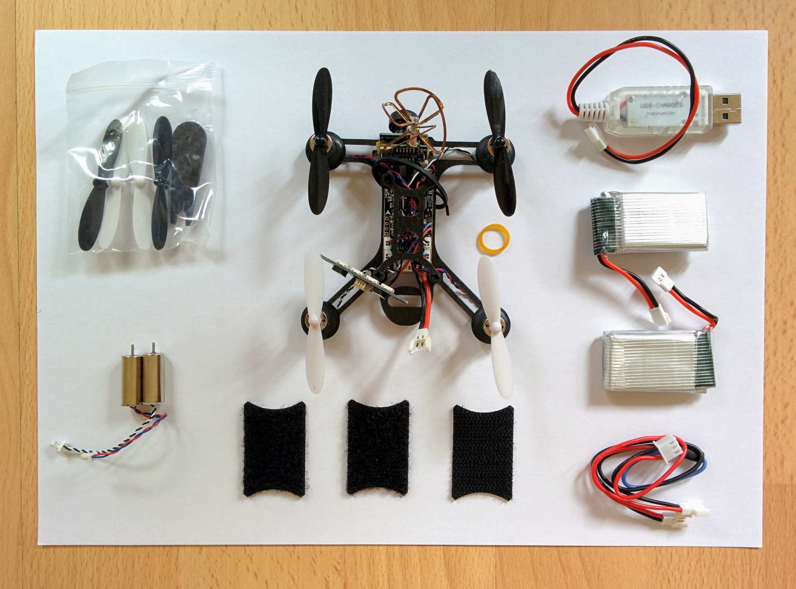
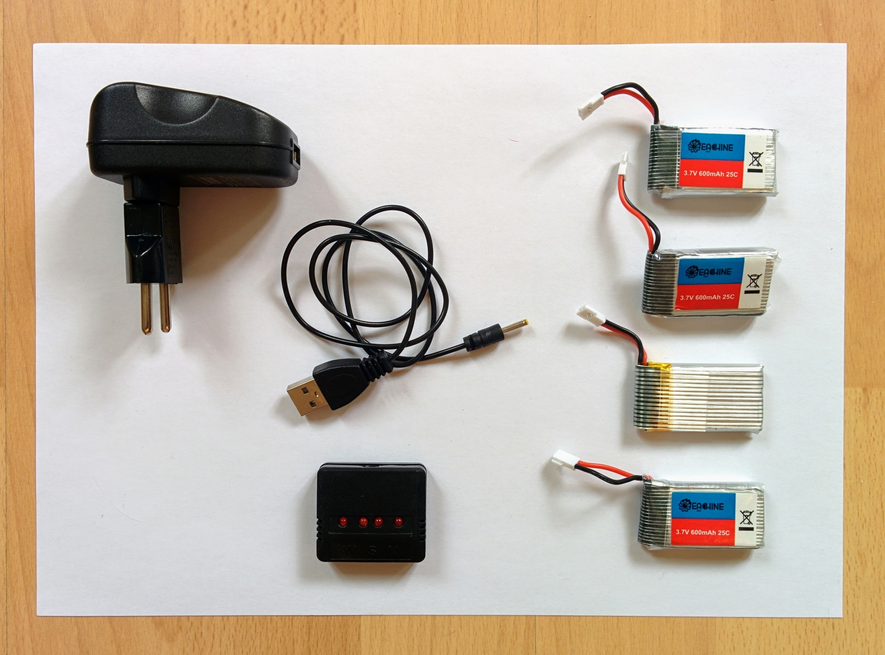
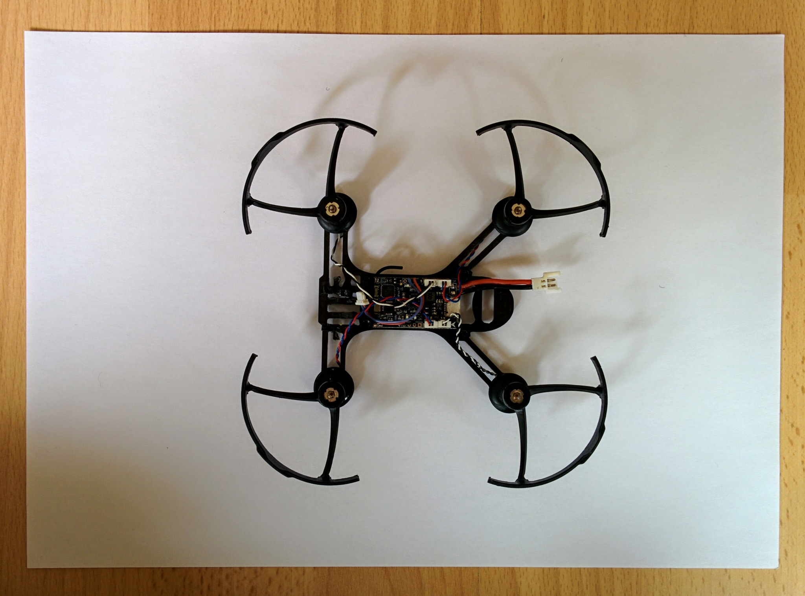
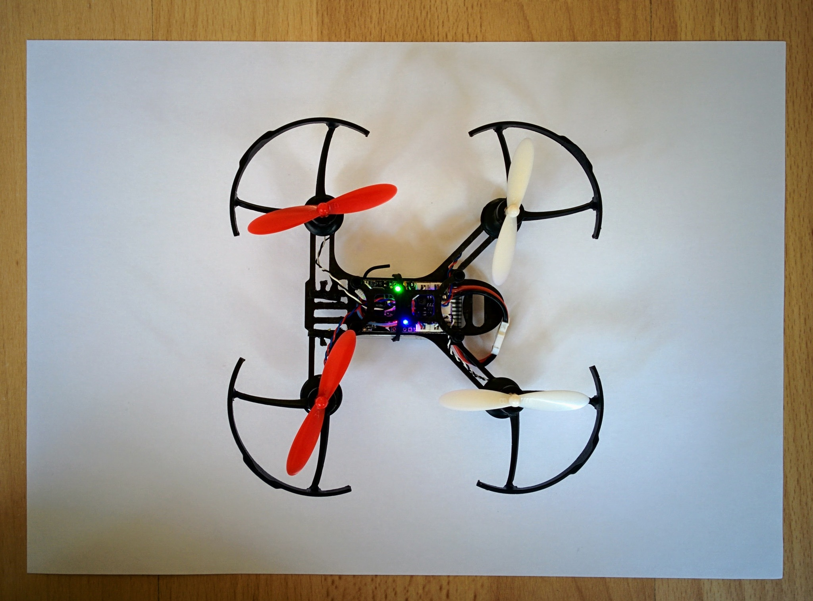
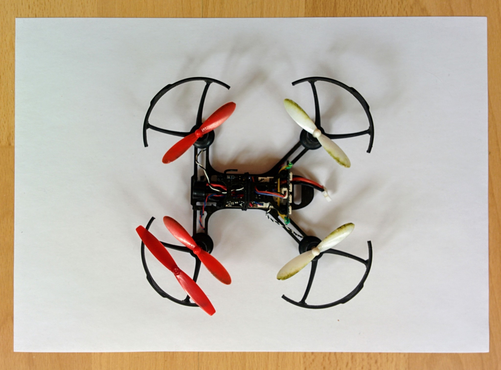
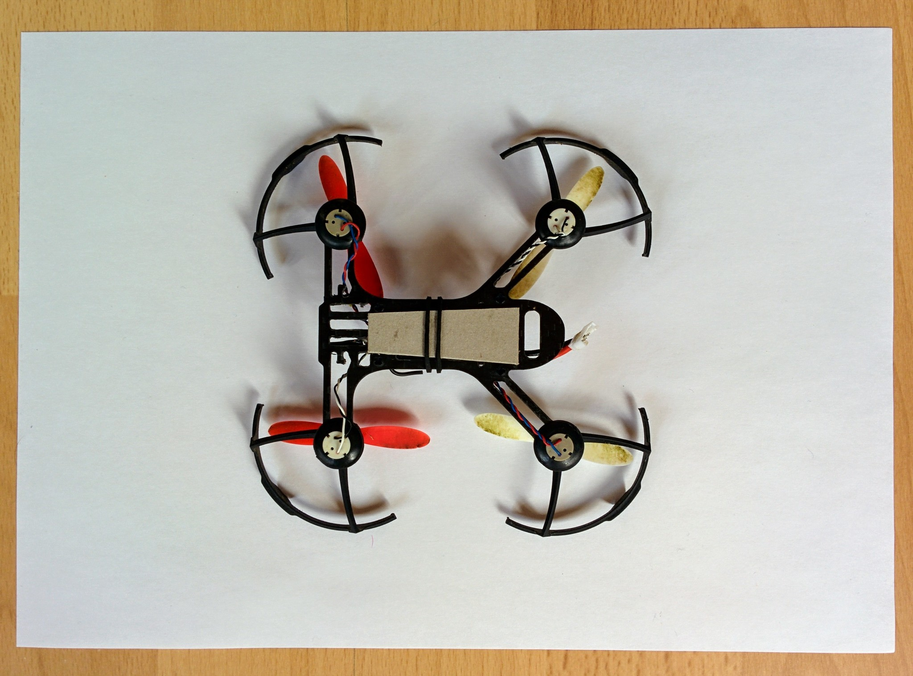
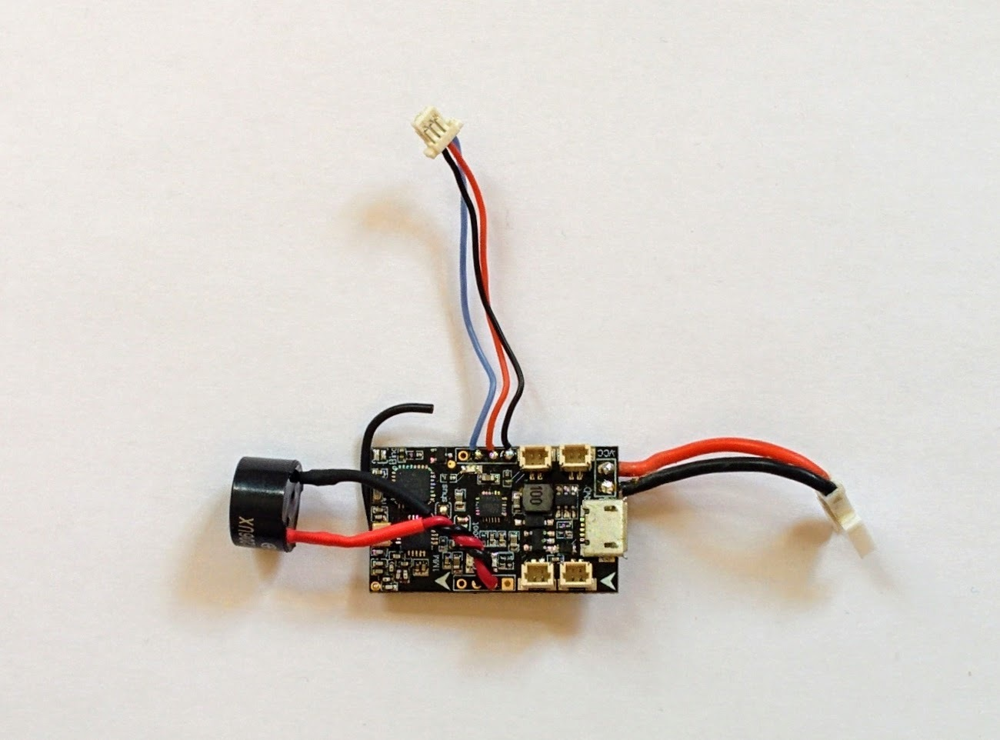
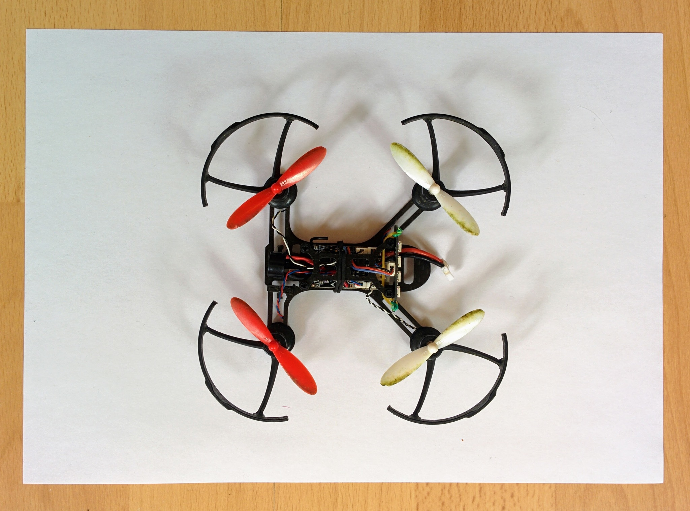
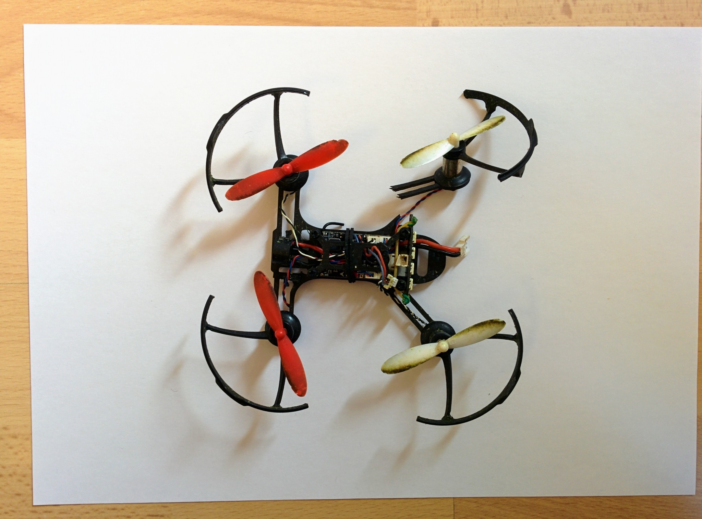
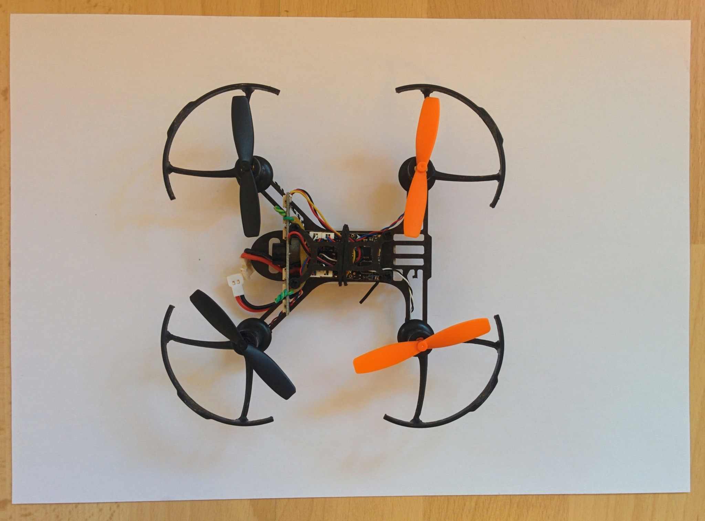

Practising with the Eachine QX95
================================

Nearly every introduction to flying quadcopters tells people to expect frequent crashes when they get started with learning to fly. You have to get used to controlling the two sticks simultaneously and get used to things like [ground effect](https://en.wikipedia.org/wiki/Ground_effect_(aerodynamics)) and so on.

After investing so much time and money in my F450 quadcopter build I didn't like the idea of its first flight ending after seconds with it flipping over, burying itself in the ground and losing a propeller or two in the process (there are no end of videos of this kind of thing on YouTube).

So I thought I'd buy a low end [BNF](https://www.modelflight.com.au/blog/difference-between-rtf-bnf-pnp-arf/) drone that I could control with the same transmitter I intended to use with my main build and which I could learn to fly with without worrying too much about crashing it. Until recently you just couldn't get small cheap BNF drones that you could control out of the box with a heavy duty general purpose transmitter like the FrsKY Q X7 or the X9D+ but this has started to change.

Initially I bought an FPVModel [X-Racer X-1](https://www.fpvmodel.com/x-racer-x-1-diy-combo_g1269.html) after reading a very positive [review](https://oscarliang.com/x-racer-x1-micro-quad/) on Oscar Liang's site. As it turned out it wasn't quite what I wanted - I wouldn't recommend it for a complete beginner - it's very responsive which may be great for stunt flying in confined spaces but for me it meant I just continuously flipped or crashed it. It also really is tiny and its 250mAh battery only lasts 2 or 3 minutes so one has hardly any time to practice between battery changes. The X1 comes with just two batteries, and of course it never occurred to me to buy additional batteries when I ordered it, so after just a few minutes of flight time both batteries would be dead and I'd have to connect them up to the included USB charger and wait for them to recharge.

My second purchase proved far more successful. Eachine are now producing a whole range of small quadcopters that come in a number of variants compatible with different types of transmitters, including FrSKY transmitters like the Q X7. At the moment the range includes the QX110, QX105, QX95, QX90 and QX80. After reading various reviews (like [this one](http://www.drone-maniac.com/test-eachine-qx95-the-best-qx-fpv-brushed-racer/)) I decided on the QX95.

Note: the QX95 has undergone a major revision since the initial reviews. On the initial QX95 models the receiver came as a separate board to the flight controller and was mounted on top of the frame, my model came with the receiver integrated into the flight controller board (so it's now much more neatly packed away within the frame).

The X1 is 64mm from propeller hub to diagonally-opposite propeller hub - the QX95 is noticeably bigger as 96mm from hub to hub. And its larger 600mAh battery lasts noticeably longer - around 6 minutes. This may not sound like much but it's a far less frustrating amount of time to play with than the few minutes of the X1.

So I bought my [QX95 from Banggood](https://www.banggood.com/Eachine-Tiny-QX95-95mm-Micro-FPV-LED-Racing-Quadcopter-Based-On-F3-EVO-Brushed-Flight-Controller-p-1085818.html) for around &euro;62.

_QX95 unboxed_  

In addition to all the obvious bits there are three bits of velcro - one is supposed to be stuck to the bottom of the frame and the others to the batteries. I didn't bother with these - the included black rubberband is more that enough to hold the batteries in place if it's doubled over. That along with the battery connector itself means there's no risk of the batteries coming loose in flight or even during a crash.

There are two spare motors - a clockwise (CW) and counterclockwise (CCW) one - and a set of replacement propellers along with a small plastic wrench for removing propellers.

There's a little USB charger which you can use to charge one battery at a time and there's an adapter so you charge both batteries together if you already have a charger that takes a standard balance connector. However after my experience with the X1 I bought four additional batteries this time and they came in a combo with a cheap little charger - I did all my charging using this charger.

_Charger and additional batteries_  

Unfortunately one of the additional batteries turned out to be a dud. In retrospect, dud battery or not, I think I'd buy the [6 battery variant](https://www.banggood.com/6X-Eachine-3_7V-600mah-25C-Lipo-Battery-With-Charger-for-QX90-QX95-QX80-QX100-EX100-EX105-EX110-X73-p-1105959.html). If you have to travel a bit to get to a nice open space with few people it's nice to have enough batteries for a reasonable amount of flight time.

My short amount of experience with the X1 made me realize how valuable propeller guards are for a beginner. While the guards are part of the X1 basic design they are not included with the QX95 so I bought a [pack of four guards](https://www.banggood.com/Prop-Guards-Protecetion-Cover-For-820-Coreless-Motor-DIY-Micro-Quadcopter-Frame-BlackWhite-p-1094285.html).

You really have to apply quite a lot of force with the small plastic wrench to remove the propellers and then it takes quite a bit of pressure to force the guards onto the tops of the motors as shown here.

_QX95 with propellers removed and prop guards added_  

You may also notice that the FPV camera is gone in this picture. The fun thing here is that you're free to customize your drone as you want. I don't have any of the FPV gear needed to receive the camera signal so as it's bulky and unnecessary I desolderd it (though you could just as well snip the connections to the flight controller board). Note: it's definitely lead free solder on the board so even with my soldering iron set to 425C the solder didn't melt straight away.

It's a shame that you don't seem to be able to buy any of these small drones preassembled without an FPV camera as even the basic [QX95 camera](https://www.banggood.com/Eachine-QX90-Micro-Racing-Quadcopter-Spare-Parts-5_8g-25MW-32CH-VTX-520TVL-CMOS-14-Camera-3-In-1-p-1079391.html) is fairly expensive and constitutes about a third of the overall cost.

I also removed the LED strip as (initially at least) this just seemed like a gimic to me - but as you'll see later I added it back once I realized its value.

Many of the reviews I read commented that the Eachine propellers are notoriously bad - I can't really comment on that (and perhaps they've improved) but having removed the original propellers to put on the guards I replaced them with [propellers from Hubsan](https://www.banggood.com/Hubsan-X4-H107D-FPV-RC-Quadcopter-Spare-Parts-Blade-H107D-a06-p-911713.html).

_QX95 with Hubsan propellers_  

If you look very closely at the image you'll see that the propellers are labelled _A_ and _B_ - this seems to be a standard convention for labelling CW and CCW propellers. The propeller to the left of the nose is an _A_ propeller the one to the right a _B_ propeller, at the rear this order is reversed - rear left is a _B_ propeller and rear right is an _A_ propeller.

These weren't actually the propellers I'd intended to use - in reviews I'd read that Gemfan propellers were popular and well regarded but with the propeller guards in place the Gemfan propellers, that I'd bought, were too large. I picked up the Hubsan propellers at a local store, if I was ordering again from Banggood I'd probably buy [Walkera QR Ladybird propellers](https://www.banggood.com/Wholesale-Walkera-QR-Ladybird-Spare-Parts-Main-Blades-Propellers-QR-Ladybird-Z-01-p-46561.html) which I've seen get good reviews. It's good to have spares - when crashing into grass it's the propellers that take the most noticeable damage as they chop into things.

_QX95 with unused Gemfan propeller_  

My first customization, after going out for my first practice flights, was very high tech! There are small screw heads protruding from the base of the frame - the battery tends to slide around on these scew heads rather than resting nice and flat against the frame so I added a small piece of cardboard that the battery could rest on (the cardboard isn't even even glued in place). In this picture you can already see that the propellers are already quite green - this is a result of them working hard as little lawn mower blades, having frequently crashed into grass.

_QX95 with cardboard base for battery_  

Whenever I crashed my initial X1 I was very impressed at how robust such a little craft was. The QX95 was the same - it crashed repeatedly without incurring damage and I could cut the throttle and just let it drop out of the sky whenever it seemed to be getting away from me or seemed about to crash into me or something else. It survived drops from significant heights without any damage and without anything even popping off. I practised in an area with tough dense grass that provided a lot of shock absorbtion - the results would probably have been rather different over tarmac.

After coming back from my next practice flights I added a buzzer. The QX95 is very small and if it lands some distance away from you it can be hard to find even in short grass. As I'd already removed the FPV camera there was lots of space at the front of the frame for the buzzer. The buzzer is just the standard kind you use in many beginner electronic projects - the important thing is that it must be an [active buzzer](https://electronics.stackexchange.com/a/224442/27099) rather than a passive one.

_Flight controller with added buzzer_  

I used a [WST-1206UX](https://www.digikey.com/products/en?keywords=433-1048-nd) buzzer from Digikey but any 5V rated active buzzer should be fine. Banggood sell suitable little [no-name buzzers](https://www.banggood.com/5V-Buzzer-Alarm-Beeper-With-Cable-for-Eachine-QX70-QX90-QX95-NAZE32-F3-DIY-Micro-Brushed-FPV-Racer-p-1100338.html). On the Banggood product page for the [flight controller](https://www.banggood.com/Eachine-FRF3_EVO-Brushed-Flight-Control-Board-Built-in-FRSKY-Compatible-SBUS-8CH-Receiver-p-1091779.html) you can find detailed images of the board that show exactly where to solder on the plus and minus wires from the buzzer.

Once connected I set up the buzzer flight mode so I could just flip a switch on my transmitter to make the QX95 beep loudly to enable me to find it more easily if it crashed somewhere in the distance.

Having connected the buzzer I found that, in addition to the simple beeper mode, the flight controller beeps to indicate all kinds of things. This is all described in the Cleanflight [buzzer document](https://github.com/cleanflight/cleanflight/blob/master/docs/Buzzer.md) - I found this quite convenient but the buzzer is very loud so it probably quickly gets irritating for those around you!

Note: usually the adhesive foam pads, holding something like this flight controller to the frame, peel off reasonably well and can be reused. The pads on the QX95 however disintegrated when I pulled out the flight controller. I had to carefully scrape the remains of the pads off the flight controller and the frame and then cut new tiny pads, with a craft knife, from the [mounting foam](https://www.unmannedtechshop.co.uk/3m-double-sided-mounting-foam/) that I'd already bought for my main quadcopter build. Afix these pads first to the flight controller rather than the frame, as the foam has to be placed carefully to avoid e.g. the aerial and little resistors and connectors, and then remount the flight controller in the frame.

When I added the buzzer I also added back the LED strip. When you're out flying it's important to be able to see if you're looking at the back of the craft (and if not rotate it until you can see it). The QX95 is very small so even if it's not that far away from you it can be pretty difficult to tell what side you're looking at. The addition of a strip of very bright LEDs makes this much easier.

_Reassembled QX95 with buzzer and LED strip_  

The LED strip comes with foam mounting pads to fix the strip in place on the rear posts of the frame. I pulled off these foam pads and instead held it in place with one of the rubberbands meant for the FPV camera (along with some twists of wire) as this makes it much easier to move the strip when you need to access the USB connector.

I took out the FPV camera on my QX95 which gave me lots of room for the buzzer but if you want to keep the camera then a nice alternative setup, where space is more constrained, is a [combined buzzer and LED strip](https://www.banggood.com/Matek-WS2812B-LED-Board-With-5V-Buzzer-For-Naze-32-Skyline-32-Flight-Controller-p-991715.html) - fitting this though means desoldering the cable for the existing LED strip before fitting the new one (which is all shown in [this video](https://www.youtube.com/watch?v=TihDtgvOLsc&feature=youtu.be&t=41)).

---

Increased the roll/pitch expo from 0 to 0.55 and the yaw expo from 0 to 0.35 as per <http://www.propwashed.com/learning-rate-mode/>.

Painless360 (when working with ArduCopter rather than Betaflight) use rates of 25% and 15% respectively for these values. 

I haven't found anything really good on rates and expos in Betaflight - [this video](https://www.youtube.com/watch?v=sGl7KBfZYZA) explains things a bit but you'd already need to have thought about the linear relationship between stick movements and quadcopter movements that exists before these adjustments are applied. Oscar Liang goes into more details [here](https://oscarliang.com/rc-roll-pitch-yaw-rate-cleanflight/), although his initial screenshot comes from an old version of Cleanflight and this is an area where things have changed a lot (which is reflected in comments and updates in the text).

---

TODO:

* add in [`inprogress-qx95.md`](inprogress-qx95.md) content and work in any relevant information from [`fpv-x-racer.md`](fpv-x-racer.md).
* work in contents of [`cleanflight-settings`](cleanflight-settings).

---

Crash
-----

After much abuse and no end of crashes the inevitable eventually did happen and one of the arms broke off. Initially it just bent but I bent it flat and carried on flying without adding any additional support around this point so after a few more crashes it broke off completely. I was flying it in conditions that were too windy and it struck the ground with enough force to break the arm and more surprisingly, given its relatively protected position, break the connector on the LED strip.

_Broken arm and LED connector_  

Anyone with an ounce of DIY skills or serious drone racing intentions (where accidents and repairs are a day-to-day fact of life) would have repaired the arm. I instead replaced [the frame](https://www.banggood.com/Eachine-Tiny-QX95-Micro-FPV-Racing-Quadcopter-Spare-Parts-Carbon-Fiber-DIY-Frame-Kit-QX95F-p-1094393.html) - a job at least as time consuming as repairing the arm as you have to disassemble the old setup and reassemble things on the new frame.

I took the opportunity to replace the old LED strip with one with an integrated buzzer. Stupidly I desoldered the wires of the old strip from the main PCB - I should have left them there and instead cut off the connector and soldered down the wires on the new strip. While the desoldering worked, the hole for ground became blocked for some reason - repeated application of the solder sucker didn't help and no matter how much I heated the solder I couldn't force the new ground wire through the hole. Eventually I just soldered the ground wire to a blob of solder on top of the hole. There was no issue with the power or signal holes or with the holes for the buzzer wires.

In the end it all worked out and also I replaced the much battered Hubsan propellers with Walkera propellers.

_Resurrected QX95 with new LED strip (with integrated buzzer) and Walkera propellers._  

TODO: the Walkera propellers aren't nicely labelled, it turns out that for each color one is CW and one CCW  - you have to work out which motors are CW and which CCW (from the color of their wiring) and then visually work out which propeller of each pair is CW and which CCW and pair things up appropriately - I'm sure I've commented on how to do this elsewhere so search or maybe it's in the links page.

Battery charging
----------------

As I'd bought a somewhat more high end balance charger for my main drone project I wanted to be able to use it to also charge the small 1S batteries that are used with the QX95.

TLDR; forget about your balance charger and just use a super cheap charger, like [this one](https://www.banggood.com/X6-6-In-1-Charger-For-Hubsan-X4-WLtoys-UDI-JXD-JJRC-Syma-JXD-p-965757.html), that's specifically designed for charging these batteries.

You can get balance cable, like [this one](https://www.banggood.com/Wholesale-Balance-Charging-Cable-For-Walkera-Wltoys-Hubsan-X4-Eachine-H8-p-51891.html) from Banggood, that can be used to connect up three of the small batteries used by the QX95 to a balance charger so that they appear as a single 3S battery to the charger.

The Banggood cable comes with a JST connector for connecting to the charging port of the charger - if you have a charger like the S60 that uses banana connectors then you'll need an adapter. The small red JST connector involved here is often also called a BEC connector - so if you search on eBay for "[banana to BEC](https://www.ebay.com/sch/i.html?_nkw=banana+to+bec)" you should find the right thing (searching for "[banana to JST](https://www.ebay.com/sch/i.html?_nkw=banana+to+jst)" turns up some appropriate adapters but also turns up more things that aren't what's required here).

In searching for something that could handle could handle more than three batteries I came across this [Reddit thread](https://www.reddit.com/r/Multicopter/comments/2sm378/how_can_i_charge_5_x_240mah_batteries_for_my/) that suggests getting a parallel cable like [this one](https://www.banggood.com/Wholesale-Walkera-Hubsan-X4-Eachine-H8-1-to-5-Balance-Charging-Cable-For-3_7V-Battery-p-68437.html) from Banggood.

It comes with connectors for attaching 5 batteries plus a JST connector and a female micro Losi connector. The female micro Losi connector is a little odd - it actually allows you to take 6 of these cable setups and plug five of them into the battery connectors of the sixth so allowing you to wire up 25 batteries in total. So assuming 5 batteries are enough you can ignore the female micro Losi connector and just connect up the JST connector to your charger (again using a JST to banana adapter if necessary).

Despite Banggood calling this cable setup a balance charging cable it's actuall a parallel charging cable. I ordered one of these and it was only when it arrived that I realized it couldn't be for balance charging and went back to the Reddit thread where they do clearly describe it as a parallel charging cable. So what's parallel charging? It's explained in detail [here](http://www.electricrcaircraftguy.com/2013/01/parallel-charging-your-lipo-batteries_22.html) and in less detail but more clearly by Oscar Liang [here](https://oscarliang.com/parallel-charging-multiple-lipo/).

One important constraint is that the batteries all be similarly discharged (Oscar Liang says they should all be within 0.1V). This is an issue given how I fly my QX95. As it has no voltage alarm I just fly it until it's ability to lift in response to the throttle drops off - so given this imprecise stopping point some of my batteries are off from others by more than 0.1V. It is possible to handle this by measuring the voltage of all the batteries and ordering them according to voltage as described in the video accompanying the first parallel charging explanation that I linked to.

In the end this all seemed like way more trouble than it's worth - so as stated above I'd recommend using a cheap charger that's designed for these small 1S batteries. And if I was determined to use my balance charger I'd stick with the proper balance cable for just 3 batteries rather than trying parallel charging.

For a nice explanation of why the LEDs on these cheap chargers flash in such an apparently eratic manner (particularly at the start of charging) see this [explanation](https://www.amazon.com/gp/customer-reviews/R1HD6C8F2H4C1E/) provided by a reviewer of a similar device on Amazon - in short it doesn't reflect defective behavior.
