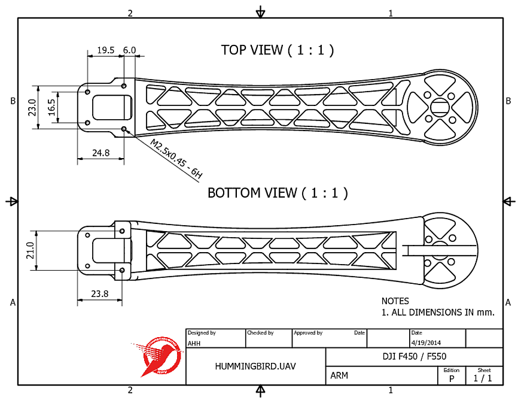
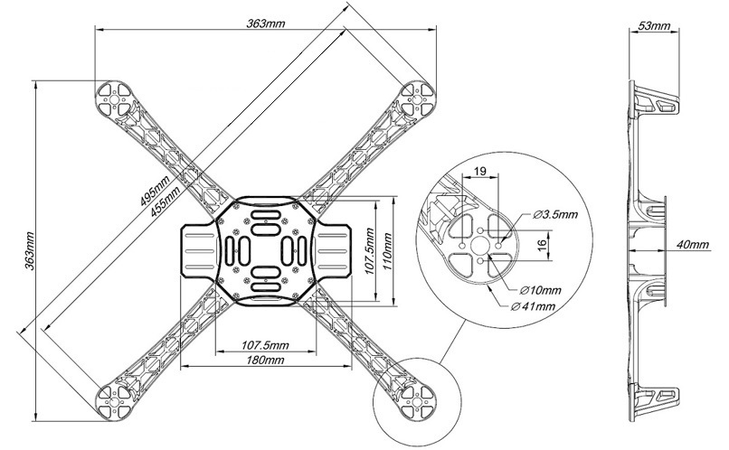
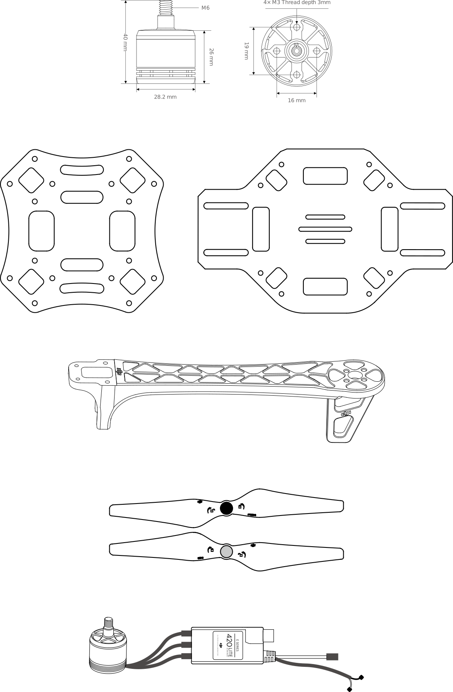

F450 dimensions
===============

There don't seem to be any comprehensive technical drawing for the F450 frame.

This page contains the best details I could find.

There is a nice technical drawing of the leg produced by [Hummingbird.UAV](https://vimeo.com/hummingbirduav/about):

Just the dimensions for the "head" of the arm seem to be correct - the arm itself seems to be somewhat squashed length-wise.

Note: Hummingbird.UAV is a private individual who produced this image after-the-fact, i.e. this is not an original drawing used to produce the arms.

The next picture is for the HJ450 - a very close copy of the F450 produced by [Xin zhenhua Trading Co.](http://www.wtotoy.com/showproducts_431.html) and available from e.g. the [HKG store](http://stores.ebay.com/HKG-store?_dmd=2&_nkw=hj450):

While the top and bottom plates are noticeably different from the F450, e.g. three slots rather than two in the protruding nose and tail areas, the overall dimensions are nearly identical.

The following drawings were extracted from the [F450 user manual](http://dl.djicdn.com/downloads/flamewheel/en/F450_User_Manual_v2.2_en.pdf):

  
_This is a PNG - click to see the original SVG._

Note: while these are nice vector graphics they don't seem to be millimeter perfect (with the exception of the motors).

Finally I produced an outline combining the base plate from the user manual and an outline of the arm traced (by Inkscape) from the Hummingbird.UAV picture (and stretched to be the correct length):

  
_This is a PNG - click to see the original SVG._

This was done quite quickly and it would be fairly easy to produce something more millimeter perfect with a little more effort.
