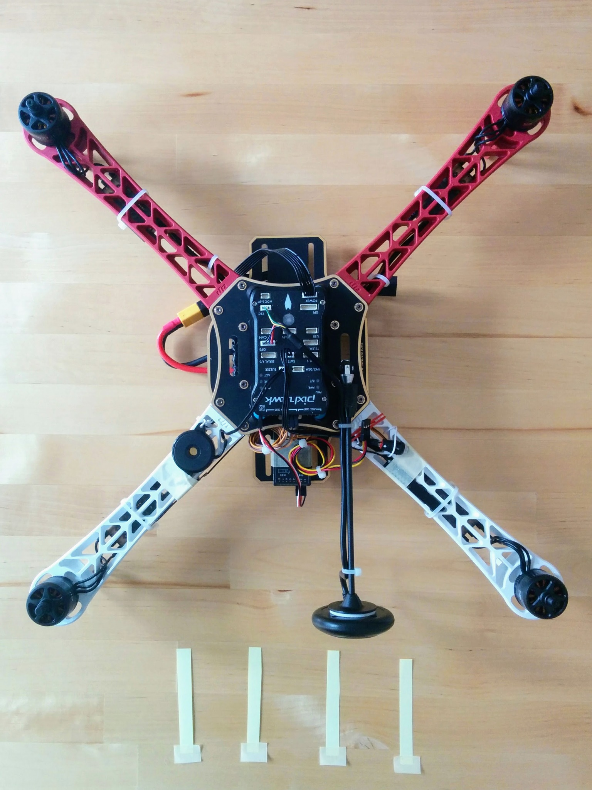
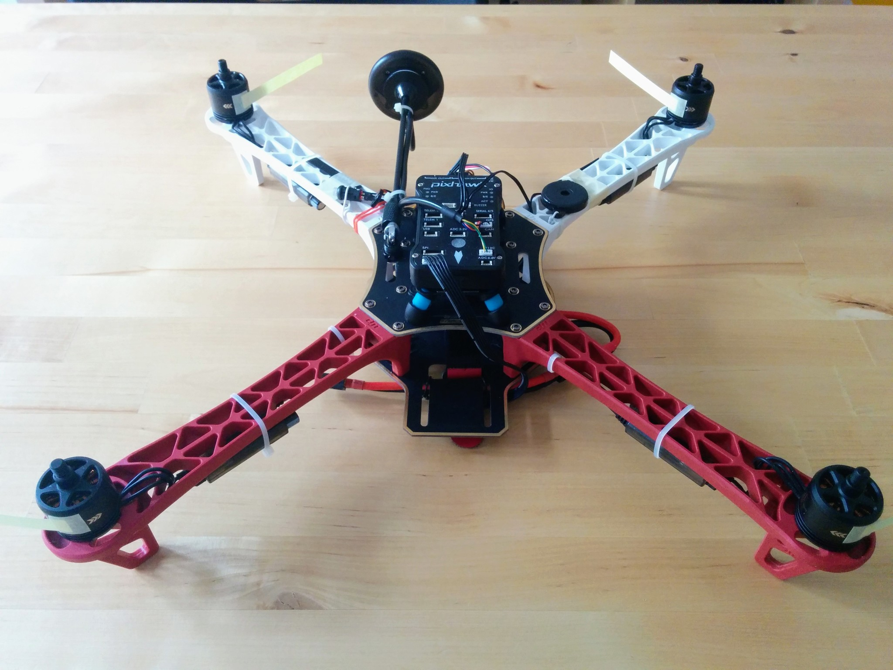
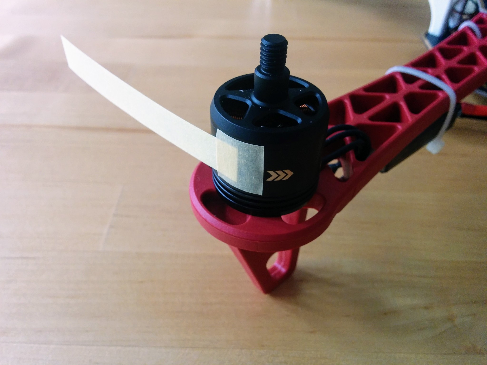
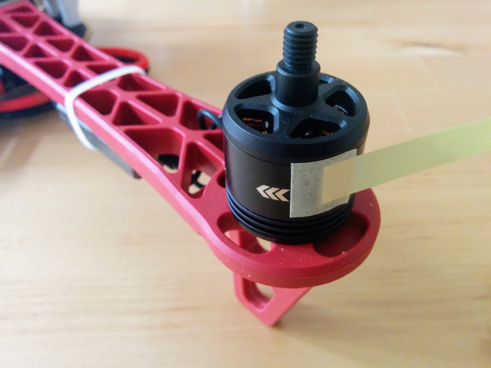
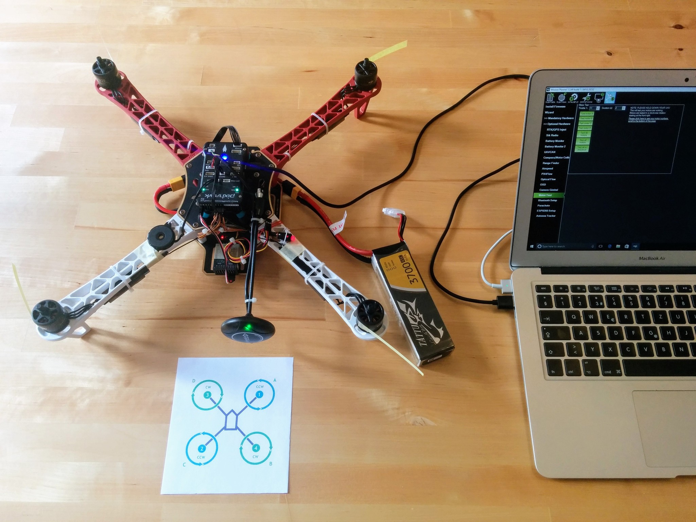
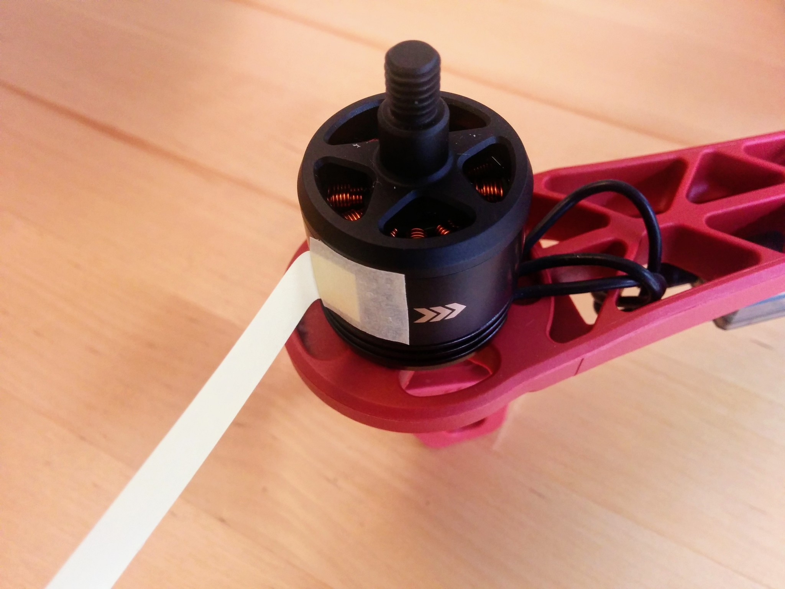
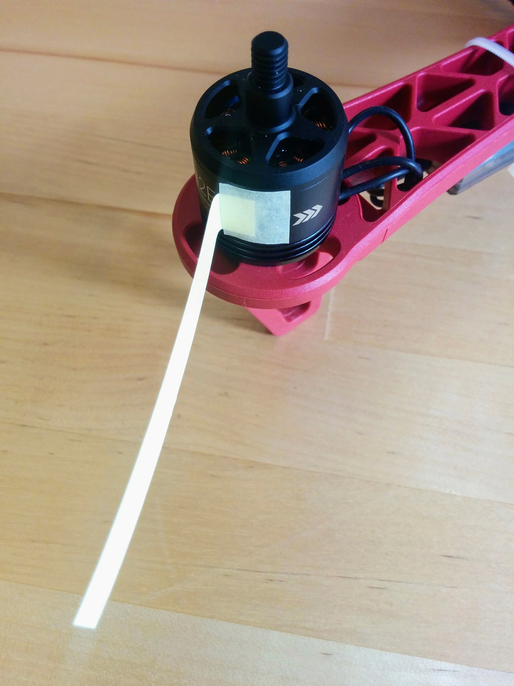

Final assembly
=============

First pass at final assembly. Next add in the comments included with the photos in Google Photos. Rename the image files to more informative names. Then work in all the Post-its etc.

Order:

* GPS mast base.
* Damping platform.
* ...

Many of the images here can probably be discarded.

_01._  

_05._  

Note: some of the tops didn't come with a 3M double sided mounting pad.

Move 05. down to 08 below out into a separate page.

_06._  

_07._  

There's little gained in showing any of these bases (except perhaps the FCMODEL) from other angles.

_55._  

An M3x10mm bolt, a 3.2x8x0.8mm washer and an M3 [locknut](https://en.wikipedia.org/wiki/Locknut) for attaching a four-screw-hole style GPS mast base to the F450 top plate. The bolt here is 10mm which is a little long, 9mm would be perfect and 8mm would be too short.

_09._  

The inner slot is much wider than the outer and you'd need washers with a larger diameter than typically come with the 3.2mm hole size that matches our bolts.

_03._  

You'd have to snip off the inner "loops" of the base rather than let them extend under the damping platform.

_08._  

_04._  

Use masking tape to see how the base will sit relative to the top plate and to confirm that how you layout the VHB tape on the damping platform base won't leave any tape entirely over a hole or on top of a bolt head.

Note: the damping platform base has mounting holes and comes with bolts but even if you wanted to you couldn't drill the top plate so that you could bolt it down as the mounting holes end up directly over the plastic ends of the arms.

_11._  

_12._  

The platform designed specifically for the Pixhawk, rather than the APM, has a slightly wider base which mean the feet would be over bolts - but this wouldn't cause an issue as unlike the other platform the rubber XXXs don't extend below the bottom of the platform's base plate.

_13._  

VHB neatly cut to the desired lengths and widths with the help of parchment paper. I can't conclusively say, without some lab analysis, that the parchment paper had no detrimental affect on the VHB tape, but it would seem not - I could lift the entire craft (including battery) by the vibration damping platform without the tape giving way.

I didn't sand any of the surfaces but I did make sure they were very clean using isopropyl alcohol. I did this here for the plates of the damping platform and for the top F450 plate and the underside of the Pixhawk that the platform is attached to. I did it also for the GPS module and the GPS mast head that it is stuck to and for the end of the mast and the bottom socket that it's plugged into (before applying epoxy glue).

I did buy sandpaper but only used it on the end of the GPS mast (before glueing it into its socket), in other situations I forgot to use it (e.g. here with the damping platform). Apparently the most important things with VHB tape are having clean surfaces and applying as much pressure as you can when sticking surfaces together.

For a nice article on getting the most out of VHB tape see [this](https://www.headphonesty.com/2017/06/how-to-10x-3m-vhb-tape-adhesiveness/) on Headphonesty.

I bought sandpaper with a [CAMI 400](https://en.wikipedia.org/wiki/Sandpaper#Grit_sizes) grit size (KWB [830-400](https://www.kwb.eu/de/detail/index/sArticle/2950698/sCategory/3131985) paper) - for no better reason than this was the finest sandpaper at the hardware store before one got into what was classed as ultra fine (where it was hard to feel any abrasiveness).

None of the surfaces involved, e.g. the plastic of the damping platform here, reacted badly to isopropyl alcohol but in the case of the Pixhawk and GPS module I took care to make sure it didn't come near to any of the electronics and didn't spray it on directly to devices containing electronics.

Some portions of the VHB tape end up over holes in the F450 top plate once attached. I did plan to apply talc to exposed portions like this - to avoid random gunk getting stuck to them over time - but forgot, by the time I remembered too much assembly had been done for it to still be easy to get at these areas anymore.

Note: when stripping down and rebuilding look at how feasible it really is to talc these points - maybe they're impossible to get at.

One thing to take into account when applying VHB tape to the lower half of the platform is the position of the bolts on the top F450 plate (that hold on the arms). In the photo below the large pieces of VHB tape at the top and bottom of the lower platform are shorter left-to-right than they might be - this is in order to avoid those raised bolt heads.

_14._  

_15._  

_02._  

_16._  

TODO: move above two pictures of the other damping platform (and probably some of the other stuff here) into [`vibration-damping-platform.md`](vibration-damping-platform.md) and note that the rubber feet of this platform end up sitting on bolt heads on the F450 top plate - the rubber feet and the raised bolt heads combine to form a gap between F450 top plate and damping platform underside of about 2.5mm (of this a tiny bit more than half is the foot) which makes the gap too big for standard VHB tape.

_17._  

_18._  

Added GPS base. The GPS mast is tall enough that when it's lying flat backwards you can no longer tip the craft onto its back legs to get at the underside (instead you have to tip it onto its right or left side). In retrospect I'd place the base more towards the middle/front so there wasn't this problem or cut the mast length down by one or two cm.

TODO: add picture of washer and split washer, i.e. the bits that didn't come with the mast.

TODO: mark out photos that were taken later to fill in things that had been missed, like using the socket driver via the lower plate slot, and are out of sequence.

_[*] 56._  

Used 5.5mm socket driver - hole in bottom plate makes it easy to get at the bolt but should have done it before mounting anything else.

_[*] 36._  

Important: we need to make sure to keep the left/right cavity free of obstructions so that the battery can be slid in easily - if the nut holding the GPS mast in place descended a few millimeters more it would be a problem.

_19._  

Arrow facing forward - upside down relative the DJI branding on top plate.

_20._  

---

Mast setup part 1 (of 2).

_21._  

Above the GPS base before insertion of mast with epoxy.

_22._  

Above the GPS base after inserting mast with epoxy. Excess epoxy cleaned off with tissue. Note: epoxy is very toxic, do not get in eyes and clean off skin.

Doing the epoxying at this stage meant I could get leaving this to dry overnight out of the way at the same time as clamping the Pixhawk. In retrospect I'd leave the Pixhawk clamped one evening and do the rest of the assembly the next day, doing the mast setup as the last part (see below where I add the GPS module itself - both this and adding the mast here were done prematurely). I'd add the GPS module to the top component of the mast as one of the last steps on the next day and have everything else ready (mast cleaned and base cleaned and lower mast end sandpapered) but only do the actual epoxying before going to bed.

So I'd move attaching the base of the mast to be the very first thing I do (before attaching the damping platform) but move everything else to do with it to the end.

Here I used a suitable UHU epoxy but I later bought [J-B Weld epoxy](https://www.amazon.co.uk/dp/B0006O1ICE) as (like 3M VHB tape) it seems to be considered a standard component of the drone builder's toolkit and is noted for creating extremely tough and robust bonds.

---

I just used a ??? metal plate (have a look in Migros and see what it's called and get it's dimensions) on top of a piece of cardboard (for a bit of padding between the metal plate and the Pixhawk) so that the clamps didn't press down directly on the fairly flimsy case of the Pixhawk.

_24._  

Pixhawk gently clamped down and GPS mast expoxied into base and drying.

_25._  

_27._  

Buzzer and safety button wired on and plugged in. I wired down the buzzer via its mounting holes rather than e.g. trying to attach it by its back to the frame with Blu Tack - as noted previously the back isn't attached very strongly to the rest of the buzzer.

_28._  

Note: in retrospect I wouldn't plug in the buzzer and safety switch as this makes resting the craft upside down impossible. I'd have just taped them down with masking tape to keep them out of the way.

_29 RX in place._  

RX and antennas taped down and RX plugged into Pixhawk.

_30._  

These photos of the RX fail to capture where the servo cable is plugged in - this is much clearer in image 53 (which also shows the ESC control cables much clearer).

_31._  

Routed front "control" wires via underside. Note: I've redone the front cable tie so both power and "control" wires are tied. Note: I couldn't find a definite correct term for the ESC "control" wires/cable.

_35._  

"Control" cables taped down.

In retrospect I'd do the battery test with the solder pads temporally insulated with insulation tape. After this I'd feed the front ESC wires back like this and permanently tape down the middle portion of these wires with tape and then cover the solder pads (and the ends of the tape) with black Sugru (smoothed out with soapy finger tips). Then I'd look at pulling all the "control" wires up to the middle rear of the top plate, possibly temporally taping them in place. All this as part of the soldering section - with the intension then in this section of coiling all four wires into a single coil and connecting them to the Pixhawk before connecting anything else, i.e. before buzzer and safety switch. Whether a single coil works out better than two, as here, remains to be seen.

Covering the main power connector though with Sugru would make it hard to add extra power cables later, e.g. for transmitter, camera and SiK radio (or is powered via Pixhawk?).

_32._  

ESC "control" wires ready to be plugged in, with numbers clearly showing.

_33._  

ESC "control" wires plugged into Pixhawk.

_34._  

_[*] 53._  

---

Mast setup part 2 (of 2).

_23._  

While the bottom end of the mast is glued into the base the top end is attached to the top plate (above) using a both (that requires a 1.5mm wrench).

Important: when screwing on the plate holding the GPS module to the mast the most important thing is to make sure the arrow on the module is facing exactly forward like the arrow on the Pixhawk.

_37._  

GPS module (and compass) attached to mast.

I would have liked a Coke can as a scale reference but it seems, other than Redbull sized cans, cans have been completely replaced by PET bottles (at least in Switzerland). And then there's the metric/imperial issue anyway - cans in Europe are 330ml while in the US they're larger at 355ml (12 US fl oz).

As noted above in part 1 of the mast setup this was all done a bit prematurely.

_38._  

GPS module plugged into Pixhawk.

_[*] 54._  

---

_39._  

Battery strap added. Initially I placed the power module over the hole it goes through without taking it into account.

_40._  

Power module taped and wired down. And plugged into PDB.

_41._  

Power module plugged into Pixhawk 1. I want to keep the front area clear for a camera so I routed the cable around the side rather than through one of the slots. This could be cropped much better to focus on power module cable.

_42._  

Is there a better term than "anti-slip mat"?

_57._  

Battery and silicone mat.

_58._  

Silicone mat on battery.

_47._  

Battery in place.

_48 Overlong battery strap._  

Battery strap done up. At 30cm it's at least 4cm too long. Bought 26 and 25cm later and 25cm was perfect. Move up pictures of these from later.

---

51, 52 and 43 can probably go.

_51._  

Safety red - battery not yet plugged in.

_52._  

Safety red - battery plugged in.

_43._  

Partially inserted motor wires - above and below.

_44._  

_Motor test._  

The motor test does _not_ require a GPS fix or the ability to arm but the safety must be off/red.

TODO: explain that I say safety off I mean the safety switch has been pressed and gone from flashing to solid red.

When you press a button you're usually turning something on. However pressing the safety switch turns the safety off - the safety switch flashes red initially and when you press it it goes solid red. Solid red essentially means that the motors are unlocked and that the propellars may turn. Turning off the safety is a precondition for another step - arming. Arming relates to the flight controller - before arming can occur the flight controller must be ready and a number of pre-flight conditions must have been met - these include the already mentioned safety being off and e.g. that a GPS lock has been acquired. Arming is done via the transmitter and involves holding the throttle down and to the right for five seconds.

The temptation once the craft is fully assembled is to immediately plug in the battery and see what happens - the answer is that it'll make an awful racket and not much else.

The battery powers both the flight controller and the ESCs, and the ESCs will beep continuously until the flight controller is ready and the safety is off.

USB from your computer however powers just the flight controller, so to avoid all this noise it's better to first power the system via USB, so the ESCs are off initially, let the flight controller start up and then press the safety switch. Once the safety switch is solid red the system is in a state where the ESCs will be silent when the battery is connected (they'll just make an initial cheerful beep).

### Motor testing

So when the system is ready as described connect a battery so the ESCs are powered and we can test the motors. When we soldered the PDB we continuity tested everything and then connected the battery to test that we heard each ESC making a noise (the racket mentioned above). So unless something is seriously wrong all motors will turn - what needs to be tested and corrected if necessary is the direction the motors turn.

Despite being labelled CW and CCW the motors can actually rotate in both directions but rotating against its intended direction isn't good for the motor (and the craft won't fly and the self-locking propellars won't lock if any motor is turning opposite to its expected direction).

TODO: do I have a link on why turning counter to the intended direction is bad for a motor?

TODO: is it only at this point that I plugged in the motors - or was it done earlier? Probably best to do it here - in which case modify the next paragraph.

When we plugged each motor into its ESC we plugged in the wires in no particular order - it turns out that any order is fine to get the motor to turn and that switching any two wires will reverse the direction of turning. So all motors should turn but we have to check each in turn - if the initially wiring order for a given motor causes it to turn opposite to its intended direction then we must correct this by swapping any two of the motor connectors plugged into the ESC, e.g. just swap over the left and the right connectors (leaving the middle one as it is).

If this sounds a little odd then see XXX - you just need to understand a little about how brushless motors work and then works through some simple maths, called necklace combinatorics, to see why this works.

I found that even at their lowest speed the motors turned too fast for me to be able to easily see which direction they're turning. So I cut out little paper streamers and attached one to each of the motors with masking tape - with the streamers attached, as shown in the photos, behind the arrow heads on the motors that indicate the intended turning direction. If you attach each streamer like this then it should flatten down nicely against the body of the motor if the motor turns in the intended direction, if the motor turns in the wrong direction it'll turn so fast that the streamer will still flatten againt the motor body but when it stops turning you'll see that the streamer has been ripped backwards.

If you've powered up things as described above, i.e. via USB, turned off the safety and connected the battery then everything is ready for testing. Just start up Mission Planner, press _Connect_, go to the _Initial Setup_ view, expand _Optional Hardware_ and select _Motor Test_. For whatever reason the motor test does not use the 1, 2, 3, 4 motor labelling used everywhere else but labels the motors A, B, C, D (starting at the front right and going clockwise).

Note: as described elsewhere batteries are stored at a storage voltage - this is about 3.85V per cell - i.e. well above voltage that you should stop flying (around 3.3V, 3V being the danger point for LiPo batteries). So even new batteries that have never been charged should be at about this voltage (you can check with the voltage sensor) and have more than enough charge for these tests.

So print out the little arm numbering/lettering diagram we already used earlier, when labelling the ESCs and attaching the motors to the arms, and let's go through each motor in turn.

Under _Motor Test_ you'll see two fields, _Throttle_ and _Duration_, that are initially set to 5% and 2 seconds respectively - so when you e.g. press _Test motor A_ it will apply 5% throttle to motor A for 2 seconds. Try it - you'll here a low pitched beep from the relevant ESC for two seconds and then a quick higher pitched beep at the end (as the throttle drops back to zero) but worryingly the motor won't actually turn. This is simple to resolve - the motors won't turn at all until a certain minimum throttle value is reached and it turns out 5% is too low - just increase the throttle value and retry, in my case I had to raise it to 17% before the motors would turn.

Once the throttle value is high enough and the motors turn, go through each motor in turn and see that it turns in the required direction, i.e. look at how the streamers behave. If a given motor turns in the required direction then just move onto the next one, if it doesn't just swap over two of the connectors plugged into the ESC - this will always reverse the direction but restest anyway to confirm that everything is plugged in properly and you see the expected behavior.

Once you've gone through all four motors and got each turning in its required direction the craft is now essentially ready to fly.

TODO: the next line says now is a good time to recalibrate - but it is it? If the motor test is done before the GPS mast is epoxied in then probably not.

Now is a good time to recalibrate, i.e. with Mission Planner still connected go to _Initial Setup_, click on _Wizard_ and redo the frame selection, accelerometer and compass steps - that's all that's needed, once you've completed the compass step you can close the wizard. As noted when doing the calibration the very first time, the new calibration only actually comes into affect after the Pixhawk is restarted.

When doing the calibration you should have the mast up and everything else in place as it will be in flight. Whether this makes any serious difference is hard to tell (see the next) section and its probably fine to leave the propellars off (as they make turning the craft on its sides much harder).

TODO: add note that after 90 days the VM still works but you can't run it for more than 4 hours - after 4 hours it shuts itself down. I couldn't find anything that said it should behave like this but this is the behavior I observed and I'm _assuming_ the license expiring and this behavior beginning are linked.

The resulting `.param` file for my setup after this recalibration can be found in [`ready-to-fly.param`](ready-to-fly.param).

### Affect of physical components

I tried to determine what settings were affected as a result of the Pixhawk now being part of the ready-to-fly craft and then what settings were affected by:

* Having the GPS mast up or down.
* Having the battery (with voltage sensor) in place or not.
* Having the battery plugged in or not while in place.
* Having the propellars on or not.

Unsurprisingly nothing has an affect on the radio calibration - so you only need to redo the accelerometer and compass calibration steps.

The accelerometer calibration affects the parameters:

* `AHRS_TRIM`
* `INS_ACCOFFS`
* `INS_ACCSCAL`

The compass calibration affects the parameters:

* `COMPASS_DIA`
* `COMPASS_ODI`
* `COMPASS_OFS`

Note: these aren't the full parameter names, there are `X`, `Y` and `Z` variants for most and device 1 and device 2 variants for some, e.g. accelerometer 1 and 2.

Most of these values, with the exception of `INS_ACCSCAL`, changed noticeably with recalibration but they also changed noticeably on every recalibration whether the setup had been changed or not. So it wasn't possible to isolate if any of the above factors (the presence of the battery etc.) was relevant or not.

Some of the parameters do look like they're more affected by changes than others, e.g. `AHRS_TRIM`, but the data wasn't clear enough to draw any solid conclusions without a lot more work.

Note: the `GND_ABS_PRESS`, `INS_GYROFF` and `STAT_BOOTCNT` values are updated everytime the Pixhawk restarts and the `STAT_RUNTIME` updates continuously so any changes seen in these values is not related to calibration.

If your interested you can see the relative difference (as a percentage) for parameters between uninstalled and fully setup in [`uninstalled-installed.txt`](param-changes/uninstalled-installed.txt) and between two recalibration runs with the same setup in [`rerun.txt`](param-changes/rerun.txt).

The relative difference was calculated as `|x - y| / max(|x|, |y|)` (as per Wikipedia [relative change and difference](https://en.wikipedia.org/wiki/Relative_change_and_difference)).

### Brushless motor and necklace notes from keep.google.com

From bookmarks:

* http://www.rcuniverse.com/forum/rc-electric-off-road-trucks-buggies-truggies-more-147/8359705-what-purpose-three-wires-brushless-motor.html - idiots and intelligent people
* https://www.reddit.com/r/Multicopter/comments/2afixg/can_someone_explain_esc_wiring/
* https://en.wikipedia.org/wiki/Electronic_speed_control#ESC
* https://en.wikipedia.org/wiki/Brushless_DC_electric_motor#Controller_implementations

#### 1.

How can it be that plugging the cables in in any order gets the motor to go in one direction and then swapping any two of the connections gets it to go in the other?

If you're a math nerds then you can think of the connectors as three distinct beads on a necklace, if you take all rotations as equivalent then the number of orderings is 3!/3, i.e. just 2 (see the [necklace example](https://en.wikipedia.org/wiki/Necklace_(combinatorics)#Necklace_example) in the Wikipedia Necklace (combinatorics) article). So if you plug in the connectors in any order it should be clear that you can then achieve the second (and only other) ordering by swapping any two of the connectors.

At the risk of laboring the point let's go through the permutations - it's really quite simple.

Essentially the motor has three phases 1, 2 and 3 and it doesn't matter which phase we start on - we just need to get a sequence going.

So the sequence 1, 2, 3 and its rotations 2, 3, 1 and 3, 1, 2 are equivalent - we don't care which phases comes first.

If we reverse the sequence the engine will run in the opposite direction, so reversing 1, 2, 3 we get 3, 2, 1 and its rotations 2, 1, 3 and 1, 3, 2 (which similarly are equivalent).

We can get to 3, 2, 1 from 1, 2, 3 by just flipping 1 and 3 - this is equivalent to flipping two wires on our motor.

What other flips can we do on 1, 2, 3? We can flip 1 and 2 to get 2, 1, 3 - which we see is just one of the rotations of 3, 2, 1, and if we flip 2 and 3 we get its other rotation.

I.e. any flip in the ordering 1, 2, 3 results in the reverse ordering or one of its rotations - the same holds true for flips done on the rotations of 1, 2, 3.

In short - of the six permutations half correspond to turning CW and half to CCW and switching any two connectors moves you from the CW half to the CCW half or vice-versa.

#### 2.

This trick only works due to a neat bit of combinatorics and the fact that we only have three phases and not more. The ESC has a clear ordering of phases but we don't care if the phases are rotated by how we connect up the leads, we just care if they're reversed.

#### 3.

You might think that as there are three wires there must be six possible permutations - so how can it be fine to just plug then in any old way and then just switch any two of them if the motor turns the wrong way?

There are indeed six permutations, but half of them correspond to turning CW and the other half correspond to turning CCW and it turns out that switching any two wires is guaranteed to get you from a CW permutation to a CCW permutation (and not one of the other two CW permutations) and vice-versa when going from CCW to CW.

This is a case of necklace combinatorics, the three CW permutations are just rotations of each other, as are the CCW ones. To understand why this is the case you need to know a little about how brushless motors work - see X and Y. Then if the Wikipedia necklace combinatorics page is clear you can just look at the three possible swaps on each of the six permutations and you'll quickly see you always get from a CW permutation to a CCW one and vice-versa.

---

_45 Getting a GPS fix._  

_46 "wind flags" in place._  

_49 Tools and materials used in assembly._  

_50 Voltage sensor in place._  

Voltage sensor attached to frame. Note: plug sensor cable into RX, coil up and cable tie _before_ taping down RX and make sure RX is far enough forward that sensor cable doesn't poke into battery strap. Move note about plugging in S.PORT cable up to where you taped down the RX.

The FrSKY FLVSS sensor can handle any battery with a balance connector from 2S up to 6S. On one side you have six pins, one of which is marked GND - if you have a 4S battery then its balance connector should be plugged into this pin and the next four pins (leaving the last two pins unconnected). The balance connector should be plugged in so that it's final red power wire should be the furthest away from the GND pin. On the other side of the sensor you have a 3x2 group of pins - you can connect the cable from the receiver to either the top or bottom set of three pins, it doesn't matter which you choose, and the other three are free for daisy chaining additional sensors. The little graphic beside these pins shows which is are signal, power and ground - make sure to connect the yellow signal wire, red power wire and black ground wire from the receiver accordingly.

Note: older FLVSS used to have yellow text for the total battery voltage and cyan text for the individual cell voltages, while newer ones have white text for all values.

Note: the little black and white one page printed manual that came with my FLVSS sensor incorrectly showed the signal pin of the sensor connected to the ground pin of the receiver's Smart Port (and the ground pin of the sensor connected to the signal pin of the receiver), this is corrected in the online color PDF [manual page](https://www.frsky-rc.com/wp-content/uploads/2017/07/Manual/FLVSS.pdf).

---

_26._  

One way catches - not clear in photo.

Straps
------

* <https://www.banggood.com/10PCS-26cm-Eachine-Lipo-Battery-Tie-Down-Strap-p-1137622.html>
* <https://www.banggood.com/RJX-HOBBY-Magic-Tape-Tie-Down-Strap-for-RC-Battery-p-1134012.html>
* <https://www.banggood.com/RJX-Hobby-Magic-Tape-Bulletproof-Vest-Material-Tie-Down-Strap-for-RC-Battery-p-1153171.html>
* Silicone - <http://www.rjxhobby.com/rjx-rjx1280>
* Stiched faux-leather - <http://www.rjxhobby.com/rjx-rjx1494>

