Final setup
-----------

RSSI 45 / 42 defaults (some people seem to choose a lower critical value - if brave you can guage when RTL kicks in, after testing that it kicks in properly when you just turn off the radio).

Put to 75 (max) and 70 to try out.

RSSI+/-

Note: in addition to _RSSI_, there's _RSSI-_ and _RSSI+_, the same goes for various other telemetry values. The - and + variants just show the lowest and highest values seen for the given telemetry value.

TODO: presumably these values are transient and survive for the lifetime of the current session - check how and when they get reset.

Telemetry screen - "NO DATA" when RX off, RSSI automatically shown when on.

RxBt - voltage seen by RX.
Batt - TX (already shown in top bar).
Time
Cels

Announces every 10 seconds "RF signal low" or "RF signal critical".

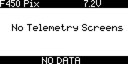

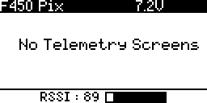

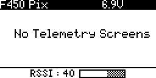

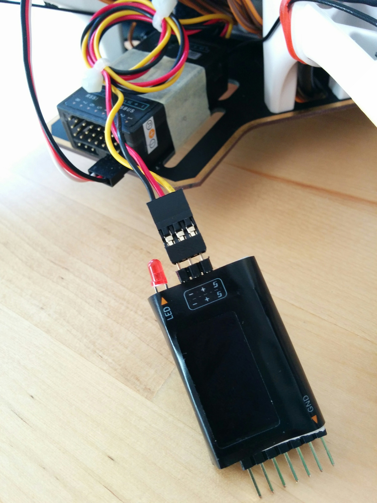

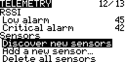

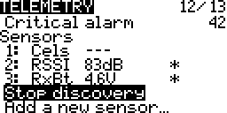

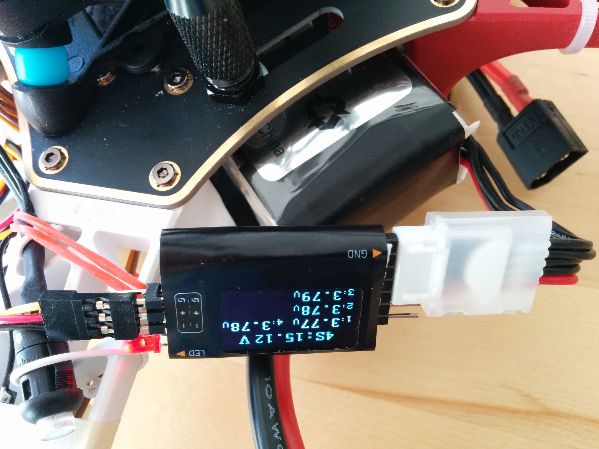

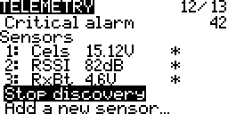

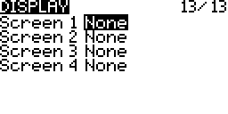

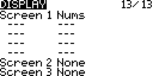

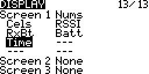

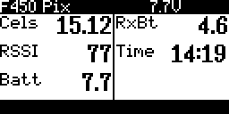

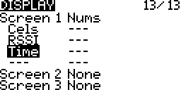

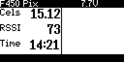

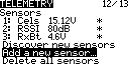

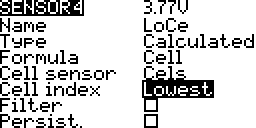

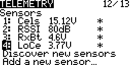

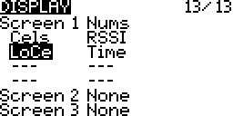

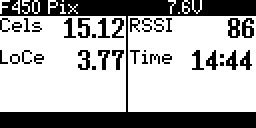

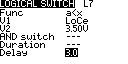

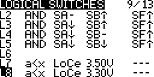

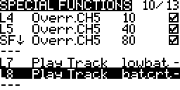

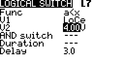
