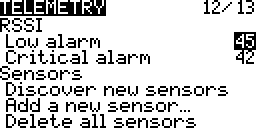
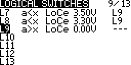
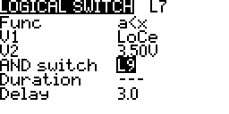
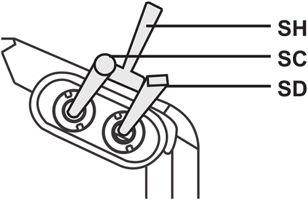
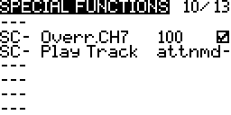
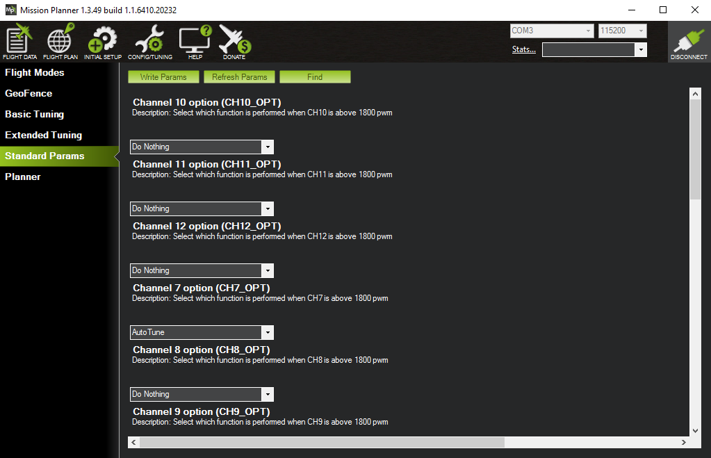
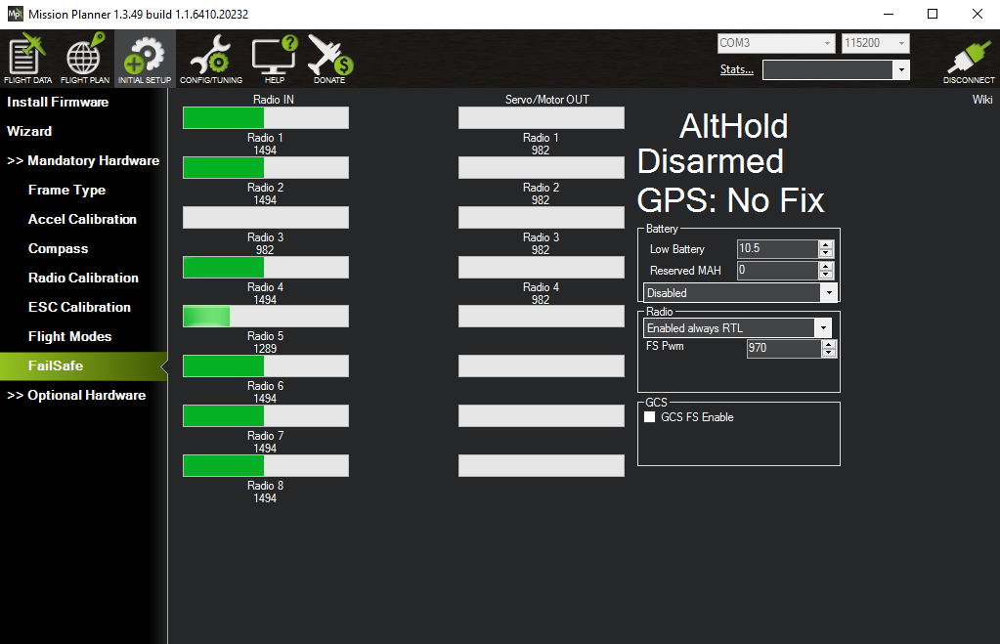
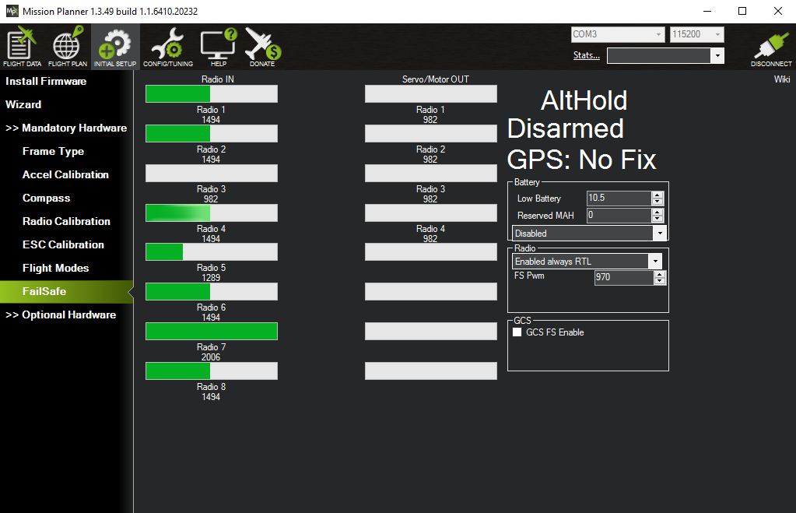
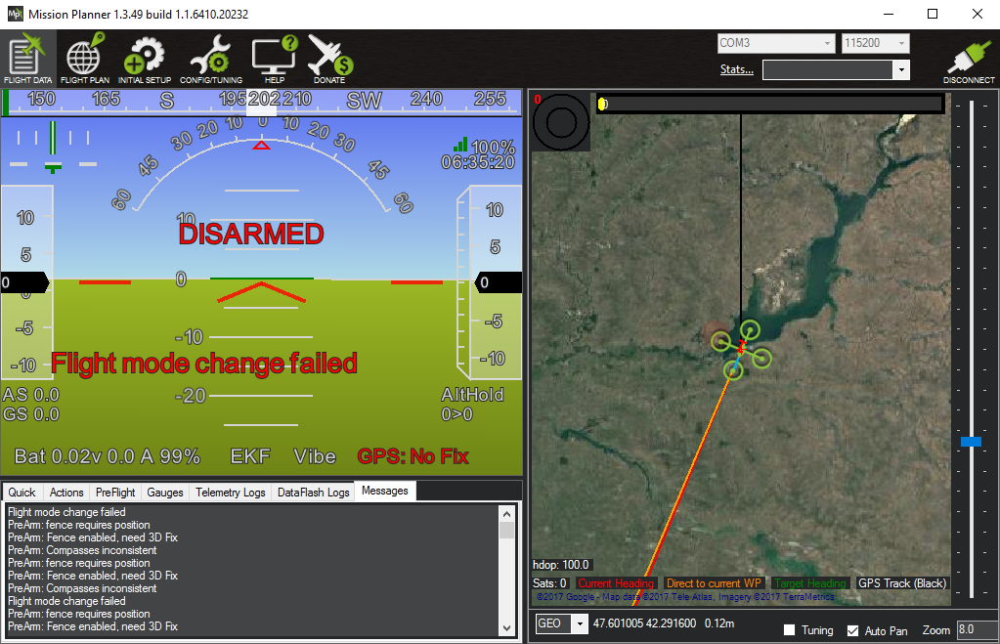
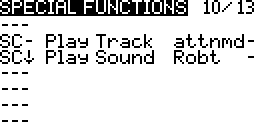

Final setup
-----------

Here we'll just do some final setup to:

* Display telemetry data on the transmitter.
* Add alarms for low and critical radio signal and battery conditions.
* Enable auto-tuning.
* Look at auto-trim.

Telemetry
---------

If you long press _PAGE_ from the main screen you get to the telemetry screens. If the receiver is off then all you'll see is "No Telemetry Screens", the top bar shows the currently selected model and the current voltage of the transmitter's batteries.

Plug the Pixhawk in to USB (there's no need to connect the main LiPo battery). This will provide power to the receiver. Now (without you needing to configure anything) it will start displaying the [RSSI](https://en.wikipedia.org/wiki/Received_signal_strength_indication) (received signal strength indication). This tells you how strong the radio link between the receiver and the transmitter is. If you walk around with the transmitter you should the value increase and decrease as you'd expect. However when you get within about 2m things get a little odder as various affects kick-in due to the receiver and transmitter being too close together.

TODO: this should be explained way earlier as people get confused by the "telemetry lost" / "telmetetry recover" (yes it's "recover" and not "recovered"). Can I find a good explanation for the "saturation" affect when RX and TX are close.

TODO: I tried to get a good explanation of why RSSI behaves strangely when the RX and TX are in close proximity - there's lots of fairly random unconvincing explanations on the web. I asked on the OpenTX rocket chat but just got "I believe it's nothing more than the short distance causing a signal overload on the RX frontend." (see [here](https://opentx.rocket.chat/channel/OpenTX_General?msg=zeD5EoF765crgjuHR)). This seems the most common explanation that there's some kind of signal swamping issue.

If you walk very far away then you'll hear the transmitter announce "RF signal low" (and the RSSI bar will turn from solid black to a checkered pattern). If you go even further it will announce "RF signal critical". It'll repeat these warning every 10 seconds while the signal remains low (or critical).

So you get the RSSI value displayed as a bar and low and critical alarms without having to set up anything. The same isn't true of any other telemetry values - in particular the telemetry data from the FrSKY voltage sensor. This has to be setup explicitly. Make sure the voltage sensor is plugged in.

Now on your transmitter go to the _Model selection_ screen and long press _PAGE_ twice to get to _Telemetry_, scroll down to _Discover new sensors_ and press _ENTER_. It should detect the _Cels_, _RSSI_ and _RxBt_ telemetry values being transmitted by the receiver. An asterisk should flash on and off beside the _RSSI_ and _RxBt_ values showing that updated values for these are being received continuously.

_Cels_ is the value coming from the voltage sensor - initially its value shows as `---` but plug the sensor into the balance connector of the battery and it'll start generating data.

You can see that the basic _Cels_ value is the total voltage of the battery - but what we're really interested in is the voltage of the individual cells, in particular the lowest voltage one. It's crucial that the voltage of no one cell drops too low. We'll come back to this later - but for the moment will just work with the total battery voltage.

Press _Stop discovery_ and then press _PAGE_ to get to _Display_.

Here we can configure what's seen on the telemetry screens. Select _None_ for _Screen 1_ and change it to _Nums_. You can also choose to display values as bars but this involves a bit more setup as you have to set low and high range for each item you want to display.

Now go down and add items to five of the `---` areas, when you press _ENTER_ you can scroll through a list of items that can be displayed. There are all kinds of things, like throttle value etc., the interesting things are right at the end. Select the three sensors that were discovered along with _Batt_ and _Time_.

Note: for _RSSI_ (and many other values) there are also plus and minus variants, i.e. _RSSI+_ and _RSSI-_. These can be used to show the highest and lowest seen values for RSSI, i.e. the normal _RSSI_ value is updated continuously while _RSSI+_ and _RSSI-_ are only updated when the current RSSI value falls or rises above than the previous miniumum or maximum.

TODO: when are the _RSSI-_ and _RSSI+_ values reset - when the TX is switched on and off?

TODO: ask about the following on the [OpenTX 2.2 support thread](https://www.rcgroups.com/forums/showthread.php?2823315-OpenTx-2-2):

1. The TX battery voltage is still displayed in the top bar but RSSI has disappeared from the bottom one. Why? If I remove _RSSI_ as a displayed value it's still gone (i.e. it's not removed to avoid duplication). In OpenTX 2.1 you could choose the voltage source displayed in the top bar, i.e. you could switch it from the TX value to the Cels value, but this feature seems have gone from the _Telemetry_ screen - has setting up the top and bottom bar moved elsewhere?

2. Note difference between RSSI that TX sees from RX and the the RSSI that the RX sees from the TX that's reported back via telemetry data. Presumably the first is what you see in the bottom bar below. Is there anyway to get "TX seen RSSI" as an item on the telemetry screen or is it gone forever once "RX seen RSSI" is available? Ask about this on some OpenTX forum.

Now if you exit all the way back to the main screen and long press _PAGE_ you see something a bit more interesting than "No telemetry screens". So _Cels_, as already mentioned, is the total voltage of your craft's battery, _Batt_ is the voltage of the transmitter's batteries (and just duplicates the value already seen in the top bar) and _RxBt_ is the voltage of the receiver's power source. The receiver is powered via the Pixhawk that provides it with about 5V - so this value isn't directly related to any battery and isn't very interesting.

So we've seen the varous voltage source values we can display - as _Batt_ is already shown in the top bar and _RxBt_ isn't very relevant let's remove them on the _Display_ screen and then return to the cleaned up telemetry screen.

The voltage of the lowest voltage cell is more important than the total voltage. To get this we have to go back to the _Telemetry_ screen and manually add a new sensor (that's actually derived from secondary data provided by the _Cels_ sensor but not yet displayed). Select _Add a new sensor_.

Then enter an appropriate name, e.g. "LoCe" (it can be a maximum of four letters), set _Type_ to _Calculated_, _Formula_ to _Cell_ and _Cell sensor_ to the name of our sensor, i.e. _Cels_, and set set _Cell index_ to _Lowest_.

On exiting out we now see LoCe as an additional sensor. You can add more sensors, just like above but with different _Cell index_ values, e.g. 1 to 4 for the specific cells or _Highest_ for the highest voltage cell or _Delta_ for the difference between the highest and the lowest voltage cell (to give you a measure of how balanced the cells in your battery are). For the moment we'll just stick with LoCe.

You can now add LoCe to the displayed values and see it on your telemetry screen.

Low RSSI alarm
--------------

We don't have to do anything to set up audio alerts for low and critical RSSI values - this is done automatically. If you were looking carefully on the _Telemetry_ screen you'd have seen the _Low alarm_ and _Critical alarm_ values for RSSI - the defaults seem to be considered good (45 and 42 respectively).

As noted above if you take the transmitter and walk away from your receiver, watching the RSSI value getting smaller and smaller, you will eventually hear the "RF signal low" and then the "RF signal critical" audio alerts. Or if you live in a small apartment (like mine) where the RSSI never drops to 45, no matter where transmitter and receiver are, you can simply temporarily alter the low and critical levels to e.g. 75 (the maximum settable level) and 70 respectively to test things out.

Low battery alarm
-----------------

Surprisingly there isn't a similarly simple default setup for warning on low battery voltage. Instead we have to set up a logical switch that turns on when the value of LoCe falls below a particular value. Then we use this logical switch to trigger an audio alert.

So go to the _Logical switches_ screen, scroll down to a free slot, long press _ENTER_ and select _Edit_. Then for the _Func_ select _a<x_, then select LoCe and 3.5V for the _V1_ and _V2_ values respectively and choose a _Delay_ of 3 seconds.

The 3 second delay means that the condition has to hold for at least 3 seconds - this avoids the switch being triggered for temporary voltage drops - these happen e.g. when you suddenly apply a lot of throttle.

Most web pages are fairly consistent in giving 3.3V as the value at which the battery voltage will start to drop very rapidly and is the point at which you should stop flying, however there's more variance as to what constiutes the low point before this at which you should start thinking of wrapping up a session with a paricular battery. I've chosen 3.5V and this seems fairly common.

So we've setup a logical switch to trigger at 3.5V, setup another to trigger at 3.3V.

Now that we have two logical switches, that will trigger at our low and critical voltage values, go to the _Special Functions_ screen and add two additional functions that link these logical switches to the _Play track_ function. Select the _lowbat_ track for the 3.5V triggered switch and the _batcrt_ track for the 3.3V triggered switch.

Note: _batcrt_ isn't part of the standard OpenTX SD card contents and comes from the sounds in `opentx-extra-tracks.zip` that we installed previouly when setting up sounds for the flight modes.

You can then test that the audio alert really gets triggered by going back and editing one of the logical switches, temporarily increase the _V2_ value to e.g. 4V and just leave it for the delay period (3 seconds), you don't have to exit out of editing. If all goes well you should hear the expect track - if all goes well return _V2_ to its proper value.

Unlike the RSSI alarm, these alarms will only sound once rather than repeating every 10 seconds. Getting sounds to repeat is easy - on the _Special Functions_ screen just change the `-` (that you see at the end of the `L7` and `L8` lines above) to 10 (seconds). However this isn't enough - once the battery voltage drops below the low threshold then the low battery alert will continue repeating even once the voltage drops below the critical voltage threshold. To avoid this you'd have to make the low logical switch dependent on the critical one not being active.

Instead a more useful optional extra here is to make the low and critical logical switches dependent on their being any voltage at all being reported! If you add the above logical switches you'll quickly notice that the transmitter announces the low and critical battery alerts whenever you've e.g. got things hooked up to MP and are just powering the craft via USB rather than via the battery. To disable this annoying behavior add a new logical switch that becomes active only if the voltage is above 0 and then make the existing low and critical logical switches dependent on this switch being active.

Auto-tune
---------

The craft is continuously adjusting its behavior according to its sensors, where it is now and where it wants to be. Core to this is a set of three parameters called PID (proportional-integral-derivative) and if you get into whole drone field you'll find people can get quite obsessive about tuning these parameters to match their craft and how they want it to behave. How these parameters interact and affect things is really fairly complex - if you want a nice introduction see Bruce Simpson's [PID video](https://youtu.be/0vqWyramGy8) and Oscar Liang's [explanation of PID](https://oscarliang.com/quadcopter-pid-explained-tuning/).

The important thing is that for the craft to be as controllable as possible and behave as well as possible in flight these parameters have to be adjusted to match the craft. So if you've built your own craft this is an issue - the flight controller software uses some reasonable defaults that should work for pretty much anything but they obviously won't be the best for your craft. Tuning the PID values is a black art but the auto-tune feature of ArduCopter can help you out by finding the best values automatically.

To do this it puts your craft through quite a prolonged sequence of exercises, twitching it this way and that, comparing what should ideally have happened with what the sensors report actually did happen. Using the data gathered in this way it works out what it thinks should be the ideal PID values.

Once you've set things up to enable auto-tune (as described below) you just need to go out on a low wind day, point the craft into the wind (if there is any), go to the _AltHold_ flight mode, flick the _SC_ switch into its middle position and then follow the remaining instructions on the [auto-tune page](http://ardupilot.org/copter/docs/autotune.html) that cover invoking auto-tune.

TODO: pointing the craft into the wind assumes that when tuning all axes (as we are) that it starts on the roll axis, see if it twiches left first - if it does this is the case.

Note: the auto-tune instructions mention setting the `AUTOTUNE_AXES` and `AUTOTUNE_AGGR` parameters, however their default values, 7 (all axes) and 0.1 (aggresive), are already the most appropriate values and shouldn't need to be changed.

Setting up auto-tune is simple - we want to set the _SC_ switch of the transmitter so that when it's flipped to its middle position it sets the transmitter's channel 7 value high (and plays a track to tell us we're in auto-tune mode) and in MP we want to configure the flight controller to interpret channel 7 going high as the trigger to enter auto-tune mode.

_Upper right switches._  

On the transmitter go to _Special functions_ and add two new special functions, both of which are activated when _SC_ is in its middle position, i.e. _SC-_. The first special function should be set to override channel 7 and set its value to 100% (make sure to remember to tick the enabled box - it defaults to disabled) and the second one should play the track `attnmd`, i.e. it'll announce "auto tune mode". There's a note later on using a mix rather than a special funtion to change the value of channel 7 - but the special function approach is very simple, so we'll stick with it here.

Set up in MP is just as trivial - just make sure your craft is connected, go to _Config/Tuning_, then to _Standard Params_ and use _Find_ to search for paramters containing the word "channel". Then select _AutoTune_ from the dropdown for _CH7_OPT_. The only confusing thing (as noted before) is that the layout means that it looks like the dropdown for _CH7_OPT_ is the one immediately above it, but actually its the one below it, separated from it by some blank space.

That's it done. The next few screenshots are just about confirming that things are setup properly. But first make sure your transmitter is turned on. A convenient way to see the currently selected flight mode and the channel values for channels 1 to 8 is to go to _FailSafe_. Flip your flight mode switches to reach _AltHold_ mode - you'll see the mode reported on the upper-right (and see the channel 5 value change as you flip the flight mode switches). You need to be in _AltHold_ mode before you can enable _AutoTune_ mode.

Now flip the switch assigned to enable _AutoTune_ mode, i.e. move the _SC_ switch to its middle position. You'll see the channel 7 value going high but unfortunately you don't see _AltHold_ changing to _AutoTune_.

The only way I've found to confirm that flipping the _SC_ switch did anything other than set the channel 7 value high is to instead go _Flight Data_ and flip to the _Messages_ tab. Now if you flip _SC_ to its middle position you'll see "Flight mode change failed" on both the HUD and it the messages tab. So while you can change between the flight modes you configured for channel 5 even while disarmed, it seems that you cannot switch into _AutoTune_ mode - but at least you can see that it tried.

TODO: the auto-tune instrutctions also recommend enabling [voltage scaling](http://ardupilot.org/copter/docs/current-limiting-and-voltage-scaling.html) - look into this.

Auto-trim
---------

In addition to auto-tune mode there is auto-trim mode. Trim was already discussed briefly in relation to the transmitter - if your craft has a tendency to always drift to the right then you can correct this with the digital trim button on the transmitter that corresponds to roll so that it permanently adjusts roll slightly to the left to compensate for the rightward drift. It turns out that this trim adjustment can also be done by the flight controller.

If you put your craft into [auto-trim mode](http://ardupilot.org/copter/docs/autotrim.html#auto-trim) (it needs to be a windless day) you just need to use the sticks to maintain your craft in a stable hover for 25 seconds - the flight controller will then work out from the stick movements you needed to make what trim values are needed to maintain a stable position without you having to make the corrections you did via the sticks.

If everything is set up properly then trim adjustments shouldn't really be necessary. Trim should not be needed to e.g. compensate for a lot of weight on the nose caused by a camera setup. Instead the flight controller should already have been calibrated such that it can work out from its sensors what's happening - if it feels it should be level but additional weight on the nose is causing it to tip forward then it will apply more power to the front motors until reality matches expectations. It's doing this kind of thing continuously, irrespective of unequal weight distribution etc.

TODO: can anyone provide any reason why trim should be needed even if a craft's sensors are well calibrated?

However if you still find your craft tending to drift in a particular direction even when the sticks are centered (and you've calibrated all the sensors) then auto-trim may be able to solve the problem. Unlike auto-tune no setup is required on your transmitter or in MP, instead auto-trim is enabled by holding the throttle stick in the arming position for 15 seconds (rather than the normal 5) and then following the instructions on the auto-trim mode page (linked to above).

Note: the auto-trim instructions haven't been updated since the time of the old APM flight controller, when they refer to "the small red, blue and yellow LEDs" they're referring to a tiny set of LEDs on the APM rather than anything on the Pixhawk.

TODO: wouldn't it be easier if auto-tune just involved letting the craft drift for 25 seconds (assuming its drifting is not too extreme) and then working out from the start and end GPS positions how trim needs to be adjusted - even with relatively inaccurate GPS fixes this should be fairly OK if the craft is left to drift for long enough, no?

Notes
-----

* For a nice video on setting up telemetry (discovering sensors) on the Q X7 see this [video](https://youtu.be/Qo4Ck_vsJ6I?t=122) from Painless360 (from 2:02 onwards). And for one on displaying all the data available from your FLVSS sensor on your transmitter, including the individual cell voltages, the highest and lowest values and the difference between these two, see this [video](https://youtu.be/lORZGjDpZEg).
* There are only so many tracks available in the OpenTX standard sound pack, even the larger packs that you can find in the popular  [Amber sound pack thread](https://www.rcgroups.com/forums/showthread.php?2151914-The-Amber-Transmitter-Sound-Pack) can't cover everything. So if there isn't a track already available for something, it may be more convenient to flag the event with one of the non-specific chirps and beeps that OpenTX provides. So instead of _Play Track_ you can choose _Play Sound_ and then pick from sounds with names like Robot, Sci-fi, Cricket etc.
   
 You can add new tracks but you can't add new sounds - there's just a limited set of them hardcoded into OpenTX. They're programmatically generated in the `audioEvent` function found in the OpenTX [`audio_arm.cpp`](https://github.com/opentx/opentx/blob/2.2/radio/src/audio_arm.cpp) file.
* Above we just setup the _SC_ switch to trigger auto tune mode directly. There are only a limited number of switches on the transmitter - if you end up wanting to trigger substantially more actions then it makes more sense to create logical switches (as we did for the flight modes). This way you can easily get easily trigger eight additional events by combining _SC_ and _SD_ to get 3 banks of 3 triggers, i.e. 9 possible states (where the first corresponds to nothing-triggered, leaving you with 8 triggers).
* I used a special function to get _SC_ to set the channel 7 value high. On the whole though this kind of thing should be done via mixes - I asked a question above this on RCGroups and got some nice replies, if you look at the [thread](https://www.rcgroups.com/forums/showthread.php?2979489-OpenTX-set-3-way-switch-so-its-mid-maxes-one-ch-and-down-maxes-another-%28via-mixes%29) you can see alternative approaches to doing things with mixes rather than using a special function. The question involves using the _SC&darr;_ position in addition to the _SC-_ position used here. For this situation though a special function is good enough.
