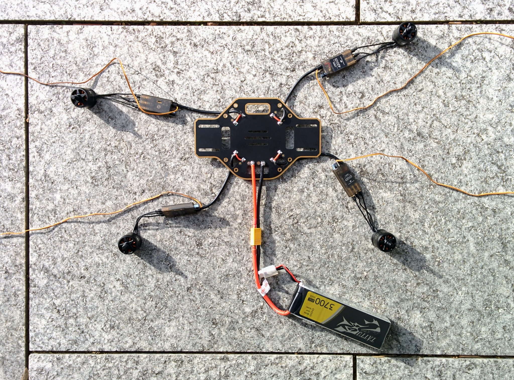
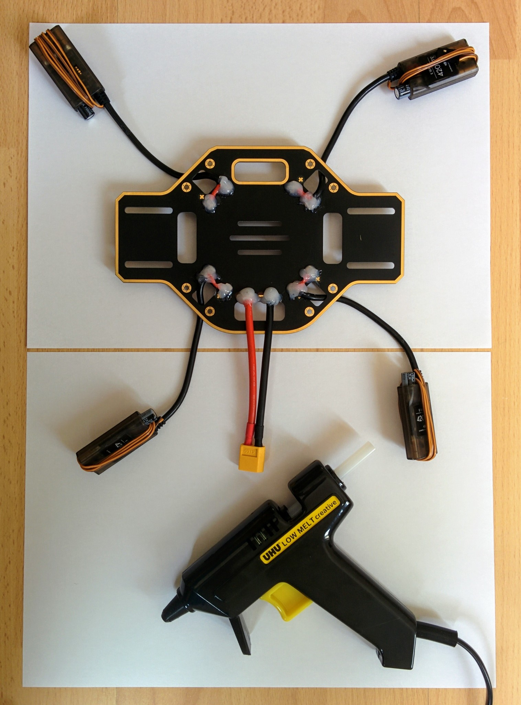
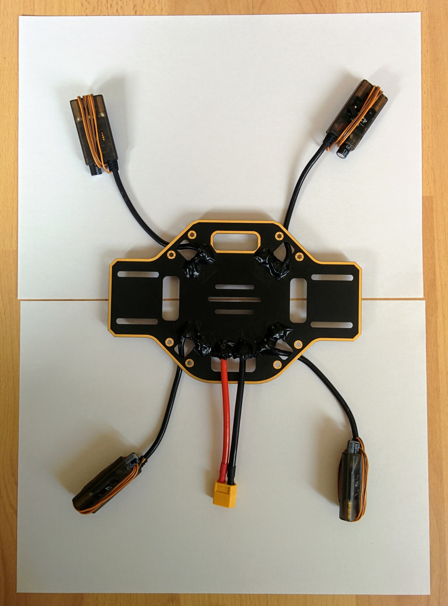
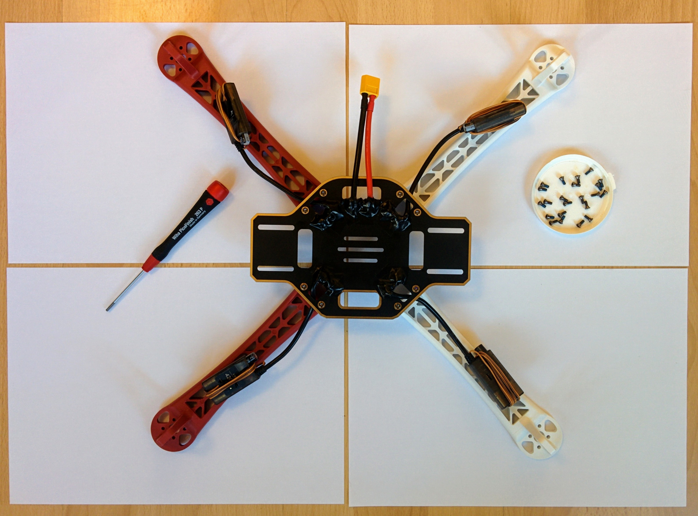
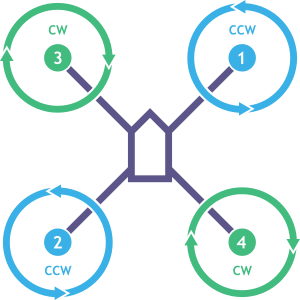

Frame assembly
==============

TODO: see also [`frame-parts.md`](frame-parts.md).

Now that we've soldered up the PDB and done the continuity testing we can do a quick check with the battery before assembling the frame.

If you've done the continuity testing properly you should be pretty confident there are no shorts, however connecting the battery for the first time is the point at which you'll know for sure. As such you should do this test outside on concrete as it there is a short the battery will puff up and possibly explode and catch fire.

The ESCs will beep to indicate their state if everything is OK and they are getting power (you can see a description of the sounds they make in the [E305 user manual](http://dl.djicdn.com/downloads/e305/en/E305_User_Manual_v1.00_en.pdf)). They'll only make a sound if the motors are connected so connect a motor to each ESC. At this point the order of the connectors is unimportant, for each motor just plug its three connectors any-which-way into an ESC. The bullet connectors are quite hard to remove once fully inserted so push them in most but not all of the way for this test. Once all the motors are connected, connect the battery - for safety reasons don't lean over the battery while doing this.

_Outdoor battery test._  

If all goes well you'll hear a continuous tone from all the ESCs. This is actually the ESC error tone - indicating that they're receiving no control signal - which isn't surprising as they're not connected yet to the flight controller. But it does indicate that the PDB is wired up correctly and delivering power to each ESC.

The tone is one of those sounds where it's hard to determine the source, I had to hold my ear right up to each ESC in turn to check that a sound was coming from each. The motors also seem to be making a sound, if you hold each one you can feel a little pulsing motion in each motor.

TODO: are both ESCs and motors really making separate sounds, is the pulsing feel from the motors covered anywhere.

The solder joints are large and exposed and could easily accidentally short against something, the [F450 user manual](http://dl.djicdn.com/downloads/flamewheel/en/F450_User_Manual_v2.2_en.pdf) very briefly mentions that you should insulate these points but doesn't suggest how. At [3:31](https://youtu.be/pUTHIL_Xfcc?t=211) in their assembly video they use hot glue. At [28:41](https://youtu.be/ER2GxMo0X3E?t=1721) in the Marionville Models video he just uses insulation tape.

I bought a cheap arts and crafts hot glue gun (the Uhu [Creative XL](http://www.uhu.com/en/products/glue-guns-hot-melt-adhesives/detail/uhu-creative-xl-low-melt-110c-glue-gun.html?cHash=62ef031c5d16bc8a8cefa468999b7dd9)) and you can see the results here.

_Solder joints covered in hot glue._  

If you've ever opened up any consumer electronics item you'll often find clear rubbery hot glue has been used at various point, generally as a form of strain relief for cables that may occassionaly be pulled rather than as a form of insulation. The glue from my glue gun was quite different to this, it's not transparent and it went hard rather than rubbery and once hard it was quite easy to prise off (even after leaving it for its 2 hours maximum bonding time) which obviously isn't ideal. After a little searching it seems I should have been looking for "high viscosity", i.e. more rubbery, glue but I can't recommend a particular product.

It's probably good enough to just cover everything up with insulating tape without using hot glue - though watch out, if there are any little spurs or sharp points at the solder joints they may pierce the tape. I finished up covering everything in tape anyway (using completely normal insulating tape - this [one](https://www.amazon.co.uk/d/Tape/Tesa-56192-00010-02-Insulation-Tape-15-mm-Black/B004SQLWH2/) from Tesa), this makes things look much tidier.

_Glue and wires covered by insulation tape._  

What goes where
---------------

You have a lot of flexibility in how you put the quadcopter together. The classic configuration has the PDB with its solder pads facing upwards and all wires simply soldered onto this upper face (without any threading of cables through holes in the PDB as I've done), then the Pixhawk is affixed to the PDB with adhesive foam pads (which provide some vibration damping) and then the adhesive velcro strip is attached left to right on top of the upper plate and the battery is installed here, held in place by the velcro and the battery strap.

I'm going for a different configuration where the pads of the PDB face downwards, this means all the solder joints are more exposed, being on the underside of the craft - but it has the advantage that the area between the bottom and top plate is free of obstacles like wires and solder joints. Using a vibration damping platform makes the space between the plates quite tight so instead of trying to squash the Pixhawk in here I'm going to install it on the top plate and use the middle space for the battery.

It's not only space issues that make it seem preferable to mount the Pixhawk on top, having it there also makes it easier to get at. Before I made the decision to mount the Pixhawk on top I actually bought a [LED and USB module](https://www.unmannedtechshop.co.uk/all-in-one-led-and-usb-module-for-pixhawk/) (along with an [I2C board](https://www.unmannedtechshop.co.uk/i2c-board/) that needs to used with it) - if the Pixhawk is installed in the middle space then its USB port is hard to get at and its status LED hard to see, so this little module duplicates the USB port and LED in a little unit that can be attached to one of the quadcopter arms where it's easy to get at and a cable run back from it to the hidden away Pixhawk.

However I decided I wanted to be able to easily get at the ports of the Pixhawk so mounting it on the top plate made more sense. This has another upside in that it moves the Pixhawk further away from the electrical noise of the PDB but has the downside of making the GPS mast harder to place (the upper plate is relatively small and the the vibration damping platform ends up covering a lot of it).

I'm keeping with the convention of using the two red arms for the front arms and the white ones for the back arms (even though this seems back to front to me e.g. relative to a car with its white lights at the front and red ones at the back). Similarly I'm going to stick with having the PDB oriented so that the power connector points off to the left (as [here](https://youtu.be/ER2GxMo0X3E?t=1835) in the Marionville Models video and [here](https://youtu.be/H_Rvi7xQLdw?t=118) in one of the DJI videos). In some DJI video they have the wider axis of the PDB going left-right but having it going front-back seems to make allowing you e.g. to mount a camera on the underside of the front facing extenstion.

Rather than keep the battery in place with velcro, as it's hard to pull upwards when the battery is mounted in the middle space, I'm going to use a non-slip silicone mat (like this [one](https://hobbyking.com/en_us/battery-silicon-anti-slip-mat-126x40x1-5mm-black.html)) instead. And rather than mount it left to right I'm going to mount it front to rear as this makes it possible to moving it forward or back to compensate for e.g. the weight of a nose mounted camera.

TODO: does this actually work out? If I mount the receiver at the rear of the bottom plate will it and the battery get in each others way?

Assembly
--------

The F450 kit came with two small packets of screws, longer 8mm M3 screws for the motors and shorter 6mm M2.5 screws for the arms. The E305 system also came with some packets of screws - we will not need any of those.

So open up the packet of shorter screws. You'll notice that each screw has a small blue patch on it - this is thread locker, a glue that stops the screws working loose due to vibration. The blue thread locker is weak enough that it won't prevent you unscrewing the screws later (there are stronger forms of thread locker intended for binding screws in place permanently). If you do ever remove the screws remember that you'll need to reapply fresh thread locker before screwing them back in.

TODO: confirm that thread locker really doesn't survive unscrew/rescrew operations.

Now screw on the legs making sure that the power connector for each ESC runs between the arch formed by the points of the leg that are screwed down to the PDB.

_PDB with arms screwed on._  

As shown in the photo I've used a 2mm hex screw driver for this - using a proper screw driver is far more convenient than using a small Allen key.

Now tie the ESCs to the undersides of the arms with cable ties - you'll need XXmm ties.

Before you add the top plate number the connectors from the ESCs according to the following scheme:

| No. | Arm         |
|:---:|-------------|
| 1   | Front right |
| 2   | Back left   |
| 3   | Front left  |
| 4   | Back left   |

The ordering may seem odd (being neither a CW or CCW numbering order) but you can confirm it in the relevant [ArduCopter documentation](http://ardupilot.org/copter/docs/connect-escs-and-motors.html#motor-order-diagrams) and the corresponding [PX4 documentation](https://dev.px4.io/en/airframes/airframe_reference.html#quadrotor-x).

_Arm numbering and CW and CCW motor placement._  

I use a white [edding 780](http://www.edding.com/creating-and-decorating/products/gloss-paint-marker/edding-780-gloss-paint-marker/) pen that's designed for writing on glass, metal and plastic.
