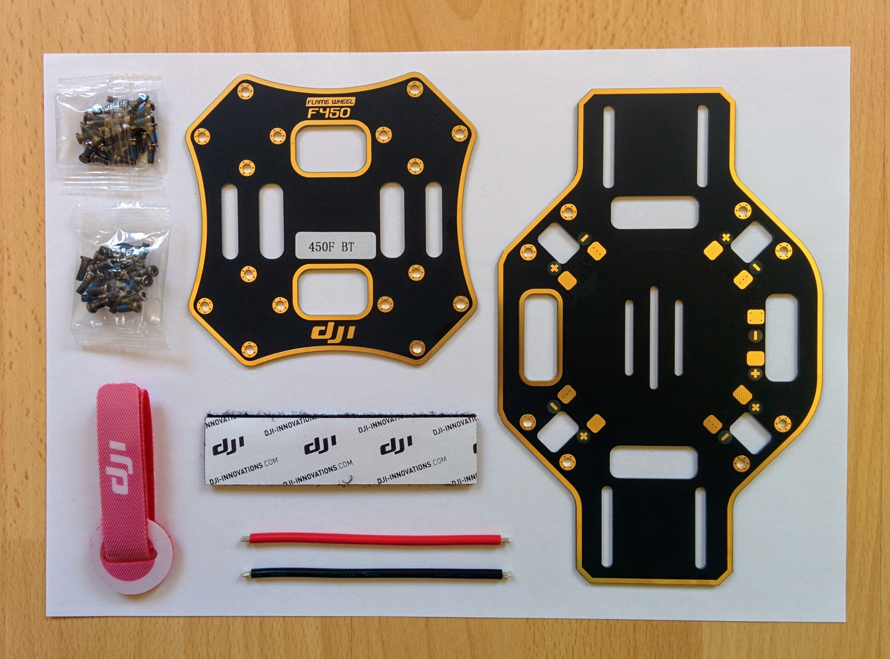
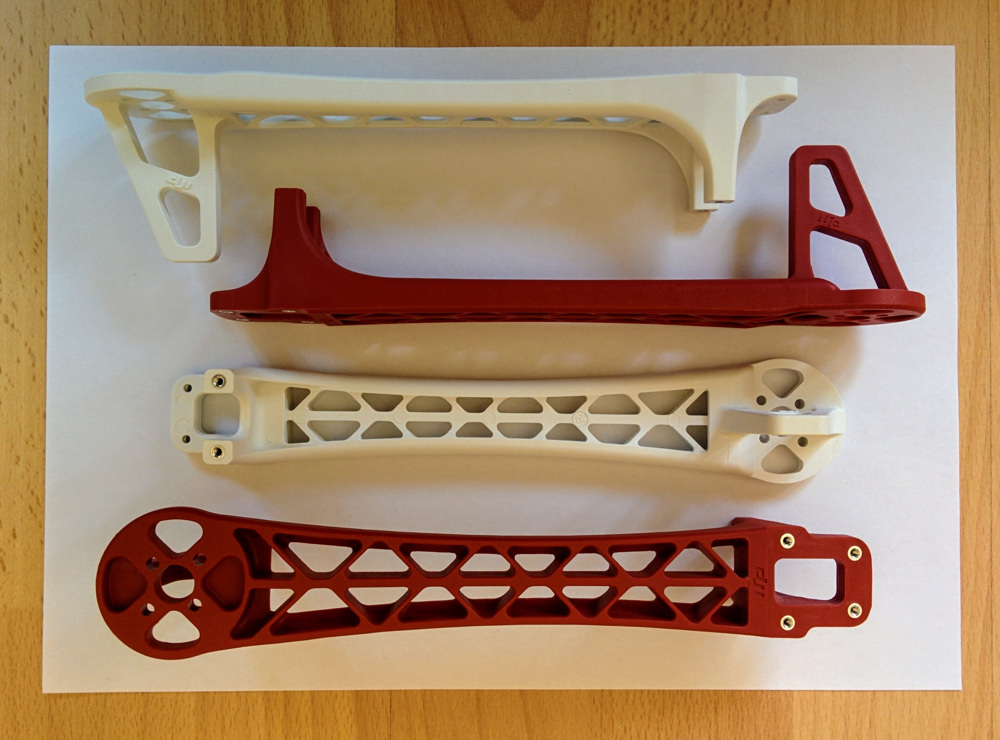
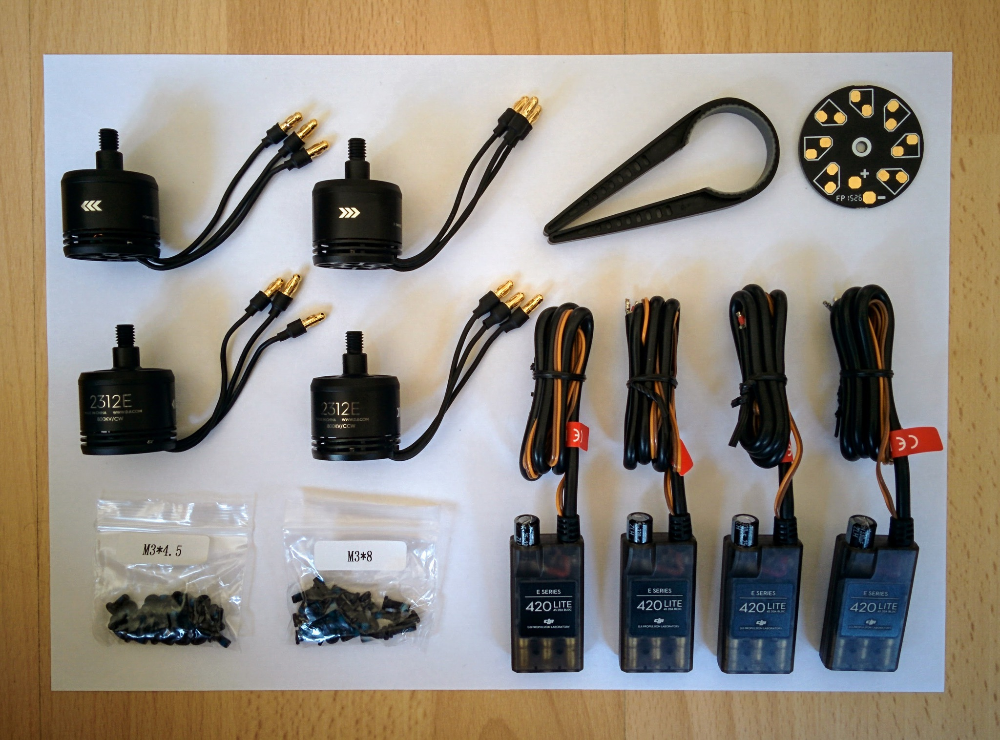
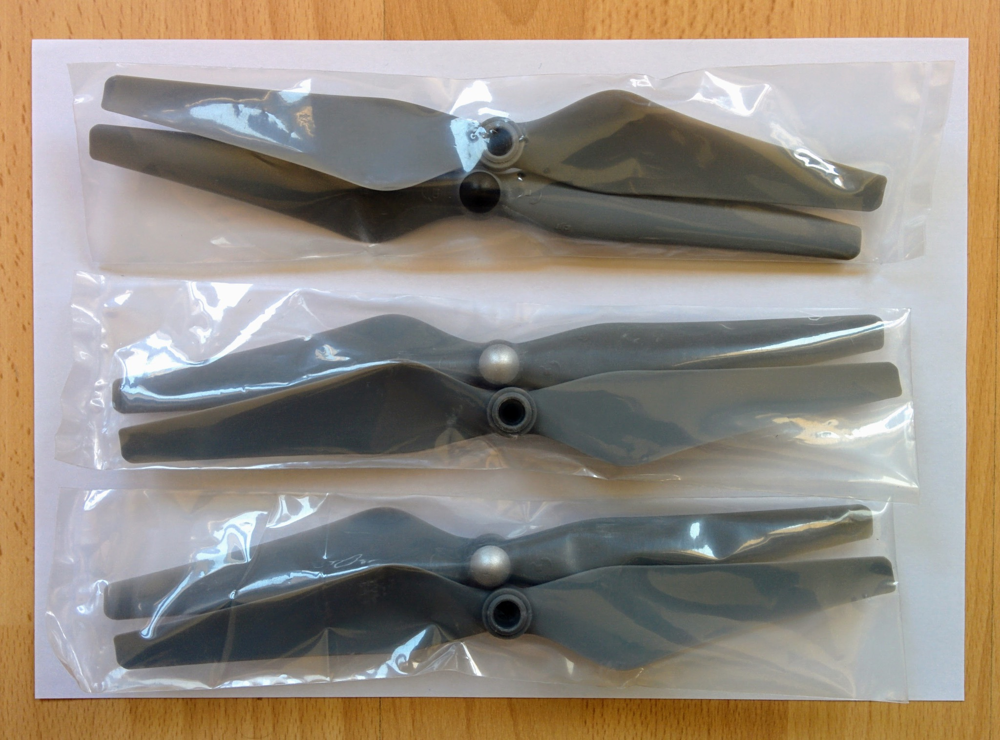
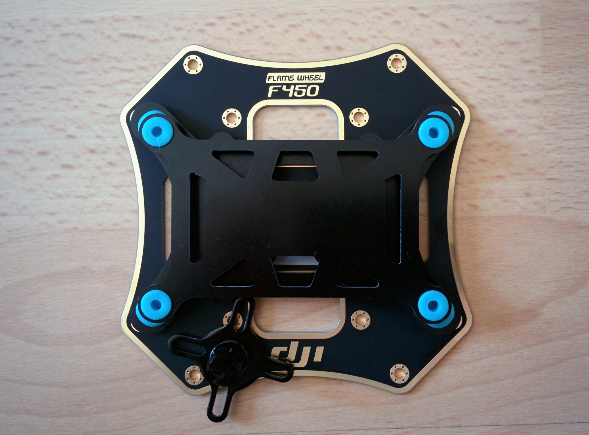

F450 frame kit
--------------

Online stores seem to be particularly vague about what exactly comes in the F450 frame kit. The kit I received consisted of:

* Top and bottom central plates.
* Two red legs and two white legs.
* Two small packets of screws.
* A battery strap.
* An adhesive backed velcro strip.
* A red and a black piece of 14AWG wire.

The velcro strip comes in a bag labelled 450MSX - this corresponds to the part mysteriously referred to as the "magic strap" in the user manual. Its purpose isn't clear, some people seem to use it in combination with the battery strap - cutting off a section of the strip and attaching one side of this to the frame and the other side to the battery to stop the battery sliding under the battery strap.

The packets of screws are unlabelled but the packet of shorter screws are the 24 M2.5 6mm screws needed to secure the central plates to the legs and the packet of longer screws are the the 16 M3 8mm screws needed to secure motors to the legs.

The red and black wires are for connecting the lower plate (that also serves as a PDB) to power. However rather than solder an XT60 connector onto these I just bought an XT60 connectors that was already soldered onto a pair of wires.

_Central plates, velcro strip, battery strap, wires and screws._  

_F450 legs._  

E305 tuned propulsion system
----------------------------

The E305 tuned propulsion system consists of:

* Two clockwise (CW) and two counterclockwise (CCW) 2312E 800KV motors.
* Two 420 Lite ESCs.
* A PDB.
* A propellar removal clamp.
* A packet of M3 4.5mm screws and a packet of M3 8mm screws.
* Three packets of propellars, each containing a CW and CCW propellar.

The PDB isn't needed as the bottom plate of the F450 is also a PDB. Similarly two different lengths of screws are provided so you can match them to the depth of the assembly holes on your frame but neither is needed as the F450 frame already came with suitable screws (M3 8mm screws).

If you look at the picture below you can clearly tell the CW and CCW motors apart by the arrows on the sides of the motor housings. If you look at the other side of the motors you'll also see "CW" or "CCW" as part of the labelling.

The housing of the motors is aluminium and apparently buckles easily under pressure so you should always use the propellar removal clamp if you need to grip them tightly.

Each pack of propellars contains one CW propellar (with a black colored central nut) and one CCW propellar (with a silver colored central nut).

_Motors, ESCs, clamp, PDB and screws._  

_Propellars._  

Mast placement
--------------

If you install the vibration damping board on the top plate then you're fairly limited in where you can place the base of the GPS mast. If you're going to stick it down then the following picture shows the best you seem to be able to do with the kind of base and board that I have. One leg is attached to nothing (and should probably be cut off) but the rest of the base rests solidly on the top plate.

An alternative would be to use longer assembly screws and screw the base down with the same screws used to attach one of the F450 legs. Or one could perhaps attach the base to one of the jutting out panels of the bottom plate - this would have the advantage of letting you center the mast better relative to the nose/tail axis of the drone but at the cost of bringing the GPS unit about 37mm closer to the battery and the PDB (the total mast length is about 140mm).

_Placement of the base of the GPS mast._  

