Parts
=====

So what other parts do you need besides a frame and a propulsion system? The list below makes clear that there's quite a bit more to the whole thing.

An approximate price in Euros has been given for every item (even though I bought most items in the UK or Switzerland). As you can see the most expensive items are the propulsion system, flight controller and transmitter. The batteries (especially if you buy two in order to have one in reserve) and charger also add a significant cost.

Each part is listed with one or more links to either a product page or a shop page that provides details about the part (in the case of shop pages I chose pages that provided the best description and not necessarily the shop from which I bought the given part).

I've put together a separate page - [`stores.md`](stores.md) - which includes links to sites that carry the parts shown here.

Various acronyms used in the parts list, like ESC and PDB, are explained later in this pages or on one of the other pages here.

### Major components

| Price | Description |
|-------|-------------|
| &euro;24 | 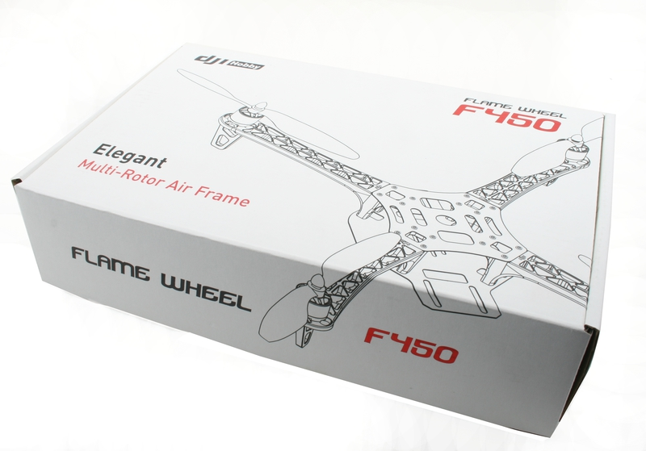 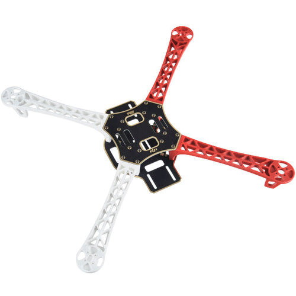 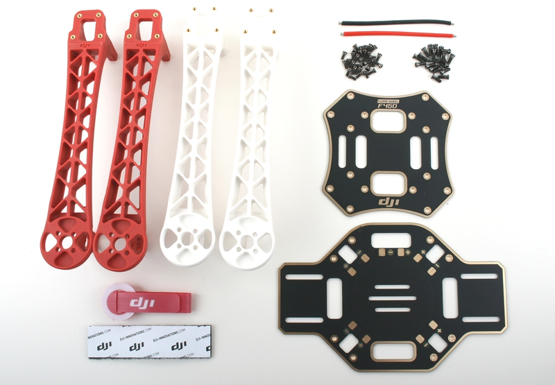 F450 frame - the basic platform to which everything else is attached ([link 1](https://www.amainhobbies.com/dji-flame-wheel-f450-basic-quadcopter-drone-kit-dji-fw450bas/p235233), [link 2](http://www.builtdrones.com/dji-flamewheel-f450-basic-kit/)).
| &euro;150 | 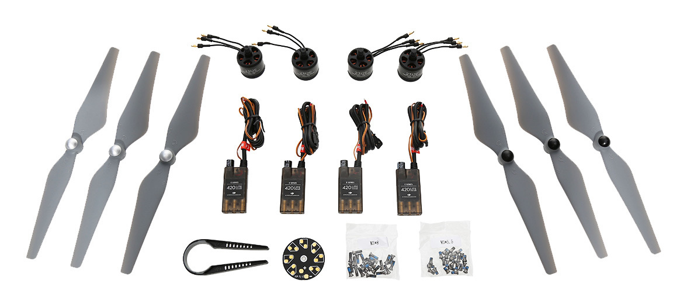 E305 propulsion system - propellers, motors and ESCs ([link](http://store.dji.com/product/e305-4)).
| &euro;175 | 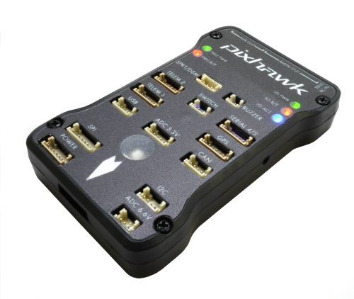  Pixhawk flight controller - the "brains" of the system ([link](https://pixhawk.org/modules/pixhawk)).
| &euro;41 | 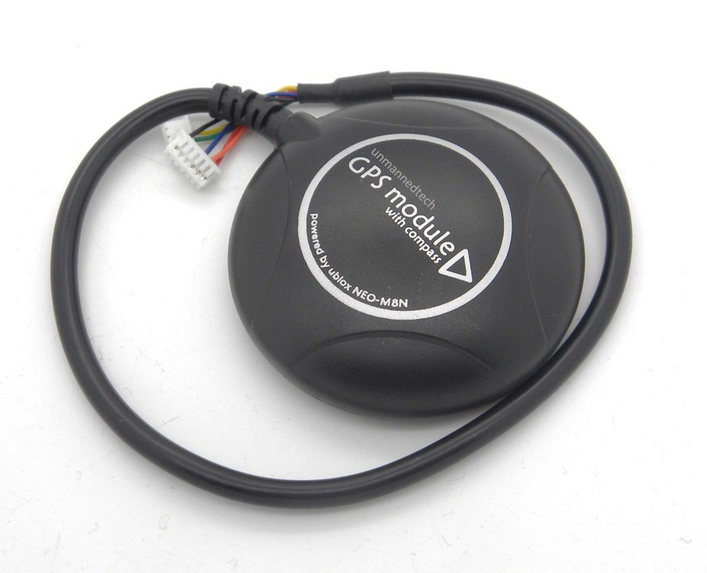 u-blox NEO-M8 GPS (and compass) module ([link](https://www.unmannedtechshop.co.uk/ublox-neo-m8n-gps-with-compass/)).
| &euro;35 | 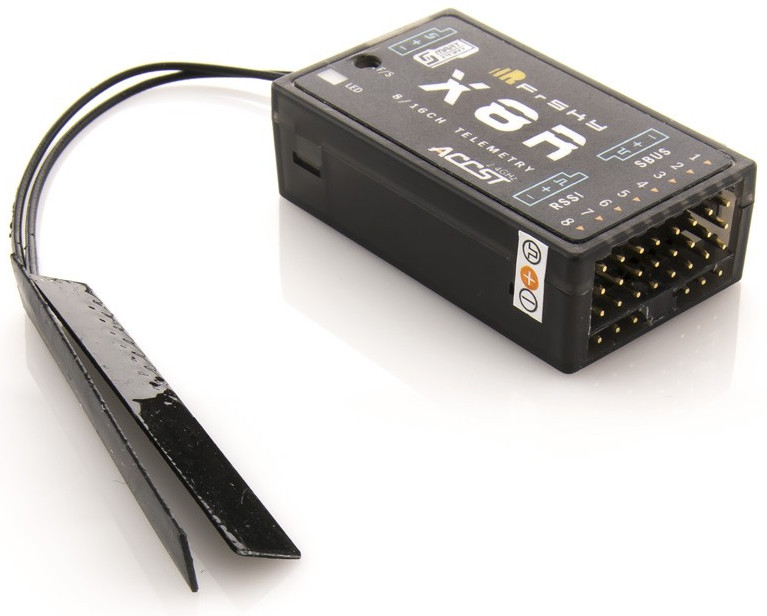 X8R receiver - the drone's wireless receiver ([link](https://www.unmannedtechshop.co.uk/frsky-x8r-8-16ch-s-bus-accst-receiver-with-smart-port/)).
| &euro;17.50 | 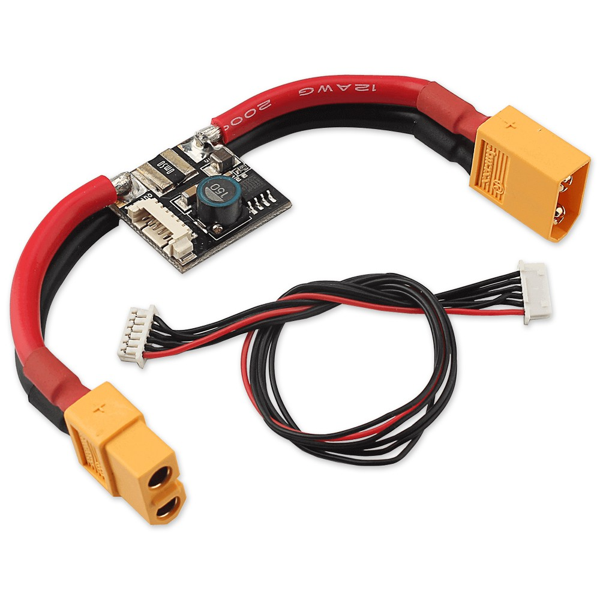 Power module - connects the battery to the flight controller and the PDB ([link](https://www.unmannedtechshop.co.uk/high-voltage-apm-power-module-with-3a-ubec/)).
| &euro;48 | 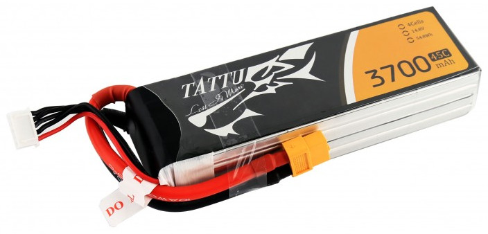 LiPo 3300mAh 4S1P 14.8V 45C battery ([link](http://www.gensace.de/tattu-3700mah-14-8v-45c-4s1p-lipo-battery-pack.html)). |
| &euro;108 | 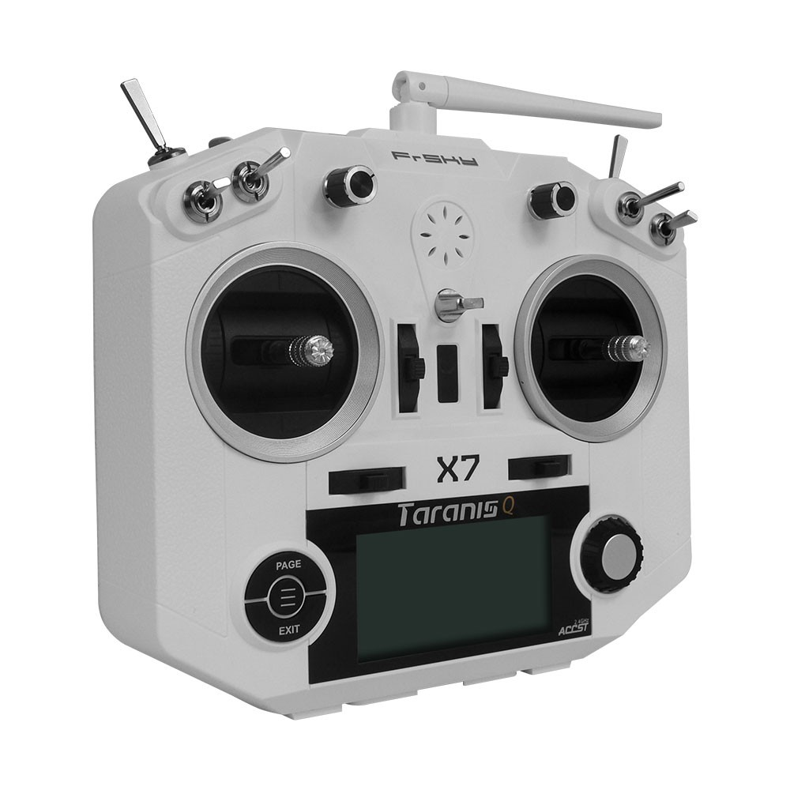 Taranis Q X7 transmitter ([link](https://www.unmannedtechshop.co.uk/frsky-taranis-q-x7-2-4ghz-transmitter/)).

### Support components

| Price | Description |
|-------|-------------|
| &euro;40 | 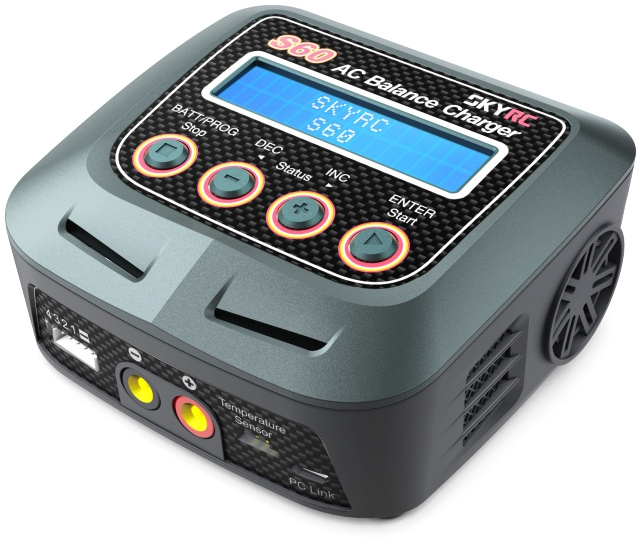 S60 LiPo charger ([link](https://www.unmannedtechshop.co.uk/skyrc-s60-ac-balance-charger-discharger/)).
| &euro;12.50 | 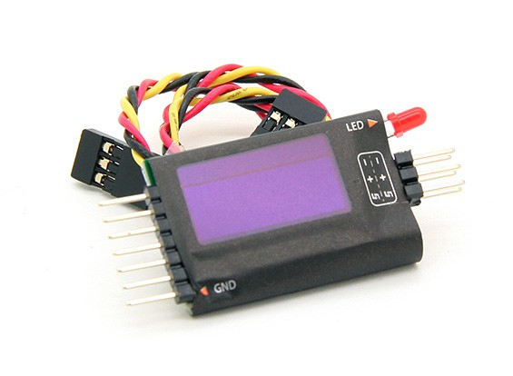 FLVSS voltage sensor ([link](https://hobbyking.com/en_us/frsky-flvss-lipo-voltage-sensor-with-smart-port-1pc.html)).
| &euro;6.50 | 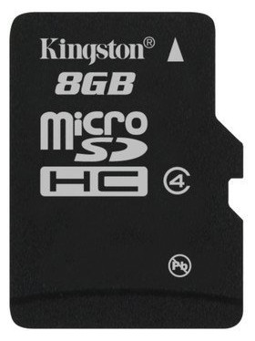 Micro SD card (at least 1GB) for transmitter ([link](https://www.amazon.co.uk/Kingston-8GB-Micro-SD-HC/dp/B001CQT0X4/)).
| &euro;5 | 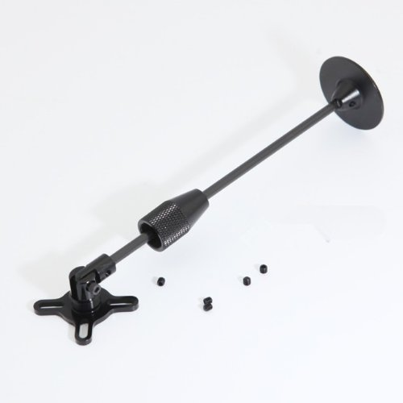 GPS mast - separates the GPS unit from interference from the rest of the system ([link](https://www.unmannedtechshop.co.uk/foldable-gps-mast-mount/)).
| &euro;7.50 | 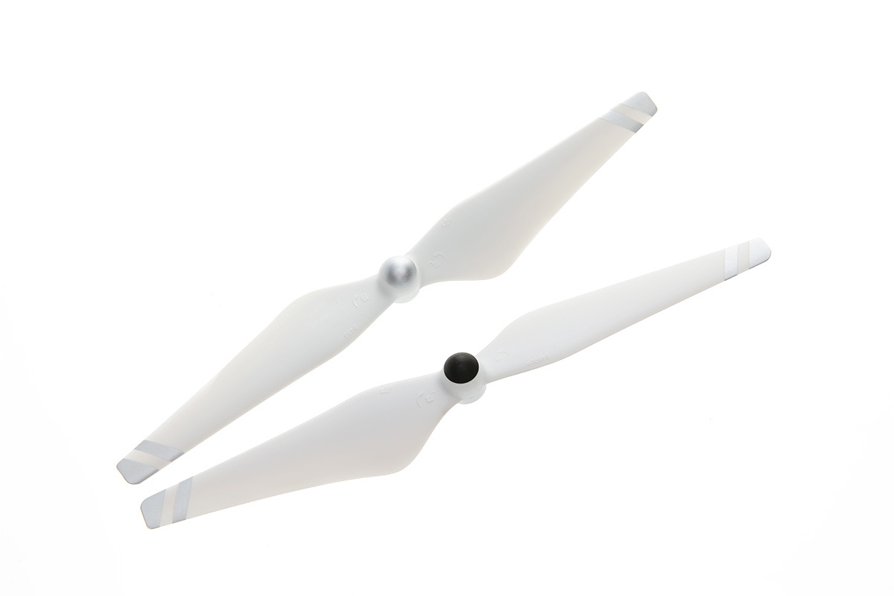 Spare propellers ([link](https://store.dji.com/product/9450-self-tightening-rotor-white-silver-stripes)).
| &euro;17 | 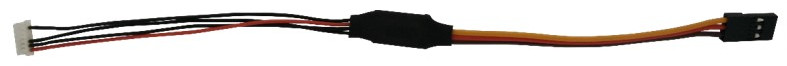 Telemetry cable ([link](http://www.craftandtheoryllc.com/product/telemetry-cable-flightdeck-taranis-opentx-ardupilot-arducopter-pixhawk-2-cube-servo-frsky-smartport-smart-port-df13-jst-gh-serial/)).

### Additional physical components

| Price | Description |
|-------|-------------|
| &euro;1 | 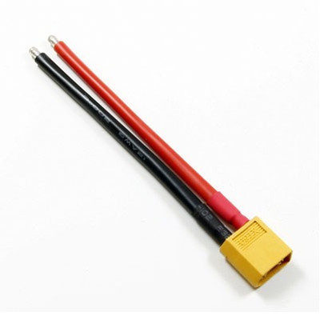 XT60 male power connector - connects the PDB to the power module ([link](https://www.unmannedtechshop.co.uk/male-xt60-wire-10cm/)).
| &euro;3 | 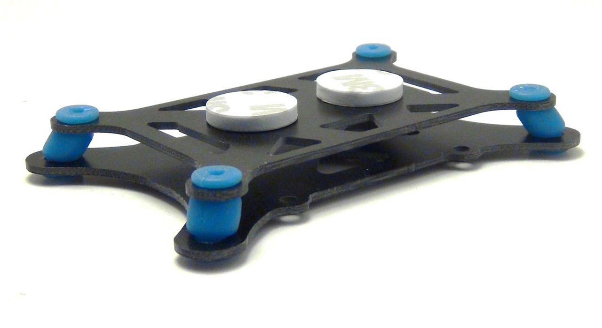 Vibration damping mounting set - isolates the flight controller from the vibration of the frame ([link](https://www.unmannedtechshop.co.uk/vibration-damping-mounting-set/)).
| &euro;3 | 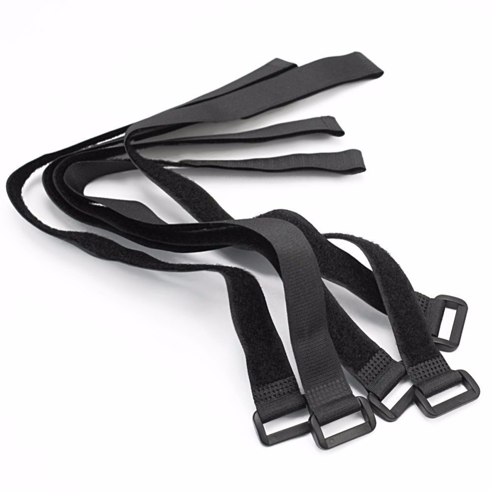 Hook and loop velcro straps - attach battery to frame ([link](https://www.unmannedtechshop.co.uk/hook-loop-battery-strap-pack-of-5/)).
| &euro;2 | 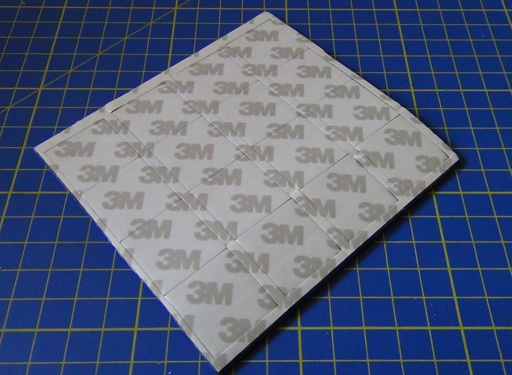 Mounting foam - attach ESCs and other components to the frame ([link](https://www.unmannedtechshop.co.uk/3m-double-sided-mounting-foam/)).
| &euro;5 | 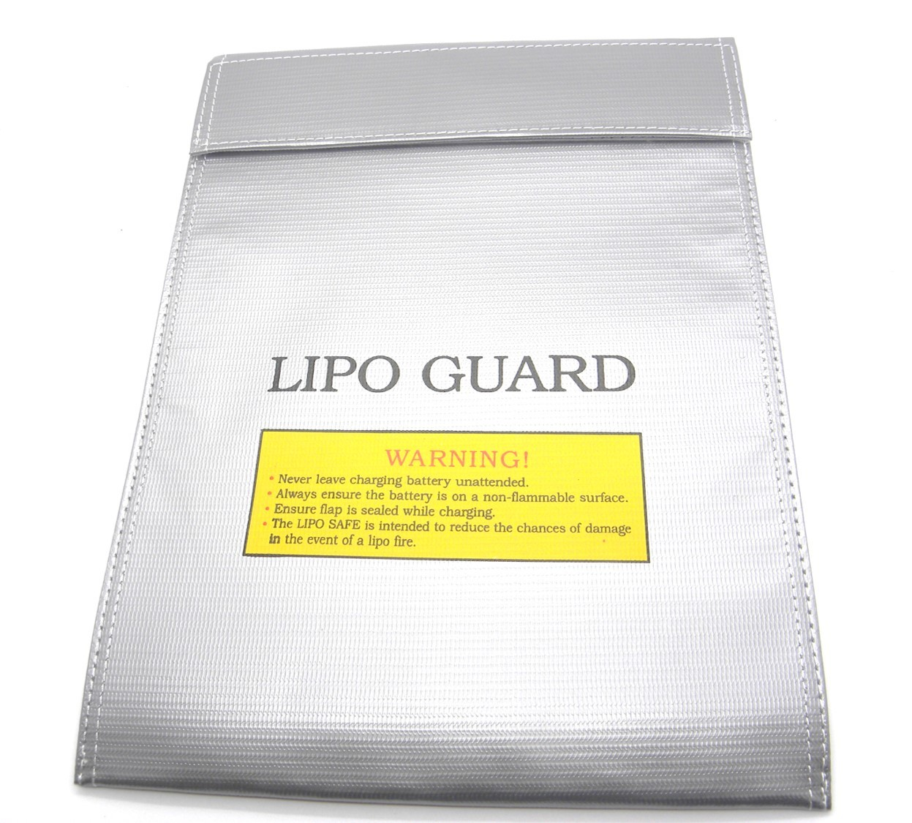 LiPo safety bag - keep LiPos safely contained when charging or not in use ([link](https://www.unmannedtechshop.co.uk/lipo-safety-bag/)).

#### Batteries

I ordered many of my parts internationally however there are severe restrictions on the transport of LiPo batteries and some carriers refuse to transport them at all - the UK Royal Mail for example will destroy any package found to contain them. So it may be easiest to order the batteries from a local distributor - however they may not have the particular brand (Tattu) of LiPo listed above. The important things is to buy a 4S (4S1P means the same thing) 14.8V battery with an XT60 connector. The other two values typically quoted for a battery, C and mAh, are less important but it should be 3500mAh or more for a reasonable amount of flying time. The odd thing about LiPo batteries is a lack of standardization on the main connector (you can see some of the different types [here](http://www.tjinguytech.com/reviews/rc-connectors)), so make sure to buy one with an XT60 connector in order to match the power module listed above. LiPo batteries are dangerous and you should not buy second hand or cheap no-brand batteries. I bought Tattu batteries but a similar suitable example would be this [Turingy 3600mAh battery](https://hobbyking.com/en_us/catalog/product/view/id/69399/s/turnigy-battery-3600mah-4s-30c-lipo-pack-xt-60) from HobbyKing.

#### Soldering

As already noted some minor soldering is required - it's assumed you already have a soldering iron and solder and know how to use them.

#### Miscellaneous parts

The [F450 user manual](http://dl.djicdn.com/downloads/flamewheel/en/F450_User_Manual_v2.2_en.pdf) additionally notes that you'll need threadlocker, a 2mm hex key, [nylon cable ties](https://www.amazon.co.uk/Green-Cable-100Mm-2-5Mm-All/dp/B00904S2DE), scissors and [flush cutters](https://www.sparkfun.com/products/11952). The hex key and the threadlocker (which is something I'd never heard of before) are covered in the [miscellaneous parts](notes.md#miscellaneous-parts) note, however it turns out that the screws that come with the F450 frame kit already have threadlocker applied so you do not need to buy additional threadlocker.

Details
-------

The following sections cover the major components of the quadcopter including some non-physical elements such as the flight stack. The details here are more general notes rather than good explanations and could certainly do with more high level introduction but hopefully anything that isn't made clear here should become clearer as we proceed through the actual build.

### Frame

The frame is the basic physical platform to which all other components are attached. While most of the other components are updated on a regular basis, frame design seems to evolve at a slower pace. The [DJI Flame Wheel](https://www.dji.com/flame-wheel-arf/feature) F450 frame came out in early 2012 and still seems to be one of the most popular non-race quadcopter frames.

I choose it because it's recommended on many first time build page (such as the ArduPilot [build your own multicopter](http://ardupilot.org/copter/docs/build-your-own-multicopter.html)) and it has more available space in its central section than it's little brother - the F350 - without the extra complexity and expense of its six armed big brother - the F550.

It consists of four arms and a top and bottom central plate. The bottom plate also serves as the PDB (power distribution board), i.e. the board that connects the motors (via ESCs) to the battery (via the power module). The ESCs (covered later) are soldered directly to the PDB, as is a cable for connecting the PDB to the power module.

Note: if you buy the E305 propulsion system separately from the frame then it will come with a small PDB so that the propulsion system can be used with any frame, this separate PDB is not needed when using the F450 frame.

### Power module

The PDB distributes power to the ESCs (and from them to the motors). The power module consists of a main cable that's split in two with a tiny circuit board (PCB) in the middle. The main cable connects to the battery at one end and to the PDB at the other end and most of the power simply flows through from the battery to the PDB. However there's also another smaller cable, with a 6-position connector, coming out of the PCB - this connects to the flight controller and provides it with power along with current and voltage information (allowing it to monitor the state of the battery).

### Flight controller

The flight controller is the brains of the operation. It's one of the largest components in the system, essentially it's a small computer with its own internal sensors and connectors allowing it to take input from external components (such as the GPS and compass), interact with the receiver and control the rest of the system.

It's internal set of sensors are together called an IMU ([inertial measurement unit](https://en.wikipedia.org/wiki/Inertial_measurement_unit)). For a drone the typical IMU covers 10 [degrees of freedom](https://en.wikipedia.org/wiki/Degrees_of_freedom_(mechanics)) that are provided by:

* A 3-axis gyroscope.
* A 3-axis accelerometer.
* A 3-axis magnetometer (compass).
* A barometric pressure (altitude) sensor.

It's fairly obvious how important such sensors must be for a drone - if you'd like to experiment with such sensors (and with the MCU) then see the [IMU and MCU section](notes.md#imc-and-mcu) on the notes page.

Note: if the IMU has a compass you might wonder why the GPS module also has one. The GPS module is normally raised away from the main body of the craft, on a mast, in order to isolate it from electrical noise - this noise is also an issue for the IMU's compass so, if present, the compass of the GPS module is used in preference.

The flight controller is often also called the autopilot but this shouldn't confuse you into thinking it's just needed for autonomous flight - it's handling tasks like controlling the speed of the individual motors, via the ESCs, irrespective of whether a preprogrammed path is being followed or someone is directing the drone from the ground.

Note: some people distinguish between the terms flight controller and autopilot - using the term flight controller for the kind of systems found in the drones aimed at the racing crowd that are not capable of autonomous flight while restricting the term autopilot to systems that combine a flight controller with all the bits necessary for autonomous flight, e.g. as [here](http://www.dronetrest.com/t/beginners-guide-to-drone-autopilots-flight-controllers-and-how-they-work/1380) on the DroneTrest site. However this is far from universal and many sources just use the two terms interchangeably.

There are many flight controllers but as noted earlier I wanted an open source hardware implementation. I chose the Pixhawk flight controller which is covered in the next section.

### Pixhawk

The [Pixhawk](https://pixhawk.org/modules/pixhawk) is an [open source hardware](http://freedomdefined.org/OSHW) flight controller that originated at [ETH Zurich](https://en.wikipedia.org/wiki/ETH_Zurich) and is the de-facto standard high end open source hardware flight controller. It is the most commonly used flight controller when using the popular [ArduPilot flight stack](http://ardupilot.org/dev/docs/apmcopter-code-overview.html) and the [PX4 flight stack](http://px4.io/docs/px4-basic-concepts/) - at least in the hobbyist community - though neither of these flight stacks is tied to the Pixhawk.

It is the most expensive component in the parts list above and there are certainly cheaper flight controllers - the most interesting of which seems to be the OpenPilot [CC3D Revolution](https://www.unmannedtechshop.co.uk/openpilot-cc3d-revolution-flight-controller/) which is a product of the [LibrePilot](https://www.librepilot.org/) project (a successor to the now defunct OpenPilot project).

However I chose the Pixhawk as I liked the flight stack projects that used it and liked the fact that it is popular in academic environments.

While the Pixhawk is open source hardware most discussions recommend the [3DR](https://3dr.com/) produced Pixhawk and warn against cheap chinese produced versions. However 3DR no longer produce the Pixhawk version you see covered by the [pixhawk.org](https://pixhawk.org/) and [px4.io](http://px4.io/) sites and have pivoted and pivoted again in trying to find a profitable business model - they no longer focus on producting hardware (see [here](https://techcrunch.com/2017/04/27/investors-are-betting-3dr-can-find-life-after-solo-as-a-drone-data-platform/) for a TechCrunch take on this).

So at the moment you have no choice but to go with a version produced by some other manufacturer. I did some searching and after excluding completely unknown knock-offs I came up with the following list:

* [Unmanned Pixhawk](https://www.unmannedtechshop.co.uk/unmanned-pixhawk-autopilot-kit/)
* [3DXR Pixhawk](https://www.3dxr.co.uk/product/pixhawk-1-v2-4-8-m8n-gps-power-brick/)
* [Holybro Pix32](http://www.holybro.com/product/11)
* [RadioLink Pixhawk](http://www.radiolink.com.cn/doce/product-detail-116.html)
* [HKPilot32](https://hobbyking.com/en_us/hkpilot32-autonomous-vehicle-32bit-control-set-w-power-module.html)

The Unmanned, HKPilot32 and 3DXR Pixhawks are available directly from their producers, while the Holybro can be picked up e.g. from [Synosystems DE](https://synosystems.de/de/kategorien/315-pix32-px4-246-pixhawk-flight-controller.html) and the RadioLink from e.g. from the [RobotShop INT](http://www.robotshop.com/eu/en/radiolink-pixhawk-advanced-autopilot.html). There are no end of versions from anonymous manufacturers on sites like AliExpress and Banggood, e.g. this [full package](https://www.aliexpress.com/item/PX4-PIX-2-4-8-32-Bit-Flight-Controller-433-915-Telemetry-Neo-M8N-GPS-Minim/32759523206.html) on AliExpress and this more [basic bundle](https://www.banggood.com/Pixhawk-PX4-2_4_8-Flight-Controller-32-Bit-ARM-PX4FMU-PX4IO-Combo-for-Multicopters-p-1040416.html) on Banggood. The examples just quoted from AliExpress and Banggood are dramatically cheaper than from other sources but you can't really know what you're getting.

I went with the Pixhawk version from Unmanned Tech UK as they seem more engaged in the whole scene than many other suppliers, they are linked to as having been suppliers of the original 3DR version on the pixhawk.org site and are mentioned favorably on other sites. I bought it bundled with a [Ublox Neo-M8N GPS module](https://www.unmannedtechshop.co.uk/ublox-neo-m8n-gps-with-compass/) and an [APM power module](https://www.unmannedtechshop.co.uk/high-voltage-apm-power-module-with-3a-ubec/). TODO: and telemetry kit?

Note: apparently the HobbyKing Pixhawk isn't connector compatible with other makes (see [where to buy section](https://pixhawk.org/modules/pixhawk#where_to_buy) on pixhawk.org, though I haven't been able to confirm this from any other source).

### Flight stack

The flight stack is the software that runs on the flight controller hardaware and covers, among many other things, both basic direct remote control and fully autonomous autopilot operation.

As already mentioned the Pixhawk supports two flight stacks - PX4 and ArduPilot (the pixhawk.org site used to feature a page covering the choice between the two, it's now gone but you can still find [it on the Wayback Machine](https://web.archive.org/web/20150915080740/http://www.pixhawk.com/choice)).

Note: the ArduPilot stack, often abbreviated as APM (for ArduPilotMega), is rather misleadingly named. It comes from its early days when it originally ran on the [Arduino Mega](https://www.arduino.cc/en/Main/arduinoBoardMega). Those days are long gone and it now runs on ARM processors, like the one found in the Pixhawk, and various other platforms. This [code overview](http://ardupilot.org/dev/docs/apmcopter-code-overview.html) shows it can run on Linux and that when it runs on the Pixhawk it actually sits on top of the PX4 firmware.

When it comes to comparing the PX4 and ArduPilot flight stacks there's lots of confusing and often contradictory information out there. For some information see [this thread](http://discuss.ardupilot.org/t/apm-stack-question-apm-vs-px4/11497) and [this one](http://discuss.ardupilot.org/t/new-guy-here-trying-to-make-sense-of-it-all/9255) on the ArduPilot forums and [this thread](http://discuss.px4.io/t/px4-vs-ardupilot-when-to-choose-what/2214) and [this one](http://discuss.px4.io/t/px4-vs-ardupilot-arduplane-for-mapping-photogrammetry-using-fixed-wing/1766) on the the PX4 forums.

The [ArduPilot stack](https://github.com/ArduPilot/ardupilot) and the [PX4 one](https://github.com/PX4/Firmware/) can both be found on Github and both are clearly under active development.

PX4 appears to be more a product of the academic community while ArduPilot appears to a product of the hobbyist community with some resulting differences in focus, e.g. PX4 seems to focus more on autonomous flight while ArduPilot perhaps more on direct control.

Both though work with ground control software for autonomous operation, e.g. Mission Planner (for ArduPilot) and QGroundControl (originally developed to work with PX4 but now also compatible with ArduPilot). See the [ground station](http://ardupilot.org/copter/docs/common-choosing-a-ground-station.html) section of the ArduPilot site for some comparison of ground control applications.

### ESC

The propulsion systems constists of the propellers, motors and ESCs ([electronic speed control](https://en.wikipedia.org/wiki/Electronic_speed_control)). ESCs are responsible for driving the motors at the speed requested by the flight controller. An ESC contains its own microcontroller (generally an Atmel ATmega or a Silabs 8051). For more information on ESCs see this DroneTrest [guide](http://www.dronetrest.com/t/what-to-consider-when-buying-a-esc-for-your-multirotor/1305).

I chose the E305 propulsion system as it's the standard system sold with the F450 frame (and can be bought bundled together with it as a kit). The ESCs are the most expensive element in the E305 propulsion system (one ESC being just a little more expensive than its corresponding motor).

There are open source hardware ESC implementations and many commercial ESCs are flashable with open source firmware (the main open source firmwares being [BLHeli](https://github.com/bitdump/BLHeli) and [SimonK](https://github.com/sim-/tgy)). However there seem to be no really popular open source hardware implementations and configuring the open source firmwares for your particular ESCs (whether commercial or open source) is non-trivial. So for this piece of hardware it seemed easiest to stick with the commercial ones from DJI and consider them non-upgradable black boxes. Many closed source hardware manufacturers produce ESCs that come with the BLHeli firmware as standard, e.g. the [Turingy Multistar 20A](https://hobbyking.com/en_us/turnigy-multistar-20a-v2-esc-with-blheli-and-4a-lbec-2-6s.html) or the [DYS XM20A](https://hobbyking.com/en_us/xm20a-mini-esc.html).

**Update:** it seems that in recent years BLHeli has completely eclipsed SimonK and unfortunately the main developer has decided to make future development closed source (see this [post](https://www.rcgroups.com/forums/showpost.php?p=37259534&postcount=60) and the related thread on RCGroups).

DJI make a big deal of the fact that their propulsion systems, including the E305, are "tuned" propulsion systems - that the ESCs rather than being sold for use with arbitrary motors have been specifically tuned to work very well with the motors sold as part of the same system. This seems to have been well received by reviewers.

Note: for earlier DJI propulsion systems the system and the ESCs had the same name, e.g. E300. For the E305 system that's no longer the case and the ESCs are named 420 LITE.

### Transmitter and receiver

The transmitter is the handheld control unit while the receiver is the corresponding component in the drone that receives instructions from the ground and communicates them to the flight controller. The names transmitter and receiver reflect their primary/historical function - these days communication between them is now two way.

The transmitters and receivers from the manufacturers FrSKY seem to be the most popular choices for pairing with the Pixhawk and the information relating to hooking up FrSKY components to the Pixhawk is certainly the easiest to follow.

The Taranis X9D+ is a mid-spec transmitter that historically has been very popular choice for setups like the one here. However it's little brother the cheaper Q X7 came out in early 2017 - it's a somewhat cut down version of the X9D+ but is very similar in most respects and runs the same [OpenTX](http://www.open-tx.org/downloads) firmware. See the DroneTrest blog for a [comparison of the two transmitters](http://blog.dronetrest.com/taranis-x9d-or-taranis-q-x7-which-is-better-to-buy/).

**Update:** the Q X7 actually has some improvements over the X9D+, like an S.BUS port that makes using it to upgrade the receiver very simple, and I prefer it's simpler design - the Q X7 is more than adequate for this purpose and I would choose it over the X9D+ irrespective of cost.

The recommended receiver to go with the FrSKY transmitter, for this kind of build, is the [X8R](https://www.unmannedtechshop.co.uk/frsky-x8r-8-16ch-s-bus-accst-receiver-with-smart-port/). While it features a big 3x8 row of servo pins that are unneeded for this build, its design makes it easier to plug together with other components using standard servo cables than smaller but otherwise equally suitable transmitters like the "naked" [X4R-SB](https://www.unmannedtechshop.co.uk/frsky-x4r-sb-eu-naked-receiver-without-case/) or the [R-XSR](https://www.rcgroups.com/forums/showthread.php?2935614-FrSky-new-arrival-Full-range-ultra-mini-redundancy-receiver-R-XSR%21).

The ArduPilot [FrSKY telemetry page](http://ardupilot.org/copter/docs/common-frsky-telemetry.html) describes telemetry support for various FrSKY receivers and lists the X8R as the best supported (along with the X6R).

You can optionally connect the flight controller to the receiver using a telemetry cable, this allows the flight controller to communicate telemetry information, such as the GPS location of the craft, to the transmitter which can display this data on its LCD screen.

Note: the pixhawk.org site still lists the old D4R-II as their recommended FrSKY receiver on their [FrSKY page](https://pixhawk.org/peripherals/radio-control/frsky) and on their [FrSKY telemetry page](https://pixhawk.org/peripherals/telemetry/frsky). However this information is just stale and everywhere else you find the later X series receivers being used in recent builds and the ArduPilot [FrSKY telemetry page](http://ardupilot.org/copter/docs/common-frsky-telemetry.html) describes the D4R-II as deprecated as far as their flight stack is concerned.

Telemetry kit
-------------

TODO: install the [telemetry kit](https://www.unmannedtechshop.co.uk/100mw-ardupilot-unmanned-telemetry-kit-v2-433mhz/) and get the relaying of telemetry information and direct control from the ground station working. If all works out add it to the parts list and add more details here.
