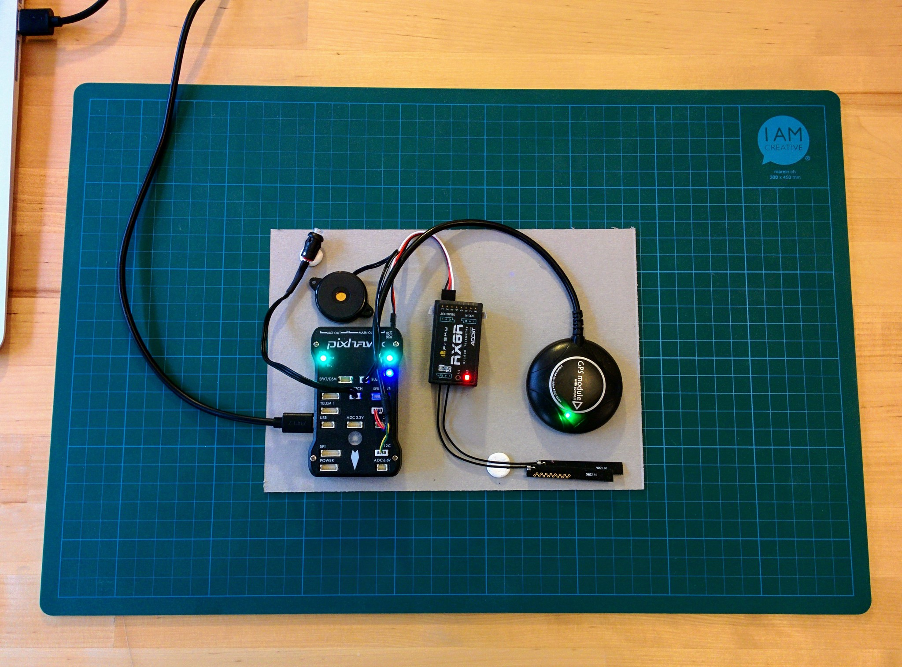
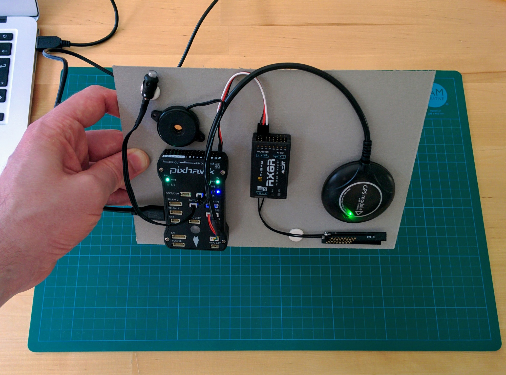

Pixhawk setup
=============

For reasons we won't go into here Microsoft Windows has a much bigger issue with small hobbyist electronic devices that aren't backed by big corporations (who can pay up for a USB vendor ID and Windows certification).

Often these devices appear to your computer as simple serial devices (the kind of thing that was common back in the days when people still used analog modems) or as generic USB storage devices. As such they can generally be connected to Mac or Linux machines without the need to install any extra drivers. This is not the case with Windows - where driver installation and setup generally forms a major part of using one of these device with your computer.

If updating the firmware on your transmitter or receiver or trying to connect a small FPV flight controller to something like [CleanFlight](http://cleanflight.com/) or [BetaFlight](https://github.com/betaflight/betaflight/blob/master/README.md) the driver setup generally it involves something like [Zadig](http://zadig.akeo.ie/) (though recently an apparently more convenient/automatic solution is available in the form of the [ImpulseRC Driver Fixer Tool](http://www.dronetrest.com/t/fix-any-stm32-dfu-drivers-issues-when-flashing-betaflight-cleanflight-firmware/3603)).

Having said all that it's nice to find out that for the Pixhawk drivers aren't an issue on any plaform, whether it's Windows, Mac or Linux. Mac and Linux don't need any additional driver and on Windows the popular ground control application when installed also automatically install the correct Pixhawk related drivers rather than leaving it to you as a separate step.

But what's ground control software? They fulfil a number of roles. Once your system is fully setup it's the software that you run on your computer to plan out routes that can be uploaded to the Pixhawk and can then be followed autonomously by your drone once it's in the air. If you've got a telemetry kit (like this [one](https://www.unmannedtechshop.co.uk/100mw-ardupilot-unmanned-telemetry-kit-v2-433mhz/)), with a ground module that's plugged into your computer and an air module that's plugged into the flight controller on your drone, then the ground control software can track the status of your drone in flight (showing it's location, battery level and other telemetry data) and also control the drone in a similar fashion to your transmitter.

But most importantly initially, the ground control application is used to setup and configure your flight controller. It's use after this is optional. You connect your flight controller to your computer via USB and then the ground control application can be used to update the flight stack (either [ArduCopter](http://ardupilot.org/copter/) or [PX4](http://px4.io/) in our case), calibrate the drone's sensors and setup the flight stack (configuring things such as flight modes).

There are a number of ground control applications - the two most popular are [Mission Planner](http://ardupilot.org/planner/) and [QGroundControl](http://qgroundcontrol.com/). Mission Planner only supports the ArduPilot flight stack and only runs on Windows. QGroundControl supports both ArduPilot and PX4 and it runs on Windows, Mac and Linux.

However Mission Planner is by far the most used, so despite the fact that I use a Mac myself I'll go throught setup using Mission Planner on Windows first.

Note: the ArduCopter site describes another ground control application called APM Planner 2 (APMP2) as the [best one for Mac and Linux](http://ardupilot.org/copter/docs/common-choosing-a-ground-station.html#apm-planner-2-0). But this is simply a plug for a project that's closely associated with ArduPilot. I found that the most common questions asked regarding it were of the form "I can do X in Mission Planner, how do I do X in APMP2?" with the answer almost invariably of the form "You can't do X in APMP2, APMP2 isn't really intended for that use case." So it seems they're not even aiming to create a full feature ground control application, it's unclear though what particular audience they are targeting.

TODO: add pointer to [`windows-vm.md`](windows-vm.md) and add note on the need to add a [USB filter](windows-vm.md#usb-filters) for the Pixhawk.

Mission Planner setup
---------------------

Download the latest Mission Planner (MP) version using the link in the [installation section](http://ardupilot.org/planner/docs/common-install-mission-planner.html) of the MP documentation (you can also browse around in the [directory](http://firmware.ardupilot.org/Tools/MissionPlanner/) containing the MP installation file if you're interested). At the time of writing (and for some time now) the EU mirror for MP is amazingly slow - it takes more than 20 minutes to download the roughtly 60MB installation file.

As noted elsewhere MP also installs all necessary Pixhawk drivers so no additional driver installation is needed. When running MP for the first time is asks you if you want to enable [Altitude Angel data](https://www.altitudeangel.com/Home/Developers) - you should probably select _Yes_ as this data is needed by MP to highlight things like restricted airspaces around airports. You then have to register for a free Altitude Angel account and allow MP to access it. In the background Windows will also have popped up a Firewall dialog asking if you want to allow MP to access networks (I ticked the boxes for both private and public networks). It then asks you if you want to run the setup wizard - this will set up your Pixhawk - however I suggest skipping the wizard at this point and just let it open the normal full MP application.

I've found MP can be a little flakey during its first run (if you run it from the command prompt you can see various errors being output that don't appear subsequently once you've allowed firewall access etc.) So I suggest just expanding the MP window (it's initially squashed up small enough to fit on even the smallest screen) and then restarting it (it will start with the same window size as it had when you exited).

I've also seen MP incorrectly inform me that a newer firmware version was available, e.g. it told me that version 3.5.0 was available - this was technically true, 3.5.0 was available for the helicopter version of the firmware but 3.4.6 was still the latest available quadcopter version and was the version already on my Pixhawk. The version number file stored with the latest stable quadcopter firmware can be seen [here](http://firmware.eu.ardupilot.org/Copter/stable/PX4-quad/git-version.txt).

Once MP is up and running click on _Initial Setup_ and then on _Wizard_. The wizard is fairly self explanatory:

* First you select your vehicle type, i.e. multirotor in this case.
* Then the multirotor type, the simple four motor X type.
* Then connect your Pixhawk - and select it from the dropdown list (most probably there'll only be one item in the list, e.g. COM3).

I have no Windows machine so I run Windows as a VM within VirtualBox - while all other aspects of using MP with VirtualBox worked perfectly, trying to install firmware via the VM never worked. So instead I always loaded firmware using QGroundControl (which is covered later). Once the latest firmware is installed you can cause the MP wizard to skip the firmware step by first clicking the _Connect_ button (upper-right in the main MP window) and only then starting the wizard - this time it goes through the same initial steps but then jumps the firmware steps and goes straight onto the calibration steps:

The wizard could do with some work on its usability - especially when it comes to the calibration steps. You might expect the _Next_ button to initiate the calibration covered by a particular step but it will actually skip it - each page of the wizard generally has another button to actually starts the given calibration process - and for some steps there's an additonal non-obvious button that needs to be pressed to mark the step as completed. As we'll see being able to skip steps is important - as it's essentially impossible to complete the wizard in one go, you have to quit it and redo it a number of times, skipping the steps you've already completed.

OK - so onto the calibration:

* Accelerometer - as instructed you have to place you system in turn flat, on its left, right, nose, tail and back, pressing a key after each step. Each time I tried this I eventually got the message "3D Accel calibration needed" at some point in the process - I had to look at the [source code](https://github.com/ArduPilot/ardupilot/blob/126296b/libraries/AP_Arming/AP_Arming.cpp#L192) to detemine that this really is a critical error meaning that the calibration failed. I just restarted and restarted this step, trying to make the transition between steps - left side to right side etc. - as smooth as possible until eventually the calibration completed without error.
* Compass - this is kind of a hard one to explain - you're probably best off watching the [compass calibration video](https://www.youtube.com/watch?v=DmsueBS0J3E) that they link to. Essentially you want to completely rotate your Pixhawk on all 3 axes, i.e. x, y and z, where the origin is at the center of your Pixhawk. If you're connected via USB then the longer and more flexible your USB cable the easier this will be. As we'll see much later you can also connect to your ground control application wirelessly - which makes rotating things around every which way much easier. In the video the presenter rotates the craft quite slowly. You don't have to do it in such a disciplined manner - you can just rotate your setup rapidly every which way (making sure to get in full rotations on all three axes), the calibration logic doesn't care what order the data points come in and won't give up recording data points until it's satisfied that it's got what it needs. If you're interested in what's going on here Adafruit have a nice tutorial on the electronics involved and this step equates to what they cover in the [magnetometer calibration section](https://learn.adafruit.com/ahrs-for-adafruits-9-dof-10-dof-breakout?view=all#magnetometer-calibration).
* Battery monitor configuration - here you just need to choose "Pixhawk" and "3DR power module" for the autopilot and sensor you're using (the power module is equivalent to the original 3DR ones - interestingly the originals are still [available](https://www.amazon.com/dp/B071Y4CZGZ)) and then the mAh value for you battery. In my case this is 3700, if you're using a slightly different battery make sure to specify the correct value.
* Sonar - just click _Next_ as we don't have one.
* Radio calibration - assuming you've bound your transmitter to your receiver (as covered previously), you should now turn on your transmitter and once the green LED on the receiver goes on click the _Continue_ button. The _Spektrum Bind_ section isn't relevant, you just need to click _Calibrate Radio_ then move each stick in turn to its four corners, i.e. covering the furthest points each can go in all directions, you should see red upper and lower bands appear on the throttle, yaw, pitch and roll indicators. When you move the throttle to the lower-right corner you may hear an annoyed beep from the Pixhawk - this is because this stick position is used to arm the flight controller and the beep is telling you that unsurprisinly it's not currently in a state to be armed. Now flip through the switches you've set up to change flight modes, go from flight mode 1 to flight mode 6 - you should see a lower red bar established for radio channel 5 and the high bar getting higher as you flip up through the modes to mode 6. Make sure to press the _Click when Done_ button to wrap up - it will warn you to return you throttle to its lowest position (but doesn't remind you to return your switches to select flight mode 1 which is necessary in order to be able to arm later).
* Flight mode selection - see http://ardupilot.org/copter/docs/flight-modes.html - see if the Painless360 video points up any modes you mightn't have considered just from the ArduCopter page - https://www.youtube.com/watch?v=PC2io5WPTzM

TODO: have I got pitch correctly inverted, cf with Painless360 video.

XXX Sometimes I could quit out of the wizard by pressing the standard close (x) button of its window, but often this did nothing and I had to kill MP with the Task Manager to get out of the wizard.

XXX main LED flashes blue when ready, except for safety button, and flashes green once safety button has been pressed and held such that it stays red.

If you quit out of the wizard and press _Flight Data_ your taken to the view with the artificial horizon where you can generally see a very clear reason displayed for why arming has failed. The messages may be a little unituitive but you can generally find a clear explanation on the page covering all the [pre-arm safety checks](http://ardupilot.org/copter/docs/prearm_safety_check.html) or failing that using Google. The arming failure reasons I experienced were:

* Pixhawk has to be rebooted to save calibration data!!!
* "Check `FS_THR_VALUE`" - this is related to the [radio failsafe](http://ardupilot.org/copter/docs/radio-failsafe.html). There are two radio failsafe mechanisms - no-signal (preferred) and low-throttle. `FS_THR_VALUE` is related to the low-throttle mechanism and, despite the fact that we're actually going to use the preferred no-signal mechanism, the `FS_THR_VALUE` still has to be set correctly. If you're in the _Initial Setup_ view and expand _Mandatory Hardware_ and select _Radio Calibration_. If your transmitter is on you should be able to move the throttle up and down and see the resulting throttle values, move the throttle to its lowest position and note the value, e.g. 982. Then go from _Radio Calibration_ to _FailSafe_ - there's a section there for _Radio_ with the value _FS Pwm_, this value must be at least ten less than your lowest throttle value. In my case it wasn't so I adjusted it down 970. This is all explained in the linked to pages.
* TODO: work in other arm failure reasons below.

* CONTINUE HERE.

Inprogress notes
----------------

_Flat._  

_At 90&deg; on nose._  

_At 90&deg; on right side._  

TODO: is that it's right side, it is relative to the labels on the ports, but if you consider the arrow as pointing in the direction of travel then it's the left when thinking in terms of forward movement (as one would in a car or a train).

TODO: flesh out...

Arming is done by pressing the safety button until it goes solid red and then pushing the throttle to the lower-right corner.

In the wizard you eventually get to a point where it asks you if you can arm.

I couldn't but in the wizard it gives you no info as to the failure reason.

For this you need the main _Flight Data_ view, on the area with the artificial horizon it'll show the failure reason if you cannot arm.

The Pixhawk indicates that it's not ready to arm with double flashing yellow.

TODO: this may not be true - according to pixhawk.org "Amber - Low battery or Failsafe (Return to home, etc)" - so this may just have been because I was in RTL flight mode. Hmmm... if I power up the Pixhawk while in flight mode RTL then it flashes yellow, if I then flip to stabilize then all is good and if I flip back to RTL it (oddly) flashes blue rather than going back to yellow. So flashing yellow only happens if you boot in a stupid mode.

If you try to arm in this situation the Pixhawk will beep loudly twice.

The initial arm failure reason was that the pixhawk had to be power cycled for calibration to take affect.

Then it complained about the lack of a GPS lock - so I then rested on a windowsill until the GPS's secondary blue LED started flashing.

The Pixhawk flashes blue while waiting for a lock.

Then it complained that "GPS speed error 1.4 (needs 1.0)".

However the real issue seems to have been that during the wizard steps I'd flipped the flight mode switches - I should have returned them all to their default position so that I was in acceptable flight mode for take off, i.e. stabilize.

From <http://ardupilot.org/copter/docs/arming_the_motors.html> "You can only arm or disarm in Stabilize, ACRO, AltHold and Loiter mode."

Once everything is good the Pixhawk flashes green to indicate its ready to be armed and once armed it goes solid green.

Note: if you arm the flight controller but then don't apply any throttle, it will fairly quickly return to the disarmed state.

To disarm move throttle to lower-left corner.

If it beeps twice and refuses to arm despite blinking green check you've pressed the safety button!

---

How to reset the flight controller: <http://ardupilot.org/copter/docs/common-parameter-reset.html>

---

QGroundControl
--------------

Install QGroundControl (QGC) as per the [Download and Install](https://docs.qgroundcontrol.com/en/getting_started/download_and_install.html) section of its manual.

For Mac this is no different to installing any other application. For Linux a few more step are involved.

### Linux installation

On the [download page](https://docs.qgroundcontrol.com/en/getting_started/download_and_install.html#ubuntu-linux) there's an easy to use AppImage (for more on AppImage see this [Ask Ubuntu question](https://askubuntu.com/q/774490)) and an old fashioned tar file. I opted for the tar file, so this involved downloading it and then:

    $ sudo apt-get install espeak libespeak-dev libudev-dev libsdl2-dev
    $ tar -xf ~/Downloads/QGroundControl.tar.bz2
    $ cd qgroundcontrol
    $ ./qgroundcontrol-start.sh

The `apt-get` is listed in the [README](https://github.com/mavlink/qgroundcontrol#install-additional-packages) as needed to install all additionally required packages.

Once up and running on Linux the first thing QGC does is point out the usual Linux permissions issue with connecting serial devices like the Pixhawk and tells you how to resolve this:

    $ sudo usermod -a -G dialout $USER
    $ sudo apt-get remove modemmanager

It's a historical hangover that the `modemmanager` package is still installed by default and that the primary user is not a member of the `dialout` group (the group of people who can access serial-like devices like the Pixhawk). An alternative is to setup [udev](https://wiki.archlinux.org/index.php/udev) rules for the Pixhawk like so:

    $ cat > 99-pixhawk.rules << EOF
    # Pixhawk udev rules:
    # * Make it accessable to all users and soft link it to /dev/pixhawk.
    # * Tell the ModemManager to ignore it.
    SUBSYSTEM=="tty", ATTRS{idVendor}=="26ac", ATTRS{idProduct}=="0011", SYMLINK+="pixhawk", MODE="0666"
    ATTRS{idVendor}=="03eb", ATTRS{idProduct}=="2404", ENV{ID_MM_DEVICE_IGNORE}="1"
    EOF
    $ sudo chown root:root 99-pixhawk.rules
    $ sudo mv 99-pixhawk.rules /etc/udev/rules.d

Note: udev will automatically pick up this new rule when you plug in the Pixhawk (you only ever need to force udev to reread rules if the device in question is already plugged in or you've modified an existing rule).

Even after such a rule is added QGroundControl will still complain on startup about permissions but then go and successfully automatically connect to your Pixhawk device without issue.

Using udev rules appeals to nerds like myself - adding yourself to the `dialout` group and removing the ModemManager package is probably a more sensible solution that solves the whole issue, for this device and others, once and for all. The only issue is that existing processes will not automatically pickup on the group change - the bluntest solution to this is to reboot your system (just once after invoking `usermod`).

As often seems to happen with USB devices on Linux if you plug them in and out too often something eventually gets confused and they can no longer be successfully reconnected - in this situation I reset the whole USB system with a script I wrote. You can find it [here](https://gist.github.com/george-hawkins/5d93be322379afdc690b976e4b12dd71) and run it like so (assuming you've made it executable):

    $ sudo ./reset-usb

---
