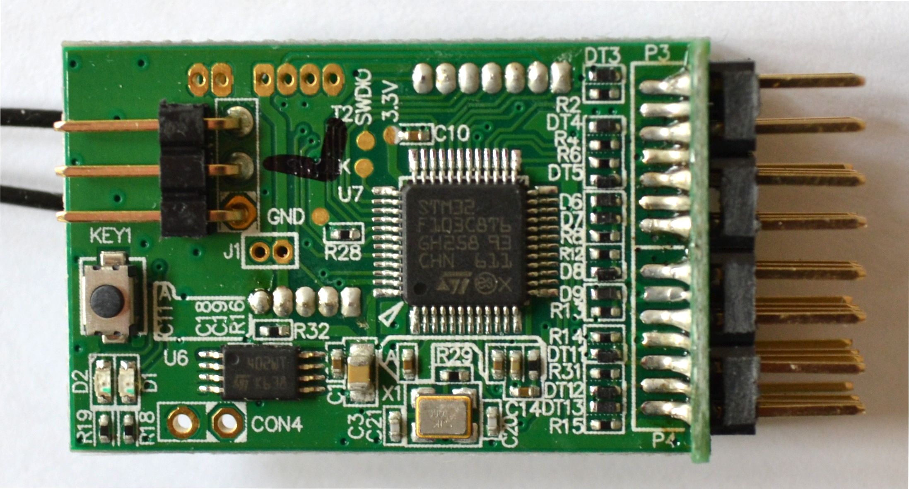
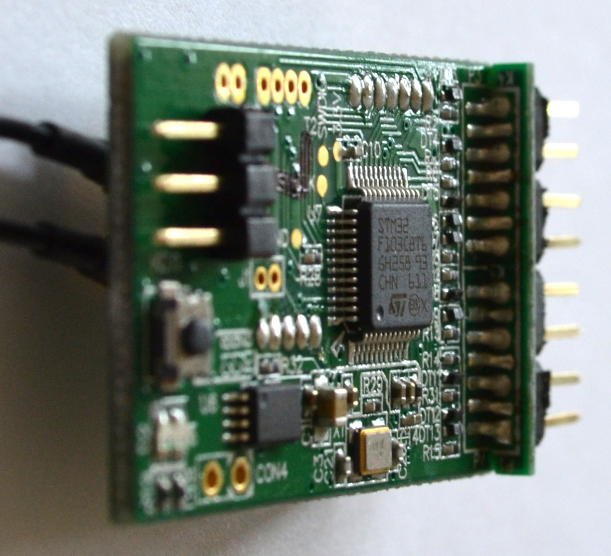
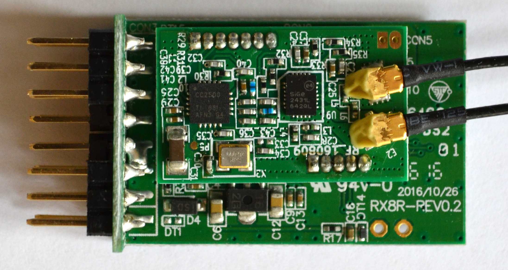
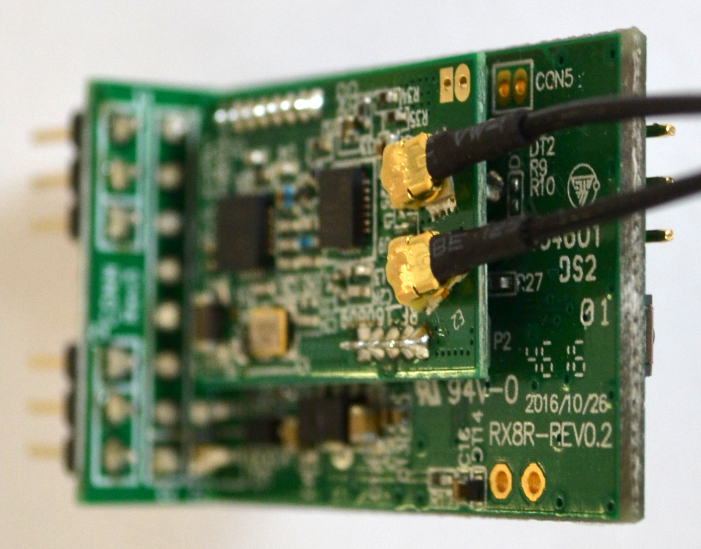
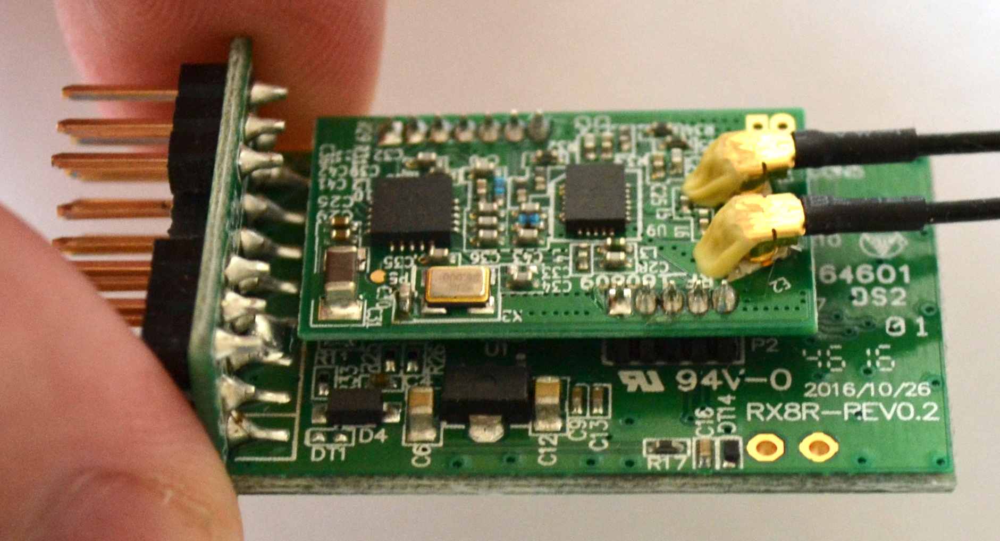
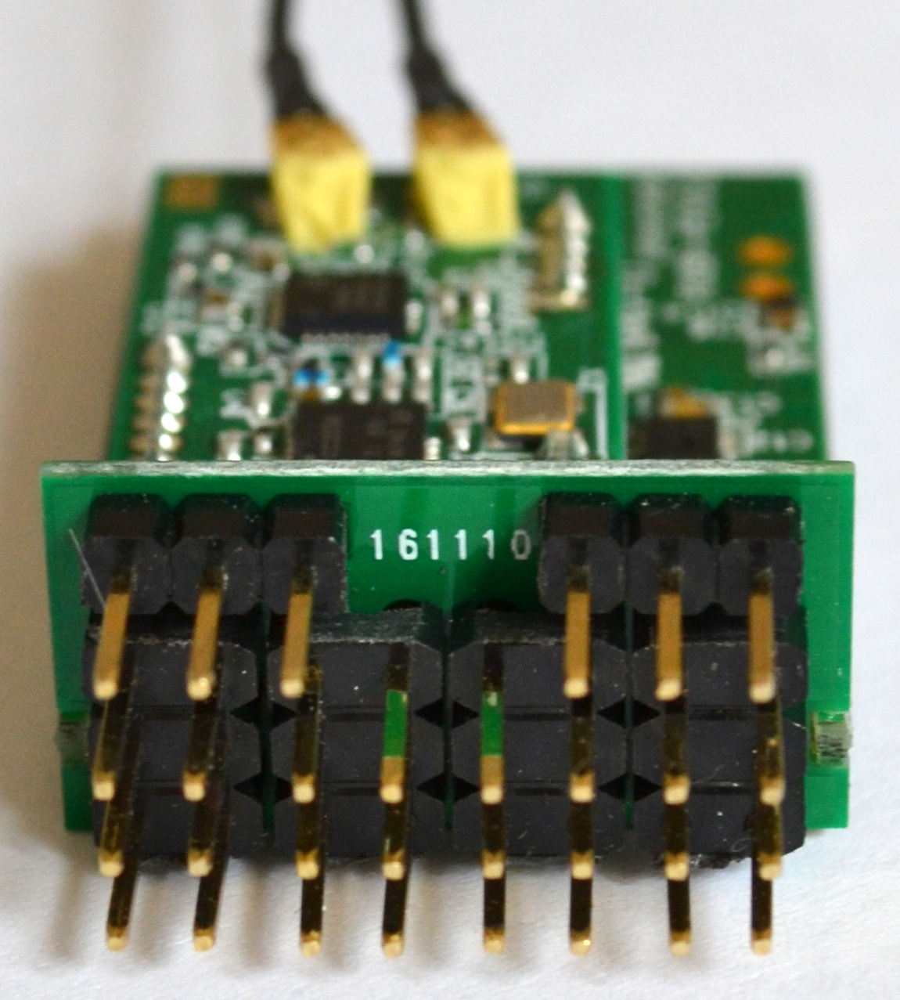
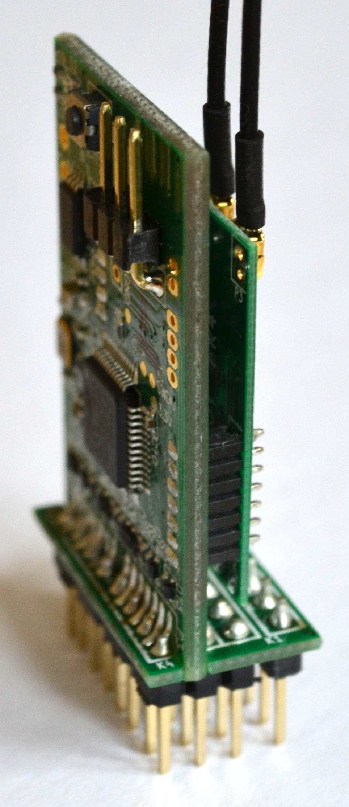

Inside the RX8R
===============

The RX8R consists of a primary PCB and a radio submodule.

The top of the primary PCB has the F/S switch, several pads - GND, 3.3V, SWCLK and SWDIO (the text for SWCLK is largely obscured by a black mark) - and two sets of connections labelled CON4 and J1.

_Primary PCB from the side (Smart Port pins are to the left)._  

_Servo pins with the two S.BUS ports at the bottom._  

_Radio submodule on underside of primary PCB._  

_Radio submodule on underside of primary PCB from right side._  

_Radio submodule on underside of primary PCB from bottom edge._  

Looking at the radio submodule from the top edge we can see two more sets of connections, these ones labelled CON2 and CON5.

_Servo pins with the two S.BUS ports now at the top._  

Looking at the underside of the radio submodule one can just make out another set of connections, labelled P3.

_Closeup of P3._  

