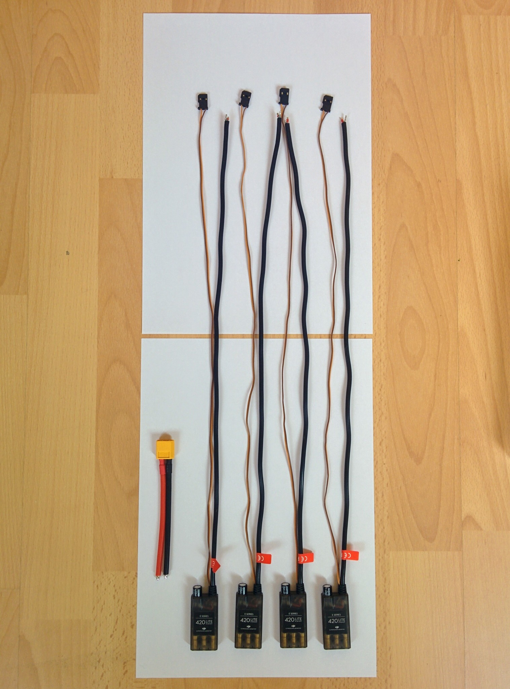
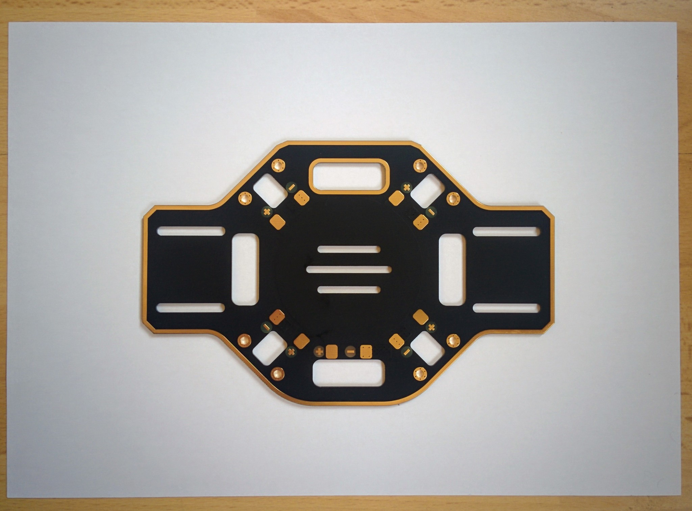
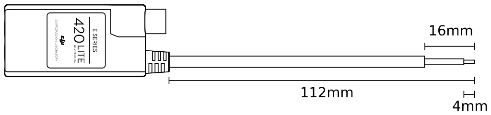
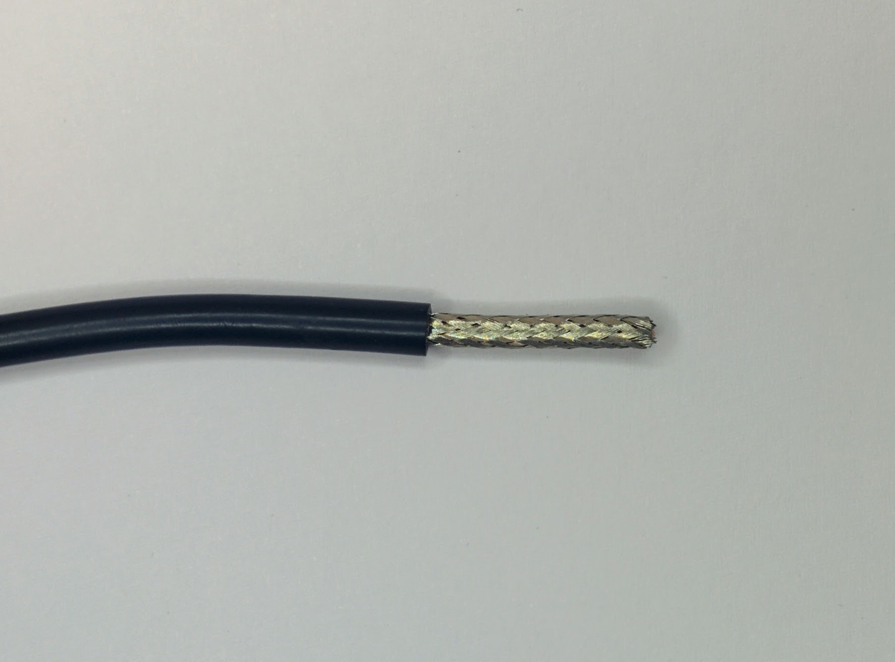
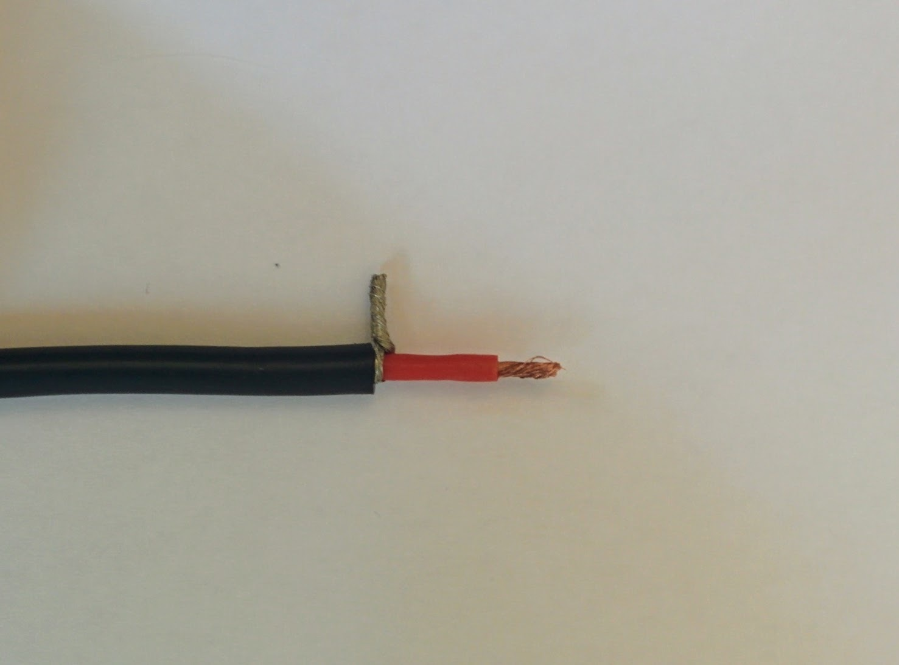
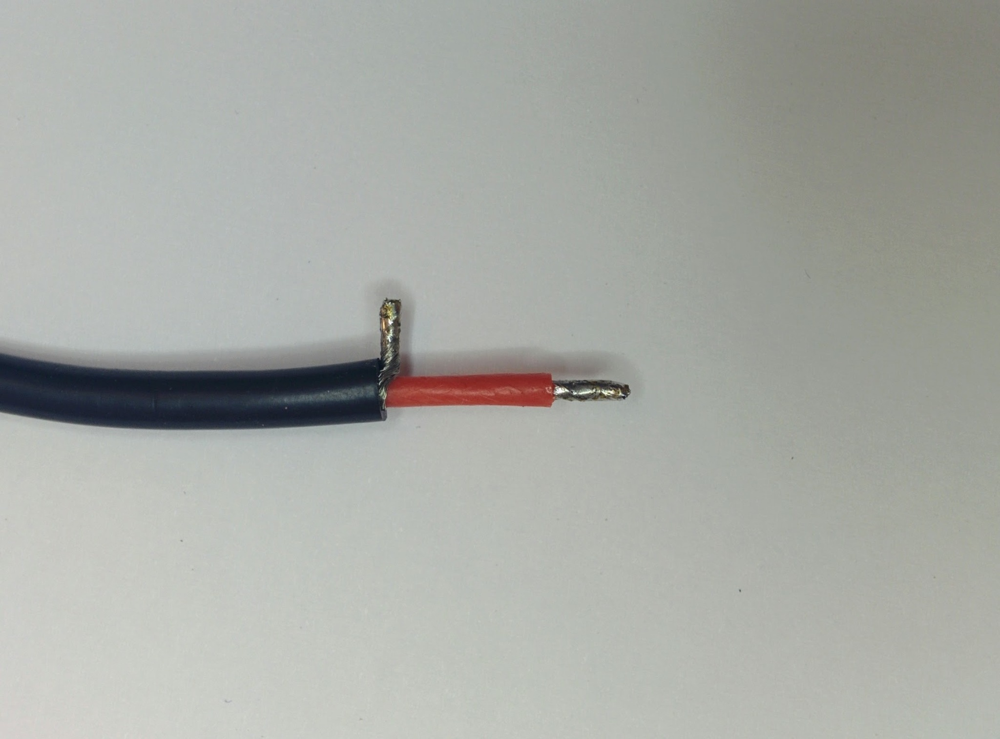
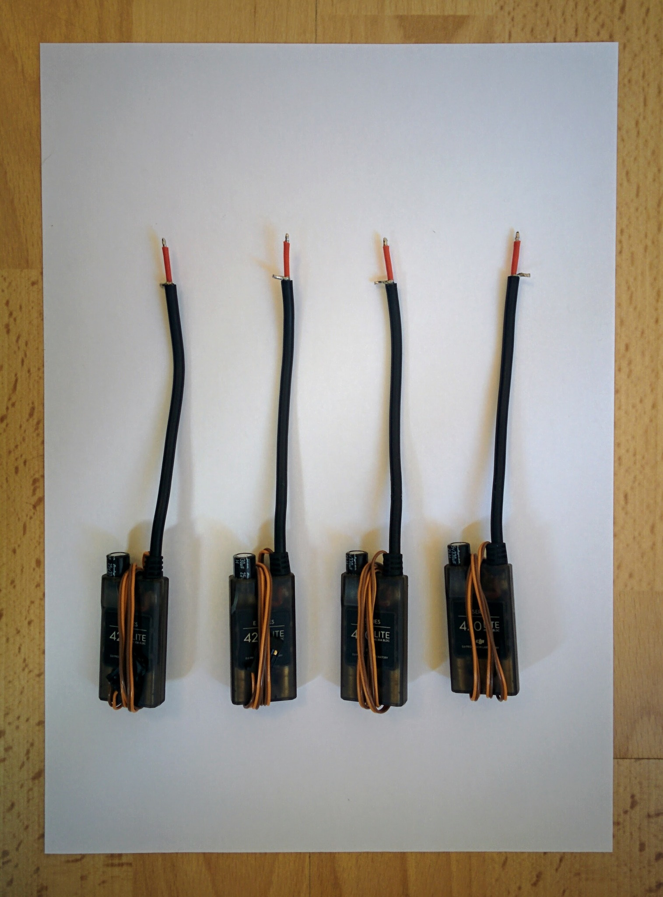
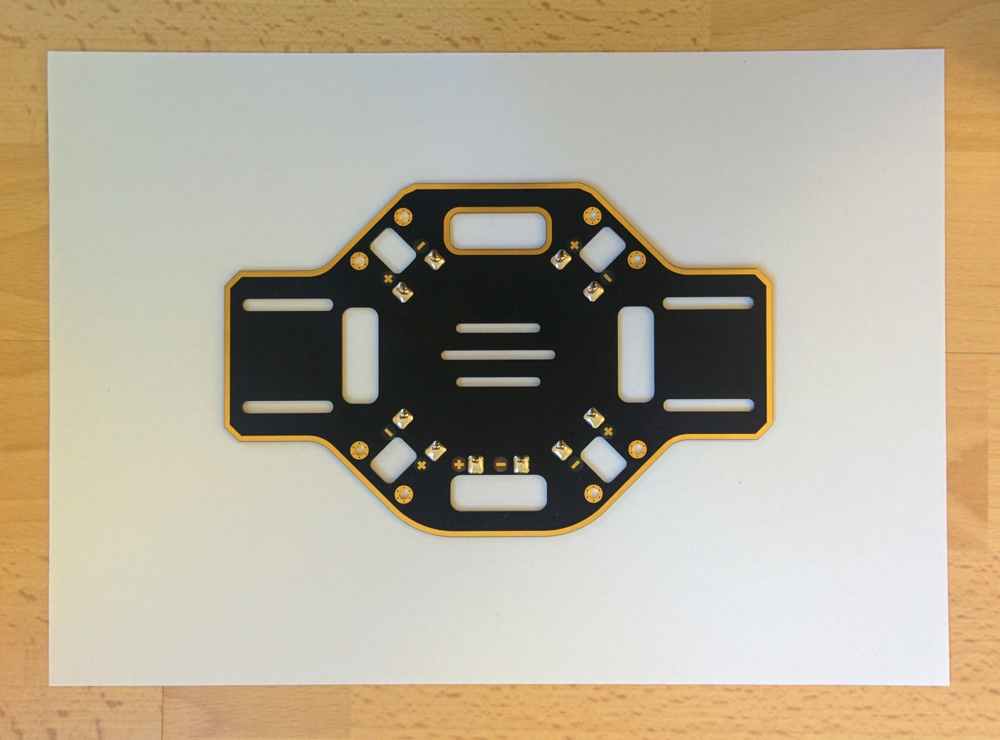
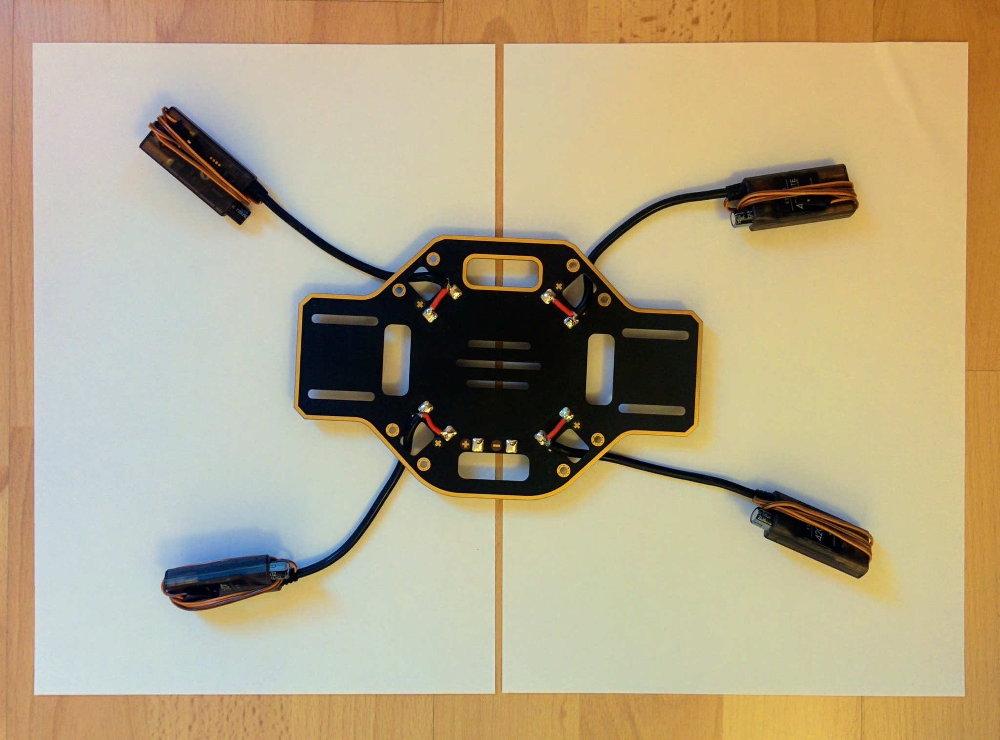
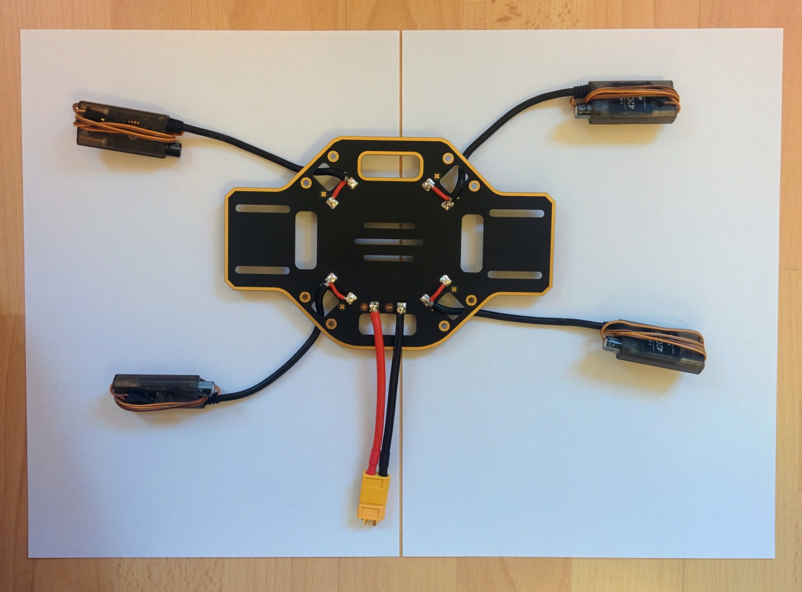

Soldering the PDB
=================

Soldering the ESCs and the power connector to the PDB is the only really tricky part of the assembly. I had soldered [through hole](https://en.wikipedia.org/wiki/Through-hole_technology) components before for hobby electronics projects but this didn't prepare me very well for the soldering involved here - I was surprised at how quickly the heat from the soldering iron was drawn away from the point of contact, meaning that things like the PDB and wires became extremely hot in the process of trying to solder anything.

In hobby electronics projects the solder pads are generally tiny and heat up almost instantly - with the large solder pads involved here the solder behaved quite differently and tended to bead up. Solder paste is not used in electronics projects as it has a corrosive affect but I found it essential here. It's usage seems common with the more heavy duty soldering required for drone building (but many people also seem to be able to get by without it). I found that applying a little to the wires, especially the thicker ones, made them much easier to tin and applying a little (with a tooth pick) to the solder pads on the PDB caused the solder to flow onto them nicely without beading up.

Solder paste does spread out from the point where it's applied and leaves behind a noticeable residue after soldering. I scrubbed this off with pure isopropyl alcohol (like [this](http://uk.farnell.com/kontakt-chemie/kontakt-ipa-200ml/cleaner-ipa-200ml/dp/2142406)) and normal supermarket cotton swabs.

I used something similar to this [solder paste](https://hobbyking.com/en_us/solder-paste-50g.html) from HobbyKing. In videos you also often see people using no-clean flux pens (like this [one](https://www.adafruit.com/product/3468) from Adafruit). Flux and solder paste are quite different things but I can't comment on whether one is better than or more appropriate than the other for the usage seen here.

TODO: can I get a definitive take on this - the fact that HobbyKing sells solder paste but no flux pens seems to imply the former is more used in RC hobbyist circles.

Each ESC comes with two long cables - a servo cable that goes to the flight controller and a power cable that is going to be soldered to the PDB. We're going to leave the servo cables as they are but the power cables are heavy and far too long for this build as they are.

Each motor has its own dedicated ESC. Each motor has three cables coming out of it and the connectors on these cables are inserted into one end of an ESC. The motors are mounted at the ends of the quadcopter arms and the ESCs are mounted on the undersides of the arms. When cutting short the ESC power cables it's obviously important to make sure you don't cut them so short that the fairly short cables on the motors can't reach the ESCs when everything is mounted later.

_ESCs and power connector._  

_F450 PDB._  

I cut my cables down to 112mm, I then removed the last 16mm of the outer black silicone coating to reveal the strands of ground wire that are braided into a sheath around the power wire. The silicone is extremely soft - you just have to gently roll the cable under a craft knife to cut the silicone deeply enough to then be able to pull it off.

_ESC cable length._  

_ESC's braided ground sheath._  

It's easier than it looks to just gently pull apart the braiding with something like a toothpick, leaving you with the individual strands of ground wire.

_Unbraided ground wires._  

These strands can then be pulled sideways and twisted into a single ground wire and cut back to just a few millimeters. You can then also remove a few millimeters of the red coating around the ground wire.

_Strands twisted into single ground wire._  

You can then tin both the ground and power wire (even for these small wires I applied a little solder paste first to make this easier).

_Tinned ground and power wires._  

Once this is done for all four ESCs they're ready to be soldered to the PDB. In this picture I've wrapped the servo wires around the ESCs to keep them out of the way during the soldering job.

_ESCs ready for soldering._  

The PDB first has to be prepared by applying solder to all the pads. Applying solder paste to the pads first made a huge difference to how easily the solder spread out nicely on the pads. When soldering I held the iron to each pad for several seconds (the solder paste clearly heats up and starts to bubble) before applying the solder itself. Quite a lot of solder needs to melted onto each pad - too much though and it becomes hard to remelt later when attaching the wires from the ESCs and the power connector - too little and there isn't enough to properly hold the wires in place.

_Solder on PDB pads._  

I want to mount the PDB upside down so I first brought each the cable up through the hole next to the pads that the cable was going to be soldered to. This is a layout choice that's discussed later. It does make things a little trickier when doing the soldering but connecting the ESCs to the PDB was relatively easy in the end. I applied the soldering iron to each pad until the solder already there remelted then, keeping the iron in place, I brought the appropriate wire down on top of the tip until the tinned solder on the wire also melted. Then I pulled the soldering iron tip out and used it to push the wire into the solder on the pad before removing it and letting things cool. Holding the wire in place while the solder cooled was tricky as the wire got very hot - I had to use a pliers rather than my fingers.

_ESCs soldered to PDB._  

It's not the best soldering job the world has seen but everything looks fairly reasonable. The last thing is to attach the power connector. This proved more difficult than the ESC cables - the much fatter wires of the power connector drew away a lot of heat - it was very hard to heat up the solder on the pads such that satisfactory connections could be made between the pads and the wires of the power connector. Perhaps holding the wire against the top of the soldering iron tip while also applying it to the solder on the pad isn't a good idea in this situation and one should keep the wires away and just plunge them into the solder on the pads once it has been remelted.

_Fully soldered PDB._  

In the picture above showing the completed soldering job you can still see the female connector that I attached to the male XT60 connector at the end of the power connector. This is often recommended for any kind of connector when doing soldering - the pins in the connector can get hot enough to cause their plastic casing to distort, holding the pins in place, by connecting the opposite gender connector, helps prevent this.

Continuity testing
------------------

It's very important that you visual check that all the red wires are connected to plus terminals on the PDB and all the black wires to minus terminal and then to [continuity test](https://learn.sparkfun.com/tutorials/how-to-use-a-multimeter/continuity) the finished job.

You should set your multimeter to continuity mode and hold one of its probes against power connector's plus terminal on the PDB and then touch the other probe off every other plus terminal in turn and make sure you hear a beep (indicating a connection), then touch the probe off every minus terminal (including the one for the power connector itself) and ensure that there are no beeps. Then switch and test for continuity between the the minus terminal for the power connector and all other minus terminals and a lack of continuity with all the plus terminals.

Continuity where you're expecting it is important - if you don't get a beep where you're expecting it then things won't work later. However testing for shorts, i.e. a beep where there shouldn't be one, is actually more important because things not working is just annoying but shorts are dangerous. There are no end of videos on YouTube showing what happens if you short a LiPo battery - it's really quite dramatic, the cells puff up and eventually explode and sometimes catch fire.

Because of this danger it's important to do the initial battery test (which we'll come to later) outside even if you're confident of your continuity testing. Better safe than sorry - it'd be unfortunate if your drone build resulted in your home burning down!
