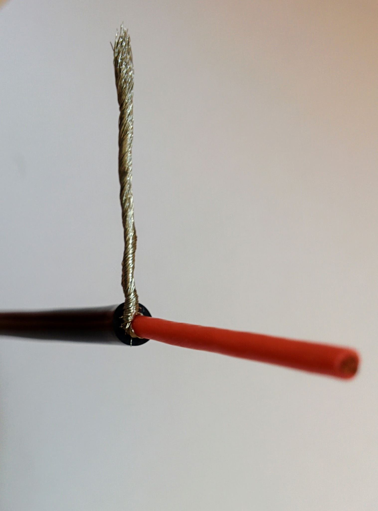
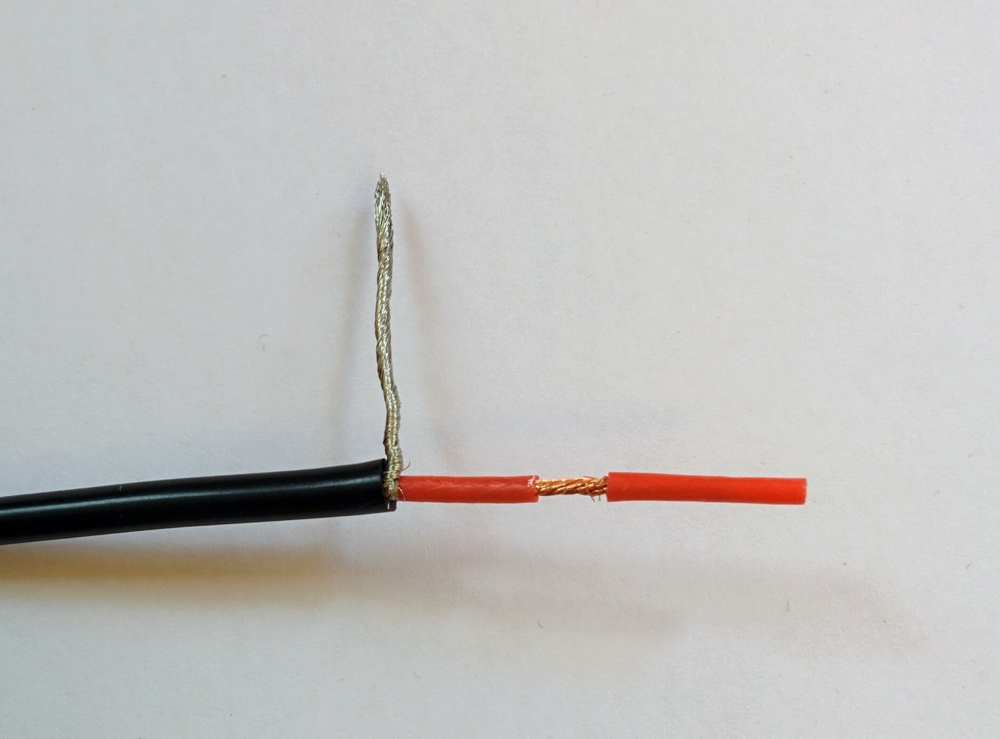
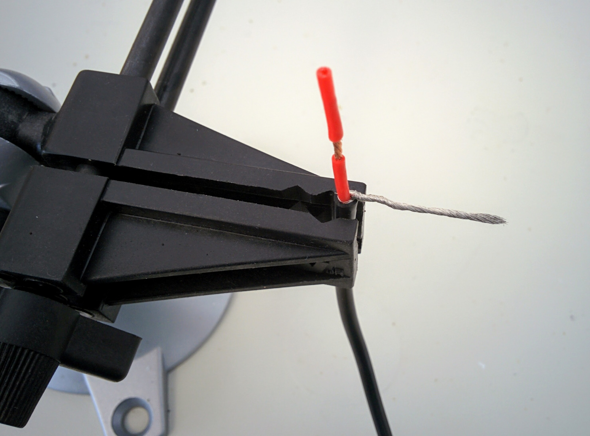
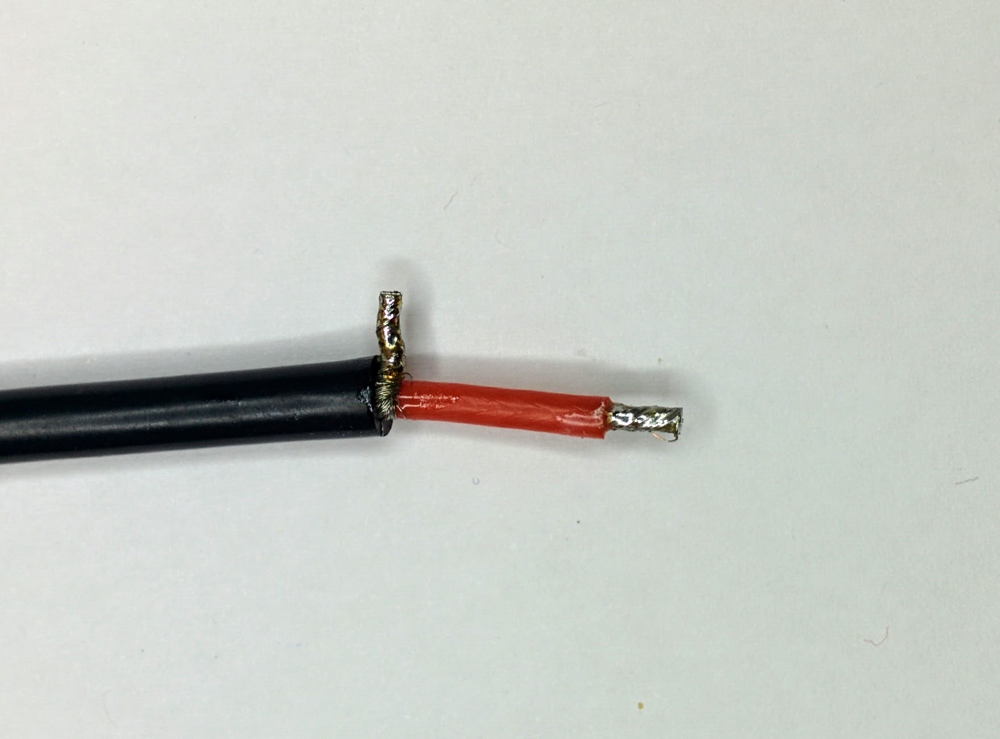

Soldering the PDB
=================

Soldering the ESCs and the power connector to the PDB is the only really tricky part of the assembly. I had soldered [through hole](https://en.wikipedia.org/wiki/Through-hole_technology) components before for hobby electronics projects but this didn't prepare me very well for the soldering involved here - I was surprised at how quickly the heat from the soldering iron was drawn away from the point of contact, meaning that things like the PDB and wires became extremely hot in the process of trying to solder anything.

For electronics projects I generally have my soldering iron at 325C (when working with leaded solder) but after reading around it seems that a higher temperature is typically used for the thicker wires and larger pads involved here. 375C is a commonly suggested temperature and some people go as high as 400C (but this seems to be considered extreme). At least as important as the temperature is the soldering iron tip - for electronics projects I use a narrow chisel but a broader tip, even at the same temperature setting, can deliver and maintain much more heat at the point of contact.

TODO: can I get a better reference than e.g. this [Reddit comment](https://www.reddit.com/r/Multicopter/comments/3d01te/tips_for_soldering_on_a_power_distribution_board/ct0vqeo/) on why a wider tip is so much better than a narrower one at the same given temperature setting.

In hobby electronics projects the solder pads are generally tiny and heat up almost instantly - with the large solder pads involved here the solder behaved quite differently and tended to bead up. Solder paste is not used in electronics projects as it has a corrosive affect but I found it essential here. It's usage seems common with the more heavy duty soldering required for drone building (but many people also seem to be able to get by without it). I found that applying a little to the wires, especially the thicker ones, made them much easier to tin and applying a little (with a tooth pick) to the solder pads on the PDB caused the solder to flow onto them nicely without beading up.

Solder paste does spread out from the point where it's applied and leaves behind a noticeable residue after soldering. I scrubbed this off with pure isopropyl alcohol (like [this](http://uk.farnell.com/kontakt-chemie/kontakt-ipa-200ml/cleaner-ipa-200ml/dp/2142406)) and normal supermarket cotton swabs.

I used something similar to this [solder paste](https://hobbyking.com/en_us/solder-paste-50g.html) from HobbyKing. In videos you also often see people using no-clean flux pens (like this [one](https://www.adafruit.com/product/3468) from Adafruit). Flux and solder paste are quite different things but I can't comment on whether one is better than or more appropriate than the other for the usage seen here.

TODO: can I get a definitive take on this - the fact that HobbyKing sells solder paste but no flux pens seems to imply the former is more used in RC hobbyist circles.

Each ESC comes with two long cables - a servo cable that goes to the flight controller and a power cable that is going to be soldered to the PDB. We're going to leave the servo cables as they are but the power cables are heavy and far too long for this build as they are.

Each motor has its own dedicated ESC. Each motor has three cables coming out of it and the connectors on these cables are inserted into one end of an ESC. The motors are mounted at the ends of the quadcopter arms and the ESCs are mounted on the undersides of the arms. When cutting short the ESC power cables it's obviously important to make sure you don't cut them so short that the fairly short cables on the motors can't reach the ESCs when everything is mounted later.

_ESCs and power connector._  

_F450 PDB._  

I cut my cables down to 112mm, I then removed the last 16mm of the outer black silicone coating to reveal the strands of ground wire that are braided into a sheath around the power wire. The silicone is extremely soft - you just have to gently roll the cable under a craft knife to cut the silicone deeply enough to then be able to pull it off.

**Update:** see the post-mortem and following section below. If repeating I'd cut the cables down to 122mm and expose 26mm of ground and power cable so I could apply the trick of using the coating that's ultimately going to be removed from the power cable to both twist the strands together and stop them splaying apart during tinning.

_ESC cable length._  

_ESC's braided ground sheath._  

It's easier than it looks to just gently pull apart the braiding with something like a toothpick, leaving you with the individual strands of ground wire.

_Unbraided ground wires._  

These strands can then be pulled sideways and twisted into a single ground wire and cut back to just a few millimeters. You can then also remove a few millimeters of the red coating around the ground wire.

_Strands twisted into single ground wire._  

You can then tin both the ground and power wire (even for these small wires I applied a little solder paste first to make this easier).

_Tinned ground and power wires._  

Once this is done for all four ESCs they're ready to be soldered to the PDB. In this picture I've wrapped the servo wires around the ESCs to keep them out of the way during the soldering job.

_ESCs ready for soldering._  

The PDB first has to be prepared by applying solder to all the pads. Applying solder paste to the pads first made a huge difference to how easily the solder spread out nicely on the pads. When soldering I held the iron to each pad for several seconds (the solder paste clearly heats up and starts to bubble) before applying the solder itself. Quite a lot of solder needs to melted onto each pad - too much though and it becomes hard to remelt later when attaching the wires from the ESCs and the power connector - too little and there isn't enough to properly hold the wires in place.

_Solder on PDB pads._  

I want to mount the PDB upside down so I first brought each the cable up through the hole next to the pads that the cable was going to be soldered to. This is a layout choice that's discussed later. It does make things a little trickier when doing the soldering but connecting the ESCs to the PDB was relatively easy in the end. I applied the soldering iron to each pad until the solder already there remelted then, keeping the iron in place, I brought the appropriate wire down on top of the tip until the tinned solder on the wire also melted. Then I pulled the soldering iron tip out and used it to push the wire into the solder on the pad before removing it and letting things cool. Holding the wire in place while the solder cooled was tricky as the wire got very hot - I had to use a pliers rather than my fingers.

_ESCs soldered to PDB._  

It's not the best soldering job the world has seen but everything looks fairly reasonable. The last thing is to attach the power connector. This proved more difficult than the ESC cables - I found it almost impossible to create a good joint. The power connector pads drew the heat away so quickly that the solder on the pad went solid almost instantly at the point where I tried to pull the tip out of the solder (or to the side) and push the power connector wires down into it. Pulling the tip up around the wire and using it to force the wire into the solder on the pad didn't have any apparent affect on keeping things molten long enough to form a good joint. And it was certainly impossible to bring both the solder on the tinned wire end and on the pad to melt by holding the wire down on the solder pad with the tip. In the end I made the best joint I could but suspected that the solder of the pad and on the tinned wire hadn't fully melted together and so then applied large amounts of solder to the soldering iron tip (for maximum heat transmission) and held it against the sides of the joint in the hope of bringing it to melt together properly. The joints passed continuity testing but whether they're very good is doubtful.

TODO: Googling didn't help - can I get tips on what the correct approach is? It wasn't enough using solder paste and an iron at 375C with the broadest tip of the three tips that came with my iron (2mm across at the point of the chisel). Do I need a higher wattage iron (than my 40W Weller WHS 40) or a yet wider tip? Googling at least seemed to make clear that upping the temperature wasn't the answer, that 375C is really the sensible max for unleaded (with 400C as an absolute max).

_Fully soldered PDB._  

In the picture above showing the completed soldering job you can still see the female connector that I attached to the male XT60 connector at the end of the power connector. This is often recommended for any kind of connector when doing soldering - the pins in the connector can get hot enough to cause their plastic casing to distort, holding the pins in place, by connecting the opposite gender connector, helps prevent this.

Continuity testing
------------------

It's very important that you visual check that all the red wires are connected to plus terminals on the PDB and all the black wires to minus terminal and then to [continuity test](https://learn.sparkfun.com/tutorials/how-to-use-a-multimeter/continuity) the finished job.

You should set your multimeter to continuity mode and hold one of its probes against power connector's plus terminal on the PDB and then touch the other probe off every other plus terminal in turn and make sure you hear a beep (indicating a connection), then touch the probe off every minus terminal (including the one for the power connector itself) and ensure that there are no beeps. Then switch and test for continuity between the the minus terminal for the power connector and all other minus terminals and a lack of continuity with all the plus terminals.

Continuity where you're expecting it is important - if you don't get a beep where you're expecting it then things won't work later. However testing for shorts, i.e. a beep where there shouldn't be one, is actually more important because things not working is just annoying but shorts are dangerous. There are no end of videos on YouTube showing what happens if you short a LiPo battery - it's really quite dramatic, the cells puff up and eventually explode and sometimes catch fire.

Because of this danger it's important to do the initial battery test (which we'll come to later) outside even if you're confident of your continuity testing. Better safe than sorry - it'd be unfortunate if your drone build resulted in your home burning down!

Post-mortem
-----------

I wasn't very happy with the results of my soldering job and I asked about the issues I'd experienced in a [post on RCGroups](https://www.rcgroups.com/forums/showthread.php?postid=37903751).

If I was doing this again I'd start off with my 2mm soldering tip - I only switched up from a 0.8mm tip to 2mm once I started experiencing problems. The 2mm tip is the widest available for my Weller WHS 40, the widest Hakko tip that Pololu sell is the 3.2mm [T18-D32](https://www.pololu.com/product/2787) so I guess this implies that in this domain no job should require anything bigger.

This [tutorial on RCTech](http://www.rctech.net/forum/radio-electronics/336870-how-solder-correctly-not-so-brief-lesson.html) says that when working with wires the tip should be as wide as the wire, so as the largest wires one deals with here are 12 AWG (where the core has a diameter of 2.053mm) a 2mm tip should be fine. The same tutorial says when soldering pads the tip must be smaller than the pad. The pads on the PDB here are 5x6mm so it's not clear if a 2mm tip is a bit too small - heat transfer is stated as an issue with small tips and this is certainly an issue I experienced (though I was using way too much solder).

I'd use massively less solder - look at how little solder is involved in the solder joints on the ready-soldered-up power module used in this build. The pads should only be lightly tinned - at [15:40](https://youtu.be/ER2GxMo0X3E?t=940) in the Marionville Models video you can see that he uses at most around 2cm of solder per pad and at the end the pads still look nice and shinny.

I also applied too much solder when tinning the thick 12 AWG wires - the solder apparently should soak all the way to the core but you shouldn't end up with a thick outer coating of solder. Steps 4 and 5 of [this Instructable](http://www.instructables.com/id/Strip-and-Tin-Wires-Like-a-Pro) provide a nice tip on using the silicone coating that you're stripping off to both twist the strands and stop the strands fraying apart while tinning.

I found it hard to coat the fat 12 AWG wires - the junction area between the exposed wire and the silicone coated wire seemed to always end up bare and the underside would end up bare while the top was tinned. Perhaps the trick is to drag the solder across the exposed wire quicker, rather than really feeding solder into the wire as I did, and to then turn the wire over and do the same for the underside. Practicing tinning on pieces of 12 AWG cable cut down to 10cm (the length of the power connector cable) might be an idea.

The RCTech tutorial says one should heat the wire underside while applying the solder to the top but I wonder how well this works with thick 12 AWG wires - perhaps once flux is applied heat really will travel well from one side to the other. While one should always tin one's tip the RCTech tutorial mentions tip tinning in this context to ensure good heat transfer (but you shouldn't be aiming to transfer the solder used in tinning the tip to the tin the wire).

I also got the impression that solder wicked much further up the wire than just the exposed portion. Again it's probably an issue of applying less solder in the first place but perhaps if it's still an issue one can hold the wire in a vice with the tip pointing downward and apply the soldering iron tip to the very end to draw down excess solder to bead up at this point where it can be removed with the tip (and got rid of on a wire sponge).

0.5mm solder (like [this](http://www.all-spec.com/Catalog/Soldering-Rework/Solder/Solder-Wire/24-6337-0010-16600)) seems to be the recommended diameter, don't use anything thicker.

Kester flux pens came up again and again, e.g. this [RCGroups post](https://www.rcgroups.com/forums/showpost.php?p=23956945&postcount=25). The [Kester #2331-zx pen](https://www.sparkfun.com/products/retired/8967) that Sparkfun used to ship, before shipping issues around hazardous chemicals stopped them, seems to be the most poplular, with the [Kester #951 pen](http://www.kester.com/products/product/951-flux-pen) being the more expensive no-clean non-hazardous near equivalent that's available more easily.

There seems to be a lot of argument on no-clean pens vs water-soluble pens vs the classic pens (where you need to use something like isopropyl alcohol to clean up the flux). All seem to have pros and cons. The shelf life of all, given their cost, is depressingly short at about 1 year. Solder paste in contrast seems to last forever. I really couldn't find a good reference on where or why one would choose one over the other, i.e. solder paste vs flux.

At [0:54](https://youtu.be/H_Rvi7xQLdw?t=55) in the DJI E300 video and at [15:02](https://youtu.be/ER2GxMo0X3E?t=902) in the Marionville Models video they clearly use flux but in many other tutorials people talk about solder paste. HobbyKing only sell solder paste and it's not clear there's even much of a difference - is solder paste just flux (the hazardous kind) with solder particles mixed in.

Soldering the 12 AWG power connector wires to their tinned PDB pads was the biggest issue. I haven't come across anything that sounds like the magic solution. Hopefully using way less solder would improve the situation, requiring less heat to melt the solder on the tinned pads (and make them less inclined to instantly resolidify before creating a joint with the wire). I don't believe the solder on the pads can be brought to melt by holding the wire down onto the pads with the soldering iron tip, as is the suggested approach for thinner wires (but who knows with less solder involved?). I suspect the answer is just less solder and a very well tinned tip between wire and pad, holding the wire onto the pad with a pliers (as I found the wire became too hot to hold directly). Then once the solder on wire and pad looks to have melted pull the tip up over the wire and use it to push the wire down onto the pad to push in more heat, then withdrawing the tip and keep the wire held in place with the pliers.

Presumably practice makes perfect.

Retrying
--------

On one of the discard lengths of wire that I'd cut off one of the ESCs I tried to improve on what I'd done previously.

On soldering down the ground wires I'd noticed the strands were more splayed out at the base than ideal. So really split the strands 50/50 and pull them around either side of the central power wire, really push them down on the outer coating with a finger nail so all strands are at a proper right angle and twist the strands together making sure to twist tight up against the central ground wire.

_Twist ground wires right upto base._  

As per the mentioned Instructable I cut off 26mm of outer coating rather than 16, leaving me with 10mm of excess. Then when it came to removing the coating from the power wire, instead of pulling off 4mm of coating straight away, I cut into the coating 14mm down and then slowly pulled up (twisting as I went) to expose about 5mm of wire for tinning - this approach stops the strands splaying at the end.

_Expose section for tinning._  

I held the wire in a vice like so I could drag the iron from left-to-right underneath the wire while applying solder to the top. It took a little while for the wire to heat up enough for the solder to melt into it. Before tinning the wires I applied solder paste with a toothpick.

_Heat from below._  

Tinning a longer length than needed and then cutting the tinned wire down to a length of 4mm results in very nice ends with no splaying.

_Trim to desired length._  

I found it impossible to tin the wire right at the base (you can still see the strands at the base) and trying to do so just meant using more solder than wanted without getting it onto the base. So just split the strands nicely 50/50 and pull them tightly around the central power wire - in this photo you can see I pulled more strands around the side we're looking at which results, as seen here, in a thicker bunch of strands on one side of the central power wire.
