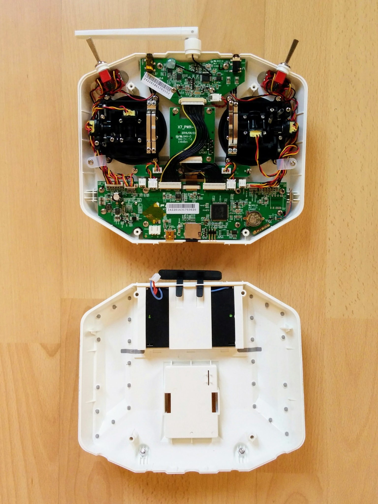

Stick configuration
===================

Your transmitter comes with two sticks but what should happen when you e.g. move the left stick up and down? This depends on convention. There are a number of conventions for stick configuration and they have been given uninformative names, i.e. "mode 1", "mode 2" etc. By far the most common mode is mode 2 (where up down on the left stick controls the throttle). The next most common is mode 1 (popular in Japan) and then the other modes almost never come up.

Mode 2 is the default on the Q X7 and we're going to stick with it, so there's no need to go into detail here on how to change mode. If you're interested in the different setups of the different modes see Oscar Liang's description of [modes](https://oscarliang.com/choose-rc-transmitter-quadcopter/#modes) but before you do a note...

The stick directions have names, people who come to quadcopter flying from flying RC planes tend to continue using names that meant something for planes but mean little for quadcopters - i.e. aileron, elevator and rudder. For people less wedded to the thinking that went with planes the terms pitch, yaw and roll are used. Both schools use the term throttle. If you're new to RC then neither set of terms may mean much so here's a simple table:

| Planes | Multicopters | Meaning |
|--------|--------------|---------|
| elevator | pitch | go forward or backward |
| aileron | roll | go left or right |
| rudder | yaw | turn clockwise or counterclockwise |
| throttle | throttle | ascend or descend |

The term "elevator" seems particularly confusing, at least to me, it doesn't mean up and down as one might guess. Hopefully the distinction between _going_ right and _turning_ clockwise is clear - if you're used to first person shooters then:

* Going right is the equivalent of siddling left crabwise while still facing the same direction.
* Turning clockwise means changing the direction your facing (turning to face right, turning further to face back and so on until you do a full 360&deg;).

I couldn't find a perfect page showing the use of the terms pitch, roll etc. This [page](http://newatlas.com/drone-school-quadcopter-transmitter-mode-1-2/40847/) clearly labels the sticks for mode 1 and 2 while this [page](https://www.wearechampionmag.com/quadcopter-transmitter-mode2-vs-mode1-difference) shows nicely the affect of the controls on the drone (unfortunately it uses the term roll for forward and backward, as well as left and right, rather than using the more common pitch for forward and backward).

Note: one aspect of stick setup that I won't go into here is trim. If you go back to the diagrams I used when first introducing the transmitter you'll see the four black digital trim buttons. For details on trim see the "controller trim" section of this [page](https://dronebuff.com/drone-controller/) and see this [video](https://www.youtube.com/watch?v=Nk2h06Ql3cM) (the presenter is not terribly successful at getting his trim settings correct but you get the idea).

Disabling throttle self centering
---------------------------------

The Q X7 comes with both sticks self centering in all directions, i.e. if you let go of either it returns to the center point.

However throttle, i.e. up/down, controls overall power to the propellers - when throttle is all the way down the propellers should be off and when its all the way up they should be turning at maximum. So you don't really want throttle just springing half way to a value between these two points. Most people want throttle at zero when they're getting ready for talkoff and then they want it just staying where it is if they take their finger off it.

Aside: older consumer drones used to behave much like this too, at least for the low throttle case. On older DJI models the throttle only self centered if you took your finger off it when it was above the midpoint - on the latest models though the throttle always self centers. This is because on these models there's less of a direct link between the position of the throttle and how fast the motors are turning, instead the center point means "hold current altitude" while up and down, either side of this, mean ascend and descend respectively. When using ArduCopter the throttle behaves similarly to this is the [position hold](http://ardupilot.org/copter/docs/poshold-mode.html) and [altitude hold](http://ardupilot.org/copter/docs/altholdmode.html) flight modes.

_Throttle with self centering disabled_  

To disable self centering on the throttle you have to open up the transmitter - this isn't a big issue, unlike many consumer electronic items that come with strict injunctions against opening them up it's expected that you'll take apart the transmitter (though if you break anything that's still your problem).

The whole mechnical mechanism behind a stick is called a gimbal and you often hear people using the terms stick and gimbal interchangeably (though confusingly the term gimbal on its own often means the remote control camera setup that's common on many drones these days - to see the clear distinction between the two see e.g. the [gimbal sticks section](https://hobbyking.com/en_us/radios-receivers-1/parts-accessories/gimbal-sticks-extensions.html) and the [camera gimbals section](https://hobbyking.com/en_us/multi-rotors-drones/camera-gimbals.html) on the HobbyKing online store).

I'm not going to go in-depth into disabling self centering for the throttle, instead I suggest watching these videos (each link brings you to the specific point in the video that discusses disabling self centering):

* [Painless360 at 4:51](https://www.youtube.com/watch?v=YD3ojhwVmrI&feature=youtu.be&t=291)
* [Flite Test at 8:18](https://www.youtube.com/watch?v=7cExS1tTOJA&feature=youtu.be&t=498)

I watched quite a number of videos before settling on these two as describing the best way to do thing. The Painless360 video is closest to how I did things - however he mixes this step in with removing the battery holder (so he can put in a LiPo instead) which is something I didn't do. Also when removing the back cover he removes two screws that you don't need to remove (the upper left and right screws under the battery cover). In the Flite Test video they leave the battery holder connected to the main PCB, while I (like Painless360) chose to unplug it.

_Q X7 internals._  

The whole thing is easy to do but I was a little nervous that I'd yank out the wires when unplugging the battery holder or that the screw driver would slip and I'd stab the PCB when tightening the screw that disengages the gimbal spring. Note that this screw is only barely screwed in initially - it actually popped out when I started trying to screw it down. When you've got the transmitter opened up and are looking at the internals make sure to still think about the front of the transmitter and take care that you don't accidentally rest everything on one switch or stick while focusing e.g. on tightening a screw.

In brief the steps I took were as follows:

* Removed both the battery door and the external module doors from the back cover before starting.
* Removed the four large Phillips screws holding the back cover on and took it off.
* Left the battery holder in place, in the back cover, but unplugged it from the main PCB.
* Screwed down (all the way) the lower of the two screws related to the up/down spring arrangement for the left gimbal.
* Screwed down (all the way) the upper screw of the non-notched bar that provides the friction needed to stop the gimbal just flopping about. I then loosed the screw about half a turn to make the movement a little less stiff.
* Plugged the battery holder back in and put the back cover back on, taking care to watch out for the pins on the PCB that stick up into the external module bay.

Note: while you've got the transmitter opened up you can take the opportunity to look at the rest of the internals, not just the gimbals. You'll see things like the little watch battery that will keep the transmitter's clock (called an [RTC](https://en.wikipedia.org/wiki/Real-time_clock)) going even when the main battery compartment is empty.

Once you've got throttle self center disabled you can leave it pulled down when turning on the transmitter so you'll no longer get a throttle warning when it starts up.

Note: [RCDiy](http://rcdiy.ca) has lots of useful pages about FrSKY transmitters, including the Q X7, and about OpenTX. He does have a video on disabling throttle self centering - however I don't recommend it as he removes the battery holder from the back cover - which is unnecessary - and he loosens the upper of the two screws related to the up/down spring arrangement rather than the better approach of tightening the lower one. Despite these criticisms the video is accompanied by an otherwise excellent [page](http://rcdiy.ca/taranis-q-x7-tutorial-first-flight-setup/) that describes the disassembly and provides lots of close up pictures - if you click on them you'll see all the relevant screws etc. very clearly highlighted.
