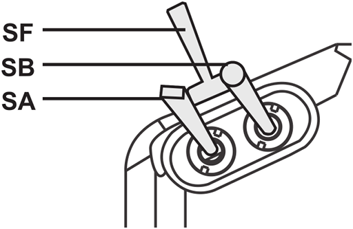

Flight modes
============

TODO: provide quick intro to flight modes and explain that this whole page is about mapping from switch postitions on the transmitter to one of six flight modes configured on the flight controller via Mission Planner.

Now we're going to setup flight modes for the transmitter. This can be done on the transmitter itself but as it involves a lot of settings it's far easier to do using OpenTX Companion.

So start the transmitter in bootloader mode (keep the two lower trim buttons pressed inwards when turning on the transmitter), open OpenTX Companion on your computer and connect the transmitter to your computer using a USB cable.

The first thing we have to do is read the current model (or models) from the transmitter - go to the _Read/Write_ menu and select _Read Models and Settings From Radio_.

[ TODO: screenshot of loaded models ]

This page largely covers the process that Painless360 covers well in [this video](https://www.youtube.com/watch?v=agjHu-WhCJw&feature=youtu.be&t=364) from 6:04. However he first shows how to set things up using a Taranis X9D+ that's been modified to add a six position switch, it's only around 10:00 that he discusses achieving things using two of the switches on an unmodified transmitter.

He uses the swtiches SF and SE on the Taranis X9D+. The Q X7 doesn't have an SE switch so instead we'll use the upper left pair of three-way switches called SA and SB.

_Upper left switches._

We'll set things up so that flight mode 1 is selected when SA and SB are in their up position, flight mode 2 is selected when SB is moved to its middle position and flight mode 3 when SB is moved to its down position. Then when SA is moved to its middle position SB in its up position selects flight mode 4, in its middle position flight mode 5 and in its down position flight mode 6. Moving SA to its down position does nothing.

To do this we first have to create six logical switches. Under the _Logical Switches_ tab I set the _Function_ for _L1_ to _L6_ to _AND_ and then for these six logical switches I filled in the values for _V1_ and _V2_ with the six combinations of SA and SB outlined in the previous paragraph. SA and SB can be up (&uarr;), middle(-) or down (&darr;). So we end up with:

|    | Function | V1       | V2       |
|----|----------|----------|----------|
| L1 | AND      | SA&uarr; | SB&uarr; |
| L2 | AND      | SA&uarr; | SB-      |
| L3 | AND      | SA&uarr; | SB&darr; |
| L4 | AND      | SA-      | SB&uarr; |
| L5 | AND      | SA-      | SB-      |
| L6 | AND      | SA-      | SB&darr; |

[ Include corresponding screenshot ]

Then we setup what each of these logical switch is going to do - they're going to output different values on channel 5 and the flight controller will interpret each of these values as meaning it should switch to a corresponding flight mode. This is done by going to the _Special Functions_ tab - here I set the _Switch_ value for special functions 1 to 6, i.e. _SF1_ to _SF6_, to _L1_ to _L6_ respectively.

| #   | Switch | Action        | Parameters | Enable   |
|-----|--------|---------------|------------|----------|
| SF1 | L1     | Override CH05 | -90        | &#x2713; |
| SF2 | L2     | Override CH05 | -40        | &#x2713; |
| SF3 | L3     | Override CH05 | -20        | &#x2713; |
| SF4 | L4     | Override CH05 |  10        | &#x2713; |
| SF5 | L5     | Override CH05 |  40        | &#x2713; |
| SF6 | L6     | Override CH05 |  80        | &#x2713; |

Important: make sure you've ticked _Enable_ for each switch here or nothing here will have any affect.

[ Include corresponding screenshot ]

Question: what do the parameter values -90 etc. mean? Answer: if you're interested [6:16](https://www.youtube.com/watch?v=agjHu-WhCJw&feature=youtu.be&t=376) onwards in the video explains this in terms of a six position rotary switch but the same applies for our six logical switches.

Note: in 2.2.0N371 _L1_ etc. appear as _LSw01_ under the _Special Functions_ tab - this has apparently been fixed, see <https://opentx.rocket.chat/channel/OpenTX_General?msg=6N2WSoh2ANKbBMKr7>

Then under the _Inputs_ tab right click on _Input05_ (or select and press enter) and set:

* Input name: Mod
* Source: SA

Note: the value for _Source_ isn't really important but you should tie it to one of the physical switches being used, i.e. _SA_ or _SB_, rather than tying up a switch that isn't involved.

Now try try everything out - press the _Simulate_ button at the bottom of the screen. The _Radio Simulator_ window will appear (its layout has changed since the video), go to the _View_ menu and select _Radio Outputs_ (you can dock the resulting dialog be pressing the little dock icon to the left of its close button). The _Radio Outputs_ shows the logical switches and the channel outputs (along with global variables).

You can't interact with the logical switches directly, instead move the sliders for the real switchs _SA_ and _SB_ and you'll see the state of the logical switches and the output for _CH05_ changing in accordance with what we've just configured.

In Mission Planner one can setup six flight modes that are then triggered by our six logical switches. OpenTX Companion can't know what flight mode you've assigned to a particular switch in Mission Planner - so you have to sort this assignment out in Mission Planner first and then come back to OpenTX Companion and tell it the name of the flight mode you've associated with each logical switch so that it can helpfully display the name corresponding to the currently selected positions of _SA_ and _SB_.

To do this go to the _Flight Modes_ tab and then in the sub-tabs set the _Name_ for _Flight Mode 0_ to "None" but otherwise leave it alone (it just provides a default template for the other modes), then go through _Flight Mode 1_ to _6_ and set their _Switch_ values to _L1_ to _L6_ respectively and set their _Name_ values to corresponding flight mode assigned in Mission Planner, e.g. _Stabilize_, _Alt. Hold_ etc.

If you then try out _Simulate_ again you'll see the names appear on the transmitter LCD as you flip _SA_ and _SB_ (a bug in the version I was using meant the logical switches didn't flip initially - I closed the simulator and switched tabs, which may have been irrelevant, and retried and everything worked as expected).

Assigning sounds
----------------

If you'd like the transmitter to announce the current mode as you flick the switches (which can be a helpful confirmation when you want to remain focused on your drone rather than the transmitter's LCD screen) you can also do this in _Special Functions_.

First though OpenTX Companion needs to know what sounds are available. The sounds are stored in the _SOUNDS_ directory on the transmitter's SD card and OpenTX Companion works off a synced copy of this directory. Go to _Settings_ in OpenTX Companion and select a folder for the _SD Structure path_ - I created a new directory called `~/opentx-companion/sdcard` and selected this. Then select menu _File / Synchronize SD_ - this is quite slow if you used the default SD card contents as it contains sound file for German, Spanish, French and Italian, in addition to English, so 75% of the content is for other languages. Once this is done OpenTX Companion knows what sounds can be played.

Go back to _Special Functions_ and this time assign _L1_ to _L6_ to _SF11_ to _SF16_ (the only reason for using these rather than _SF7_ onwards is so that the last digit matches nicely for each, i.e. _L1_ to _SF11_ etc.) and this time choose _Play Track_ at the action for each. Then for the _Parameters_ value for each you can choose a track.

The default set of sounds are more suitable for planes than quadcopters - there aren't tracks in the default sound pack for stabilize etc., you can just choose the generic flight mode tracks _fm-1_ to _fm-6_, that just announce "flight mode one" and so on.

There are no end of sound packs for OpenTX - the most popular seems to be one called "Amber". For whatever reason the standard sound packs found under <http://voices-21.open-tx.org/opentx-taranisplus/en/> (2.1 is the latest version for which sound packs are available like this) don't include sounds like stabilize, Amber is included here under the `thirdparty` directory but has had sounds like stabilize removed. The 2.1 version of Amber linked to from <http://open-txu.org/home/v2-1-resources/> does have these sounds.

2.1 sounds however are not compatible with 2.2 so we'll have to wait for compatible sound packs which contain these sounds. There is an Amber sound pack linked to on <http://open-txu.org/v2-2-resources-2/> but it doesn't contain a CSV as seems to be expected for a sound pack.

TODO: when 2.2.0 finally comes out see if there's a sound pack with "stblzmd", "althld" etc. that you see in various videos (and which are contained in the full Amber sound pack).

So now each logical button is associated with two actions - changing the value transmitted on channel 5 and playing a sound.

[ Include screenshot of sounds ]

Emergency switch
----------------

Painless360 feels it's a good idea to assign a single physical switch to switch into the flight mode that's most appropriate for emergency situations. This is typically the [return-to-launch (RTL) flight mode](http://ardupilot.org/copter/docs/rtl-mode.html).

So let's turn SF into that emergency switch - its the top left two-way switch (the top surfaces left and right of the antennae are often referred to as the shoulders of the transmitter). To do this just return to the _Special Functions_ tab and setup _SF7_ and _SF8_ like so:

| #   | Switch   | Action        | Parameters | Enable |
| SF7 | SF&darr; | Override CH05 | 80         | &#2713 |
| SF8 | SF&darr; | Play Track    | fm-6       |        |

Remember again to click _Enable_ for _SF7_. Again we can only play a very generic sound.

TODO: update if I get better sounds setup.

Important: this assume RTL mode is configured as the sixth flight mode, i.e. the one triggered by the 80 parameter value.

Note: this won't cause the flight mode shown on the LCD screen to update - as this is configured off the state of the logical switches.

TODO: confirm this is the case once I've gone through the Mission Planner step.

Save changes
------------

Once done close the _Editing model_ screen and select menu _Read/Write / Write Models and Settings To Radio_. Eject the transmitter's USB drives and disconnect the transmitter.

Choose your own setup
---------------------

The above setup tries to match the setup covered in the Painless360 video. But you should know enough now to be able to create whatever setup seems most logical to you. In the end I went for a different setup myself.

In my setup SA and SB are in the up position, as before, for flight mode 1, then I move SA to its middle position for flight mode 2 and to its down position for flight mode 3. Then (leaving SA in its down position) I move SB to its middle position for flight mode 4 and to its down position for flight mode 5.

But what about flight mode 6? I have the separate switch SF setup as above and move it to its down position to for flight mode 6. So unlike the Painless360 setup I don't have two ways to reach flight mode 6.

Note: for this configuration I used a column in the _Logical Switches_ tab that we ignored previously - to the right of the _V1_ and _V2_ columns is an _AND Switch_ column. It may seem odd to have such a column when _AND_ can be selected in the _Function_ column, however it's independent of the _Function_, _V1_ and _V2_ columns and allows you to optionally specify a third switch that must also be in a given state for the specific logical switch to become active. So I specified SF&uarr; in this column for all my logical switches. However due to a bug in the version I was using the simulator ignored the values of SA and SB unless I closed the simulator and changed focus to another application then returned to OpenTX Companion and reopened the simulator, alternatively I could change one to the SF&uarr; values to !SF&darr; (which is logically the same thing for a two-way switch like SF) - though the issue returned each time I moved focus to another application and then returned to OpenTX Companion.

For more details on logical switches, including an explanation of the _AND switch_ column, see the [logical switches section](https://opentx.gitbooks.io/manual-for-opentx-2-2/content/logical_switches.html) of the OpenTX 2.2 manual.

TODO: log a bug around this and also see if it's Linux specific.

Invert the elevator / pitch
---------------------------

At 3:57 he explains that for ArduCopter the elevator/pitch value has to be inverted otherwise the quadcopter will go forward when you pull the right stick back and go backward when push it forward.

Note: having to reverse the elevator is basically an ArduCopter bug (though some people seem to argue its a matter of perception what's correct), see [ArduPilot #935](https://github.com/ArduPilot/ardupilot/issues/935) and this [DIY Drones thread](http://diydrones.com/forum/topics/pitch-is-reversed-where-should-i-fix-it).

TODO: see if this is also the same when using PX4 and QGroundControl.

Painless360 inverts the elevator via the _Inputs_ screen but [this video](https://www.youtube.com/watch?v=oJXETHp2lsE&feature=youtu.be&t=114) and others suggest that this isn't how you should do this as apparently you'll invert the stick but not the associated trim buttons.

So instead go to the _Outputs_ screen for your model, go down to _CH2_ (which is elevator), press ENTER, select _Edit_, go down to _Direction_ and change the _---_ value shown to _INV_.

You can then see the affect of this by going to the main screen and then pressing PAGE to see values being output on the first eight values, move the left stick up and down and you'll see the channel 3 value changing - its value is highest when you push it all the way up (as you'd expect), now move the right stick, i.e. elevator, which we've just inverted and you'll see how its value is at its lowest when the stick is pushed all the way up.

TODO: verify the claim about trim - establish the copter at a stable fixed point and then use the roll trims to force the copter left and right, rather than using the roll stick, then try the same with the pitch trims and see that these trims affect going back and forward in the same way as the roll trims affect going left and right.

TODO: it looks like fixing it in the transmitter is easiest but see if there's a toggle for it during setup in Mission Planner.

---

TODOs
-----

TODO: Painless360 has a nice short explanatory [video about expo](https://www.youtube.com/watch?v=ajJ3rJ1HN5Q). In this video he explains (at 4:26) why it's better to set expo on the flight controller rather than the transmitter (due to resolution issues) if you're using a flight controller. This is already noted elsewhere from one of his other videos.

In the video that this page covers he also sets expos via the _Inputs_ tab at 5:23 - he puts expo of 25% on Ail, 25% on Ele and 15% on Rud (Thr is left without expo) to make controls "calmer".

So as noted above expo should if possible be set via the flight controller rather than in the transmitter, so can we do this in Mission Planner?

TODO: at 20:48 he briefly mentions failsafe - doing it via the receiver - but mentions he'll cover it later via mission planner. Make sure you do cover this too.

TODO: reference page <http://open-txu.org/home/special-interests/multirotor/opentx-apm-px4-pixhawk/> that accompanies Painless360's YouTube video.

TODO: move the following section elsewhere.

Installing OpenTX Companion on Ubuntu
-------------------------------------

Installed PPA as per <https://launchpad.net/~opentx-test/+archive/ubuntu/ppa>

    $ sudo add-apt-repository ppa:opentx-test/ppa
    $ sudo apt-get update
    $ sudo apt-get install opentx-companion22

Launched it:

    $ companion22

Enabled nightly firmware and Companion downloads under Settings / Application Settings.

Under Settings / Radio Profile I set the Radio Type to "FrSky Taranis X7" and enabled the lua and massstorage Build Options.

As restarting I, as prompted, saved the latest firmware - I saved it to `~/opentx-companion`.

After connecting to the TX in normal and off modes it turns out what Companion wants is bootloader mode.

So keeping the two lower trim buttons pressed towards the center I turned on the TX and connected it.

Important: I have automounting of USB drives disabled. So while the drives show up in Unity I had to explicitly open the Taranis before Companion could get the `EEPROM.BIN` file it needs if you want to load exisitng models.

