Transmitter next steps
======================

Previously we updated everything to do with the transmitter - in particular the transmitter OS called OpenTX. Then we disabled self-centering for the throttle. Now we're finally go through the basic configuration for the transmitter.

There are no end of transmitter settings you can adjust but we can ignore nearly all of them as they have sensible defaults or are irrelevant for out setup. We'll just set some basic things like time and date and create a model.

Models
------

A single transmitter can be used to control any number of remote controlled craft, e.g. you could have a model plane, tank, boat, submarine and quadcopter and use the same transmitter to control whichever one of these you wanted to use at a particular time.

On your transmitter you have to create models - each model corresponds to the one of the RC craft you own. Later we'll cover the binding process that ties a given model to the actual receiver in the corresponding craft.

The transmitter comes with one model, called MODEL01, already setup - when you turn on the transmitter you can see in the main screen that it's the currently selected model.

_Main screen before any setup._  
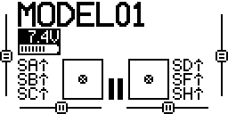

Configuration
-------------

I'm not going to go into much detail about how to use the transmitter buttons like PAGE etc. to navigate around and change settings. The buttons have been covered previously and if you need more help on getting started on using them and changing settings there's a section later that includes links to videos that cover all this.

In this section we're just going to:

* Set date and time for the transmitter.
* Set its county code.
* Set the receiver channel order.
* Calibrate the sticks and pots.
* Create a new model.
* Set the model name.
* Set the model's failsafe setting.

To get started long press MENU to get to the _Radio setup_ screen and set the current date and time.

_Set date and time._  
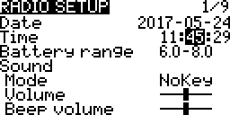

Then use the dial to navigate downwards and set the country code if necessary. It defaults to US, I set it to EU. This tells the transmitter to comply with the radio spectrum regulations that apply in your region. The low level radio firmware is already region specific and should behave appropriately for that region anyway so this setting isn't as important as it sounds.

_Set country code._  
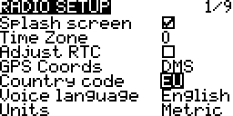

Now navigate down further to the bottom of the screen. The last two entries are _Rx channel ord_ and _Mode_. We already covered mode when setting up the sticks - we're using mode 2 and default value of _Mode_ should already match this. However we do have to change _Rx channel ord_ (by default it's set to _TAER_), change this to _AETR_. The next section down below explains what this means.

_Set RX channel order._  
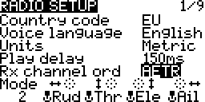

Then use PAGE to get to the _Calibration_ screen and re-calibrate the sticks and pots (this has been covered previously). Remember to set the pots to their mid position before starting.

_Calibration._  
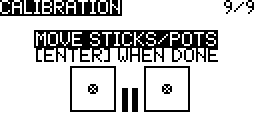

Now onto creating a model. Press EXIT to get back to the main screen then short press MENU to get to the _Model selection_ screen. You can either modify the existing MODEL01 or create a completely new model. To create a new model turn the dial to select an empty slot, e.g. 02, and press ENTER and select _Create model_.

_Create a new model._  
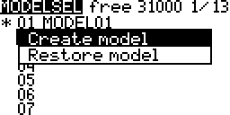

The new model is initially just called MODEL02, the asterisk beside it indicates that it's the currently selected model.

_New model with default name._  
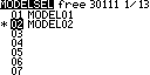

Now press PAGE and update the model name to something more informative, e.g. "F450 Pix". Long hold ENTER to get a capital letter.

_Set model name._  
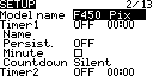

Use the dial to scroll through all the other options until you reach failsafe. Set it to _No pulses_, we'll come to what this means later.

_No pulses failsafe._  
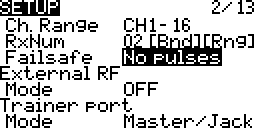

That's it - setup is done for the moment. If you return to the main screen you'll see that the name of the newly created model is now shown as selected. If you play with the sticks and switches you'll see the screen update in response.

_Main screen with new model selected._  
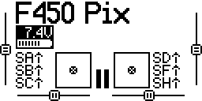

If you accidentally turn the dial on the main screen you get to two mysterious rows of dashes - just dial back up to get out of here. **Update:** if you configure six flight modes (as we do later) then you'll see one of the first six dots here highlighted according to the currently selected flight mode (so as there are 64 dots does it really support 64 flight modes or are some for something else?). Even then these dots seem of limited use (could one really distinguish between the 15th and 16th dot being highlighted) and anyway the name assigned to the current flight mode is shown in the upper half of the main screen which seems more informative than these dots.

_Main screen - lower half._  
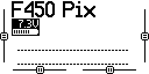

If you press PAGE you'll get to a screen that shows the transmitter's channels. These are essentially the set of values that the transmitter will send to the receiver. Initially just the sticks are bound to channels, i.e. only the stick states and nothing else will be sent. Move the sticks and see how the bars of this screen react.

_Main screen - page 2, showing channels 1 to 8._  
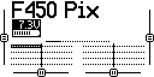

The transmitter supports up to 32 channels (16 using the standard internal RF module and 16 more if you add an additional external RF module), initially bars for channels 1 to 8 are shown. Turn the dial and you'll see the topmost bar change to indicate that channels 9 to 16 are now showing, turn it further to see channels 17 to 24 and so on. As nothing is bound to these channels there's nothing really to see.

_Main screen - page 2, showing channels 9 to 16._  
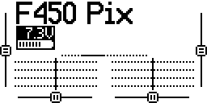

If you press the PAGE button again you'll get to the same channel information but this time displayed as numbers rather than bars.

_Main screen - page 3._  
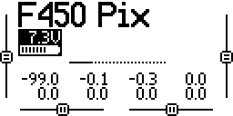

Receiver channel order
----------------------

We looked at something called mode when we covered stick setup. The chosen mode affects which stick direction is considered to be throttle etc., e.g. up/down on the left stick is throttle in mode 2.

However there are two devices involved here - the transmitter and the receiver. The mode just affects the mapping between stick directions and names like _Ail_, _Ele_, _Thr_ and _Rud_ in the transmitter. So when you're in mode 2 and you move the left stick up and down this adjusts the value that the transmitter associates with throttle. The transmitter then has to transmit this value to the receiver.

As noted above the transmitter has 16 channels (using its internal RF module) on which it can output these values. Typically the stick values are transmitted on the first four channels, i.e. 1 to 4. But like mode it's just a convention how the receiver (and the related equipment - either a flight controller or directly connected servos) interprets the values it sees on these channels.

There are two main conventions for receivers. Many devices follow the convention established by the manufacturers Spektrum and JR where channel 1 is interpreted as the value for the throttle and so on like this:

| Channel # | Control  |
|-----------|----------|
| 1         | Throttle |
| 2         | Aileron  |
| 3         | Elevator |
| 4         | Rudder   |

The shorthand for this convention (for obvious reasons) is TAER. Many other devices follow the Futaba and Hitec convention:

| Channel # | Control  |
|-----------|----------|
| 1         | Aileron  |
| 2         | Elevator |
| 3         | Throttle |
| 4         | Rudder   |

The shorthand for this convention is AETR and is the one that the setup we're building here requires.

Note: as discussed elsewhere the names elevator, aileron, rudder and throttle tend to be popular among those piloting planes while the names pitch, roll, yaw and throttle are more common among those piloting mutlicopters. Unfortunately OpenTX always uses the plane naming convention in all its screens and menus.

When you create a new model the controls are initially mapped to channels according to the current value of _Rx channel ord_. If you go to the _Mixer_ screen for your model you can see the current mapping between channels and controls.

_Mixer screen._  
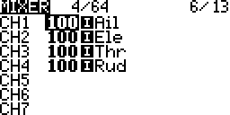

_RX channel ord_ is a global setting, however it only affects the initial channel order of models created after you modify it. If you change _Rx channel ord_ again later it won't affect any existing models. And once a model has been created you can go to its _Mixer_ screen and change the initially assigned channel order without it affecting anything else.

Note: there's an _Input_ screen that superficially looks quite similar to the _Mixer_ screen - however this screen is about adjusting the behavior of the various controls, e.g. adjusting expo (which we'll come to later) to make them less "twitchy". On this screen you can even adjust the real source for the values _Thr_ etc. on this particular model. By default the stick direction considered throttle (according to your current mode setting) is mapped to _Thr_ etc. but you could e.g. map one of the pots to _Thr_ for this particular model (or do really odd things like take the source for the logical _Thr_ value from the aileron stick direction and so on).

Failsafe
--------

Above we set failsafe to _no pulses_. Before we did this the transmitter would always warn that there was no failsafe set for the current model when the transmitter was turned off.

The failsafe setting determines what the receiver should do if it loses contact with the transmitter, e.g. if the drone flies too far away or the transmitter runs out of battery power. There are various options - including leaving the choice to the receiver and then configuring the actual failsafe behavior on the receiver. Other options include having the receiver just maintain the same output as when it lost contact, this presumably results in the situation getting worse in most circumstances as the receiver tells the craft to maintain the course that caused it to fly out of range.

With a craft like ours the flight controller can respond intelligently to losing contact. So in this situation _no pulses_ is the preferred option (see [ArduPilot failsafe setup](http://ardupilot.org/copter/docs/radio-failsafe.html#receiver-and-flight-controller-set-up)), this leave it up to the flight controller to decide what to do. It can e.g. be configured to return to the launch point or, if it's following a preconfigured route, to simply complete the route.

TODO:

* RCdiy covers [testing failsafe](http://rcdiy.ca/taranis-q-x7-tutorial-first-flight-setup/#Testing_Failsafe) - make sure to include a section on doing the same.
* In the video on the ArduPilot failsafe setup page also show they [how to test things](https://youtu.be/FhKREgqjCpM?t=93), cf this with RCdiy's approach. Note: unlike here (but like RCdiy) they set up the failsafe via the receiver, also I think they're using an ancient PX4 so arming is different.

Expo
----

When you use the sticks for pitch, roll and yaw you're generally not making extreme movements so the sticks stays near the center in any given direction and you rarely move any stick to its maximum or minimum position. You end up just moving the sticks within a small area around their center position. So it would be nice if we could adjust things to stretch out this small central area so that small movements around the center result in less dramatic movements in the vehicle, making it easier to control and making it less "twitchy" when responding to the small movements we're typically making.

This is what expo is about - adjusting the responsiveness around the center of the sticks. Generally expo is just applied to pitch, roll and yaw while the throttle is left as it is - so for the left stick we're just talking about adjusting things for left-right movement, i.e. yaw, while for the right stick we're talking about both left-right and up-down movement, i.e. roll and pitch.

Painless360 has a [nice video](https://www.youtube.com/watch?v=ajJ3rJ1HN5Q) that explains expo far better than I could. And then in a [separate video at 5:10](https://www.youtube.com/watch?v=NIR85KOqIAo&feature=youtu.be&t=310) he explains how to set expo on the Q X7. That video covers everything clearly within a minute - so I'll just cover things briefly here.

| Inputs before adjustments | AIL before adjustments | AIL with expo of 25 | Inputs after adjustments |
|-|-|-|-|
| 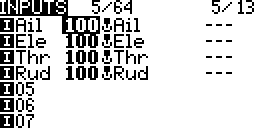 | 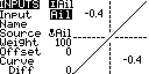 | 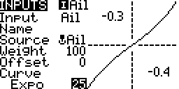 | 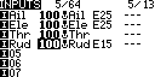 |

From the main screen of the Q X7 you short press the MENU button to get to the _Model selection_ screen and then use the PAGE button until you get to the _Inputs_ screen. Then in turn for _Ail_, _Ele_ and _Rud_ you press and hold ENTER and select _Edit_ - on the edit screen for each you go down to _Curve_ and change the default values their (_Diff_ and 0) to _Expo_ and the desired expo value. Suggested values are as follows:

| Control | Value |
|---------|-------|
| Ail | 25 |
| Ele | 25 |
| Rud | 15 |

These are just values that Painless360 consistently suggests in various videos and not ones I've come to by experimentation. As noted above throttle is left unadjusted.

Note: despite the name the function behind expo in OpenTX is not an exponential fuction - if you're interested take a look at [`mixer.cpp`](https://github.com/opentx/opentx/blob/2.2/radio/src/mixer.cpp), there you'll find a large comment and the actual `expou` function that's used.

Loss of resolution
------------------

Painless360 says at [4:26](https://youtu.be/ajJ3rJ1HN5Q?t=266) in his video introducing the expo concept and at [7:57](https://youtu.be/NIR85KOqIAo?t=477) in his video on configuring the Q X7 that you should set up expo on the flight controller rather than the transmitter, if you can, as this avoids a loss of resolution.

As it turns out you can't do this with ArduCopter. But what does he mean by loss of resolution? It's not important for our situation but let's look at it briefly.

Let's just consider rudder. When the right stick is at its leftmost position it sends a PPM value of around 980 and when it's at its rightmost it sends a value of around 2000. So the range of rudder values runs from 980 to 2000.

| | |
|-|-|
| _Before applying expo._ 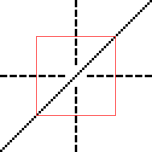 | _After applying expo._  |

Above we see the graphs that we saw when setting expo on the transmitter. The x-axis is real stick movement and the y-axis is the PPM value sent by the transmitter - initially the relationship between the two is linear. However if I specify an expo of 25 then things change - the 50% of the stick movement range around the center, that used to correspond to 50% of the range of PPM values on the y-axis, now corresponds to just 40%.

If we move the pitch stick from its leftmost position to its rightmost this is a movement of about 50&deg;. So if we think about the middle 50% of the range of the x-axis shown above then moving from one end to the other corresponds to a movement of about 25&deg;

As already noted the range of PPM values sent by the transmitter runs from around 980 to 2000. After applying expo just 40% of the this range, i.e. 1286 to 1694, correspond to our 25&deg; of movement around the center point - whereas before expo, when things were still linear, this 40% of PPM values corresponded to 40% of total stick movement, ie. just 20&deg; of movement.

So before expo an increase in the PPM value of one described a stick movement of 20&deg; / (1694 - 1286), i.e. 0.049&deg;, whereas afterwards it describes a stick movement of about 25% / (1694 - 1286), i.e. 0.0612&deg; ("about" because things are no longer completely liner even in the middle range).

So this is the loss of resolution we're talking about. Note that there's a corresponding gain in resolution at the edges (where it's not particularly useful).

However few would complain that 0.0612&deg; wasn't still quite fine grained enough, i.e. 16 PPM values per degree of movement vs 20 before. Obviously if you use higher expo values the difference becomes greater.

One could avoid this loss of resolution by doing the adjustment in the flight controller software rather than on the transmitter - and flight stacks such as Cleanflight and Betaflight, that target racing drones, include this feature - but ArduCopter does not (I asked [a question](https://discuss.ardupilot.org/t/set-expo-for-roll-pitch-yaw-in-arducopter-rather-than-on-tx/20009) about this on the ArduCopter forum but didn't receive any replies).

Videos and tutorials
--------------------

If you had any problem with the basic transmitter setup and model creation then this section contains some links to content that hopefully will make things clearer. While much of the content may not be specific to our setup, e.g. covering planes rather than quadcopters, it can still be helpful in order to see how to use OpenTX and interact with the transmitter.

Painless360 has two relevant videos - in [Tips for setting up a new radio - 10:37](https://www.youtube.com/watch?v=YD3ojhwVmrI&feature=youtu.be&t=637) he sets date and time and later at 11:39 he goes through calibration. Then in [Creating basic model types - 2:50](https://www.youtube.com/watch?v=NIR85KOqIAo&feature=youtu.be&t=170) he creates and names a new model. Then he sets up expo (this has already been linked to above) roller. Then he briefly covers the mixer (note that the channel order shown is different to that used with the Pixhawk). From 6:44 he covers quadcopter specific setup and by 10:50 it's all over as far as quadcopters are concerned. After this point he sets up an arming switch (which isn't relevant for the Pixhawk as it uses a physical safety switch combined with stick based arming) and also sets up a flight mode switch. We'll handle flight modes later using a different Painless360 video for reference where he sets flight modes specifically for the Pixhawk using OpenTX Companion rather than the transmitter.

The Flite Test team cover model creation in [Q X7 Setup and review - 16:50](https://www.youtube.com/watch?v=7cExS1tTOJA&feature=youtu.be&t=1010). Later they bind it (which we'll come to later) to a D4R-II receiver. Most of what they cover is plane specific.

Blue Falcon covers failsafes in [Q X7 - setting up failsafes](https://www.youtube.com/watch?v=LuJ_K0pOJkE&feature=youtu.be) and at 5:28 he sets _no pulses_.

Blue Falcon in fact has a whole [playlist](https://www.youtube.com/playlist?list=PLiYYhnH4BhI-ot9OQ9djvRaacFHboFqC2) of videos covering the Q X7, that starts out with a [basic introduction](https://www.youtube.com/watch?v=W9zYI7KAtn8) and works through pretty much every aspect of the transmitter, both its hardware and its software. There are better approaches for some things he covers, e.g. gimbal adjustment, but overall it at least makes you aware of pretty much everything one can do with the transmitter.

TODO: remove this note to self: there's no further content in this playlist that needs to be worked in elsewhere that isn't already linked to.

RCdiy has a [detailed page](http://rcdiy.ca/taranis-q-x7-tutorial-first-flight-setup/#Using_OpenTX_The_Transmitter), that's accompanied by a video, that covers similar content. He covers setting the mode for the sticks (in our case the default is already what we want), binding and setting the failsafe (he delegates the choice of action to the receiver).

TODO: at 8:10 in the [Creating basic model types](https://www.youtube.com/watch?v=NIR85KOqIAo&feature=youtu.be) Painless360 sets up switches using inputs and mixers and then at 9:53 comments that this seemingly complex approach works out better than the apparently simpler approach of connecting up a mixer entry directly via source without doing any input setup. See if he follows this inputs/mixers approach when setting things up for the Pixhawk in OpenTX Companion.

TODO: RCdiy covers doing a [range check](http://rcdiy.ca/taranis-q-x7-tutorial-first-flight-setup/#Range_Check) via the transmitter - make sure to cover this too.

Binding
-------

Each RC craft has a receiver - to control a craft the transmitter has to be bound to that craft's receiver. Binding is like pairing a new bluetooth device, such as a speaker, with your smartphone. Setting up binding is part of the process of creating a model.

A single transmitter can be bound to many receivers, each model you create on your transmitter should have an associated bound receiver. A receiver however can only be bound to one transmitter at any given time.

In order to bind a receiver you have to be able to power it. Normally the receiver is powered by the flight controller. So in order to power the receiver for the binding process we'll wire up the flight controller first. Setting up the flight controller simply to provide power may seem like overkill but it's something we have to do anyway. When working with the flight controller, before it's installed in the drone, we'll power it via USB, when used in flight it will be powered by a LiPo battery.

Powering the receiver via the flight controller allows us to provide power to it without needing any additional equipment beyond what's specifically needed for this project. However if you're already into hobbyist electronics then you probably have all that's needed to directly power the receiver - it just needs a 5V source that can provide 100mA. I won't go into that here but if you're curious then take a look at [`receiver-power.md`](receiver-power.md) where I power the receiver via a breadboard power supply, via an Arduino and directly off USB.

TODO: the binding process is covered in [`binding.md`](binding.md) - fit this into the proper flow of things.

Telemetry
---------

TODO...

Wiring up telemetry for X8R and Pixhawk:

* http://ardupilot.org/copter/docs/common-frsky-telemetry.html (includes setup in Mission Planner).

TODO: make sure you enable the passthru telemetry option in Mission Planner cf the amount of telemetry info the Pixhawk will pass on if passthru is used vs if it's not.

As you can see in the table with passthru values there's only so much information - you can fairly easily see the kind of values you'd want on your primary telemetry screen. And the rest can be fitted on 2nd, 3rd and 4th screens (or ignored altogether). Having the last known GPS location can be good if your drone goes missing!

Note: in addition to _RSSI_, there's _RSSI-_ and _RSSI+_, the same goes for various other telemetry values. The - and + variants just show the lowest and highest values seen for the given telemetry value (presumably these values are transient and survive for the lifetime of the current session).

The common-frsky-telemetry.html is the usual confusion of lots of different things - I suspect the OpenTX Companion stuff is irrelevant and that much of the Mission Planner related stuff, like battery capacity might be better handled in the transmitter.

I did sensor discovery without any telemetry from the Pixhawk - all you get when the receiver is the only source is RSSI and RxBT. RxBT is just the "battery" seen by the RX - if you had telemetry from the Pixhawk you'd see the more interesting VFAS (but possibly only if you're running off a real battery rather than USB - it's unclear from what I've read).

Configuring alarms based on RSSI, Cell (the lowest cell is the important thing I guess the Pixhawk can't see this, so the battery meter is a good idea but the FrSKY device shown in this video is probably better still) and altitude - <https://www.youtube.com/watch?v=rLMpBZZSMno> (includes warning sound and reading value out loud).

Painless360 also nicely covers this in his video <https://www.youtube.com/watch?v=Lq3JwnuCrys> and shows how to record telemetry data and look at it later in OpenTX Companion - Strava for your drone :)

In addition to the telemetry cable Craft and Theory also do a nice telemetry visualization app for the X9D+ and Q X7. You can get a nice idea of what values you might like to see, even just as numbers/bars from their [app overview](http://www.craftandtheoryllc.com/flightdeck-taranis-opentx-ardupilot-arducopter-pixhawk-2-cube-servo-frsky-x9d-x7-q-x7-qx7-telemetry-smartport-smart-port-serial/). Note they do a full bundle with Q X7, X8R, telemetry cable, FlightDeckQ and a cell sensor - see [telemetry package](http://www.craftandtheoryllc.com/product/package-flightdeck-taranis-opentx-ardupilot-arducopter-pixhawk-2-cube-servo-frsky-x9d-x7-q-x7-qx7-telemetry-smartport-smart-port-serial/#configuration). So the cell sensor clearly seems to be _the_ telemetry addon to have.

In OpenTX 2.1 clearly you could set additional top bar values, in addition to the TX battery voltage, but this doesn't seem to be there or has moved in 2.2. See <http://www.multi-rotor.co.uk/index.php?topic=15143.0>

Blue Falcon:

* Wiring telemetry: https://youtu.be/WKsFG29Q5mQ - not for Pixhawk but still interesting, zip forward to 8:08 once he gets away from the receiver and into the flight controller (and then its software).

RSSI and MAVLink
----------------

Most of the telemetry information comes from the Pixhawk so it's feed back to the RX, which adds on RSSI and RxBT - though I've yet to see if this is the case, does it interleave it with the passthru data?

So the transmitter can see all the Pixhawk telemetry data and all the RX telemetry data.

But the Pixhawk can't see the RX telemetry data so my impression is that if you're using MAVLink you won't see this data - with RSSI being particularly obvious by its absense. Though note that you're now interested in two RSSI values that between TX and RX and between the two ends of the ends on the MAVLink connection - so I guess you can tell the drone to come home even if the TX/RX RSSI has gone too low as long as the MAVLink RSSI hasn't (assuming you can issue inflight commands via MAVLink - which is what I currently assume).

Anyway to get the RSSI data from the RX to the Pixhawk you have to connect the RSSI out port of the X8R to the Pixhawk as shown here <https://pixhawk.org/users/rc_rssi> - but then the setup in Mission Planner and QGroundControl/PX4 is a little less than clear.

The ArduCopter it _seems_ simple enough, according to [this page](http://hypomaniac.co.uk/passing-rssi-x8r-pixhawk/) you just have to set _RSSI_PIN_ and _RSSI_RANGE_ (this missing picture link is <http://ardupilot.org/copter/_images/pixhawk2.jpg>). So what's this 103 pin that's mentioned - see [Pixhawk analog input pins section](http://ardupilot.org/copter/docs/common-pixhawk-overview.html#pixhawk-analog-input-pins).

However this [page on ArduPilot.org](http://ardupilot.org/copter/docs/common-rssi-received-signal-strength-indication.html) mentions _RSSI_ANA_PIN_ - I suspect though this is well stale information or that at the very least that _RSSI_TYPE_ and _RSSI_CHANNEL_ are only relevant for the EZ-UHF / OpenLRS and that for the X8R the page above is more relevant and all that's important is if the correct setting is _RSSI_ANA_PIN_ or _RSSI_PIN_ - neither page disagrees about _RSSI_RANGE_.

So ArduCopter looks resolvable in terms of getting RSSI to the Pixhawk and on from there. But for PX4? The already mentioed above <https://pixhawk.org/users/rc_rssi> may have the answer in there somewhere.

RSSI and RX8R
-------------

It looks like an important difference between the X8R and the RX8R is that the second port, beside the SBUS OUT, is no longer an RSSI output port but has been repurposed as an S.BUS input port for connecting a second failover RX.

It's unclear if RSSI is on the PCB but not broken out (what does "on board" [here](https://www.rcgroups.com/forums/showthread.php?2792329-FrSky-New-Arrival-%C2%96-RX8R) mean).

I couldn't find much on the RX8R and RSSI beyond this RCGroups [thread](https://www.rcgroups.com/forums/showthread.php?2792329-FrSky-New-Arrival-%C2%96-RX8R/page6) where the RX8R is clearly being opened up to get at the RSSI signal and this [review](https://marketchangers.wordpress.com/%D0%BE%D0%B1%D0%B7%D0%BE%D1%80%D1%8B/frsky-rx8r-redundancy-bus-receiver/) that clearly states that the RSSI output has been replaced by S.BUS in (this review also provides a clear explanation of using the redundancy features).
