Transmitter next steps
======================

Previously we updated everything to do with the transmitter - in particular the transmitter OS called OpenTX. Then we disabled self-centering for the throttle. Now we're finally go through the basic configuration for the transmitter.

There are no end of transmitter settings you can adjust but we can ignore nearly all of them as they have sensible defaults or are irrelevant for out setup. We'll just set some basic things like time and date and create a model.

Models
------

A single transmitter can be used to control any number of remote controlled craft, e.g. you could have a model plane, tank, boat, submarine and quadcopter and use the same transmitter to control whichever one of these you wanted to use at a particular time.

On your transmitter you have to create models - each model corresponds to the one of the RC craft you own. Later we'll cover the binding process that ties a given model to the actual receiver in the corresponding craft.

The transmitter comes with one model, called MODEL01, already setup - when you turn on the transmitter you can see in the main screen that it's the currently selected model.

_Main screen before any setup._  
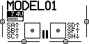

Configuration
-------------

I'm not going to go into much detail about how to use the transmitter buttons like PAGE etc. to navigate around and change settings. The buttons have been covered previously and if you need more help on getting started on using them and changing settings there's a section later that includes links to videos that cover all this.

In this section we're just going to:

* Set date and time for the transmitter.
* Set its county code.
* Set the receiver channel order.
* Callibrate the sticks and pots.
* Create a new model.
* Set the model name.
* Set the model's failsafe setting.

To get started long press MENU to get to the _Radio setup_ screen and set the current date and time.

_Set date and time._  
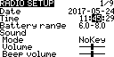

Then use the dial to navigate downwards and set the country code if necessary. It defaults to US, I set it to EU. This tells the transmitter to comply with the radio spectrum regulations that apply in your region. The low level radio firmware is already region specific and should behave appropriately for that region anyway so this setting isn't as important as it sounds.

_Set country code._  
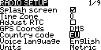

Now navigate down further to the bottom of the screen. The last two entries are _Rx channel ord_ and _Mode_. We already covered mode when setting up the sticks - we're using mode 2 and default value of _Mode_ should already match this. However we do have to change _Rx channel ord_ - by default it's set to _TAER_, change this to _TAER_. The next section below explains what this means.

_Set RX channel order._  
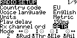

Then use PAGE to get to the _Callibration_ screen and re-callibrate the sticks and pots (this has been covered previously). Remember to set the pots to their mid position before starting.

_Callibration._  

Now onto creating a model. Press EXIT to get back to the main screen then short press MENU to get to the _Model selection_ screen. You can either modify the existing MODEL01 or create a completely new model. To create a new model turn the dial to select an empty slot, e.g. 02, and press ENTER and select _Create model_.

_Create a new model._  
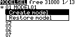

The new model is initially just called MODEL02, the asterisk beside it indicates that it's the currently selected model.

_New model with default name._  
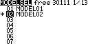

Now press PAGE and update the model name to something more informative, e.g. "F450 Pix". Long hold ENTER to get a capital letter.

_Set model name._  
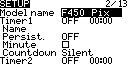

Use the dial to scroll through all the other options until you reach failsafe. Set it to _No pulses_, we'll come to what this means later.

_No pulses failsafe._  
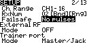

That's it - setup is done for the moment. If you return to the main screen you'll see that the name of the newly created model is now shown as selected. If you play with the sticks and switches you'll see the screen update in response.

_Main screen with new model selected._  
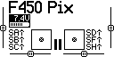

If you accidentally turn the dial on the main screen you get to two mysterious rows of dashes - just dial back up to get out of here.

_Main screen - lower half._  
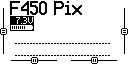

If you press PAGE you'll get to a screen that shows the transmitter's channels. These are essentially the set of values that the transmitter will send to the receiver. Initially just the sticks are bound to channels, i.e. only the stick states and nothing else will be sent. Move the sticks and see how the bars of this screen react.

_Main screen - page 2, showing channels 1 to 8._  
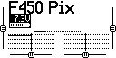

The transmitter supports 32 channels, initially bars for channels 1 to 8 are shown. Turn the dial and you'll see the topmost bar change to indicate that channels 9 to 16 are now showing, turn it further to see channels 17 to 24 and so on. As nothing is bound to these channels there's nothing really to see.

_Main screen - page 2, showing channels 9 to 16._  
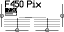

If you press the PAGE button again you'll get to the same channel information but this time displayed as numbers rather than bars.

_Main screen - page 3._  
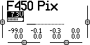

Receiver channel order
----------------------

We looked at something called mode when we covered stick setup. The chosen mode affects which stick direction is considered to be throttle etc., e.g. up/down on the left stick is throttle in mode 2.

However there are two devices involved here - the transmitter and the receiver. The mode just affects the mapping between stick directions and names like _Ail_, _Ele_, _Thr_ and _Rud_ in the transmitter. So when you're in mode 2 and you move the left stick up and down this adjusts the value that the transmitter associates with throttle. The transmitter then has to transmit this value to the receiver.

The transmitter can output values on up to 32 channels - however most receivers have far fewer values, the one we're using (the X8R) only supports 16.

Typically the stick values are transmitted on the first four channels, i.e. 1 to 4. But like mode it's just a convention how the receiver (and the related equipment, i.e. either directly connected servos or a flight controller) interprets the values it sees on these channels.

There are two main conventions for receivers. Many devices follow the convention established by the manufacturers Spektrum and JR where channel 1 is interpreted as the value for the throttle and so on like this:

| Channel # | Control  |
|-----------|----------|
| 1         | Throttle |
| 2         | Aileron  |
| 3         | Elevator |
| 4         | Rudder   |

The shorthand for this convention (for obvious reasons) is TAER. Many other devices follow the Futaba and Hitec convention:

| Channel # | Control  |
|-----------|----------|
| 1         | Aileron  |
| 2         | Elevator |
| 3         | Throttle |
| 4         | Rudder   |

The shorthand for this convention is AETR and is the one that the setup we're building here requires.

Note: as discussed elsewhere the names elevator, aileron, rudder and throttle tend to be popular among those piloting planes while the names pitch, roll, yaw and throttle are more common among those piloting mutlicopters. Unfortunately OpenTX always uses the plane naming convention in all its screens and menus.

When you create a new model the controls are initially mapped to channels according to the current value of _Rx channel ord_. If you go to the _Mixer_ screen for your model you can see the current mapping between channels and controls.

_Mixer screen._  
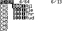

_RX channel ord_ is a global setting, however it only affects the initial channel order of models created after you modify it. If you change _Rx channel ord_ later it won't affect any existing models. And once a model has been created you can go to its _Mixer_ screen and change the initially assigned channel order without it affecting anything else.

Note: there's an _Input_ screen that superficially looks quite similar to the _Mixer_ screen - however this screen is about adjusting the behavior of the various controls, e.g. adjusting expo (which we'll come to later) to make them less "twitchy". On this screen you can even adjust the real source for the values _Thr_ etc. on this particular model. By default the stick direction considered throttle (according to your current mode setting) is mapped to _Thr_ etc. but you could e.g. map one of the pots to _Thr_ for this particular model (or do really odd things like take the source for the _Thr_ value from the aileron stick direction and so on).

Failsafe
--------

Above we set failsafe to _no pulses_. Before we did this the transmitter would always warn that there was no failsafe set for the current model when the transmitter was turned off.

The failsafe setting determines what the receiver should do if it loses contact with the transmitter, e.g. if the drone flies too far away or the transmitter runs out of battery power. There are various options - including leaving the choice to the receiver and then configuring the actual failsafe behavior on the receiver. Other options include having the receiver just maintain the same output as when it lost contact, this presumably results in the situation getting worse in most circumstances as the receiver tells the craft to maintain the course that caused it to fly out of range.

With a craft like ours the flight controller can respond intelligently to losing contact. So in this situation _no pulses_ is the preferred option (see [ArduPilot failsafe setup](http://ardupilot.org/copter/docs/radio-failsafe.html#receiver-and-flight-controller-set-up)), this leave it up to the flight controller to decide what to do. It can e.g. be configured to return to the launch point or, if it's following a preconfigured route, to simply complete the route.

TODO:

* RCdiy covers [testing failsafe](http://rcdiy.ca/taranis-q-x7-tutorial-first-flight-setup/#Testing_Failsafe) - make sure to include a section on doing the same.
* In the video on the ArduPilot failsafe setup page also show they [how to test things](https://youtu.be/FhKREgqjCpM?t=93), cf this with RCdiy's approach. Note: unlike here (but like RCdiy) they set up the failsafe via the receiver, also I think they're using an ancient PX4 so arming is different.

Videos and tutorials
--------------------

If you had any problem with the basic transmitter setup and model creation then this section contains some links to content that hopefully will make things clearer. While much of the content may not be specific to our setup, e.g. covering planes rather than quadcopters, it can still be helpful in order to see how to use OpenTX and interact with the transmitter.

Painless360 has two relevant videos - in [Tips for setting up a new radio - 10:37](https://www.youtube.com/watch?v=YD3ojhwVmrI&feature=youtu.be&t=637) he sets date and time and later at 11:39 he goes through callibration. Then in [Creating basic model types - 2:50](https://www.youtube.com/watch?v=NIR85KOqIAo&feature=youtu.be&t=170) he creates and names a new model. However after that he does initial setup for a plane, e.g. he sets up inputs (to make the sticks "calmer" at their extremes by changing their curve expo values) but then says that for a quadcopter this is normally handled via the flight controller, so you can just skip to 6:44 for his quadcopter setup. At 10:50 it's all over as far as quadcopters are concerned. He sets up an arming switch (which isn't relevant for the Pixhawk as it has its own physical arming switch) and also sets up a flight mode switch. We'll handle flight modes later using a different Painless360 video for reference  where he sets flight modes specifically for the Pixhawk using OpenTX Companion rather than the transmitter.

The Flite Test team cover model creation in [Q X7 Setup and review - 16:50](https://www.youtube.com/watch?v=7cExS1tTOJA&feature=youtu.be&t=1010). Later they bind it (which we'll come to later) to a D4R-II receiver. Most of what they cover is plane specific.

Blue Falcon covers failsafes in [Q X7 - setting up failsafes](https://www.youtube.com/watch?v=LuJ_K0pOJkE&feature=youtu.be) and at 5:28 he sets _no pulses_.

Blue Falcon in fact has a whole [playlist](https://www.youtube.com/playlist?list=PLiYYhnH4BhI-ot9OQ9djvRaacFHboFqC2) of videos covering the Q X7, that starts out with a [basic introduction](https://www.youtube.com/watch?v=W9zYI7KAtn8) and works through pretty much every aspect of the transmitter, both its hardware and its software. There are better approaches for some things he covers, e.g. gimbal adjustment, but overall it at least makes you aware of pretty much everything one can do with the transmitter.

TODO: remove this note to self: there's no further content in this playlist that needs to be worked in elsewhere that isn't already linked to.

RCdiy has a [detailed page](http://rcdiy.ca/taranis-q-x7-tutorial-first-flight-setup/#Using_OpenTX_The_Transmitter), that's accompanied by a video, that covers similar content. He covers setting the mode for the sticks (in our case the default is already what we want), binding and setting the failsafe (he delegates the choice of action to the receiver).

TODO: at 8:10 in the [Creating basic model types](https://www.youtube.com/watch?v=NIR85KOqIAo&feature=youtu.be) Painless360 sets up switches using inputs and mixers and then at 9:53 comments that this seemingly complex approach works out better than the apparently simpler approach of connecting up a mixer entry directly via source without doing any input setup. See if he follows this inputs/mixers approach when setting things up for the Pixhawk in OpenTX Companion.

TODO: RCdiy covers doing a [range check](http://rcdiy.ca/taranis-q-x7-tutorial-first-flight-setup/#Range_Check) via the transmitter - make sure to cover this too.

Binding
-------

Each RC craft has a receiver - to control a craft the transmitter has to be bound to that craft's receiver. Binding is like pairing a new bluetooth device, such as a speaker, with your smartphone. Setting up binding is part of the process of creating a model.

A single transmitter can be bound to many receivers, each model you create on your transmitter should have an associated bound receiver. A receiver however can only be bound to one transmitter at any given time.

In order to bind a receiver you have to be able to power it. Normally the receiver is powered by the flight controller. So in order to power the receiver for the binding process we'll wire up the flight controller first. Setting up the flight controller simply to provide power may seem like overkill but it's something we have to do anyway. When working with the flight controller, before it's installed in the drone, we'll power it via USB, when used in flight it will be powered by a LiPo battery.

Powering the receiver via the flight controller allows us to provide power to it without needing any additional equipment beyond what's specifically needed for this project. However if you're already into hobbyist electronics then you probably have all that's needed to directly power the receiver - it just needs a 5V source that can provide 100mA. I won't go into that here but if you're curious then take a look at [`receiver-power.md`](receiver-power.md) where I power the receiver via a breadboard power supply, via an Arduino and directly off USB.

TODO...

* Blue Falcon - https://www.youtube.com/watch?v=RH_RuVbF2YU cf with binding video below.

* https://www.youtube.com/watch?v=7cExS1tTOJA&feature=youtu.be 19:42 - binding with D4R-II

* DroneTrest - http://www.dronetrest.com/t/how-to-bind-your-x8r-receiver-to-taranis-x9d/633 - cf the video with above, note image shows that you only get max 8 channels out so up above video shouldn't have 1-16 selected.

DroneTrest recommend [this video](https://youtu.be/S-LSZQk1Ya8?t=324) on Taranis plus Mission Planner setup, but skip to 5:24 as most of what it covers looks easier in OpenTX Companion (as covered in the Painless360 series) but it is interesting to see stick callibration etc. for the flight controller and how the flight mode swtiches he configured earlier can be seen acting in Mission Planner.

Telemetry
---------

TODO...

Wiring up telemetry for X8R and Pixhawk:

* http://ardupilot.org/copter/docs/common-frsky-telemetry.html (includes setup in Mission Planner, OpenTX Companion and on the Taranis).

TODO: make sure you enable the passthru telemetry option in Mission Planner cf the amount of telemetry info the Pixhawk will pass on if passthru is used vs if it's not.

Blue Falcon:

* Wiring telemetry: https://youtu.be/WKsFG29Q5mQ - not for Pixhawk but still interesting, zip forward to 8:08 once he gets away from the receiver and into the flight controller (and then its software).
* Configuring telemetry: https://www.youtube.com/watch?v=n09q26Gh858
