Video
=====

TODO: remember to add SD card (see specific link below) to purchase list of things for video. Along with extra long pin header or a mirco-B USB connector shell (see below).

RunCam 2 - what you get in the box:

* Camera.
* Replacement lens protector.
* Battery.
* Four velcro straps - two narrow and two wider.
* Camera holder plus an adapter for a standard camera tripod.
* Two double-sided adhesive pads.
* Micro USB cable with power-in and video out connectors.
* RCA composite video adapter.
* USB cable (for recharging and connecting to your computer).
* Layard (that can be unscrewed at the middle).

_RunCam 2 parts_  
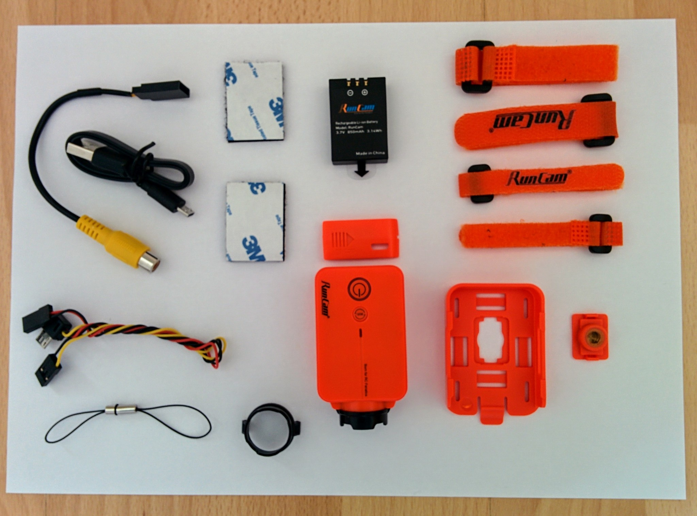

The camera holder can take interchangeable adapters for different mounts - it just comes with an adapater for the standard 1/4-20 UNC screw found on most tripods but you can e.g. also get adapters like the ones included in this [package](https://www.banggood.com/RunCam2-Camera-Mount-Support-GoPro-Action-Camera-p-1031391.html) for GoPro style mounts.

The camera comes with a number of cables - as well a standard USB cable, for recharging the battery and for connecting the camera to you computer, there's a cable consisting of a micro USB connector with power and video connectors coming off it. This second cable is more interesting - if you want you can use the power connector to provide power from e.g. your craft's main battery, rather than use the camera's internal battery, and the video connector can be connected up to a video transmitter or it can be connected up to the RCA composite video adapter and from their directly to e.g. an LCD monitor that takes composite video input.

You don't need to use this second cable at all - you can just power the camera off its internal battery and record video to the internal SD card (rather than transmitting it to some other device). The camera doesn't come with an SD card - you need at least a class 6 card, something like a cheap [16GB class 10 SanDisk card](https://www.amazon.co.uk/SanDisk-Ultra-MicroSDHC-Memory-Adapter/dp/B013UDL5V6/) is enough for more than an hour of video at 1080p and 60fps.

**Important**: if you're using the camera while powering it via USB, i.e. using its video capabilities rather than simply recharging its battery, then you must remove the battery first otherwise the battery can overheat and be damaged.

If you look at the battery you'll see a clear plastic tab with an arrow on it - I initially assumed that this was something that was meant to be pulled off, like the little protective film on the lens, but it's meant to be left there and enables you to pull the battery out of the battery compartment. Similarly I almost damaged the battery cover by assuming it's supposed to be pushed all the way to the side when removing it - instead you just push it over a few millimeters and then waggle it outwards as shown [here](https://youtu.be/r1Ju8icXsRQ?t=427) - this video also shows how to insert the SD card (upside down relative to the top of the camera).

_RunCam 2 battery compartment._  
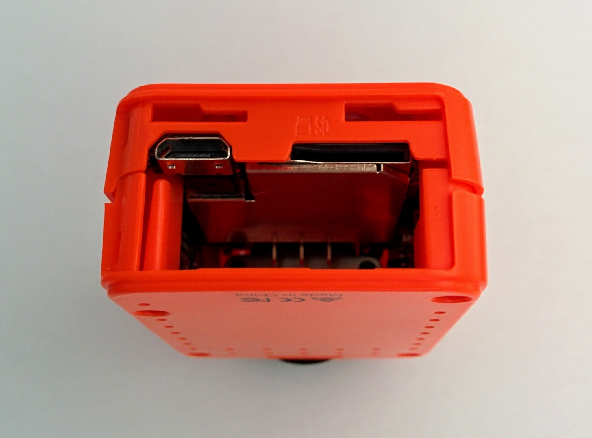

Usage
-----

To charge the battery you just need to install it in the RunCam and connect it to a USB charger or to a computer - the LED behind the main button will light up red initially before turning off later to indicate that it's fully charged.

However it takes a long time to charge and once charged you'll run it down quite quickly if you use it to power the RunCam during initial setup and getting to know the camera. So for setup I just took out the battery and powered the RunCam via USB (as noted above its important to remove the battery when using the camera like this). When powered via USB a small red LED at the edge of the main button pulses weakly but this seems to be fine.

**Important:** I found that while the camera would turn on if connected to a normal USB port you couldn't then turn on its WiFi. The issue seemed to be that the USB port couldn't provide enough power - if I connected it to a charging port or to a USB charger then everything worked fine.

The first thing you should do is install the [iOS or Android app](https://www.runcam.com/download/runcam2/) on your smartphone - this lets you see the video output of the camera, start and stop recording and adjust settings easily. Once the app is installed you can connect to the camera as follows:

* Turn on the camera by pressing the main button for 3 seconds - the LED behind this button will go blue (if it flashes blue this means you haven't inserted an SD card yet).
* Turn on WiFi by briefly pressing the WiFi button, i.e. don't hold it down. It may take a second or two before the white LED above the WiFi button starts to flash.
* On your smartphone look for a wireless network named something like "RUNCAM2_2fc113" and connect using the password "1234567890".
* Open the RunCam app and select the RunCam 2 as your device type and then press _Connect your camera_. It then goes through a binding phase, this process failed for me but the app was able to explain why - it was necessary to turn off mobile data first on my phone - once this was done the binding completed without problem.
* Once bound and connected you'll see what the camera sees on your smartphone.

My camera came with a firmware version that was only one version behind the most recent version version available at the time. Some of the earlier firmware releases had noticeable image quality issues, these are long gone but it's still probably worth updating all the same.

Assuming you're still connected to your camera (as outlined above) you'll have to first press the back button in the app (the upper-left back arrow) to disconnect as you can't upgrade the firmware while connected. Once disconnected press the upper-left menu button and select firmware update - it'll tell you what the camera's current firmware version is and ask you if you want to check for a newer version - if it finds one it'll then lead you through the update process. This process requires an SD card so you'll need to have already installed one in the camera.

Note: in the unlikely event that your camera came with a firmware version earlier than 2.1 then you'll have to update the firmware via the SD card (see the instructions included on the [download page](https://www.runcam.com/download/runcam2/)).

You'll see a lot of criticism on the web of early releases of the app and firmware but the latest versions of both make for a very easy to use camera. Once connected via the app try out the buttons above and below the video image, e.g. the white balance (WB) button, the field-of-view (FOV) button etc., drag the modes line, i.e. video, photo etc., left and right and try taking photos and videos (the big obvious red button). To the left below the video you'll see an amount of time, e.g. 01:07:00, which is the amount of video you can record given the current settings. It's all pretty obvious.

---

The video transmitter is referred to as a VTX.

See Oscar Liang's nice [introduction to VTXs](https://oscarliang.com/choose-video-transmitter-fpv-mini-quad/) and his piece on [circular vs linear polarized antenna](https://oscarliang.com/linear-circular-polarized-antenna-fpv/) that's more balanced than the many articles that say there are only pros and no cons to circular antenna.

_VTX._  
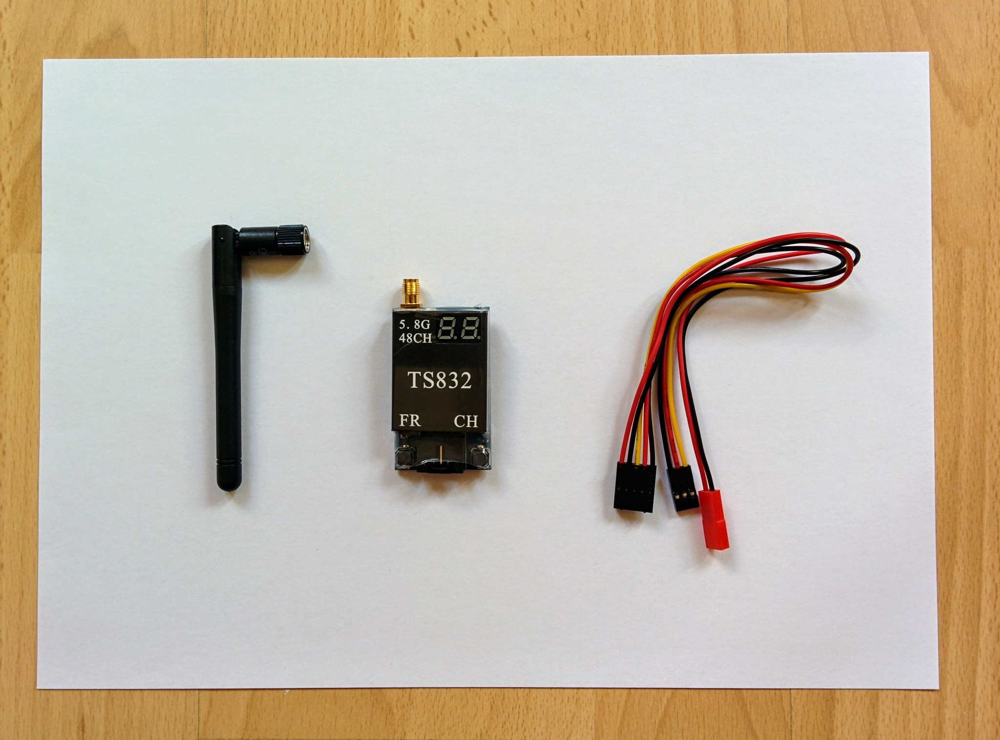

_VTX PCB rev:2.2._  
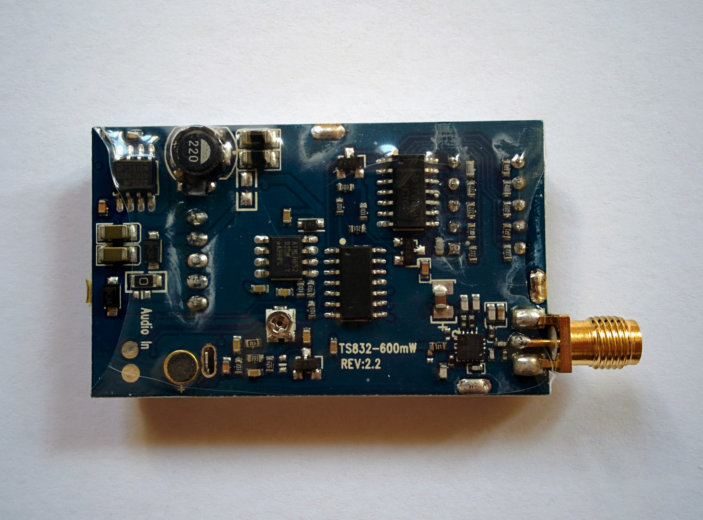

_Receiver._  
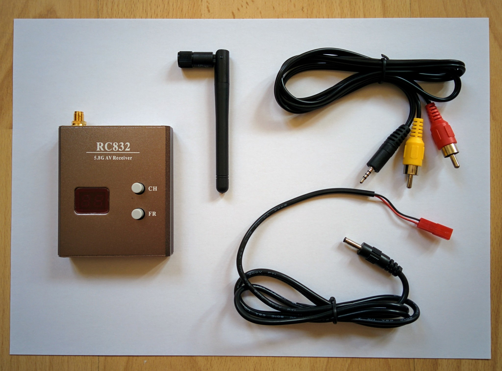

_Fpv googles._  
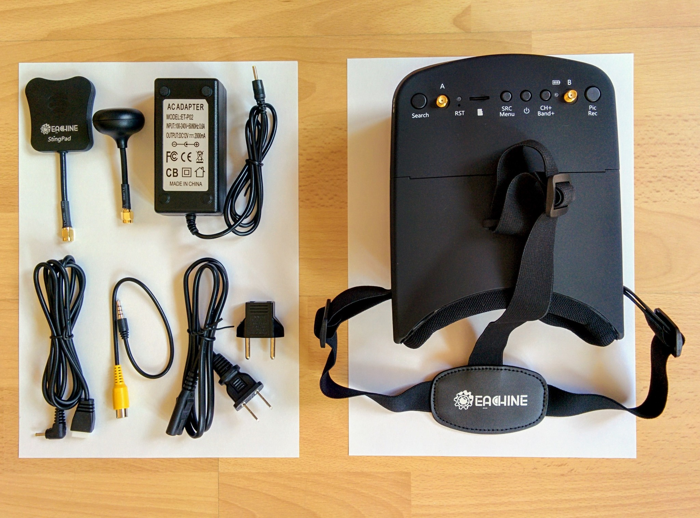

_Fpv googles bag and lens cloth._  
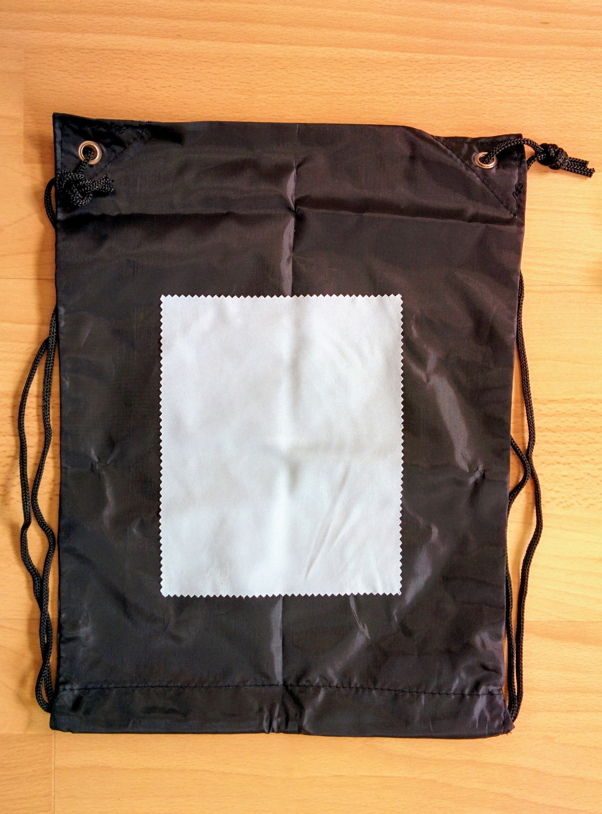

_Camera mounts (for GoPro and RunCam 2)._  
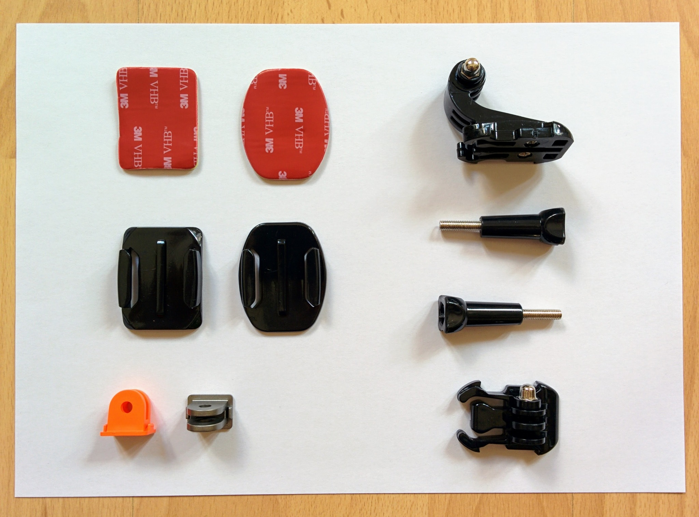

_Cloverleaf RP-SMA antennas._  
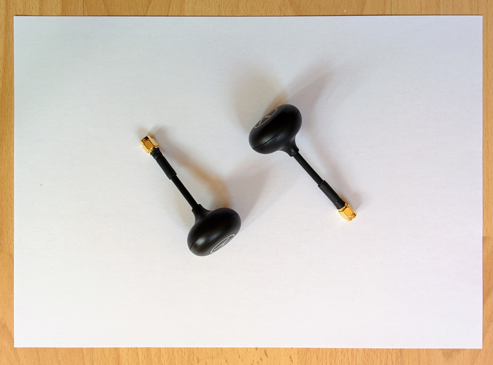

_GoPro FPV adapter cable._  
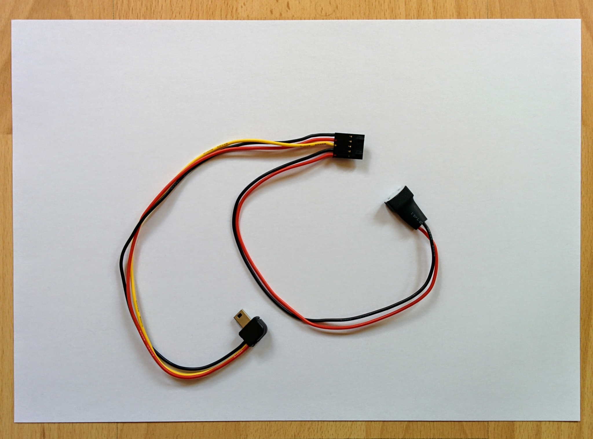

_Analog video capture._  
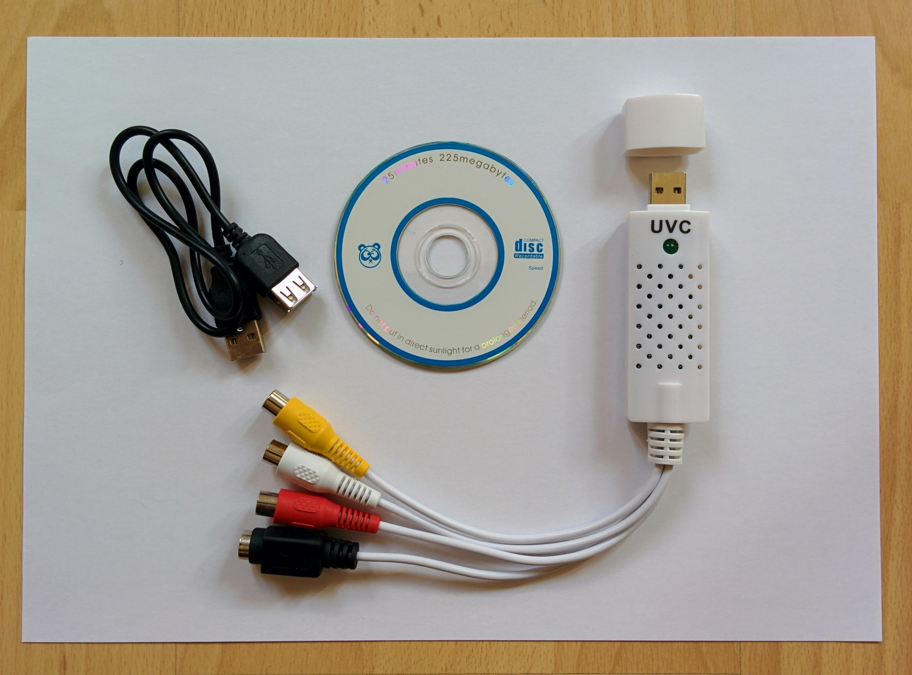

---

Batteries
---------

The LCD has a builtin 1200mAh battery. Eachine claim about 3.5 hours runtime on a fully charged batteries - reviews say its nearer to 2 hours. The RunCam 2 has a 850mAh battery and RunCam say this should give you about 1 hour when recording 60fps at 1080p.

You have to provide your own battery for the VTX (or power it off the same battery that powers the motors on your craft). The TS832 can work off 2S, 3S and 4S batteries. I chose a [Gens ace 800mAh 3S battery](http://www.gensace.de/gens-ace-800mah-11-1v-40c-3s1p-lipo-battery-pack.html) that has the BEC style connector that matches the connector on the VTX cable. The TS832 manual says it draws 220mA at 12V so an 800mAh 3S battery should provide power for substantially longer than the camera can keep shooting on a single charge. In fact a smaller battery might have been more suitable - Gens Ace have a 450mAh 3S battery that also comes with a BEC connector.

The S60 charger comes with a charger lead with banana plugs at the charger end and an XT60 connector for the battery. So to charge something with a BEC connector you'll need to buy a banana to BEC cable. Oddly Banggood and hobbyking don't seem to carry such a cable - but you can find them easily by [searching on eBay](https://www.ebay.co.uk/sch/i.html?_nkw=banana+to+bec) or you can buy a banana to multiple-connectors adapter like this [one](https://www.banggood.com/Multifunctional-Charger-4_0mm-Banana-Adapter-Connector-T-Tamiya-Futaba-TRX-XT60-EC3-JST-Wire-p-925673.html).

The goggles and the camera come with hard case batteries that presumably come with the normal protection circuitry that one finds with most consumer electronic devices that come with Li-Ion - so one shouldn't have to worry about over discharging them etc. The VTX battery though is the same style Li-Po battery as used to power the main craft and comes with no protection circuitry so it's up to you to treat it properly and not overdischarge it and bring it to storage voltage yourself when necessary.

You can power the VTX off the same battery as the main craft but this brings its own issues. There tends to be a lot of electrical noise introduced by the other components using this power source - this leads to a lot of the noise that you often see in FPV videos on YouTube. There may also be issues with voltage spikes created by the ESCs that may actually damage the VTX. Noise and spikes can be addressed, e.g. with an LC filter and a voltage regulator, but to start off it's probably simpler just to use a completely separate battery as here.

Note to self: unlike the servo connectors, where you lift up a plastic tab on the connector in order to release a pin, you have to press down a little metal tab on the crimp pin itself for the wires going into the main VTX connector - see this [video](https://www.youtube.com/watch?v=S9xeg_3eREc).

Setup
-----

The [Banggood EV800D page](https://www.banggood.com/Eachine-EV800D-5_8G-40CH-Diversity-FPV-Goggles-5-Inch-800480-Video-Headset-HD-DVR-Build-in-Battery-p-1180354.html) has a nice GIF showing how to detach the LCD from the goggles. Once you pop off the LCD you'll see it's covered in a protective film, that you might not have otherwise noticed, that needs to be removed.

_Charging the transmitter, LCD and camera batteries._  
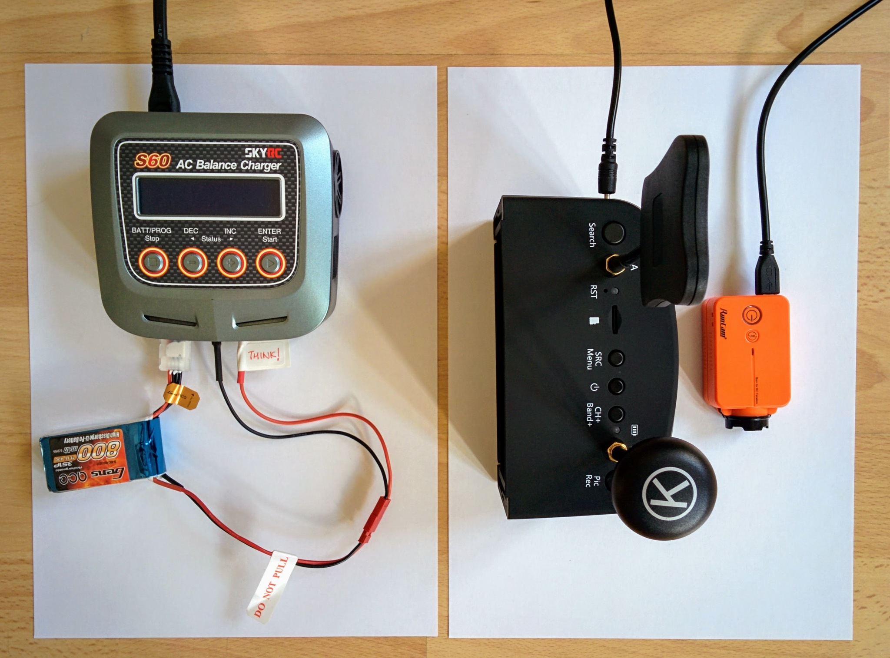

_Transmitter and camera cables and male header._  
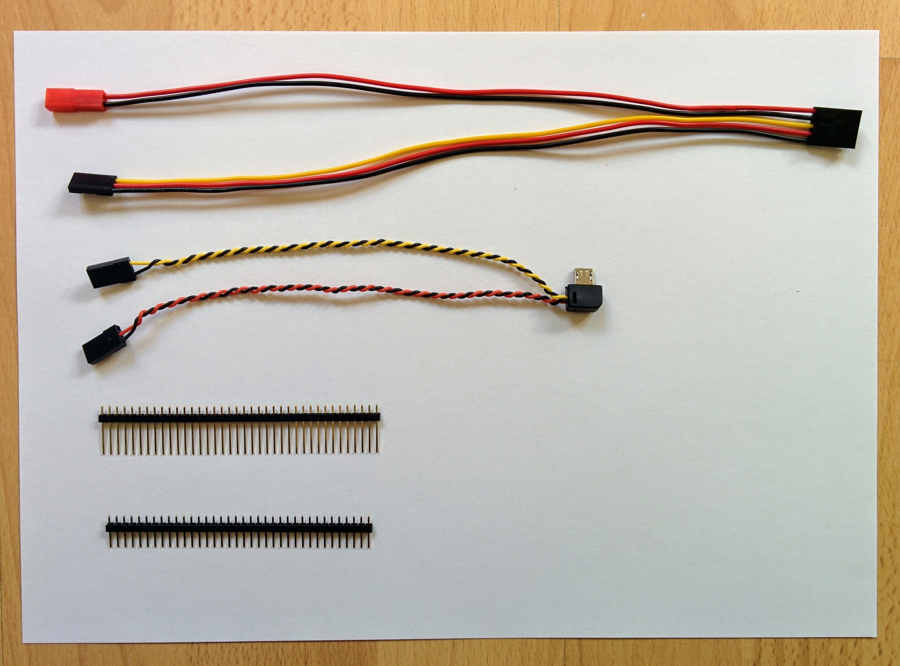

This photo shows header with standard length pins and header with the extra long pins that we'll use to create an adapter to connect the transmitter cable to the video cable. Adafruit sell [extra long pin header](https://www.adafruit.com/product/400) where the pins are already centered lengthwise (unlike the header shown here) which is what we want.

The wires or the camera cable have a nice silicone coating so you can twist them as shown to nicely separate the power and the video wires. The wires of the VTX cable are plastic coated so you can't this with them.

Note: if you never plan to power the camera off anything other than its internal battery you could snip off the power part of the camera cable, i.e. snip off the black and red cable leaving just the yellow and black one.

If the big five pin connector that connects the VTX used the same style of crimped terminals as the servo connectors then we could just pop out the black and yellow terminals from the servo on the camera cable, pop out the corresponding terminals (and the additional terminal of the unused red wire) on the main VTX connector and plug the terminals from the camera cable straight in instead. Unfortunately the main VTX connector and the servos use different styles of crimped terminals.

The best long term solution is probably to discard the camera cable altogether, chop the servo connector off the VTX cable, pop out and discard the unused red wire, that ran to the servo connector, and then solder the remaining black and yellow wires into USB micro-B connector shell (like this [one](https://www.adafruit.com/product/1390)).

Cut off three pins, use a pliers on each pin to center (if the pins didn't already come centered). We've not got a servo-to-servo adapter, plug it into the servo connector from the VTX cable and then plug in the connector from the camera cable making sure the yellow and black wires match up either side of the connection.

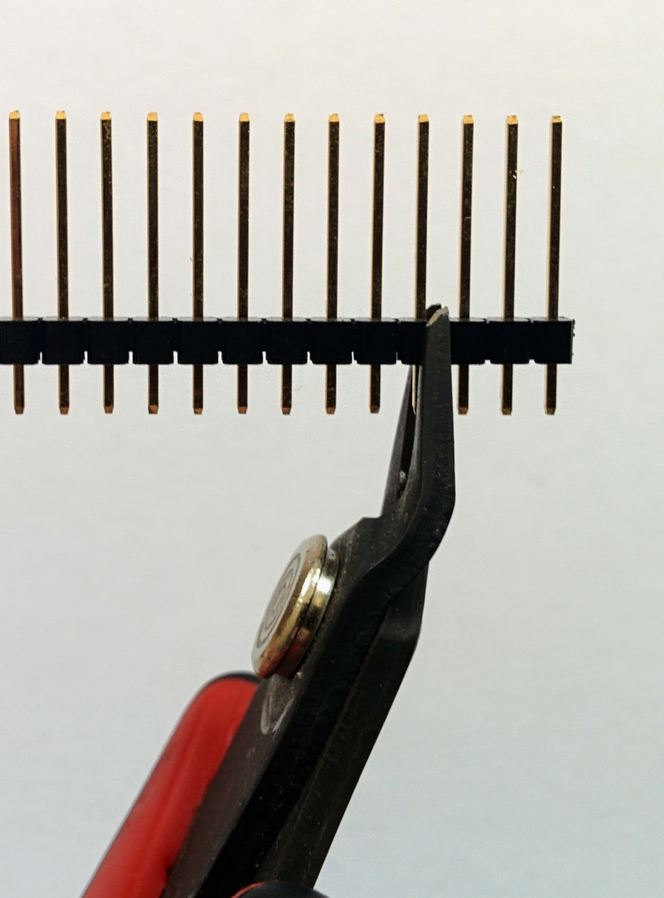 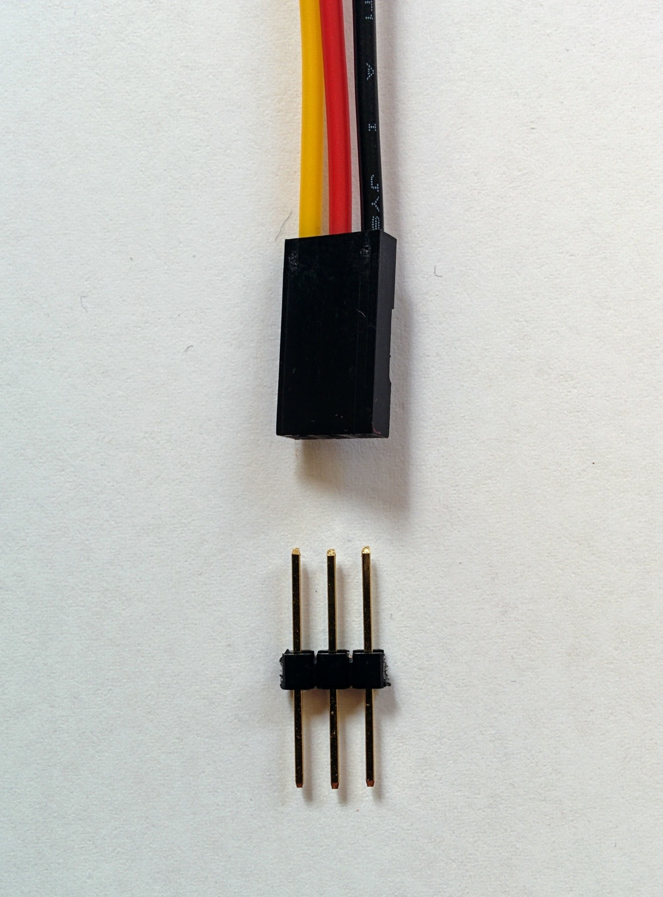 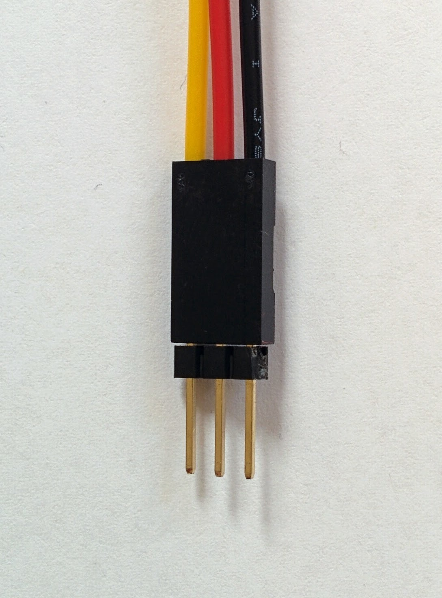 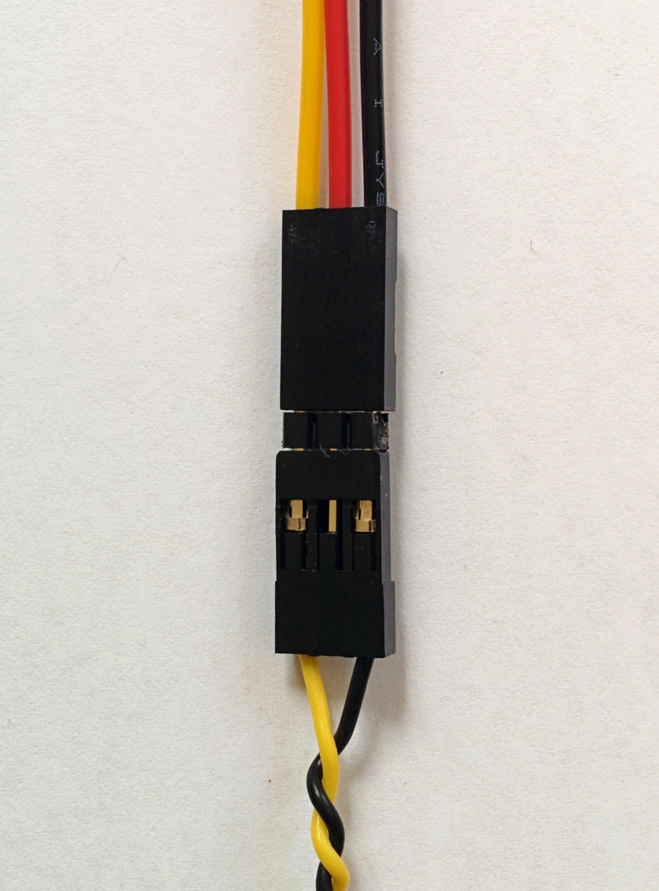

_VTX and camera cables connected together._  
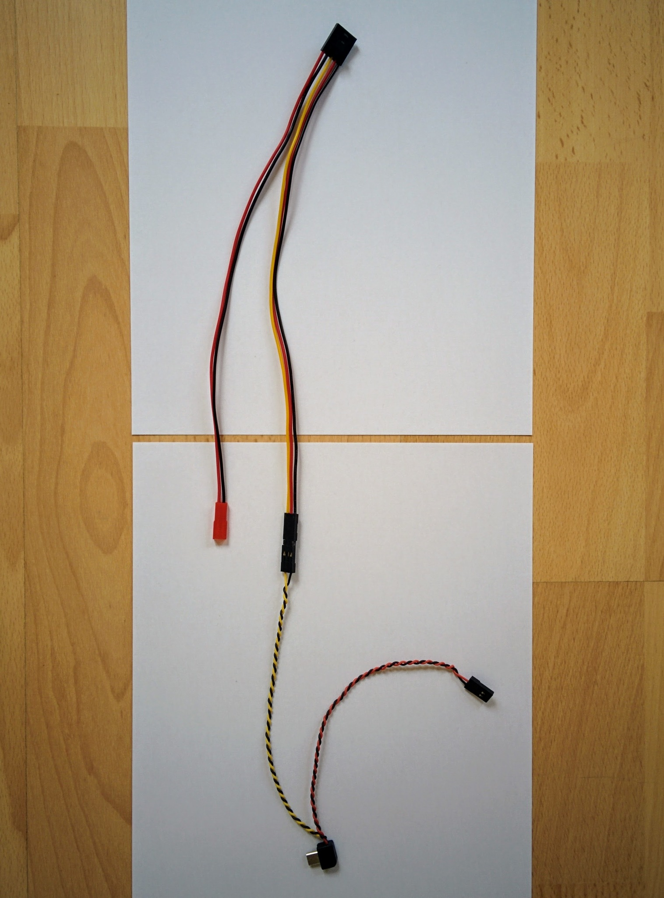

Now plug in the VTX and the camera and have the battery ready to power the VTX.

_VTX and camera ready for transmitting._  
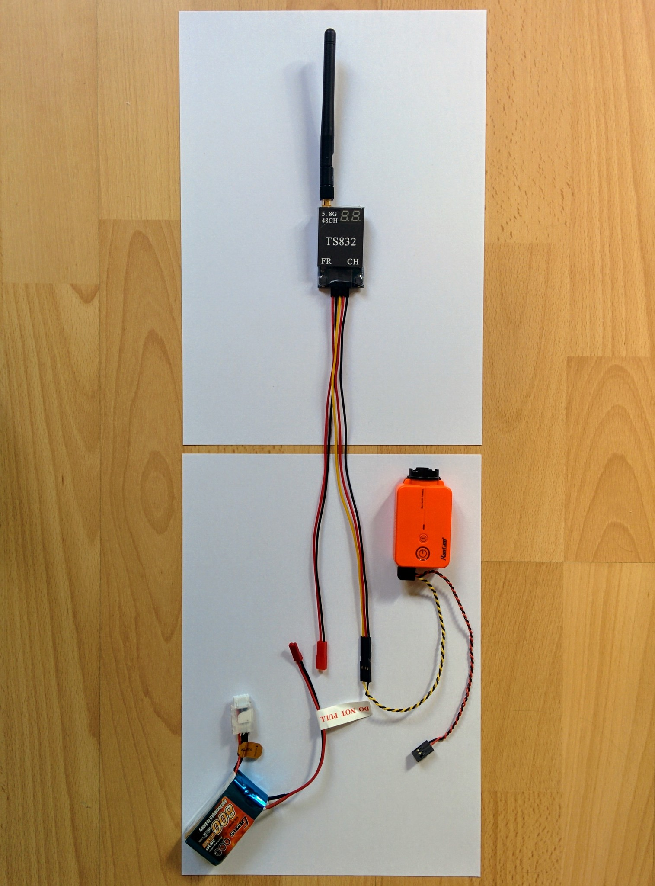

**Warning:** this is another situation where you can instantly destroy your equipment. Never power the VTX without first having connected its antenna. When the VTX is powered up it will want to dump out energy via the antenna and if it's not present the inability to get rid of energy like this may lead to immediate damange. Depending on make and manufacturer some VTXs will survive this situation while for others some component on the VTX will heat up and burnout within seconds. It's probably best to avoid finding out what the behavior of your VTX is in this situation. The same warning does not apply to the receiver, i.e. googles or LCD, as here the antenna have a passive role, i.e. they're for receiving energy pumped out by something else.

Press and hold the power button on the LCD to turn it on, then press _Search_ to scan for video signals. If you're indoors and there are various nearby 5.8GHz sources you may find the stop searching on various channels where something is transmitting without it being a video signal.

_LCD turned on and ready to receive._  
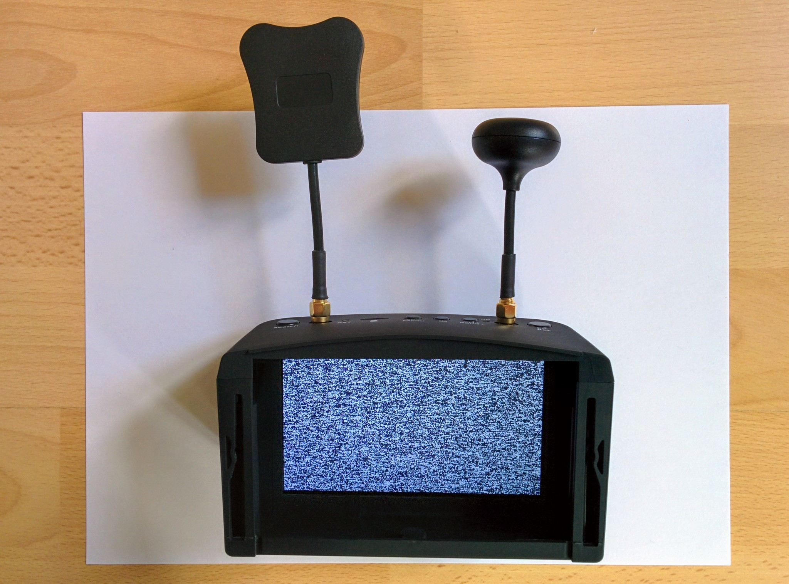

Then plug your battery into your VTX (mine started with the small red two digit seven segment display showing 11) and turn on the camera as well. I then searched again from the LCD. The initial picture was extremely underwhelming - so I switched channel on the VTX to 21 and searched again and this time got a perfect crystal clear image on my LCD.

_VTX transmitting camera feed to LCD._  
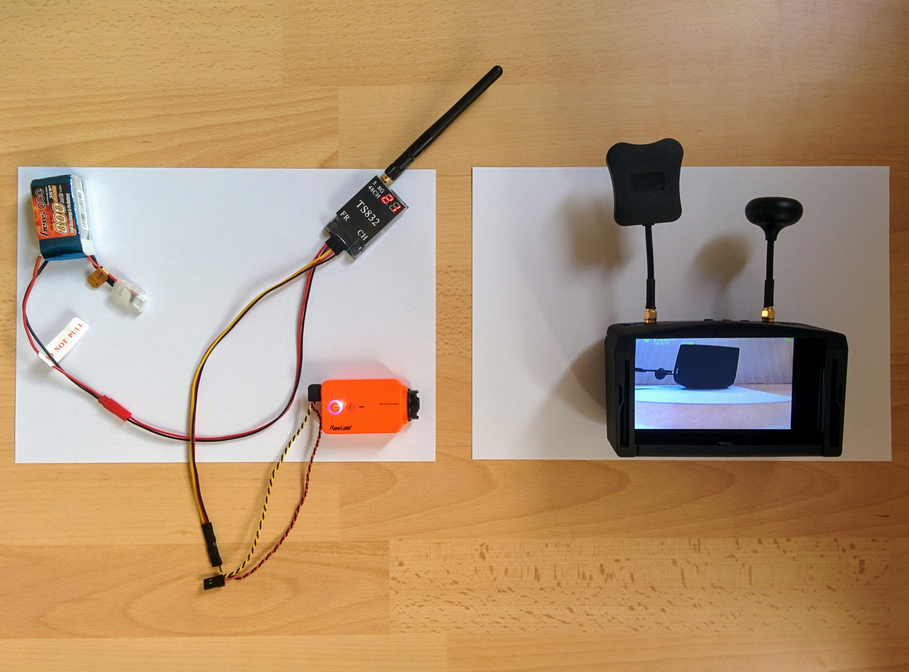

**Important:** where you're out in the field you should always power up your LCD/goggles first, before turning on the VTX, and see if you pick up an existing signal so that you can make sure you won't start transmitting on a channel that is aleady in use by someone nearby (you powering up your VTX would cause them to lose signal and crash - something that won't improve your popularity).

Frequencies
-----------

You need to match the frequency transmitted by the one received by the goggles. As the googles have a search feature all you really need to do is set a frequency on the VTX and then let the googles search for this. The googles support 40 channels split over 5 frequency ranges while the VTX supports those 40 channels plus an additional 8 on an additional frequency range.

### VTX frequencies

The VTX has a small red two digit display - the first digit is the frequency range and the second is the channel. So e.g. 24 means channel 4 on frequency range 2.

| FREQ | CH1   | CH2   | CH3   | CH4   | CH5   | CH6   | CH7   | CH8   |
|------|-------|-------|-------|-------|-------|-------|-------|-------|
| FR1  | 5,865 | 5,845 | 5,825 | 5,805 | 5,785 | 5,765 | 5,745 | 5,725 |
| FR2  | 5,733 | 5,752 | 5,711 | 5,790 | 5,809 | 5,828 | 5,847 | 5,866 |
| FR3  | 5,705 | 5,685 | 5,665 | 5,645 | 5,885 | 5,905 | 5,925 | 5,945 |
| FR4  | 5,740 | 5,760 | 5,780 | 5,800 | 5,820 | 5,840 | 5,860 | 5,880 |
| FR5  | 5,658 | 5,695 | 5,732 | 5,769 | 5,806 | 5,843 | 5,880 | 5,917 |
| FR6  | 5,474 | 5,492 | 5,510 | 5,528 | 5,546 | 5,564 | 5,582 | 5,600 |

Note: all frequencies are in MHz.

You can switch the frequency band, i.e. FR1 to FR6, by pressing the FR button on the VTX and you can switch the channel, i.e. CH1 to CH8, by pressing the CH button.

### Goggles frequencies

When you press Search on the googles you'll see it cycling through the channels, displaying CH-A-1, CH-A-2 etc. So unlike the VTX it uses letters to denote the frequency ranges with A to D corresponding to 1 to 4 respectively on the VTX and R corresponding to 5.

| FREQ    | CH1   | CH2   | CH3   | CH4   | CH5   | CH6   | CH7   | CH8   |
|---------|-------|-------|-------|-------|-------|-------|-------|-------|
| A (FR1) | 5,865 | 5,845 | 5,825 | 5,805 | 5,785 | 5,765 | 5,745 | 5,725 |
| B (FR2) | 5,733 | 5,752 | 5,771 | 5,790 | 5,809 | 5,828 | 5,847 | 5,866 |
| C (FR3) | 5,705 | 5,685 | 5,665 | 5,645 | 5,885 | 5,905 | 5,925 | 5,945 |
| D (FR4) | 5,740 | 5,760 | 5,780 | 5,800 | 5,820 | 5,840 | 5,860 | 5,880 |
| R (FR5) | 5,658 | 5,695 | 5,732 | 5,769 | 5,806 | 5,843 | 5,880 | 5,917 |

Some of the frequencies are very close together, e.g. CH8 of band B is 5,866 MHz while CH1 of band A is 5,865 MHz and the same frequency, 5,880 MHz, appears in both band D and band R. When using Search on the goggles it sometimes stopped on a nearby channel before the one actually being used by the VTX and I had to press Search again for it to actually search on to the real channel and get a better picture.

Legality
--------

I only became aware after buying this popular VTX that there's an issue with the fact that it transmits at several hundred milliwatts. While this is typical it is also well above the technical legal limit in most countries for the unlicensed 5.8GHz band - the limit is usually about 25mW, i.e. dramatically lower.

If you're out in a field and transmitting at this power it probably isn't an issue and I didn't come across any evidence on the web that anyone has ever gotten in trouble for doing so. However home WiFi routers also use the 5.8GHz band (and obey the power output limits) so don't use your VTX indoors or you may well annoy your neighbors by knocking out their WiFi.

It's up to you if you want to use a VTX like the TS832 or find a genuine 25mW VTX, e.g. this [ImmersionRC 25mW VTX](https://hobbyking.com/en_us/immersionrc-race-band-25mw-5-8ghz-a-v-transmitter.html). While most transmitters transmit at 200mW or 600mW some allow you to also flip down to 25mW. If you're planning on flying small indoor quadcopters then you should definitely use a 25mW VTX.
